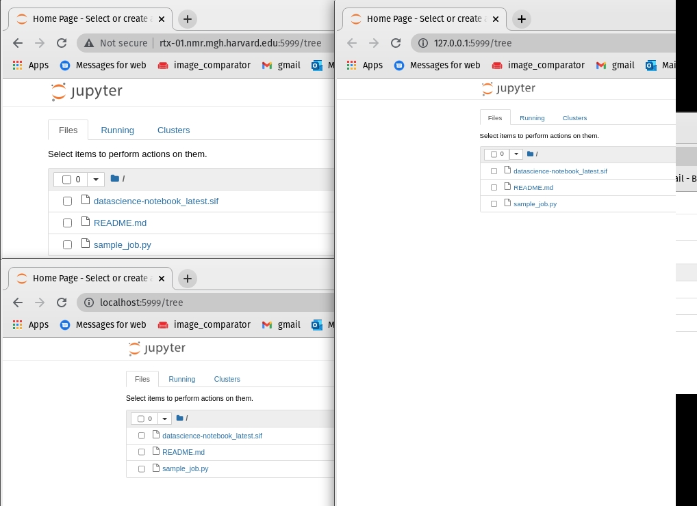
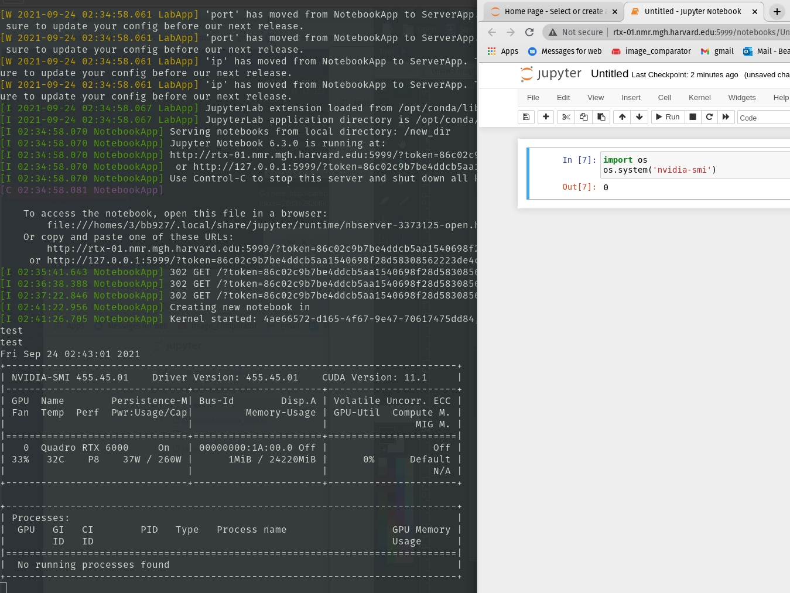
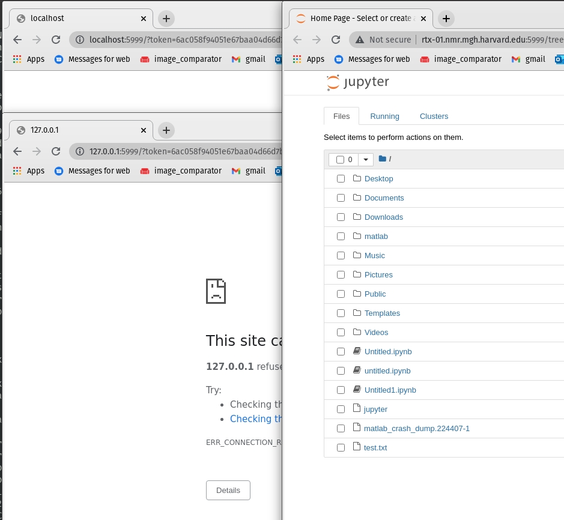

# Welcome To The Martinos Center

[Official Website](https://www.nmr.mgh.harvard.edu/)


Locate the [Intranet](https://www.nmr.mgh.harvard.edu/intranet) in the top right on the homepage. This hosts all things Martinos related and should be your first stop for information.

Other userful links within the intranet:
* [Compute Resources](https://www.nmr.mgh.harvard.edu/intranet/computer)  
* [Frequently Asked Questions](https://www.nmr.mgh.harvard.edu/faq)
* [Martinos User Information (sometimes more granular about technical things)](https://www.nmr.mgh.harvard.edu/martinos/userInfo/computer/index.php)

Pre-requisites:  
* Partners ID
* [Martinos Account](https://www.nmr.mgh.harvard.edu/intranet/computer/request-account)
* MLSC Access

## Loggin in

Test access by sshing into ```mlsc.nmr.mgh.harvard.edu``` while on the Partners [VPN (scroll down a little)](https://rc.partners.org/it-services/remote-access).

> You should be able to do this in the CMD in Windows or your terminal in MacOS\Linux.

Ex:
```bash
bbearce@pop-os:~$ ssh bb927@mlsc.nmr.mgh.harvard.edu

 /$$      /$$ /$$        /$$$$$$   /$$$$$$
| $$$    /$$$| $$       /$$__  $$ /$$__  $$
| $$$$  /$$$$| $$      | $$  \__/| $$  \__/
| $$ $$/$$ $$| $$      |  $$$$$$ | $$
| $$  $$$| $$| $$       \____  $$| $$
| $$\  $ | $$| $$       /$$  \ $$| $$    $$
| $$ \/  | $$| $$$$$$$$|  $$$$$$/|  $$$$$$/
|__/     |__/|________/ \______/  \______/

Please cite the Massachusetts Life Sciences Center 
on your posters and publications for any data analyzed 
on this cluster.

<><><><><><><><><><><><><><><><><><><><><><>

Last login: Wed Sep 22 16:06:16 2021 from 10.251.11.74
mlsc-login[0]:~$
```

## Home Directories and Data

### Home Directories
We have user accounts that are synced between all martinos machines and they all live on a drive managed by help desk. In order to keep space concerns down with 100s of users, they limit our space allowance to the point where it is unusable for more than configuratoin or tiny tests.

Therefore everything (99% of everything) is stored on hard drives or network storage.

Because of this the most important step is to symlink some important directories to change where the data stored for various programs (docker, singularity, python) will show up ultimately (not in ~/).

> Notice how ```pwd``` prints something like **/homes/#/\<username\>** rather than **/home/\<username\>**. This is because we all live in **/homes** which is special directory (drive) managed by [Help Desk](help@nmr.mgh.harvard.edu).

Ex:
```bash
mlsc-login[0]:~$ pwd
/homes/3/bb927
```

### Drives and Network Storage 
[Martinos Official Notes](https://www.nmr.mgh.harvard.edu/martinos/userInfo/computer/diskSpace.php)

* Main Storage: /cluster/qtim - 20TB # Standard cluster storage.
* New Storage: /vast/qtim - 2TB # Ultra Fast and was bought with the cluster's grant money.

#### Drives
There are no drives on the cluster. We do have our own Desktops and Servers in the QTIM lab, however that is not the focus of this tutorial. 

> We will need to dip into this a little in the Singularity section at the end of this tutorial as we need a drive to build Singularity images.

#### Network Storage
As the name implies /cluster/qtim is our lab's (QTIM) storage for use with the cluster. Everyone has a user folder as demonstrated here:

```bash
mlsc-login[0]:~$ ls /cluster/qtim
ID-qtim  machine_backups  users

mlsc-login[0]:~$ ls -la /cluster/qtim/users
total 154
drwxrwsr-x. 20 bb927    qtim 20 Sep 21 16:26 .
drwxrws---.  4 root     qtim  5 May 23 10:05 ..
drwxrwsr-x. 13 ai347    qtim 28 Aug  2 15:32 ai347
drwxrwsr-x. 22 apv12    qtim 41 Sep  5 16:46 apv12
drwxrwsr-x.  2 aza24    qtim  3 Jun  4 12:47 aza24
drwxrwsr-x. 15 bb927    qtim 24 Aug  5 18:14 bb927
drwxrwsr-x.  4 cl48     qtim  4 May 11 14:14 cl48
drwxrwsr-x.  3 cni1     qtim  3 Sep 21 17:07 cni1
drwxrwsr-x.  5 cpb28    qtim  5 Mar  4  2021 cpb28
drwxrwsr-x.  2 dd86     qtim  2 Apr 28 21:50 dd86
drwxrwsr-x.  5 gc660    qtim  6 Sep 22 14:41 gc660
drwxrwsr-x.  3 ij063    qtim  3 Aug 11 12:52 ij063
drwxrwsr-x.  9 jn85     qtim  9 Jul 21 13:26 jn85
drwxrwsr-x.  3 kalpathy qtim  3 Aug  4  2020 kalpathy
drwxrwsr-x.  7 nt771    qtim 52 Sep 20 08:20 sakshi
drwxrwsr-x. 10 sf172    qtim 10 May 28 14:20 sf172
drwxrwsr-x. 15 si74     qtim 20 Sep 11 06:38 si74
drwxrwsr-x.  2 bb927    qtim  4 Sep 21 17:31 slurm_jobs
drwxrwsr-x. 27 va914    qtim 35 Aug  2 13:12 va914
drwxr-sr-x. 35 bb927    qtim 43 Sep 10  2019 yifen
```

Go ahead and make yourself a directory here.

> Note we do not have **sudo** on these machines and everyone owns their own **folder** and are in the **qtim** group. These are denoted in columns **3** and **4**. We can technically add data to each others folders in their default state so becareful.

Ex:
```
<permissions>. <hard-links> <user>    <group> <size> <Month  Day Time> <item>
```

> This is the official place to do work, store data and code. 

This location is available you from any Martinos machine. It is 20TB large but we have a tendancy to fill up data fast. I'm in the process of clearing some out so don't worry, but there is enough room for this demo.


## Anaconda
We will need a python source for part of this demo. The Martinos center has setup an Anaconda distribution we can use thathas scientific modules as part of it. 

[Instructions for Setup](https://freesurfer.net/fswiki/DevelopersGuide/NMRCenterPython/UsersGuide)

For now run this:
```bash
export PATH=/usr/pubsw/packages/python/anaconda3.7/bin:${PATH}
```

Now you can use python:
```bash
mlsc-login[0]:bb927$ python
Python 3.7.3 (default, Mar 27 2019, 22:11:17) 
[GCC 7.3.0] :: Anaconda, Inc. on linux
Type "help", "copyright", "credits" or "license" for more information.
>>> 
```
and list conda packages available:
```bash
mlsc-login[0]:bb927$ conda list
# packages in environment at /usr/pubsw/packages/python/anaconda3-2019.03:
#
# Name                    Version                   Build  Channel
_ipyw_jlab_nb_ext_conf    0.1.0                    py37_0  
_libgcc_mutex             0.1                        main  
_r-mutex                  1.0.0               anacondar_1  
_tflow_select             2.1.0                       gpu  
absl-py                   0.7.1                    py37_0  
alabaster                 0.7.12                   py37_0  
...
...
```

> Additional instructions show you how to set your system path and properly install new packages.

## Submitting Jobs
The Martinos Center Help Desk has created official instructions for the Cluster's use located at [https://it.martinos.org/mlsc-cluster/](https://it.martinos.org/mlsc-cluster/).

It uses [SLURM](https://slurm.schedmd.com/documentation.html) to manage work loads.

The Martinos cluster docs above give the details but the most important piece is the resources available:
| Description         | #Nodes | #Cores | RAM   | #GPU               | Partition | Scratch |
|---------------------|--------|--------|-------|--------------------|-----------|---------|
| Dell R440 Server    |     30 |     24 | 384GB | none               | basic     |   1.5TB |
| RTX 6000 GPU Server |      2 |     32 | 1.5TB | 8                  | rtx6000   |   7.0TB |
| RTX 8000 GPU Server |      5 |     32 | 1.5TB | 4 have 10, 1 has 4 | rtx8000   |   7.0TB |
| NVIDIA DGX A100     |      4 |     64 | 1.0TB | 8                  | dgx-a100  |    14TB |

* R440 Server - CPU compute cluster
* RTX6000 - 24GB GPU RAM
* RTX8000 - 48GB GPU RAM
* A100 - 40GB GPU RAM (Newest, fastest and almost largest)

> Namely the **Partition column**. This is the resource you will select later. The 1st is a CPU and the last 3 are incrementally larger/faster GPUs.

You should already be signed in. Change directory to the qtim cluster network storage now (be sure to have made your own directory with ```mkdir <username>``` where \<username\> is your Partners ID and it should be located at /cluster/qtim/users/. Also this directory is one level higher than your user directory):

Ex:
```bash
mlsc-login[0]:~$ cd /cluster/qtim/users
```

Notice a non-user directory called **slurm_jobs**
```bash
mlsc-login[0]:users$ ls slurm_jobs
README.md  sample_job.py
```
Here you will find a README.md file for using the cluster. It follows from the notes in the link above, but I find it handy. In it you will find two main ways to use the job scheduler SLURM.

They are:
```bash
$ jobsubmit -p rtx6000 -A qtim -m 128G -t 0-00:5:00 -c 3 -G 1 -M ALL --mail-user bbearce@mgh.harvard.edu python sample_job.py
```
and 
```bash
srun -p rtx6000 -A qtim --mem 4G -t 0-00:1:00 -c 3 -G 1 --mail-user bbearce@mgh.harvard.edu --pty /bin/bash
```

Let's break the flags down:
```
Required argument flags:
  -A <account>     Fairshare/billing account to use (qtim)
  -m <memlimit>    Max memory your job will use before killed (RAM).
  -p <partition>   Partition to submit the job to (machine type)
  -t <timelimit>   Max real time job will use before killed (DD-HH:MM:SS)
```
Other optional flags:
```
  -c <numcores>       Number of cores per node required (default 1)
  -G <numgpus>        Number of GPUS required (default 0)
  -M <mailtype>       Send mail events. Comma separated list of:
                        BEGIN, END, FAIL, REQUEUE, ALL (previous four),
                        TIME_LIMIT_90, TIME_LIMIT_80, TIME_LIMIT_50,
                        ARRAY_TASKS, NONE (default)
  --mail-user <user>  Send mail to <user> (default is current user)

```

The more readable versions are:
```bash
$ jobsubmit -p rtx6000 \
            -A qtim \
            -m 128G \
            -t 0-00:5:00 \
            -c 3 \
            -G 1 \
            -M ALL \
            --mail-user bbearce@mgh.harvard.edu \
            python sample_job.py
```

```bash
$ srun -p rtx6000 \
       -A qtim \
       --mem 128G \
       -t 0-00:5:00 \
       -c 3 \
       -G 1 \
       --mail-user bbearce@mgh.harvard.edu \
       --pty /bin/bash
```

```jobsubmit``` allows for running of a script file while ```srun``` allows interactice mode.

### Script Execution

Let's try to submit a script (sample_job.py), but first let's open it:

/cluster/qtim/users/slurm_jobs/sample_job.py
```python
import torch

if __name__ == "__main__":
    gpu_status = torch.cuda.is_available()
    with open("/cluster/qtim/users/bb927/slurm_jobs/output.txt", "w") as f:
        f.write("Did this work? GPUs available: {}".format(gpu_status));
```

This when run, will put a file called **output.txt** in **/cluster/qtim/users/bb927/slurm_jobs**. However you might not have made **slurm_jobs** in your user directory yet so go ahead and create it and also copy **sample_job.py** to your **slurm_jobs** directory.
Ex:
```bash
mlsc-login[0]:bb927$ mkdir /cluster/qtim/users/bb927/slurm_jobs

mlsc-login[0]:bb927$ cp ../slurm_jobs/sample_job.py ./slurm_jobs/
```
Next change your copy of **sample_job.py** to edit the user folder to your own:  
from:
```python
with open("/cluster/qtim/users/bb927/slurm_jobs/output.txt", "w") as f:
```
to:
```python
with open("/cluster/qtim/users/<user directory you already made made>/slurm_jobs/output.txt", "w") as f:
```

Now we should be able to execute this. Change directories into your personal **slurm_jobs** folder and run this command substituting your **--mail-user** (email address):
```bash
jobsubmit -p rtx6000 -A qtim -m 128G -t 0-00:5:00 -c 3 -G 1 -M ALL --mail-user bbearce@mgh.harvard.edu python sample_job.py
```

You will get an email and eventually **output.txt** will be in your **slurm_jobs** directory:
```bash
mlsc-login[0]:slurm_jobs$ ls
README.md  sample_job.py

mlsc-login[0]:slurm_jobs$ ls
output.txt  README.md  sample_job.py
```

Look inside **output.txt**:
```bash
mlsc-login[0]:slurm_jobs$ cat output.txt 
Did this work? GPUs available: True
```

That is how you submit a script.

### Interactive Mode

Maybe you haven't written a script yet or any pipeline. You can reserve access with ```srun``` and ```--pty /bin/bash```.

```bash
srun -p rtx6000 \
       -A qtim \
       --mem 4G \
       -t 0-00:1:00 \
       -c 3 \
       -G 1 \
       --mail-user bbearce@mgh.harvard.edu \
       --pty /bin/bash

[bb927@rtx-01 slurm_jobs]$
```

Notice how your terminal changes to indicate that you are connected to another server:
```bash
[bb927@rtx-01 slurm_jobs]$ hostname
rtx-01.nmr.mgh.harvard.edu
```

This is the normal hostname:
```bash
mlsc-login[0]:slurm_jobs$ hostname
mlsc-login.nmr.mgh.harvard.edu
```

> If you can't get a job it's because the "fair share" system implemented to make sure everyone has fair access is not letting you as all those resources are spoken for. Usually the smaller resources are more in demand so for demo purposes we can choose large compute and little time to ensure we get something.

Ex:
```bash
rtx-01[0]:slurm_jobs$ srun -p rtx6000 \
>        -A qtim \
>        --mem 4G \
>        -t 0-00:1:00 \
>        -c 3 \
>        -G 1 \
>        --mail-user bbearce@mgh.harvard.edu \
>        --pty /bin/bash
srun: Job 565212 step creation temporarily disabled, retrying (Requested nodes are busy)
```

Try an RTX 8000 then:
```bash
srun -p rtx8000 \
       -A qtim \
       --mem 4G \
       -t 0-00:1:00 \
       -c 3 \
       -G 1 \
       --mail-user bbearce@mgh.harvard.edu \
       --pty /bin/bash
rtx-06[0]:slurm_jobs$
```

And if all else fails, try an A100 then:
```bash
srun -p dgx-a100 \
       -A qtim \
       --mem 4G \
       -t 0-00:1:00 \
       -c 3 \
       -G 1 \
       --mail-user bbearce@mgh.harvard.edu \
       --pty /bin/bash
A100-04[0]:slurm_jobs$
```

Once in a machine you can look around but know it's a different server. Also notice how **/cluster/qtim** is still available. This is key as our network storage is always available on every node (server) in the cluster. 

```bash
 rtx-01[0]:slurm_jobs$ ls /cluster/qtim
ID-qtim  machine_backups  users
```

I'm also in the starting directory I ran the script from and I can also run the previous script from here too:
```bash
rtx-01[0]:slurm_jobs$ pwd
/cluster/qtim/users/bb927/slurm_jobs
rtx-01[0]:slurm_jobs$ python sample_job.py 
rtx-01[0]:slurm_jobs$ ls
output.txt  sample_job.py
```

## Singularity
[Martinos Singularity Instructions](https://www.nmr.mgh.harvard.edu/martinos/userInfo/computer/docker.php)

In a nut shell this is what needs to be executed:

### Create **singularity** folder in your cluster user space
> (make sure ~/.singularity does not already exist first)
```bash
mlsc-login[0]:~$ cd /cluster/qtim/users/bb927
mlsc-login[0]:~$ mkdir singularity
mlsc-login[0]:~$ ln -s /cluster/qtim/users/bb927/singularity ~/.singularity
```
You can now put things in either ~/.singularity or /cluster/qtim/users/bb927/singularity and they will be in /cluster/qtim/users/bb927/singularity.

### Set some environment variables
```bash
mkdir ~/.singularity/tmp
export SINGULARITY_TMPDIR=~/.singularity/tmp
mkdir ~/.singularity/cache
export SINGULARITY_CACHEDIR=~/.singularity/cache
```

> (do this or singularity will fill up workstation OS disk at /tmp)
   (in fact put this setting in your .bashrc or .cshrc)

Test by listing home directory:

Ex.
```bash
mlsc-login[0]:bb927$ ls -la ~
...
lrwxrwxrwx.   1 bb927 bb927     37 Sep 24 01:38 .singularity -> /cluster/qtim/users/bb927/singularity
...
```

### Using Premade Containers
> You might need an account on [DockerHUB](https://hub.docker.com/)

#### Build
We will be bootstraping our containers from [DockerHUB](https://hub.docker.com/).

Ex:
```
mlsc-login[0]:bb927$ singularity build ubuntu.simg docker://ubuntu:latest
WARNING: 'nodev' mount option set on /autofs/cluster/qtim, it could be a source of failure during build process
INFO:    Starting build...
...
```

When done view it:
```bash
mlsc-login[0]:bb927$ ls
ubuntu.simg
```
#### Shell Into Container
Shell into it with ```singularity shell```:
```bash
mlsc-login[0]:test$ singularity shell ubuntu.simg 
Singularity> 
```

You can execute code and look around.

>Must know:

[1] Images are read-only by default...more on that later.

[2] You are not root inside your image, but rather your username on linux (Ex: bb927).

[3] Remember Singularity wants to auto --bind mount these 3 directories in the background whether you say to or not:
* /home/$USER
* /tmp
* $PWD

[4] For editable images (sandboxes) you must create your mount points ahead of time in the sandbox. (More shortly)

Let's talk about [3] real quick. If you do an ```ls``` it looks like we are in our home directory. Inside this container Singularity is making **/homes/3/bb927** point to **/homes/3/bb927** on the mlsc. This means anything you write here will be available if you exit the container.
```bash
Singularity> ls
Desktop    Downloads  Pictures	Templates	Untitled1.ipynb  jupyter  matlab_crash_dump.224407-1  untitled.ipynb
Documents  Music      Public	Untitled.ipynb	Videos		 matlab   test.txt
Singularity> pwd
/homes/3/bb927
```

#### Editable Containers
By default these are read only, which means you can't install software in them and besides mounts, you can't write to them. So you will need to make an editable version.

```bash
mlsc-login[0]:test$ singularity build --sandbox s_ubuntu ubuntu.simg
WARNING: 'nodev' mount option set on /autofs/cluster/qtim, it could be a source of failure during build process
INFO:    Starting build...
```

View it:
```bash
mlsc-login[0]:test$ ls
s_ubuntu  ubuntu.simg
```
> Notice how we build it out of the original *.simg container we had. You can base a sandbox on shub (SingularityHUB - A docker like repository of container sources) or dockerhub images as well.

Sandboxes are just directories so you can see inside with ```ls```:
```bash
mlsc-login[0]:test$ ls s_ubuntu/
bin   dev          etc   lib    lib64   media  opt   root  sbin         srv  tmp  var
boot  environment  home  lib32  libx32  mnt    proc  run   singularity  sys  usr
```

To shell into sandboxs and make changes we need to add the ```--writable```, ```--fakeroot``` and ```--no-home``` flag.

```bash
mlsc-login[0]:test$ singularity shell --writable --no-home s_ubuntu/
WARNING: Skipping mount /etc/localtime [binds]: /etc/localtime doesn't exist in container
Singularity> 
```

Let's make a change:
```bash
Singularity> cd /

Singularity> ls /
bin   dev	   etc	 lib	lib64	media  opt   root  sbin		srv  tmp  var
boot  environment  home  lib32	libx32	mnt    proc  run   singularity	sys  usr

Singularity> touch deleteme.txt

Singularity> ls | grep deleteme.txt
deleteme.txt

Singularity> ls /
bin   deleteme.txt  environment...
...
```

Now let's build this back into a real container (type ```exit``` and hit Enter to leave continer shell):
```
mlsc-login[0]:test$ singularity build s_ubuntu_modified.simg s_ubuntu
WARNING: 'nodev' mount option set on /autofs/cluster/qtim, it could be a source of failure during build process
INFO:    Starting build...
```

```ls```:
```bash
mlsc-login[0]:test$ ls
s_ubuntu  s_ubuntu_modified.simg  ubuntu.simg
```

Shell into new Singularity Image:
```bash
mlsc-login[0]:test$ singularity shell s_ubuntu_modified.simg 
Singularity> ls /
bin   deleteme.txt  environment ...
...
```

**deleteme.txt** is in the new image.

This exercise is to show you how to make new Singularity images after you make edits to them like installing new python packages, installing other software and adding files.

#### Other Useful Flags

```-B``` or ```--bind``` for mounting volumes.
```--nv``` gives you access to a GPU if on a machine that has one (must be done by submitting a job, as the "mlsc")

### Jupyter

> Note from Martinos help Desk: If you run jupyter, you will not be able to access the port it is on (```8888```) remotely (such as your local machine at home over VPN) due to firewall on the mlsc. But port range ```5900-5999``` are open for VNC so if you force jupyter to use port ```5999``` instead of its default you can use that.

Locate file **/cluster/qtim/users/slurm_jobs/datascience-notebook_latest.sif**. I recommend changing directory to /cluster/qtim/users/slurm_jobs/.

While in /cluster/qtim/users/slurm_jobs/:  
[1] Start job:
```bash
srun -p rtx6000 -A qtim --mem 4G -t 0-00:1:00 -c 3 -G 1 --mail-user bbearce@mgh.harvard.edu --pty /bin/bash 
```
[2] Forward via ssh in your local machine:
```bash
bbearce@pop-os:~$ ssh -N -f -L localhost:5999:localhost:5999 bb927@rtx-01.nmr.mgh.harvard.edu
```
[3] Shell into Singularity Image **datascience-notebook_latest.sif** and start jupyter notebook server:
```bash
rtx-01[0]:slurm_jobs$ pwd
/cluster/qtim/users/slurm_jobs

rtx-01[0]:slurm_jobs$ singularity shell --nv -B /cluster/qtim/users/slurm_jobs:/new_dir datascience-notebook_latest.sif
Singularity>

Singularity> ls /new_dir/
datascience-notebook_latest.sif  README.md  sample_job.py
Singularity> cd /new_dir/
Singularity> jupyter notebook --no-browser --port=5999
/opt/conda/lib/python3.8/site-packages/jupyter_server/transutils.py:13: FutureWarning: The alias `_()` will be deprecated. Use `_i18n()` instead.
  warnings.warn(warn_msg, FutureWarning)
[W 2021-09-24 02:34:58.061 LabApp] 'port' has moved from NotebookApp to ServerApp. This config will be passed to ServerApp. Be sure to update your config before our next release.
[W 2021-09-24 02:34:58.061 LabApp] 'port' has moved from NotebookApp to ServerApp. This config will be passed to ServerApp. Be sure to update your config before our next release.
[W 2021-09-24 02:34:58.061 LabApp] 'ip' has moved from NotebookApp to ServerApp. This config will be passed to ServerApp. Be sure to update your config before our next release.
[W 2021-09-24 02:34:58.061 LabApp] 'ip' has moved from NotebookApp to ServerApp. This config will be passed to ServerApp. Be sure to update your config before our next release.
[I 2021-09-24 02:34:58.067 LabApp] JupyterLab extension loaded from /opt/conda/lib/python3.8/site-packages/jupyterlab
[I 2021-09-24 02:34:58.067 LabApp] JupyterLab application directory is /opt/conda/share/jupyter/lab
[I 02:34:58.070 NotebookApp] Serving notebooks from local directory: /new_dir
[I 02:34:58.070 NotebookApp] Jupyter Notebook 6.3.0 is running at:
[I 02:34:58.070 NotebookApp] http://rtx-01.nmr.mgh.harvard.edu:5999/?token=86c02c9b7be4ddcb5aa1540698f28d58308562223de4c7a4
[I 02:34:58.070 NotebookApp]  or http://127.0.0.1:5999/?token=86c02c9b7be4ddcb5aa1540698f28d58308562223de4c7a4
[I 02:34:58.070 NotebookApp] Use Control-C to stop this server and shut down all kernels (twice to skip confirmation).
[C 02:34:58.081 NotebookApp] 
    
    To access the notebook, open this file in a browser:
        file:///homes/3/bb927/.local/share/jupyter/runtime/nbserver-3373125-open.html
    Or copy and paste one of these URLs:
        http://rtx-01.nmr.mgh.harvard.edu:5999/?token=86c02c9b7be4ddcb5aa1540698f28d58308562223de4c7a4
     or http://127.0.0.1:5999/?token=86c02c9b7be4ddcb5aa1540698f28d58308562223de4c7a4

```


> Now because of the ssh tunnel we setup in step [2] we can reach this with "localhost" or "127.0.0.1" as hostnames. Note we can also use the machine name "rtx-01.nmr.mgh.harvard.edu"

We can test the ```--nv```flag as well by seeing if ```nvidia-smi``` works:


Finally if you don't ssh tunnel then you have to use the hostname:


> Find host name with ```hostname``` once your job gives you a resource:
```bash
rtx-01[0]:slurm_jobs$ hostname
rtx-01.nmr.mgh.harvard.edu
```

### Building Your Own Sinularity Images
[Original Demo](https://bbearce.github.io/#notes/singularity/demo_for_qtim/)

We can't build on the /cluster/qtim network storage so if we want to use recipe files, we need to build images on hard drives and for that we need QTIM servers. We can touch on this another time.