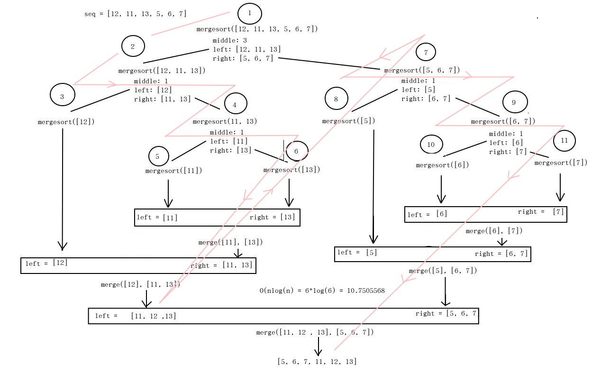

# Merge Sort

> Source: [geeksforgeeks](https://www.geeksforgeeks.org/iterative-merge-sort/)

> Related algorithm [Quick Sort](quick_sort.md)

### Difference Between Quicksort and Merge Sort
#### Definition
Quicksort is an efficient sorting algorithm, serving as a systematic method for placing the elements of an array in order. In contrast, merge sort is an efficient, general purpose, comparison-based sorting algorithms. Thus, this is the fundamental difference between quicksort and merge sort.

### Functionality
Aboveall, the functionality is the main difference between quicksort and merge sort. Quicksort sorts the elements by comparing each element with the pivot while merge sort divides the array into two subarrays (n/2) again and again until one element is left.

### Application
Also, while quicksort is suitable for small arrays, merge sort works for any type of array.

### Speed
Another difference between quicksort and merge sort is that the quicksort works faster for small data sets while merge sort works in consistent speed for all datasets.

### Space Requirement
Moreover, the space requirement is also an important difference between quicksort and merge sort. Quicksort requires minimum space compared to merge sort.  

### Efficiency
Furthermore, quicksort is not efficient for large arrays, but merge sort is more efficient than quicksort. Hence, this is another difference between quicksort and merge sort.

### Conclusion
In summary, the main difference between quicksort and merge sort is that the quicksort sorts the elements by comparing each element with an element called a pivot while the merge sort divides the array into two subarrays again and again until one element is left.



## Recursive Merge Sort:
```python
def merge(left, right):
    print(f"left: {left}; right: {right}")
    if not len(left) or not len(right):
        return left or right
    pdb.set_trace()
    result = []
    i, j = 0, 0
    while (len(result) < len(left) + len(right)):
        if left[i] < right[j]:
            result.append(left[i])
            print(f"result l < r: {result}")
            i+= 1
        else:
            result.append(right[j])
            print(f"result r > l: {result}")
            j+= 1
        if i == len(left) or j == len(right):
            result.extend(left[i:] or right[j:])
            break
    print(f"result: {result}")
    return result

def mergesort(list):
    if len(list) < 2:
        print(f"returning list: {list}")
        return list
    
    middle = int(len(list)/2)
    pdb.set_trace()
    print(f"middle: {int(len(list)/2)}") 
    print(f"left: {list[:middle]}") 
    print(f"right: {list[middle:]}") 
    left = mergesort(list[:middle])
    right = mergesort(list[middle:])
    return merge(left, right)

seq = [12, 11, 13, 5, 6, 7]
print("Given array is")
print(seq);
print("\n")
print("Sorted array is")
print(mergesort(seq))
 
# Code Contributed by Mohit Gupta_OMG
```

## Iterative Merge Sort:
```python
# Iterative Merge sort (Bottom Up)

# Iterative mergesort function to
# sort arr[0...n-1]

# perform bottom up merge
def mergeSort(a):
	# start with least partition size of 2^0 = 1
	width = 1
	n = len(a)										
	# subarray size grows by powers of 2
	# since growth of loop condition is exponential,
	# time consumed is logarithmic (log2n)
	while (width < n):
		# always start from leftmost
		l=0;
		while (l < n):
			r = min(l+(width*2-1), n-1)		
			m = min(l+width-1,n-1)
			# final merge should consider
			# unmerged sublist if input arr
			# size is not power of 2			
			print(f"merge({a}, {l}, {m}, {r})")
			merge(a, l, m, r)
			l += width*2
		# Increasing sub array size by powers of 2
		width *= 2
	return a

# Merge Function
def merge(a, l, m, r):
	n1 = m - l + 1
	n2 = r - m
	L = [0] * n1
	R = [0] * n2
	for i in range(0, n1):
		L[i] = a[l + i]
	for i in range(0, n2):
		R[i] = a[m + i + 1]
	print(f"n1: {n1} n2: {n2} L: {L} R: {R}")
	i, j, k = 0, 0, l
	while i < n1 and j < n2:
		if L[i] <= R[j]:
			a[k] = L[i]
			i += 1
		else:
			a[k] = R[j]
			j += 1
		k += 1
	while i < n1:
		a[k] = L[i]
		i += 1
		k += 1
	while j < n2:
		a[k] = R[j]
		j += 1
		k += 1


# Driver code
a = [-74,48,-20,2,10,-84,-5,-9,11,-24,-91,2,-71,64,63,80,28,-30,-58,-11,-44,-87,-22,54,-74,-10,-55,-28,-46,29,10,50,-72,34,26,25,8,51,13,30,35,-8,50,65,-6,16,-2,21,-78,35,-13,14,23,-3,26,-90,86,25,-56,91,-13,92,-25,37,57,-20,-69,98,95,45,47,29,86,-28,73,-44,-46,65,-84,-96,-24,-12,72,-68,93,57,92,52,-45,-2,85,-63,56,55,12,-85,77,-39]
a = [-1,5,12,11,13,5,6,-2,0,7]
print("Given array is ")
print(a)
mergeSort(a)

print("Sorted array is ")
print(a)

# Contributed by Madhur Chhangani [RCOEM]
# corrected and improved by @mahee96

```


```python

# perform bottom up merge
def mergeSort(a):
    # start with least partition size of 2^0 = 1
    width = 1
    n = len(a)                                         
    # subarray size grows by powers of 2
    # since growth of loop condition is exponential,
    # time consumed is logarithmic (log2n)
    while (width < n):
        # always start from leftmost
        l=0;
        while (l < n):
            r = min(l+(width*2-1), n-1)        
            m = min(l+width-1,n-1)
            # final merge should consider
            # unmerged sublist if input arr
            # size is not power of 2             
            merge(a, l, m, r)
            l += width*2
        # Increasing sub array size by powers of 2
        width *= 2
    return a
   
# Merge Function
def merge(a, l, m, r):
    print(f"{a}, {l}, {m}, {r})")
    n1 = m - l + 1
    n2 = r - m
    L = [0] * n1
    R = [0] * n2
    for i in range(0, n1):
        L[i] = a[l + i]
    for i in range(0, n2):
        R[i] = a[m + i + 1]
 
    i, j, k = 0, 0, l
    while i < n1 and j < n2:
        if L[i] <= R[j]:
            a[k] = L[i]
            i += 1
        else:
            a[k] = R[j]
            j += 1
        k += 1
 
    while i < n1:
        a[k] = L[i]
        i += 1
        k += 1
 
    while j < n2:
        a[k] = R[j]
        j += 1
        k += 1
 
 
# Driver code
a = [-74,48,-20,2,10,-84,-5,-9,11,-24,-91,2,-71,64,63,80,28,-30,-58,-11,-44,-87,-22,54,-74,-10,-55,-28,-46,29,10,50,-72,34,26,25,8,51,13,30,35,-8,50,65,-6,16,-2,21,-78,35,-13,14,23,-3,26,-90,86,25,-56,91,-13,92,-25,37,57,-20,-69,98,95,45,47,29,86,-28,73,-44,-46,65,-84,-96,-24,-12,72,-68,93,57,92,52,-45,-2,85,-63,56,55,12,-85,77,-39]
print("Given array is ")
print(a)
mergeSort(a)
 
print("Sorted array is ")
print(a)

```