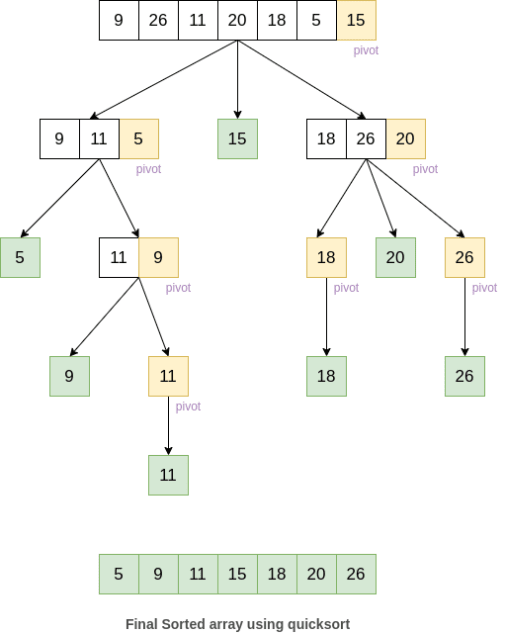

# Quick Sort

After sorting you can search the array with [binary search](../binary_search).



Take last element as pivot and low and high are indexes of full array's start and end

```python
import pdb

def partition(arr, low, high):
    i = (low-1)           # index of smaller element
    pivot = arr[high]     # pivot, takes right most element
    # print("call to partition")
    # pdb.set_trace()
    for j in range(low, high):
  
        # If current element is smaller than or
        # equal to pivot
        if arr[j] <= pivot:
            # increment index of smaller element
            i = i+1
            arr[i], arr[j] = arr[j], arr[i]
        # print(arr)
  
    arr[i+1], arr[high] = arr[high], arr[i+1]
    # print(arr)
    return (i+1)

# low and high are indexes of full array's start and end
def quickSort(arr, low, high):
    if len(arr) == 1:
        return arr
    if low < high:
  
        # pi is partitioning index, arr[p] is now
        # at right place
        pi = partition(arr, low, high)
        # pdb.set_trace()
        # Separately sort elements before
        # partition and after partition
        quickSort(arr, low, pi-1)
        quickSort(arr, pi+1, high)
  
  
# Driver code to test above
arr = [2, 7, 8, 9, 1, 5]
n = len(arr)
quickSort(arr, 0, n-1)
print("Sorted array is:",arr)
# for i in range(n):
#     print("%d" % arr[i]),
```

> Big O notation for this algorithm is O(log(n)). However according to [medium.com](https://medium.com/cesars-tech-insights/quicksort-17c5d24e7e5f#:~:text=Quicksort%20is%20a%20logarithmic%2Dtime,Merge%20Sort%20or%20Heap%20Sort.&text=Quicksort%20uses%20recursion%2C%20divide%2Dand,%2Dconquer%20and%20comparison%2Dsort.), O(log (n)) speed is a best-case/average time, in worst case scenarios it can be O(n2) depending on the implementation.