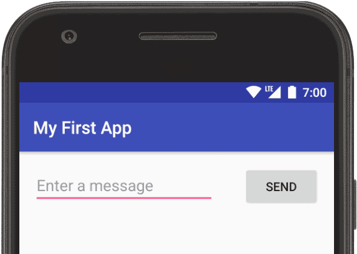
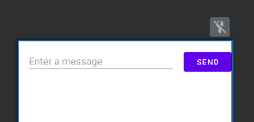

# Hello World

## Download Android Studio

[Android Studio](https://developer.android.com/studio/?gclid=CjwKCAiAsNKQBhAPEiwAB-I5zYMyj4kM8qulHdWpOwGTepIxZnIkuubwiapK1vEK95gQBIaOXcKuqxoCNGgQAvD_BwE&gclsrc=aw.ds)

Place extracted folder in:
```bash
/home/bbearce/Documents/android-studio-2021.1.1.21-linux
```

Ex:
```bash
bbearce@terry:~/Documents/android-studio-2021.1.1.21-linux$ ls -la
total 12
drwxrwxr-x  3 bbearce bbearce 4096 Feb 22 14:59 .
drwxr-xr-x 45 bbearce bbearce 4096 Feb 22 14:59 ..
drwxrwxr-x  7 bbearce bbearce 4096 Dec 31  2009 android-studio

bbearce@terry:~/Documents/android-studio-2021.1.1.21-linux$ ls -la android-studio/
total 3336
drwxrwxr-x  7 bbearce bbearce    4096 Dec 31  2009 .
drwxrwxr-x  3 bbearce bbearce    4096 Feb 22 14:59 ..
drwxrwxr-x  4 bbearce bbearce    4096 Dec 31  2009 bin
-rwxr-xr-x  1 bbearce bbearce  105333 Dec 31  2009 brokenPlugins.db
-rw-rw-r--  1 bbearce bbearce      27 Dec 31  2009 build.txt
-rwxr-xr-x  1 bbearce bbearce    7554 Dec 31  2009 classpath.txt
-rwxr-xr-x  1 bbearce bbearce 3231744 Dec 31  2009 icons.db
-rwxr-xr-x  1 bbearce bbearce    1852 Dec 31  2009 Install-Linux-tar.txt
drwxrwxr-x  6 bbearce bbearce    4096 Dec 31  2009 jre
drwxrwxr-x  5 bbearce bbearce   16384 Dec 31  2009 lib
drwxrwxr-x  2 bbearce bbearce    4096 Dec 31  2009 license
-rwxr-xr-x  1 bbearce bbearce   11352 Dec 31  2009 LICENSE.txt
-rwxr-xr-x  1 bbearce bbearce     396 Dec 31  2009 NOTICE.txt
drwxrwxr-x 57 bbearce bbearce    4096 Dec 31  2009 plugins
-rw-rw-r--  1 bbearce bbearce     418 Dec 31  2009 product-info.json
```

Run with:
```bash
/home/bbearce/Documents/android-studio-2021.1.1.21-linux/android-studio/bin/studio.sh
```

## Android Studio

Reference: [Build Your First App](https://developer.android.com/training/basics/firstapp)

### Apps provide multiple entry points
Android apps are built as a combination of components that can be invoked individually. For example, an *activity* is a type of app component that provides a user interface (UI).

Other components, such as *WorkManager*, allow your app to perform background tasks without a UI.

If any of your app's features need specific hardware, such as a camera, you can query at runtime whether the device has that hardware or not, and then disable the corresponding features if it doesn't. You can specify that your app requires certain hardware so that Google Play won't allow the app to be installed on devices without them.

After you build your first app, you can learn more about the other app components at [Application fundamentals](https://developer.android.com/guide/components/fundamentals).

After you build your first app, learn more about device configurations at [Device compatibility overview](https://developer.android.com/guide/practices/compatibility).

### Create First Project

[https://developer.android.com/training/basics/firstapp/creating-project](https://developer.android.com/training/basics/firstapp/creating-project)

> There are notes about emulators and connecting to your phone but they are simple. Read if necessary from above links.

### Build a Simple User Interface

In this lesson, you learn how to use the [Android Studio Layout Editor(https://developer.android.com/studio/write/layout-editor)] to create a layout that includes a text box and a button. This sets up the next lesson, where you learn how to make the app send the content of the text box to another activity when the button is tapped.

The user interface (UI) for an Android app is built as a hierarchy of *layouts* and *widgets*. The layouts are ```ViewGroup``` objects, containers that control how their child views are positioned on the screen. Widgets are ```View``` objects, UI components such as buttons and text boxes.




Android provides an XML vocabulary for ```ViewGroup``` and ```View``` classes, so most of your UI is defined in XML files. However, rather than teach you to write XML, this lesson shows you how to create a layout using Android Studio's Layout Editor. The Layout Editor writes the XML for you as you drag and drop views to build your layout.

In the Project window, **open app > res > layout > activity_main.xml**.

### building-ui

[Build This UI](https://developer.android.com/training/basics/firstapp/building-ui)



### starting-activity

Source: [starting-activity](https://developer.android.com/training/basics/firstapp/starting-activity#java)

#### MainActivity

We skipped over the *MainActivity.java* code that was pre-defined:
```java
package com.example.myfirstapp;

import androidx.appcompat.app.AppCompatActivity;

import android.os.Bundle;

public class MainActivity extends AppCompatActivity {

    @Override
    protected void onCreate(Bundle savedInstanceState) {
        super.onCreate(savedInstanceState);
        setContentView(R.layout.activity_main);
    }
}
```

#### Respond to Send Button

Add this method to class MainActivity:
```java
    /** Called when the user taps the Send button */
    public void sendMessage(View view) {
        // Do something in response to button
    }
```

Note: we need to import the *View* class.:
```java
import android.view.View;
...
```

Add the Method *sendMessage* to the button under Button Attributes -> onCLick.

#### Build an Intent

An *Intent* is an object that provides runtime binding between separate components, such as two activities. The Intent represents an app’s intent to do something. You can use intents for a wide variety of tasks, but in this lesson, your intent starts another activity.

Edit *sendMessage()*:
```java
    public void sendMessage(View view) {
        Intent intent = new Intent(this, DisplayMessageActivity.class);
        EditText editText = (EditText) findViewById(R.id.editTextTextPersonName);
        String message = editText.getText().toString();
        intent.putExtra(EXTRA_MESSAGE, message);
        startActivity(intent);
    }
```

Here is what is going on:

The ```Intent``` constructor takes two parameters, a ```Context``` and a ```Class```.

The ```Context``` parameter is used first because the ```Activity``` class is a subclass of Context.

The ```Class``` parameter of the app component, to which the system delivers the ```Intent```, is, in this case, the activity to start.

The ```putExtra()``` method adds the value of ```EditText``` to the intent. An ```Intent``` can carry data types as key-value pairs called extras.

Your key is a public constant ```EXTRA_MESSAGE``` because the next activity uses the key to retrieve the text value. It's a good practice to define keys for intent extras with your app's package name as a prefix. This ensures that the keys are unique, in case your app interacts with other apps.

The ```startActivity()``` method starts an instance of the ```DisplayMessageActivity``` that's specified by the ```Intent```. Next, you need to create that class.

#### Create The Second Activity

To create the second activity, follow these steps:

1. In the **Project** window, right-click the **app** folder and select **New > Activity > Empty Activity**.
2. In the **Configure Activity** window, enter "DisplayMessageActivity" for **Activity Name**. Leave all other properties set to their defaults and click **Finish**.

Android Studio automatically does three things:

* Creates the ```DisplayMessageActivity``` file.  
* Creates the layout file ```activity_display_message.xml```, which corresponds with the ```DisplayMessageActivity``` file.  
* Adds the required ```<activity>``` element in ```AndroidManifest.xml```.  

DisplayMessageActivity should look like this:
```java
package com.example.myfirstapp;

import androidx.appcompat.app.AppCompatActivity;

import android.content.Intent;
import android.os.Bundle;
import android.widget.TextView;

public class DisplayMessageActivity extends AppCompatActivity {

    @Override
    protected void onCreate(Bundle savedInstanceState) {
        super.onCreate(savedInstanceState);
        setContentView(R.layout.activity_display_message);

        // Get the Intent that started this activity and extract the string
        Intent intent = getIntent();
        String message = intent.getStringExtra(MainActivity.EXTRA_MESSAGE);

        // Capture the layout's TextView and set the string as its text
        TextView textView = findViewById(R.id.textView);
        textView.setText(message);
    }
}


```

#### Add Upward Navigation

Each screen in your app that's not the main entry point, which are all the screens that aren't the home screen, must provide navigation that directs the user to the logical parent screen in the app's hierarchy. To do this, add an **Up** button in the app bar.
