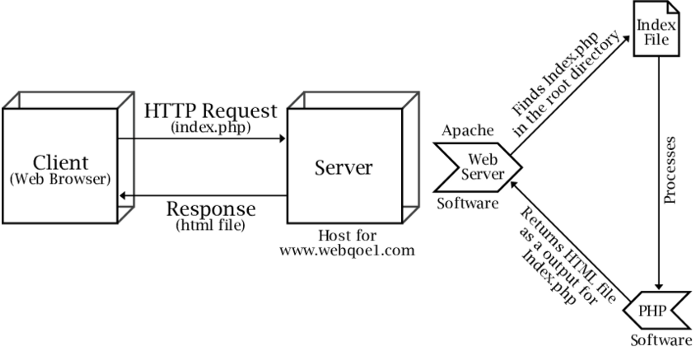

# Apache

## Intro
Intro Source: [Medium](https://medium.com/@jovanshernandez/introduction-to-apache-web-server-2138af643039)

Hypertext Transfer Protocol Secure is usually through port 443 with the unsecured protocol being through port 80.

The Apache server is configured via config files in which modules are used to control its behavior. By default, Apache listens to the IP addresses configured in its config files that are being requested. This is where one of Apaches many strengths come into play.

## Flask

Source: [codementor.io](https://www.codementor.io/@abhishake/minimal-apache-configuration-for-deploying-a-flask-app-ubuntu-18-04-phu50a7ft)
