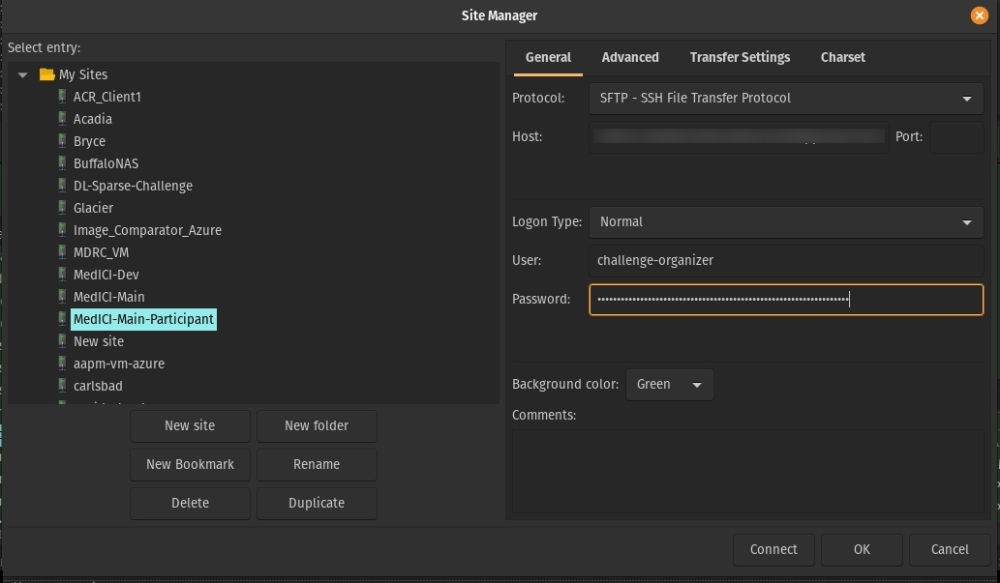

# SFTP

## Setup an SFTP server

Source: [linuxconfig.org](https://linuxconfig.org/how-to-setup-sftp-server-on-ubuntu-20-04-focal-fossa-linux)

"Secure File Transfer Protocol"

In this tutorial you will learn:

* How to install and configure SSH daemon
* How to setup an SFTP user account and group
* How to connect to SFTP server via command line
* How to connect to SFTP server via command line

SFTP requires SSH, so if SSH server is not already installed on your system, install it with the following command:
```bash
$ sudo apt install ssh
```

Once SSH is installed, we need to make some changes to the SSHD configuration file. Use nano or your favorite text editor to open it:
```bash
$ sudo vi /etc/ssh/sshd_config
```

Scroll to the bottom of the file and add the following 5 lines at the very end:
```bash
Match group sftp
ChrootDirectory /home
X11Forwarding no
AllowTcpForwarding no
ForceCommand internal-sftp
```

Restart the SSH service for these new changes to take effect:
```bash
$ sudo systemctl restart ssh
```

Create a new user group called sftp. All of our SFTP users will need to belong to this group.
```bash
$ sudo addgroup sftp
Adding group `sftp' (GID 1002) ...
Done.
```

## Login

```bash
bbearce@terry:~$ sftp challenge-organizer@<server ip address>
challenge-organizer@<server ip address>'s password: 
Connected to <server ip address>.
sftp> ls
azureuser                 challenge-organizer       
sftp>
```

## Use FileZilla

Real Example:

```bash
azureuser@codalab-vm:~$ ls -la /home
total 16
drwxr-xr-x  4 root                root      4096 Feb  5 16:13 .
drwxr-xr-x 23 root                root      4096 Jan 21 06:22 ..
drwxr-x--- 13 azureuser           azureuser 4096 Feb  7 03:13 azureuser
drwx------  6 challenge-organizer sftp      4096 Feb  7 02:43 challenge-organizer
```

```bash
$ sudo vi /etc/ssh/sshd_config
```

sshd_config:
> Note: ChrootDirectories have to be owned by root.
```bash
Match group sftp
#Match user challenge-organizer # other option
ChrootDirectory /home
    X11Forwarding no
    AllowTcpForwarding no
    ForceCommand internal-sftp
```                           


> Notice how to the sftp user they are at ```/``` but for them that is ```/home```. You don't want to give them access to the real ```/```.
