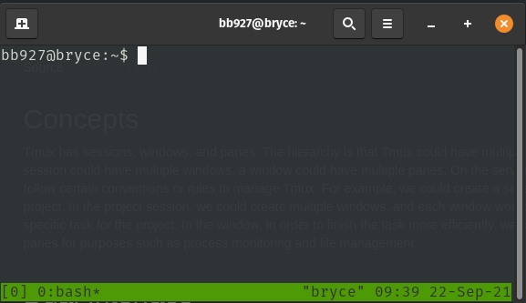
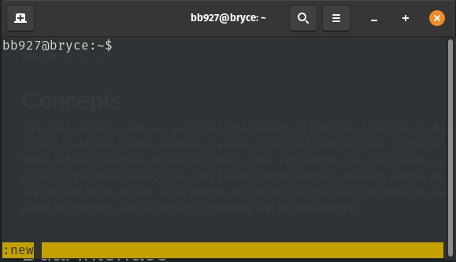
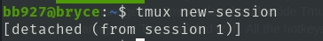
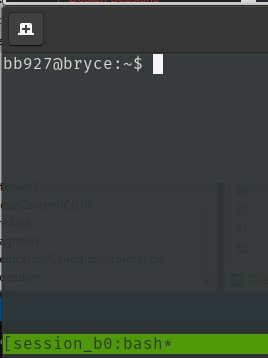
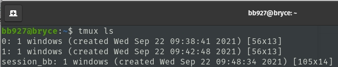
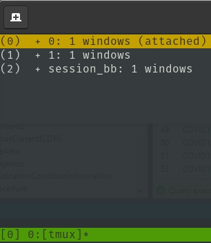
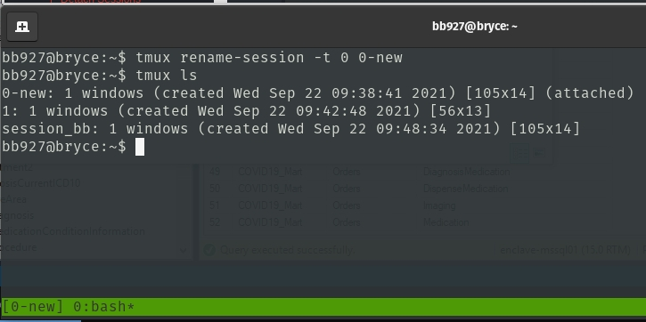
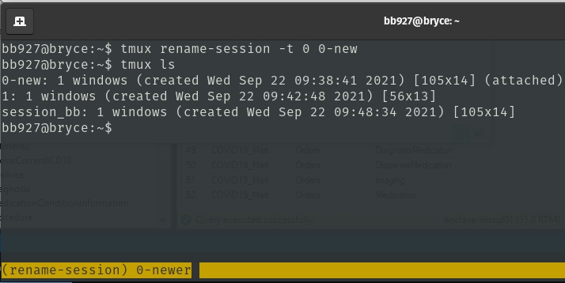

# TMUX

Source [leimao.github.io](https://leimao.github.io/blog/Tmux-Tutorial/)

## Cheat Sheets and Config
[Tmux Cheat Sheet](https://tmuxcheatsheet.com/)
[Customize Config](https://www.hamvocke.com/blog/a-guide-to-customizing-your-tmux-conf/)

## Concepts
Tmux has sessions, windows, and panes. The hierarchy is that Tmux could have multiple sessions, a session could have multiple windows, a window could have multiple panes. On the server, users could follow certain conventions or rules to manage Tmux. For example, we could create a session for a specific project. In the project session, we could create multiple windows, and each window would be used for each specific task for the project. In the window, in order to finish the task more efficiently, we create multiple panes for purposes such as process monitoring and file management.

## Dual Interface
Similar to Docker, Tmux has two layers of the interface, the local terminal outside Tmux, and the terminal inside Tmux. We could manage Tmux in both layers. While typing bash commands are equivalent in both interface, to manage the Tmux related stuff inside Tmux, we would need to use hotkeys so Tmux knows when to manage the Tmux related stuff. All the hotkeys are prefixed by ```Ctrl + b```.

## Tmux Console
In the Tmux terminal, we could call out Tmux console by ```Ctrl + b + :``` and run all the Tmux commands available for the local terminal without tmux prefix. For example, if there is a Tmux command for the local terminal like this.
```bash
$ tmux xxxxx
```
In the Tmux console in the Tmux terminal, we could do the equivalent thing by running the following command.
```
:xxxxx
```

> Note that ```:``` is the prefix of the Tmux console which we don’t type. : could be thought as $ tmux in the local terminal.

## Create Sessions
In the local terminal, we create Tmux sessions by simply running one of the following three equivalent commands.
```bash
$ tmux
$ tmux new
$ tmux new-session
```



This will create a new session to the existing Tmux. If there is no previous Tmux session running, this will create the first Tmux session. If there are already Tmux sessions running, this will create an additional one.

> This has auto named the session and will not have a custom name but rather "session 1"..."session n".



Tmux requires at least one session to run. If the last session was closed, Tmux server will automatically close.

## Detach Sessions
To return to the local terminal from Tmux sessions, we usually do detach by hitting Ctrl + b + d. Everything would be still running in the backend.



In some scenarios, we could return to the local terminal by running the following command in the Tmux terminal.
```bash
$ exit
```
> However, bear in mind that using this method the current session will exit and all the information in the current session will be lost.

## Create Sessions With Names
Tmux, by default, uses natural integers as the name for sessions. This is sometimes inconvenient for project management. We could create sessions with names using the following commands in the local terminal.
```bash
$ tmux new -s [session-name]
```


## View Sessions
To view Tmux sessions from the local terminal, run one of the following commands.
```bash
$ tmux ls
$ tmux list-sessions
```



In Tmux terminal, we check Tmux sessions by hitting Ctrl + b + s. The following information will show up.



Hit ```Esc``` or ```q``` to exit the information.

## Rename Sessions
To rename sessions, from the local terminal, we run the following command.

$ tmux rename-session [-t session-name] [new-session-name]

> If ```[-t session-name]```is not provided, the last session used will be renamed.

Ex:


Alternatively, we may also hit ```Ctrl + b + $``` to rename the current session in the Tmux terminal.



```bash
bb927@bryce:~$ tmux ls
0-newer: 1 windows (created Wed Sep 22 09:38:41 2021) [105x14] (attached)
1: 1 windows (created Wed Sep 22 09:42:48 2021) [56x13]
session_bb: 1 windows (created Wed Sep 22 09:48:34 2021) [105x14]
```

## Kill Sessions
To kill all sessions, from the local terminal, we run the following command.
```bash
$ tmux kill-server
```

Ex:
```bash
bb927@bryce:~$ tmux kill-server
bb927@bryce:~$ tmux ls
no server running on /tmp/tmux-4643095/default
```

To kill specific sessions, from the local terminal, we run the following command.
```bash
$ tmux kill-session -t [session-name]
```

## Attach Sessions
To attach to specific sessions, from the local terminal, we run the following command.

$ tmux attach -t [session-name]

## Create/Close Windows
In Tmux session, we could have multiple windows. To create a window, in the Tmux terminal, we hit ```Ctrl + b + c```. To kill the current window, in the Tmux terminal, we hit ```Ctrl + b + &``` (```&``` is ```Shift + 7```).


The windows in the sessions could have names. We rename the current window by hitting ```Ctrl + b + ,```.

## Select Windows
Each window in the session, regardless of whether it has a name or not (actually its default name is always bash), would have a window id of natural integer 0, 1, etc. We select specific window by hitting ```Ctrl + b + window id```.

Sometimes it is also convenient to use ```Ctrl + b + n``` to move to the next window, or ```Ctrl + b + p``` to move to the previous window.

## Create/Close Panes
Each window in the session could have multiple panes, just like Gnome Terminator. To split the pane vertically, we hit ```Ctrl + b + %```. To split the pane horizontally, we hit ```Ctrl + b + "```. To close the current pane, we we hit ```Ctrl + b + x```.

To toggle between panes in the window, we simply hit ```Ctrl + b + ↑/↓/←/→```.

## Use Mouse
To scroll using mouse, we have to enable mouse mode in Tmux.  
```:set -g mouse on```

To disable mouse mode in Tmux  
```:set -g mouse off```

## Copy and Paste
To do copy and paste in Tmux or between Tmux and host, holding Shift while left clicking and selecting text followed by pressing Ctrl-Shift-C will copy to the X clipboard. Ctrl-Shift-V will paste from the X clipboard as well.

Alternatively, holding Shift while left clicking and selecting text followed by right clicking. To paste, holding Shift while clicking the middle button of the mouse.

## Tmux Resurrect Usages
### Installation
To install Tmux Resurrect, it is recommended to install Tmux Plugin Manager first. Please check the GitHub repo for installation instructions.


Then we add new plugin Tmux Resurrect to Tmux by adding set -g @plugin 'tmux-plugins/tmux-resurrect' to ~/.tmux.conf. An example of the ~/.tmux.conf would be
```bash
$ cat ~/.tmux.conf 
# List of plugins
set -g @plugin 'tmux-plugins/tpm'
set -g @plugin 'tmux-plugins/tmux-sensible'
set -g @plugin 'tmux-plugins/tmux-resurrect'

# Other examples:
# set -g @plugin 'github_username/plugin_name'
# set -g @plugin 'git@github.com/user/plugin'
# set -g @plugin 'git@bitbucket.com/user/plugin'

# Initialize TMUX plugin manager (keep this line at the very bottom of tmux.conf)
run -b '~/.tmux/plugins/tpm/tpm'
```

Finally, we install the plugin by hitting Ctrl + b + I in the Tmux terminal. We would see the following information if the installation was successful.
```
                                                                         [0/0]
TMUX environment reloaded.
Done, press ESCAPE to continue.
```

## Save and Restore Tmux Environment
To save the Tmux environment, we hit ```Ctrl + b + Ctrl + s``` in the Tmux Terminal. If the save was successful, a message of Tmux environment saved! would pop up.

To restore the Tmux environment, we hit Ctrl + b + Ctrl + r in the Tmux Terminal. If the restore was successful, a message of Tmux restore complete! would pop up.

All the sessions, windows, and panels would be saved and restored with Tmux Resurrect. Some of the running commands, such as htop, would be restored as well.

## Last Tricks
Prefix Key Binding
Sometimes hitting the hotkey prefix ```Ctrl + b``` could be tedious. We could set a single button hit for ```Ctrl + b```. The right ```⊞ Win``` key on my keyboard seems to be useless in Ubuntu, and we could bind the right ```⊞ Win``` key to ```Ctrl + b```.

Acknowledgement
Thank my friend Dong Meng for recommending Tmux Resurrect to me.

Final Remarks
We would see concept similarities between Tmux, Docker, and Vim. More comprehensive Tmux commands could be found on [Tmux Cheat Sheet](https://tmuxcheatsheet.com/).