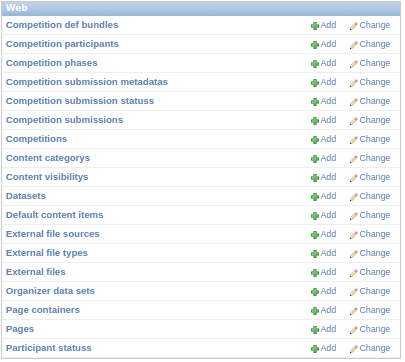
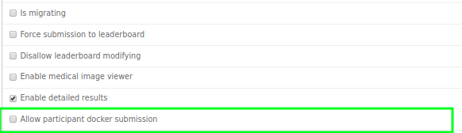
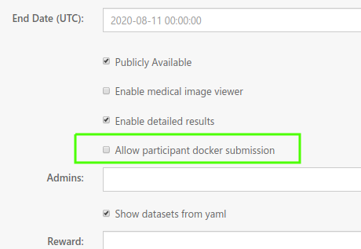
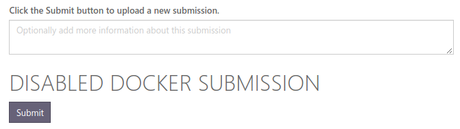
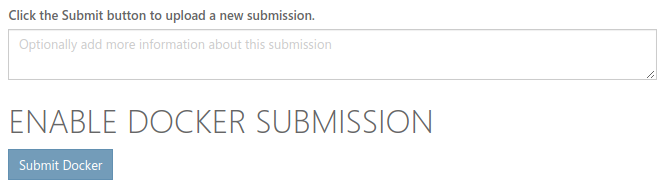
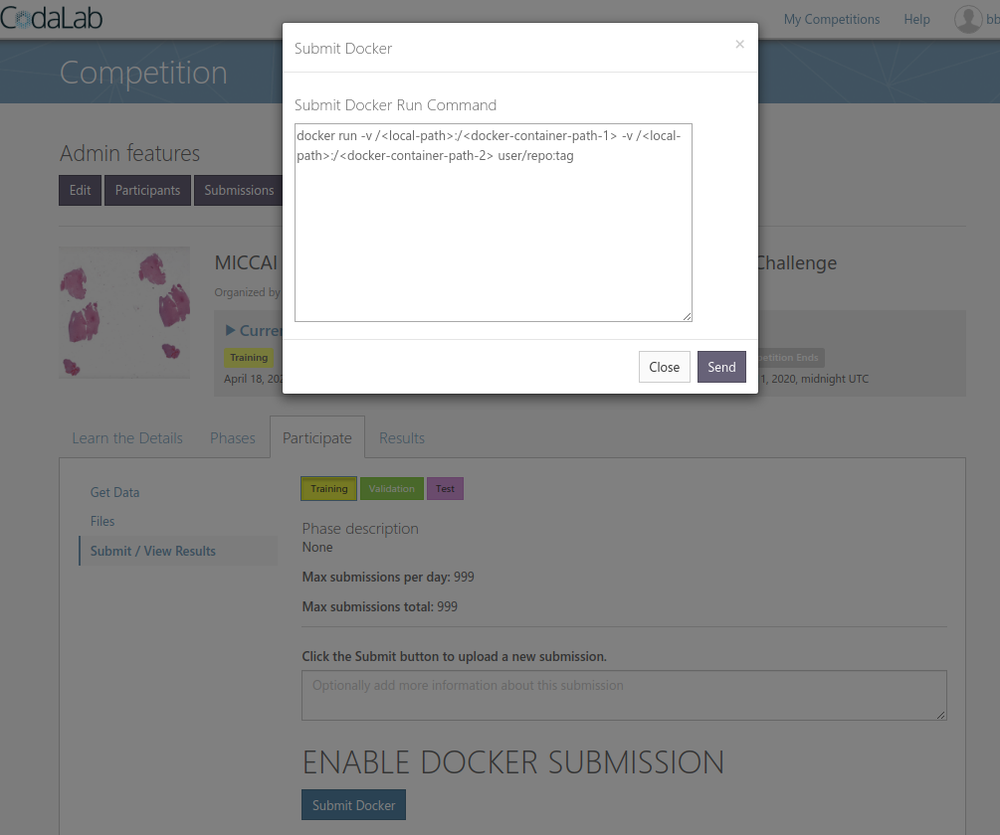

# Docker Submission

This is a documentation for adding docker submissions to the open source project [CodaLab](https://github.com/codalab/codalab-competitions).


## Introduction

Codalab comes with essentially 2 types of submissions from participants:

* Results Submission: Participants submit the "results" of their algorithms.  
* Code Submission: Participants submit actual code to be executed by the challenge organizer. The code can be executed directly as an executable ($ python sample.py...) or participants can define classes that the organizer calls themselves (hence the participants do not have to read the input data themselves).

We will be adding a third option where participants can submit a docker image with their code and libraries baked in.

## Step 1: Install Codalab

First we need a running instance installed. Setup the challenge to accept a results submission, as we will tweak this process to evaluate the output of a docker container. 

## Step 2: Add Database Option for Docker Submission

### Add New Column in Competition Table

Find file ```/codalab/apps/web/models.py```. Approximately on line 230 is the Competition model definition. It has definitions for the columns of this table. It looks like this:

```python
class Competition(ChaHubSaveMixin, models.Model):
...
```

Add ```enable_docker_submission``` as a ```BooleanField```:

**Add this line:**
```python
enable_docker_submission = models.BooleanField(default=False, verbose_name="Allow participant docker submission")
```

It doesn't matter what order the columns are in, so if you are familiar with setting up models in Django or Flask projects, just add a column that we can reference later.

### Migrate Database So We Can See Our Changes

Codalab as of this writing (5/1/2020) is deployed with an orchestration of docker containers. One of these is the database (postgres). 

Using ```docker ps``` we can see our images:

```bash
bbearce@MedICI-CodaLab-Master:~/src$ docker ps
CONTAINER ID        IMAGE                                          COMMAND                  CREATED             STATUS              PORTS                                                                                        NAMES
b8196a2e9fc5        nginx                                          "bash -x /app/docker…"   4 months ago        Up 2 months         0.0.0.0:80->80/tcp, 0.0.0.0:443->443/tcp                                                     nginx
528d2dc976a1        codalab-competitions_django                    "bash /app/docker/ru…"   4 months ago        Up 2 months         0.0.0.0:8000->8000/tcp                                                                       django
c56dcc7fb3e2        codalab-competitions_worker_site               "sh /app/docker/run_…"   4 months ago        Up 2 months                                                                                                      worker_site
23996bbcfbd0        codalab/competitions-v1-compute-worker:1.1.7   "/bin/sh -c 'celery …"   4 months ago        Up 2 months                                                                                                      worker_compute
3f5a1df0f9ae        codalab-competitions_flower                    "/usr/bin/dumb-init …"   4 months ago        Up 2 months         0.0.0.0:5555->5555/tcp                                                                       flower
b93b3f7e0a3b        codalab-competitions_rabbit                    "docker-entrypoint.s…"   4 months ago        Up 2 months         4369/tcp, 5671/tcp, 0.0.0.0:5672->5672/tcp, 15671/tcp, 25672/tcp, 0.0.0.0:15672->15672/tcp   rabbit
5e3492959db1        postgres:9.6.3                                 "docker-entrypoint.s…"   4 months ago        Up 2 months         5432/tcp                                                                                     postgres

```

We need use manage.py from the django container to migrate the database. This will talk to the postgres container for us. Codalab has notes for how to do this so we will [follow their lead](https://github.com/codalab/codalab-competitions/wiki/Dev_Database-Migrations):

> Note, in the link from codalab they have a placeholder for ```APPNAME```. Substitute ```web``` in for this.

```bash
root@django:/app/codalab# ./manage schemamigration web --auto
./manage: line 3: ./config/generated/startup_env.sh: No such file or directory
./manage: line 4: ../venv/bin/activate: No such file or directory
/usr/local/lib/python2.7/site-packages/django_extensions/db/fields/__init__.py:425: DeprecationWarning: Django 1.8 features a native UUIDField, this UUIDField will be removed after Django 1.7 becomes unsupported.
  warnings.warn("Django 1.8 features a native UUIDField, this UUIDField will be removed after Django 1.7 becomes unsupported.", DeprecationWarning)

 + Added field enable_docker_submission on web.Competition
Created 0085_auto__add_field_competition_enable_docker_submission.py. You can now apply this migration with: ./manage.py migrate web

```


Once you have that migrate the database.

```bash
./manage migrate
```

This will apply the migration and look for all changes to all tables. Looking in the results we can see our migration in action:

```bash
~
~
Running migrations for web:
 - Migrating forwards to 0085_auto__add_field_competition_enable_docker_submission.
 > web:0085_auto__add_field_competition_enable_docker_submission
~
~
```

Now let's verify our change. First create a database superuser:

```bash
docker exec -it django python manage.py createsuperuser
```

This will prompt you to create a superuser:
```bash
bbearce@miccai2019:~/src/codalab-competitions/codalab$ docker exec -it django python manage.py createsuperuser
/usr/local/lib/python2.7/site-packages/django_extensions/db/fields/__init__.py:425: DeprecationWarning: Django 1.8 features a native UUIDField, this UUIDField will be removed after Django 1.7 becomes unsupported.
  warnings.warn("Django 1.8 features a native UUIDField, this UUIDField will be removed after Django 1.7 becomes unsupported.", DeprecationWarning)

Username: admin
Email address: bbearce@mgh.harvard.edu
Password: 
Password (again): 
Superuser created successfully.

```

Now proceed to http://<your domain\>.com/admin and log in with the credentials you made. Find the "Web" app section and click "Competitions".



Next scroll till you see "Allow participant docker submission" or whatever you put as your new column.



### Add Our new Option to the CompetitionForm Class

Django or CodaLab uses ```apps.web.forms.CompetitionForm``` to manage the edit competiton form. 

```python
class CompetitionForm(forms.ModelForm):
    class Meta:
        model = models.Competition
        fields = (
            'title',
            'description',
            'queue',
            'disallow_leaderboard_modifying',
            'force_submission_to_leaderboard',
            'image',
            'end_date',
            'published',
            'enable_medical_image_viewer',
            'enable_detailed_results',
            # change start
            'enable_docker_submission',
            # change end
            'admins',
...
```

This will allow us to see this option in the edit competition view:



This has the effect of allowing access to this option from multiple views so we can conditionally render a docker submission form or a regular result submission form.

## Step 3: Add Conditional Rendering for Docker\Result Submission

### Add UI Elements

Find template ```apps/web/templates/web/competitions/_submit_results_page.html```. Roughly on line 70 there is a `````` block and in the `````` block we can add our code.


Replace the inside of the else block with this code:

```html


<h1>DOCKER SUBMISSION ENABLED </h1>
<!-- Submit Docker Button -->

<button id=submit-button type="button" data-toggle="modal" data-target="#submit-docker-dialog" class="btn btn-secondary">Submit Docker</button>

<!-- Submit Docker Button -->



<h1>DOCKER SUBMISSION DISABLED</h1>
<!-- original code from codalab -->

<button id="fileUploadButton"
        class="button btn btn-primary disabled"
        disabled="disabled">
    Submit
</button> 

<!-- original code from codalab -->

```

> Our If Else block has the original code in the else.

At this point if you refresh the page and navigate to the "Participate" tab, you should see this.



Now if we go to "Edit" and look at the competition options, we see that if we check the box "Allow participant docker submission" we can see the text change on the "Participate" tab.



Next we need the "Submit Docker" button to do something. Let's add a modal that get's triggered when you click the button.

Add this code just before the line that has `````` on line ~160:

```html
<div class="modal fade" id="submit-docker-dialog">
    <div class="modal-dialog">
     
        <div class="modal-content">
            <div class="modal-header">
                <button type="button" class="close" data-dismiss="modal" aria-hidden="true">&times;</button>
                <h4 class="modal-title">Submit Docker</h4>
            </div>
            <div class="modal-body">
                <h4>Submit Docker Run Command</h4>

                <textarea id="docker-run-command" type=text style="width: 500px; height: 250px;">docker run -v /<local-path>:/<docker-container-path-1> -v /<local-path>:/<docker-container-path-2> user/repo:tag</textarea>

            </div>
            <div class="modal-footer">
                <button type="button" class="btn btn-default" data-dismiss="modal">Close</button>
               
                 <button id="submit-docker" class="btn btn-primary">Send</button>    
            </div>
        </div>
    </div>
</div>

```

You should see this when you click the "Submit Docker" button:



Now let's tie the "Send" button from the modal to some javascript so we can call the backend to process this for us. At the bottom of the same file we've been working in, add this code and create the file apps/web/static/js/submit_docker.js:


```html
<!-- Docker Submission Front End -->

<script type="text/javascript" src="{{STATIC_URL}}js/submit_docker.js"></script>

<!-- Docker Submission Front End -->
```

In submit_docker.js add this:

```js
$('#submit-docker').click(function(){

  //copy from codalab/apps/web/static/js/Competition.js file

  $('#details').html('Creating new submission...');

  var competitionId = $("#competitionId").val()
  var description = $('#submission_description_textarea').val() || '';
  var method_name = $('#submission_method_name').val() || '';
  var method_description = $('#submission_method_description').val() || '';
  var project_url = $('#submission_project_url').val() || '';
  var publication_url = $('#submission_publication_url').val() || '';
  var bibtex = $('#submission_bibtex').val() || '';
  var team_name = $('#submission_team_name').val() || '';
  var organization_or_affiliation = $('#submission_organization_or_affiliation').val() || '';
  var phase_id = $('#submission_phase_id').val();

  // capture docker run command
  var docker_run_cmd = $('#docker-run-command').val();
  console.log(docker_run_cmd);
  // capture docker run command

  $('#submission_description_textarea').val('');

  // console.log('/api/competition/' + competitionId + '/submission?description=' + encodeURIComponent(description) +
  //                     '&method_name=' + encodeURIComponent(method_name) +
  //                     '&method_description=' + encodeURIComponent(method_description) +
  //                     '&project_url=' + encodeURIComponent(project_url) +
  //                     '&publication_url=' + encodeURIComponent(publication_url) +
  //                     '&bibtex=' + encodeURIComponent(bibtex) +
  //                     '&team_name=' + encodeURIComponent(team_name) +
  //                     '&organization_or_affiliation=' + encodeURIComponent(organization_or_affiliation) +
  //                     '&phase_id=' + encodeURIComponent(phase_id)+
  //                     '&docker-run-command='+ encodeURIComponent(docker_run_cmd)
  //             )

  $.ajax({
      url: '/api/competition/' + competitionId + '/submission?description=' + encodeURIComponent(description) +
                      '&method_name=' + encodeURIComponent(method_name) +
                      '&method_description=' + encodeURIComponent(method_description) +
                      '&project_url=' + encodeURIComponent(project_url) +
                      '&publication_url=' + encodeURIComponent(publication_url) +
                      '&bibtex=' + encodeURIComponent(bibtex) +
                      '&team_name=' + encodeURIComponent(team_name) +
                      '&organization_or_affiliation=' + encodeURIComponent(organization_or_affiliation) +
                      '&phase_id=' + encodeURIComponent(phase_id)+
                      '&docker-run-command='+ encodeURIComponent(docker_run_cmd),
      type: 'post',
      cache: false,
      async: false,
      data: {
          'id': 'trackingid',
          'name': '',
          'type': '',
          'size': ''
      }
  }).done(function(response) { 
      $('#details').html('');
      $('#user_results tr.noData').remove();
      $('#user_results').append(Competition.displayNewSubmission(response, 
                                                                 description, 
                                                                 method_name, 
                                                                 method_description, 
                                                                 project_url, 
                                                                 publication_url, 
                                                                 bibtex, 
                                                                 team_name, 
                                                                 organization_or_affiliation));
      $('#user_results #' + response.id + ' .glyphicon-plus').on('click', function() { Competition.showOrHideSubmissionDetails(this) });
      //$('#fileUploadButton').removeClass('disabled');
      //$('#fileUploadButton').text("Submit Results...");
      $('#user_results #' + response.id + ' .glyphicon-plus').click();
       location.reload(true);
  }).fail(function(jqXHR) {
      var msg = 'An unexpected error occurred.';
      if (jqXHR.status == 403) {
          msg = jqXHR.responseJSON.detail;
      }
      $('#details').html(msg);
      //$('#fileUploadButton').text("Submit Results...");
      $('#fileUploadButton').removeClass('disabled');
  });
  
  $('#submit-docker-dialog').modal('toggle');

});

```

From looking at the ```ajax``` call you can see we are hitting the route for an api that ultimately triggers a ```POST``` request in view "CompetitionSubmissionViewSet" under the api app. The part we need to edit is the ```post_save()``` method.

## Step 4: Edit Site-Worker Code

Replace the ```post_save()``` with this:

```python
def post_save(self, obj, created):
    # Original Code
    #if created:
    #    evaluate_submission.apply_async((obj.pk, obj.phase.is_scoring_only))

    if escape(self.request.QUERY_PARAMS.get('docker-run-command')) == 'None':
        # submit_docker_command = None
        submit_docker_command = "this is not a docker submission"

    else:
        submit_docker_command = escape(self.request.QUERY_PARAMS.get('docker-run-command', "")).replace('&lt;','<').replace('&gt;','>')
    
    ## - pass extra info to submission
    if created:
        evaluate_submission.apply_async((obj.pk, 
                                         obj.phase.is_scoring_only, 
                                         submit_docker_command))
    ## - pass extra info to submission
```

At the bottom of ```post_save()``` is ```evaluate_submission```. That is from apps/web/tasks.py. We are passing the ```submit_docker_command``` to ```evaluate submission```. Change ```evaluate_submission ``` to accept the ```submit_docker_command```. Also edit it to pass the command to ```task_func()```

Add ```submit_docker_command``` to these two sections:

```python
def evaluate_submission(submission_id, is_scoring_only, submit_docker_command):
```
and:
```python
task_func(submission, job_id, submit_docker_command)
```

```task_func``` is actually a user defined variable for ```score```, a function in the same file above ```evaluate_submission```. Add ```submit_docker_command``` to the input of ```score```.

```python
def score(submission, job_id, submit_docker_command):
```

Towards the bottom of ```score```, ```_prepare_compute_worker_run``` needs ```submit_docker_command```. Pass it in, and subsequently add it to it's function definition at towards the top of the page:

```python
_prepare_compute_worker_run(job_id, submission, submit_docker_command, is_prediction=False)
```
and
```python
def _prepare_compute_worker_run(job_id, submission, submit_docker_command, is_prediction):
```

Inside this function you will find a ```data``` variable we need to add the docker command to:

```python
    data = {
        "id": job_id,
        "task_type": "run",
        "task_args": {
            "submission_id": submission.pk,
            "docker_image": docker_image,
            "ingestion_program_docker_image": docker_image,
            "bundle_url": _make_url_sassy(bundle_url),
            "stdout_url": _make_url_sassy(stdout, permission='w'),
            "stderr_url": _make_url_sassy(stderr, permission='w'),
            "output_url": _make_url_sassy(output, permission='w'),
            "ingestion_program_output_url": _make_url_sassy(submission.ingestion_program_stdout_file.name, permission='w'),
            "ingestion_program_stderr_url": _make_url_sassy(submission.ingestion_program_stderr_file.name, permission='w'),
            "detailed_results_url": _make_url_sassy(submission.detailed_results_file.name, permission='w'),
            "private_output_url": _make_url_sassy(submission.private_output_file.name, permission='w'),
            "secret": submission.secret,
            "execution_time_limit": submission.phase.execution_time_limit,
            "predict": is_prediction,
            'submit_docker_command':submit_docker_command, ## - Added submit_docker_command here
        }
```

At this point the code hands off the data to the Compute-Worker with ```compute_worker_run(data, soft_time_limit=time_limit, priority=2)```.

## Step 5: The Compute-Worker

We need to enter the **compute-worker** docker container and edit "worker.py". On the machine where the compute-worker is running execute:

```bash
$ docker exec -it codalab/competitions-v1-compute-worker:latest
```
...or use the compute image that you need. 

Once inside you should be able to see "worker.py". Open it. Find function ```run(task_id, task_args)```. This is where we will add our code. 

Add this:
```python
if task_args['submit_docker_command'] != 'this is not a docker submission':
    print('@CUSTOM DOCKER START@')
    participant_docker_cmd = task_args['submit_docker_command'].format(input_dir+"/res")
    logger.info("Invoking program %s", participant_docker_cmd)
    participant_docker_process = Popen(participant_docker_cmd.split(" "))
    participant_docker_process.wait() # This halts other actions till this run isfinished.
    print('@CUSTOM DOCKER END@')

```

This is the important line:
```python
participant_docker_cmd = task_args['submit_docker_command'].format(input_dir+"/res")
```

This line substitutes the results directory into a mount placeholder so that the container can put the results from the run into it. Then the compute-worker can consume the results.


