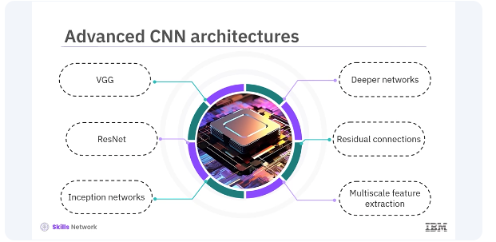
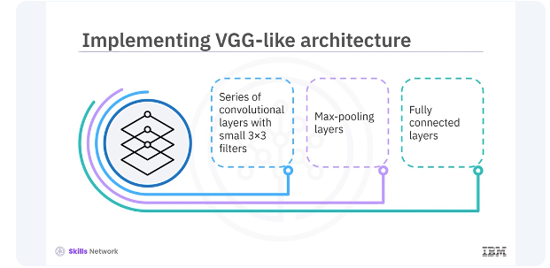
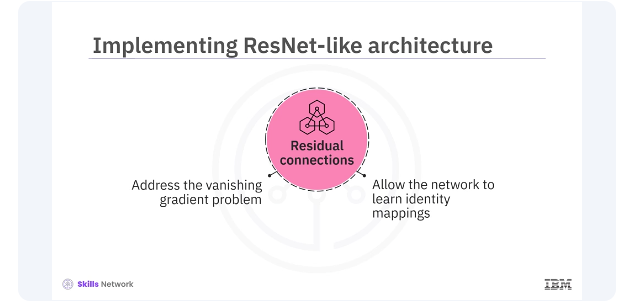

# Advanced CNNs in Keras


Welcome to this video on advanced techniques for ​developing convolutional neural networks, ​CNNs, using Keras. ​After watching this video, you'll be able to:

* ​explain advanced techniques for ​developing convolutional neural networks, ​CNNs, using Keras.  
* implement various advanced CNN architectures.  


​Convolutional neural networks, CNNs, are designed to ​process and analyze visual data ​by mimicking the human visual system. ​They consist of multiple layers, ​including:

* convolutional layers  
* pooling layers
* fully connected layers


​Each layer performs specific operations ​to extract features from the input image, ​allowing the network to learn and recognize patterns. ​Let's start with a basic CNN model.

​This model consists of ​several convolutional layers followed ​by pooling layers and fully connected layers. ​The convolutional layers extract ​features from the input image, ​while the pooling layers down sample ​the feature maps to reduce dimensionality. ​The fully connected layers at the end of ​the network perform the final classification. 

```bash
pyenv activate venv3.10.4
```

```python
from tensorflow.keras.models import Sequential
from tensorflow.keras.layers import Conv2D, MaxPooling2D, Flatten, Dense

# Create a Sequential model
model = Sequential([
    Conv2D(32, (3, 3), activation='relu', input_shape=(64, 64, 3)),
    MaxPooling2D((2, 2)),
    Conv2D(64, (3, 3), activation='relu'),
    MaxPooling2D((2, 2)),
    Flatten(),
    Dense(128, activation='relu'),
    Dense(10, activation='softmax')
])
```
from tensorflow.keras.models import Sequential
from tensorflow.keras.layers import Conv2D, MaxPooling2D, Flatten, Dense

# Create a Sequential model
model = Sequential([
    Conv2D(32, (3, 3), activation='relu', input_shape=(64, 64, 3)),
    MaxPooling2D((2, 2)),
    Conv2D(64, (3, 3), activation='relu'),
    MaxPooling2D((2, 2)),
    Flatten(),
    Dense(128, activation='relu'),
    Dense(10, activation='softmax')
])
This code adds a 2D convolutional layer with 32 filters, ​a kernel size of three by three, ​a relu activation function, ​and an input shape of 64 by 64 with three channels, RGB. ​This code adds a MaxPooling layer ​with the pool size two by two. ​This code adds another convolutional layer with ​64 filters and a kernel size of three by three. ​This code adds another MaxPooling layer ​with a pool size of two by two. ​This code flattens the 2D feature maps ​into a 1D feature vector. 

​This code adds a fully connected layer with ​128 units and relu activation. ​This code adds a fully connected output layer with ​10 units and softmax activation for classification. 

```python
# Compile the model
model.compile(optimizer='adam', loss='categorical_crossentropy', metrics=['accuracy'])

# Summary of the model
model.summary()
```
```python
Model: "sequential"
┏━━━━━━━━━━━━━━━━━━━━━━━━━━━━━━━━┳━━━━━━━━━━━━━━━━━━━━━━━━━┳━━━━━━━━━━━━━━┓
┃ Layer (type)                   ┃ Output Shape            ┃      Param # ┃
┡━━━━━━━━━━━━━━━━━━━━━━━━━━━━━━━━╇━━━━━━━━━━━━━━━━━━━━━━━━━╇━━━━━━━━━━━━━━┩
│ conv2d (Conv2D)                │ (None, 62, 62, 32)      │          896 │
├────────────────────────────────┼─────────────────────────┼──────────────┤
│ max_pooling2d (MaxPooling2D)   │ (None, 31, 31, 32)      │            0 │
├────────────────────────────────┼─────────────────────────┼──────────────┤
│ conv2d_1 (Conv2D)              │ (None, 29, 29, 64)      │       18,496 │
├────────────────────────────────┼─────────────────────────┼──────────────┤
│ max_pooling2d_1 (MaxPooling2D) │ (None, 14, 14, 64)      │            0 │
├────────────────────────────────┼─────────────────────────┼──────────────┤
│ flatten (Flatten)              │ (None, 12544)           │            0 │
├────────────────────────────────┼─────────────────────────┼──────────────┤
│ dense (Dense)                  │ (None, 128)             │    1,605,760 │
├────────────────────────────────┼─────────────────────────┼──────────────┤
│ dense_1 (Dense)                │ (None, 10)              │        1,290 │
└────────────────────────────────┴─────────────────────────┴──────────────┘
 Total params: 1,626,442 (6.20 MB)
 Trainable params: 1,626,442 (6.20 MB)
 Non-trainable params: 0 (0.00 B)
```


​This code compiles the model with the Adam optimizer, ​**categorical cross entropy loss** (one-hot encoded targets), and accuracy metric. ​This code prints the model summary, ​showing the layers and their output shapes.



​While the basic CNN model is powerful, ​more advanced architectures can significantly ​improve performance on complex tasks. ​Some popular advanced architectures include VGG, ​ResNet and inception networks. ​These architectures introduce concepts ​such as deeper networks, ​residual connections, and multiscale feature extraction. 
​



Let's look at these architectures ​and how to implement them in Keras. ​VGG architecture is known for its simplicity and depth. ​It consists of a series of ​convolutional layers with small three by three filters, ​followed by Max-pooling layers ​and fully connected layers. ​Let's look at an example of implementing ​a VGG-like architecture in Keras.

```python
from tensorflow.keras.models import Sequential
from tensorflow.keras.layers import Conv2D, MaxPooling2D, Flatten, Dense

# Create a VGG-like Sequential model
model = Sequential([
    Conv2D(64, (3, 3), activation='relu', input_shape=(64, 64, 3)),
    Conv2D(64, (3, 3), activation='relu'),
    MaxPooling2D((2, 2)),

    Conv2D(128, (3, 3), activation='relu'),
    Conv2D(128, (3, 3), activation='relu'),
    MaxPooling2D((2, 2)),

    Conv2D(256, (3, 3), activation='relu'),
    Conv2D(256, (3, 3), activation='relu'),
    MaxPooling2D((2, 2)),
    Flatten(),

    Dense(512, activation='relu'),
    Dense(512, activation='relu'),
    Dense(10, activation='softmax')
])

# Compile the model
model.compile(optimizer='adam', loss='categorical_crossentropy', metrics=['accuracy'])

# Summary of the model
model.summary()
```

```python
Model: "sequential_2"
┏━━━━━━━━━━━━━━━━━━━━━━━━━━━━━━━━━━━━━━┳━━━━━━━━━━━━━━━━━━━━━━━━━━━━━┳━━━━━━━━━━━━━━━━━┓
┃ Layer (type)                         ┃ Output Shape                ┃         Param # ┃
┡━━━━━━━━━━━━━━━━━━━━━━━━━━━━━━━━━━━━━━╇━━━━━━━━━━━━━━━━━━━━━━━━━━━━━╇━━━━━━━━━━━━━━━━━┩
│ conv2d_8 (Conv2D)                    │ (None, 62, 62, 64)          │           1,792 │
├──────────────────────────────────────┼─────────────────────────────┼─────────────────┤
│ conv2d_9 (Conv2D)                    │ (None, 60, 60, 64)          │          36,928 │
├──────────────────────────────────────┼─────────────────────────────┼─────────────────┤
│ max_pooling2d_5 (MaxPooling2D)       │ (None, 30, 30, 64)          │               0 │
├──────────────────────────────────────┼─────────────────────────────┼─────────────────┤
│ conv2d_10 (Conv2D)                   │ (None, 28, 28, 128)         │          73,856 │
├──────────────────────────────────────┼─────────────────────────────┼─────────────────┤
│ conv2d_11 (Conv2D)                   │ (None, 26, 26, 128)         │         147,584 │
├──────────────────────────────────────┼─────────────────────────────┼─────────────────┤
│ max_pooling2d_6 (MaxPooling2D)       │ (None, 13, 13, 128)         │               0 │
├──────────────────────────────────────┼─────────────────────────────┼─────────────────┤
│ conv2d_12 (Conv2D)                   │ (None, 11, 11, 256)         │         295,168 │
├──────────────────────────────────────┼─────────────────────────────┼─────────────────┤
│ conv2d_13 (Conv2D)                   │ (None, 9, 9, 256)           │         590,080 │
├──────────────────────────────────────┼─────────────────────────────┼─────────────────┤
│ max_pooling2d_7 (MaxPooling2D)       │ (None, 4, 4, 256)           │               0 │
├──────────────────────────────────────┼─────────────────────────────┼─────────────────┤
│ flatten_1 (Flatten)                  │ (None, 4096)                │               0 │
├──────────────────────────────────────┼─────────────────────────────┼─────────────────┤
│ dense_2 (Dense)                      │ (None, 512)                 │       2,097,664 │
├──────────────────────────────────────┼─────────────────────────────┼─────────────────┤
│ dense_3 (Dense)                      │ (None, 512)                 │         262,656 │
├──────────────────────────────────────┼─────────────────────────────┼─────────────────┤
│ dense_4 (Dense)                      │ (None, 10)                  │           5,130 │
└──────────────────────────────────────┴─────────────────────────────┴─────────────────┘
 Total params: 3,510,858 (13.39 MB)
 Trainable params: 3,510,858 (13.39 MB)
 Non-trainable params: 0 (0.00 B)
```

​This model starts with two convolutional layers, ​each with 64 filters, ​and a kernel size of three by three, ​followed by a MaxPooling layer. ​The next block consists of ​two convolutional layers with 128 filters each, ​followed by a MaxPooling layer. ​The third block contains ​two convolutional layers with 256 filters each, ​followed by a MaxPooling layer. 

​The final block includes ​two fully connected layers with 512 units each, ​followed by an output layer with ​ten units and softmax activation. ​This architecture follows the VGG principle of using ​small three by three filters ​and increasing the depth of the network.




​The ResNet architecture introduces residual connections, ​which help train deep networks by ​addressing the vanishing gradient problem. ​Residual connections allow the network ​to learn identity mappings, ​making it easier to train deeper networks. 

```python
from tensorflow.keras.models import Model
from tensorflow.keras.layers import Input, Conv2D, BatchNormalization, Activation, Add, Flatten, Dense

def residual_block(x, filters, kernel_size=3, stride=1):
    shortcut = x
    x = Conv2D(filters, kernel_size, strides=stride, padding='same')(x)
    x = BatchNormalization()(x)
    x = Activation('relu')(x)
    x = Conv2D(filters, kernel_size, strides=1, padding='same')(x)
    x = BatchNormalization()(x)
    x = Add()([x, shortcut]) # Novel thing here
    x = Activation('relu')(x)
    return x
```

​Here's an example of implementing ​a ResNet-like architecture in Keras. ​The residual block function defines ​a residual block with ​two convolutional layers and a shortcut connection. ​The input layer takes images of shape 64 by 64 by three. 

```python
input = Input(shape=(64, 64, 3))
x = Conv2D(64, (7, 7), strides=2, padding='same')(input)
x = BatchNormalization()(x)
x = Activation('relu')(x)

x = residual_block(x, 64)
x = residual_block(x, 64)
x = Flatten()(x)
outputs = Dense(10, activation='softmax')(x)
```

​The initial convolutional layer has ​64 filters and a kernel size of seven by seven. ​It is followed by batch normalization ​and relu activation. ​Two residual blocks are added, ​each containing two convolutional layers ​and shortcut connections. ​The output layer is ​a fully connected layer with ​10 units and softmax activation. ​The model is compiled with ​the Adam optimizer and categorical cross entropy loss (again, one-hot targets).

> They totally glossed over this but essentially the first conv2D, batchNorm and activation learns features and passes those to the residual blocks. So the shorting is for features and not the original image coming through...basically the residual blocks and amplify important features or if there is nothing to learn, nothing is passed on and the original image features and pass through.

Ex:
* Original feature map: whisker strength  
* Residual block learns: increase whisker response near nose region  
* Addition produces: improved whisker detection  


​In this video, you learned ​advanced techniques for developing CNNs using Keras, ​including implementing VGG and ResNet architectures. ​These advanced models can significantly ​improve performance on complex tasks. ​By understanding and utilizing these techniques, ​you can enhance your deep learning models ​and tackle a wider range of problems. 


## Lab

[]()