# Advanced Keras Techniques

Welcome to this video on advanced Keras techniques. ​After watching this video, ​you'll be able to list the advanced Keras techniques. ​Demonstrate each technique with code example.

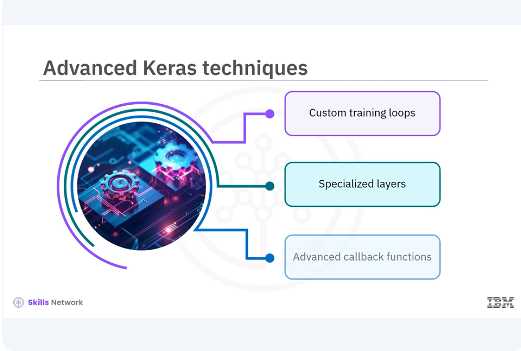

​Keras offers a variety of advanced techniques that ​can significantly enhance your model development process. ​These techniques include custom training loops, ​specialized layers, and advanced callback functions. 

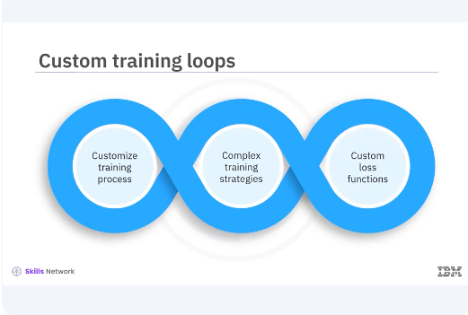

​Custom training loops give ​more control over the training process. ​While Keras fit method is powerful and convenient, ​custom training loops allows you to tailor ​the training process to your specific needs. 
​This can be particularly useful for implementing ​complex training strategies or custom loss functions. 

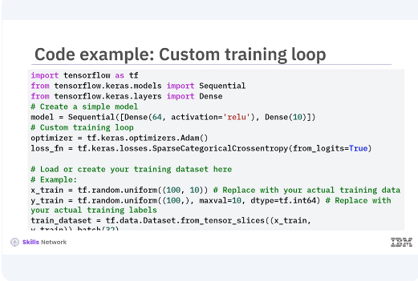

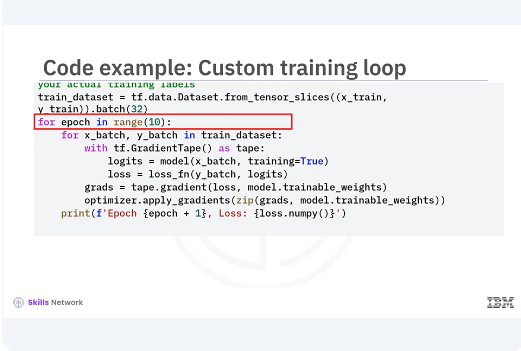

​Let's look at a simple example ​of a custom training loop, ​you will use a basic neural network in the code. ​In this example, you define ​a simple model and create an optimizer and loss function. ​The training loop iterates over ​the training dataset for a specified number of epochs. ​Within each iteration, we use a gradient tape ​to record operations for automatic differentiation. ​The gradients are then applied ​to the models trainable weights. ​This approach allows for greater flexibility ​compared to the built-in fit method. 

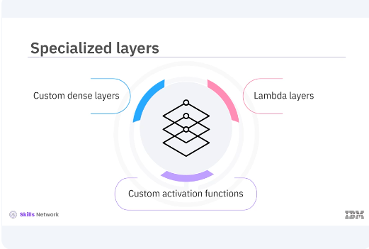

​Keras allows you to create ​specialized layers to extend ​the functionality of your model, ​such as custom dense layers and Lambda layers. ​These layers can implement ​advanced custom activation functions. ​This model can be useful for implementing ​custom layers that aren't ​available in the standard Keras library. 

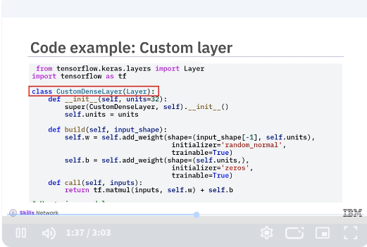

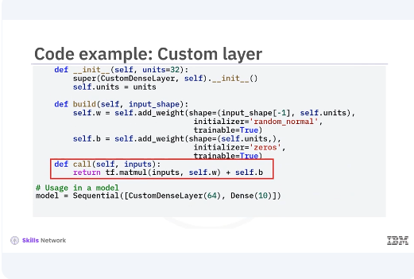

​Let's look at an example of a custom dense layer. ​In this example, you define ​a custom dense layer by sub classing the layer class. ​The build method initializes the weights and ​biases while the call method defines the forward pass. ​This layer can then be used in ​a Keras model like any other layer. 

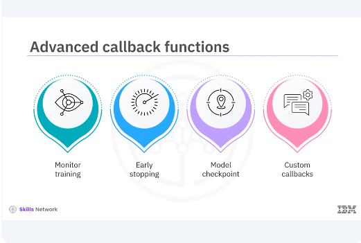

​Callback functions in Keras are a powerful tool to ​customize and extend the behavior ​of your model training process. ​They allow you to monitor training, ​implement early stopping, save ​model checkpoints, and custom callbacks. 

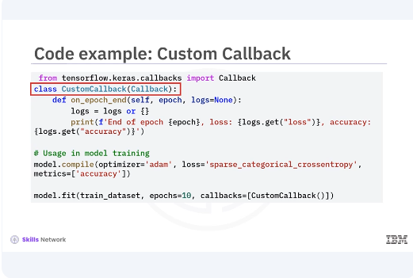

​Let's create a custom callback that ​logs additional metrics during training. ​In this example, you define ​a custom callback by sub classing the callback class. ​The on epoch end method is overridden to ​print the loss and accuracy at the end of each epoch. ​This custom callback is then ​passed to the fit method during model training. 

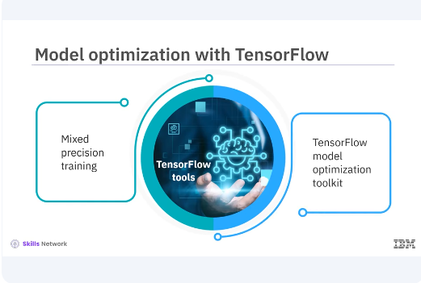

​Optimizing your models is ​crucial for achieving the best performance. 
​TensorFlow offers various tools for model optimization, ​including mixed precision training, ​and the TensorFlow model optimization toolkit.

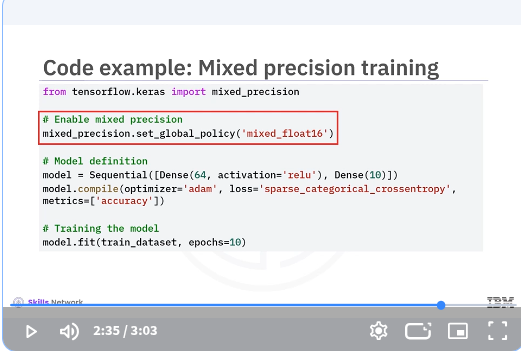

​In this example, you enable mixed precision training by ​setting the global policy to mixed underscore float 16. ​This allows TensorFlow to use ​16 bit floats where possible. ​Improving performance and reducing ​memory usage without compromising model accuracy. 

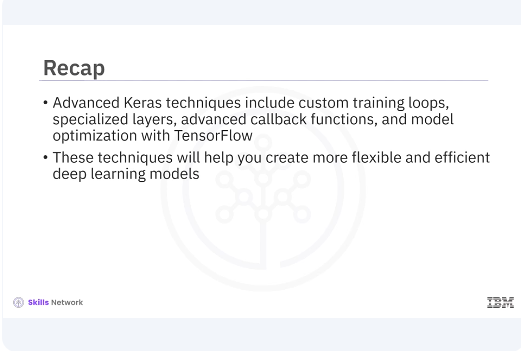

​In this video, you learned ​advanced Keras techniques include custom training loops, ​specialized layers, advanced callback functions, ​and model optimization with TensorFlow. ​These techniques will help you create ​more flexible and efficient deep learning models. 