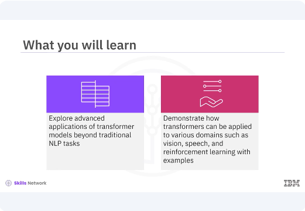
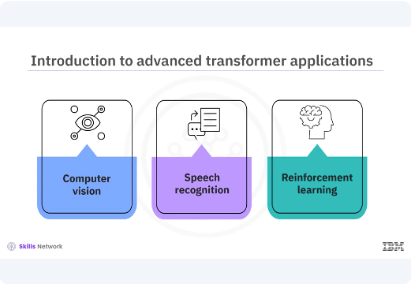
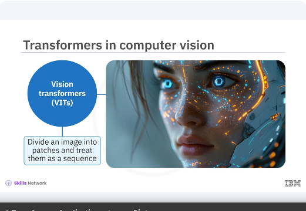
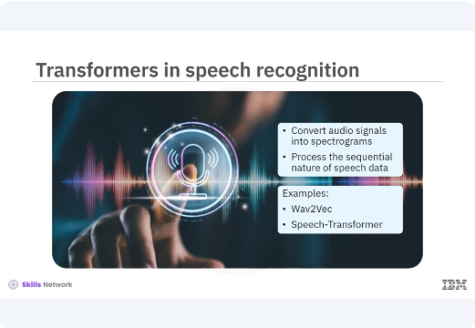
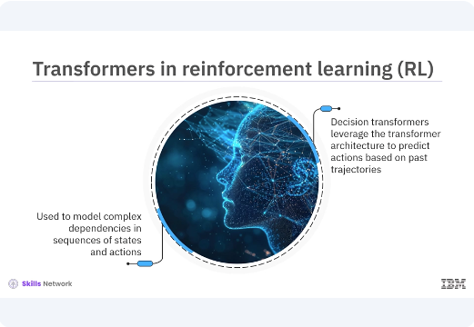

# Advanced Transformer Applications




​Welcome to this video on advanced transformer applications. ​After watching this video, you'll be able to explore advanced applications of ​transformer models beyond traditional NLP tasks. ​Demonstrate how transformers can be applied to various domains such as vision, ​speech, and reinforcement learning with examples. 



​Although transformers have revolutionized the field of natural language processing, ​their versatile architecture makes them applicable to a wide range of domains ​including computer vision, speech recognition, and ​even reinforcement learning. 



​Let's explore these exciting applications and ​see how transformers can be adapted to different tasks. ​Transformers are making significant strides in computer vision. ​Vision transformers VITs have shown that self attention mechanisms can be applied ​to image data, ​often outperforming traditional convolutional neural network CNNs. 

​VITs divide an image into patches and ​treat them as a sequence similar to words in a sentence. ​


```bash
pyenv activate venv3.10.4
```
```python
# Code example: Vision transformer for image classification
import tensorflow as tf
from tensorflow.keras.layers import Layer, Dense, LayerNormalization, Dropout

# Define the TransformerBlock class
class TransformerBlock(Layer):
    def __init__(self, embed_dim, num_heads, ff_dim, rate=0.1):
        super(TransformerBlock, self).__init__()
        self.att = tf.keras.layers.MultiHeadAttention(
            num_heads=num_heads,
            key_dim=embed_dim
        )
        self.ffn = tf.keras.Sequential([
            Dense(ff_dim, activation="relu"),
            Dense(embed_dim),
        ])
        self.layernorm1 = LayerNormalization(epsilon=1e-6)
        self.layernorm2 = LayerNormalization(epsilon=1e-6)
        self.dropout1 = Dropout(rate)
        self.dropout2 = Dropout(rate)

    def call(self, inputs, training, mask=None):
        attn_output = self.att(inputs, inputs, inputs, attention_mask=mask)
        attn_output = self.dropout1(attn_output, training=training)
        out1 = self.layernorm1(inputs + attn_output)
        ffn_output = self.ffn(out1)
        ffn_output = self.dropout2(ffn_output, training=training)
        return self.layernorm2(out1 + ffn_output)
```

In this example, the code snippet defines the core transformer block, which includes ​a multi head self attention mechanism and a feed forward neural network. 

```python
# Code example: Vision transformer for image classification

# Define the PatchEmbedding layer
class PatchEmbedding(Layer):
    def __init__(self, num_patches, embedding_dim):
        super(PatchEmbedding, self).__init__()
        self.num_patches = num_patches
        self.embedding_dim = embedding_dim
        self.projection = Dense(embedding_dim)
    def call(self, patches):
        return self.projection(patches)

```

In this code snippet, in continuation to the previous the patch embedding class ​embeds image patches into the desired dimension. 

```python
# Code example: Vision transformer for image classification

# Define the VisionTransformer model
class VisionTransformer(tf.keras.Model):
    def __init__(self, num_patches, embedding_dim, num_heads, ff_dim,
                 num_layers, num_classes):
        super(VisionTransformer, self).__init__()
        self.patch_embed = PatchEmbedding(num_patches, embedding_dim)
        self.transformer_layers = [
            TransformerBlock(embedding_dim, num_heads, ff_dim)
            for _ in range(num_layers)
        ]
        self.flatten = Flatten()
        self.dense = Dense(num_classes, activation='softmax')
    def call(self, images, training):
        patches = self.extract_patches(images)
        x = self.patch_embed(patches)
        for transformer_layer in self.transformer_layers:
            x = transformer_layer(x, training=training)
        x = self.flatten(x)
        return self.dense(x)
    def extract_patches(self, images):
        batch_size = tf.shape(images)[0]
        patches = tf.image.extract_patches(
            images=images,
            sizes=[1, 16, 16, 1],
            strides=[1, 16, 16, 1],
            rates=[1, 1, 1, 1],
            padding='VALID'
        )
        patches = tf.reshape(patches, [batch_size, -1, 16*16*3])
        return patches

```

​The vision transformer class defines the vision transformer model with patch ​embedding and multiple transformer layers. ​The extract patches method extracts patches from images for ​the transformer model.

```python
# Example usage
num_patches = 196  # Assuming 14x14 patches
embedding_dim = 128
num_heads = 4
ff_dim = 512
num_layers = 6
num_classes = 10  # For CIFAR-10 dataset

vit = VisionTransformer(num_patches, embedding_dim, num_heads, ff_dim, num_layers, num_classes)

images = tf.random.uniform((32, 224, 224, 3))  # Batch of 32 images of size 224x224
output = vit(images)
print(output.shape)  # Should print (32, 10)
```

​The example usage demonstrates how to create and ​use the vision transformer model for image classification. ​In this example, you have explored the use of transformers in computer vision, ​specifically through the vision transformer model. 
​By breaking down the model into manageable snippets, ​the key components are highlighted and ​demonstrate how they can be used to handle image classification tasks effectively. ​Transformers are also being used in speech recognition. 




​By converting audio signals into spectrograms, ​transformers can process the sequential nature of speech data. ​Models like Wav2Vec and speech transformer have achieved ​state of the art performance in speech to text tasks. ​

```python
# Code example: Transformer in speech recognition
import tensorflow as tf
from tensorflow.keras.layers import Layer, Dense, LayerNormalization, Dropout, Flatten
from tensorflow.keras.models import Model

# Define the TransformerBlock within the same cell
class TransformerBlock(Layer):
    def __init__(self, embed_dim, num_heads, ff_dim, rate=0.1):
        super(TransformerBlock, self).__init__()
        self.att = tf.keras.layers.MultiHeadAttention(
            num_heads=num_heads,
            key_dim=embed_dim
        )
        self.ffn = tf.keras.Sequential([
            Dense(ff_dim, activation="relu"),
            Dense(embed_dim),
        ])
        self.layernorm1 = LayerNormalization(epsilon=1e-6)
        self.layernorm2 = LayerNormalization(epsilon=1e-6)
        self.dropout1 = Dropout(rate)
        self.dropout2 = Dropout(rate)
    def call(self, inputs, training, mask=None):
        attn_output = self.att(inputs, inputs, inputs, attention_mask=mask)
        attn_output = self.dropout1(attn_output, training=training)
        out1 = self.layernorm1(inputs + attn_output)
        ffn_output = self.ffn(out1)
        ffn_output = self.dropout2(ffn_output, training=training)
        return self.layernorm2(out1 + ffn_output)
```

In the example, the speech transformer class defines the speech transformer model ​with convolutional and transformer layers. ​First, you define the transformer block within the same cell. ​The call method applies self attention and ​feedforward layers with residual connections and layer normalization. 

```python
# Define the PatchEmbedding layer
class PatchEmbedding(Layer):
    def __init__(self, num_patches, embedding_dim):
        super(PatchEmbedding, self).__init__()
        self.num_patches = num_patches
        self.embedding_dim = embedding_dim
        self.projection = Dense(embedding_dim)
    def call(self, patches):
        return self.projection(patches)
```


​In this code snippet, ​the patch embedding class defines a layer that embeds self projection patches. 

```python
# Define the VisionTransformer model
class VisionTransformer(Model):
    def __init__(self, num_patches, embedding_dim, num_heads, ff_dim,
                 num_layers, num_classes):
        super(VisionTransformer, self).__init__()
        self.patch_embed = PatchEmbedding(num_patches, embedding_dim)
        self.transformer_layers = [
            TransformerBlock(embedding_dim, num_heads, ff_dim)
            for _ in range(num_layers)
        ]
        self.flatten = Flatten()
        self.dense = Dense(num_classes, activation='softmax')
    def call(self, images):
        patches = self.extract_patches(images)
        x = self.patch_embed(patches)
        for transformer_layer in self.transformer_layers:
            x = transformer_layer(x)
        x = self.flatten(x)
        return self.dense(x)
    def extract_patches(self, images):
        batch_size = tf.shape(images)[0]
        patches = tf.image.extract_patches(
            images=images,
            sizes=[1, 16, 16, 1],
            strides=[1, 16, 16, 1],
            rates=[1, 1, 1, 1],
            padding='VALID'
        )
        patches = tf.reshape(patches, [batch_size, -1, 16 * 16 * 3])
        return patches
```

​In this code snippet, you define the vision transformer model class. ​The extract patches method returns the dimensions of the patches. 

```python
# Define the SpeechTransformer model
class SpeechTransformer(Model):
    def __init__(self, num_mel_bins, embedding_dim, num_heads, ff_dim,
                 num_layers, num_classes):
        super(SpeechTransformer, self).__init__()
        self.conv1 = tf.keras.layers.Conv1D(
            filters=embedding_dim,
            kernel_size=3,
            strides=1,
            padding='same',
            activation='relu'
        )
        self.batch_norm = tf.keras.layers.BatchNormalization()
        self.reshape = tf.keras.layers.Reshape((-1, embedding_dim))
        self.transformer_layers = [
            TransformerBlock(embedding_dim, num_heads, ff_dim)
            for _ in range(num_layers)
        ]
        self.flatten = tf.keras.layers.Flatten()
        self.dense = tf.keras.layers.Dense(num_classes, activation='softmax')
    def call(self, spectrograms):
        x = self.conv1(spectrograms)
        x = self.batch_norm(x)
        x = self.reshape(x)
        for transformer_layer in self.transformer_layers:
            x = transformer_layer(x)
        x = self.flatten(x)
        return self.dense(x)
```

​In this code, the speech transformer class defines the speech transformer model ​with convolutional and transformer layers. ​

```python
# Example usage
num_mel_bins = 80
embedding_dim = 128
num_heads = 4
ff_dim = 512
num_layers = 6
num_classes = 30  # Example for phoneme classification

# Initialize SpeechTransformer model
st = SpeechTransformer(num_mel_bins, embedding_dim, num_heads, ff_dim, num_layers, num_classes)

# Generate example spectrograms
spectrograms = tf.random.uniform((32, 100, num_mel_bins))  # Batch of 32 spectrograms with 100 time frames

# Get model predictions
output = st(spectrograms, training=True)
print(output.shape)  # Should print (32, 30), for batch size of 32 and 30 classes
```

Example usage demonstrates how to create and ​use the speech transformer model for speech recognition. ​The speech transformer method generates the spectrograms in batches and frames. 




​Transformers have found applications in reinforcement learning where they can be ​used to model complex dependencies in sequences of states and actions. 
​Models like decision transformer leverage the transformer architecture to predict ​actions based on past trajectories, ​enabling more efficient learning in complex environments. ​

```python
# Code example: Decision transformer for RL
from tensorflow.keras.layers import Dense, TimeDistributed

# Define the TransformerBlock class
class TransformerBlock(tf.keras.layers.Layer):
    def __init__(self, embed_dim, num_heads, ff_dim, rate=0.1):
        super(TransformerBlock, self).__init__()
        self.att = tf.keras.layers.MultiHeadAttention(
            num_heads=num_heads,
            key_dim=embed_dim
        )
        self.ffn = tf.keras.Sequential([
            Dense(ff_dim, activation="relu"),
            Dense(embed_dim),
        ])
        self.layernorm1 = tf.keras.layers.LayerNormalization(epsilon=1e-6)
        self.layernorm2 = tf.keras.layers.LayerNormalization(epsilon=1e-6)
        self.dropout1 = tf.keras.layers.Dropout(rate)
        self.dropout2 = tf.keras.layers.Dropout(rate)
    def call(self, inputs, training, mask=None):
        attn_output = self.att(inputs, inputs, inputs, attention_mask=mask)
        attn_output = self.dropout1(attn_output, training=training)
        out1 = self.layernorm1(inputs + attn_output)
        ffn_output = self.ffn(out1)
        ffn_output = self.dropout2(ffn_output, training=training)
        return self.layernorm2(out1 + ffn_output)
```


In this example, you first define the transformer block class. ​The call method applies the self attention and feedforward outputs for ​the transformer layer.

```python
# Define the DecisionTransformer model
class DecisionTransformer(tf.keras.Model):
    def __init__(self, state_dim, action_dim, embedding_dim, num_heads,
                 ff_dim, num_layers):
        super(DecisionTransformer, self).__init__()
        self.state_embed = Dense(embedding_dim, activation='relu')
        self.action_embed = Dense(embedding_dim, activation='relu')
        self.transformer_layers = [
            TransformerBlock(embedding_dim, num_heads, ff_dim)
            for _ in range(num_layers)
        ]
        self.dense = TimeDistributed(Dense(action_dim))
    def call(self, states, actions, training=True):
        state_embeddings = self.state_embed(states)
        action_embeddings = self.action_embed(actions)
        x = state_embeddings + action_embeddings
        for transformer_layer in self.transformer_layers:
            x = transformer_layer(x, training=training)
        return self.dense(x)

```

​In the example, the decision transformer class defines the decision transformer ​model for reinforcement learning. ​The call method applies the embeddings for the transformer layer.

```python
# Example usage
state_dim = 20
action_dim = 5
embedding_dim = 128
num_heads = 4
ff_dim = 512
num_layers = 6

# Initialize DecisionTransformer model
dt = DecisionTransformer(
    state_dim,
    action_dim,
    embedding_dim,
    num_heads,
    ff_dim,
    num_layers
)

# Generate example states and actions
states = tf.random.uniform((32, 100, state_dim))
# Batch of 32 sequences of 100 states
actions = tf.random.uniform((32, 100, action_dim))

# Get model predictions
output = dt(states, actions, training=True)

print(output.shape)
# Should print (32, 100, 5) for batch size 32, sequence length 100, and action dimension 5
```
​The example usage demonstrates how to create and use the decision transformer ​model for action prediction based on past trajectories. 


​In this video, you transformers versatile architecture makes them applicable to ​a wide range of domains including computer vision, ​speech recognition, and even reinforcement learning. 
​Vision transformers VITs have shown that self attention mechanisms can be applied ​to image data. ​By converting audio signals into spectrograms, ​transformers can process the sequential nature of speech data. ​Transformers have found applications in reinforcement learning where they can be ​used to model complex dependencies and sequences of states and actions. 
