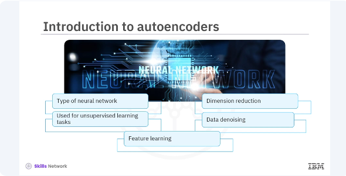
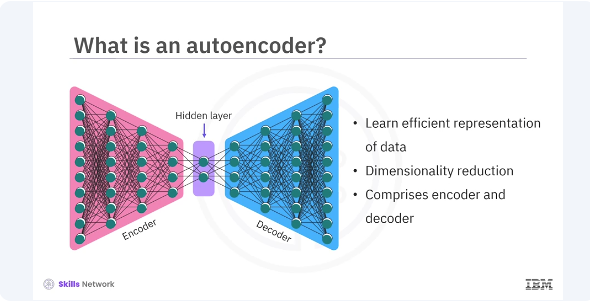
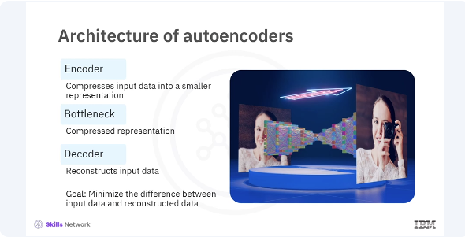
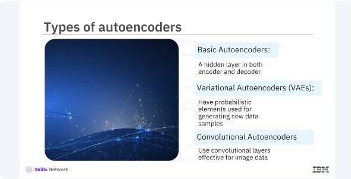
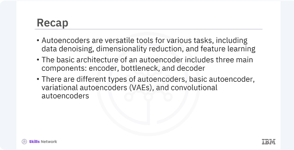

# Building Autoencoders in Keras




​Welcome to this video on how to build autoencoders in Keras. ​After watching this video, you'll be able to explain the concept of autoencoders and ​their applications. ​Demonstrate how to build and train an auto encoder using Keras. ​Autoencoders are a type of neural network used for unsupervised learning tasks. ​They are powerful tools for tasks such as dimension reduction, ​data denoising and feature learning. ​Lets explore auto encoders, their architecture and how to build and ​train them using keras. ​An autoencoder is a type of artificial neural network used to learn efficient ​representations of data, typically for the purpose of dimensionality reduction. 




​It consists of two main an encoder and a decoder. 



​To explain further, ​the basic architecture of an autoencoder includes three main components. ​Encoder compresses the input data into a smaller representation, ​bottleneck the compressed representation that contains the most important features. ​Decoder reconstructs the input data from the compressed representation. ​The goal is to minimize the difference between the input data and ​the reconstructed data. 



​There are several types of autoencoders, each serving different purposes. ​Basic autoencoders, ​simple structure with one hidden layer in both encoder and decoder. 
​Variational autoencoders, VAEs, ​introduce probabilistic elements and are used for generating new data samples. ​Convolutional auto encoders use convolutional layers and ​are highly effective for image data. 

```bash
pyenv activate venv3.14.0
```
```python
import tensorflow as tf
from tensorflow.keras.models import Model
from tensorflow.keras.layers import Input, Dense

# Encoder
input_layer = Input(shape=(784,))
encoded = Dense(64, activation='relu')(input_layer)

# Bottleneck
bottleneck = Dense(32, activation='relu')(encoded)

# Decoder
decoded = Dense(64, activation='relu')(bottleneck)
output_layer = Dense(784, activation='sigmoid')(decoded)

# Autoencoder model
autoencoder = Model(input_layer, output_layer)

# Compile the model
autoencoder.compile(optimizer='adam', loss='binary_crossentropy')

# Summary of the model
autoencoder.summary()
```


​Lets build a basic autoencoder in Keras using the functional API. ​You will use the minced data set in the example. ​In this code you define an autoencoder with an input layer of 784 neurons for ​the flattened 28 x 28 images, an encoder that reduces it to 64 dimensions, ​a bottleneck of 32 dimensions and ​a decoder that reconstructs the input back to 784 dimensions. ​You compile the model using the atom optimizer and binary cross entropy loss. 

```python
from tensorflow.keras.datasets import mnist
import numpy as np

# Load and preprocess the dataset
(x_train, _), (x_test, _) = mnist.load_data()
x_train = x_train.astype('float32') / 255.
x_test = x_test.astype('float32') / 255.
x_train = x_train.reshape((len(x_train), np.prod(x_train.shape[1:])))
x_test = x_test.reshape((len(x_test), np.prod(x_test.shape[1:])))

# Train the model
autoencoder.fit(x_train, x_train,
                epochs=50,
                batch_size=256,
                shuffle=True,
                validation_data=(x_test, x_test))
```

​Next you will prepare the minced dataset and train your autoencoder. 
​In this example, you load and preprocess the minced dataset ​by normalizing the pixel values and reshaping the images to a single vector. ​You then train the autoencoder using the training data as both the input and ​the output, aiming to reconstruct the input data.

```python
# Unfreeze the top layers of the encoder
for layer in autoencoder.layers[-4:]:
    layer.trainable = True

# Compile the model again
autoencoder.compile(optimizer='adam', loss='binary_crossentropy')

# Train the model again
autoencoder.fit(x_train, x_train,
                epochs=10,
                batch_size=256,
                shuffle=True,
                validation_data=(x_test, x_test))
```

​In addition to using the autoencoder as is, ​you can also fine tune it by training some layers while keeping others frozen. ​This helps in adapting the autoencoder to new data or improving its performance. ​In the code, you unfreeze the last four layers of the autoencoder and ​recompile the model. ​Training the model again for a few more epochs can help fine tune the autoencoder. 




​In this video, you learned autoencoders are versatile tools for various tasks, ​including data denoising, dimensionality reduction, and feature learning. 
​The basic architecture of an autoencoder includes three main encoder, ​bottleneck, and decoder. ​There are different types of autoencoders, basic autoencoder, ​variational autoencoders,VAEs, and convolutional autoencoders. 