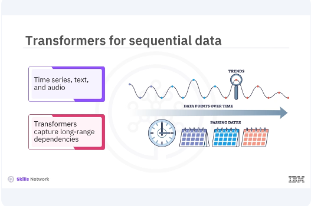
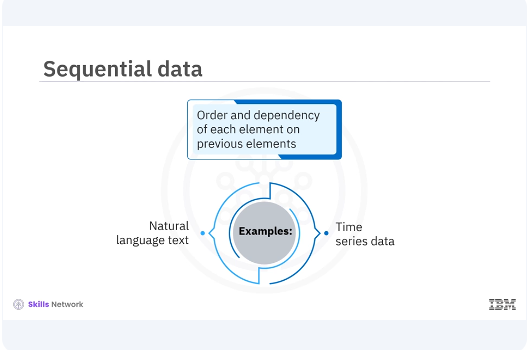
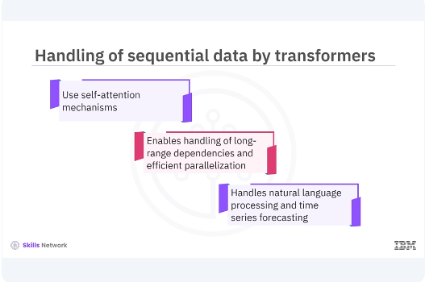
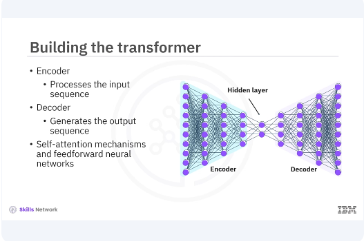
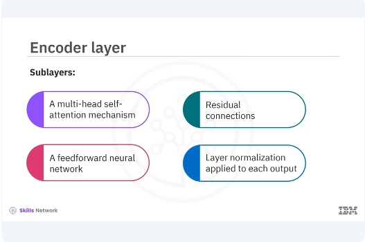
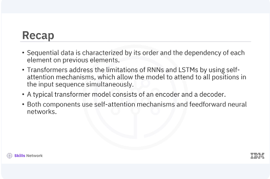

# Building Transformers for Sequential Data


Welcome to this video on building transformers for sequential data. ​After watching this video, you'll be able to ​Explain the importance and application of transformers in handling sequential data ​Demonstrate how to build a transformer model for sequential data using Keras with examples 



​Sequential data, such as time series, text, and audio, is prevalent in many real-world applications ​Transformers have revolutionized the way you handle such data by allowing models to capture ​Long-range dependencies more efficiently than traditional recurrent neural networks, RNN, ​Or long-short-term memory, LSTM.



​Sequential data is characterized by its order and the dependency of each element on previous elements. ​Examples include natural language text, where the meaning of a word depends on the context ​Provided by preceding words, and time series data, where each data point is influenced by past values ​Traditional models like RNNs and LSTMs have been used to handle sequential data, but they often struggle with long-term dependencies and parallelization issues.



​Transformers address the limitations of RNNs and LSTMs by using self-attention mechanisms ​This mechanism allows the model to focus on all positions in the input sequence at the same time ​It enables handling of long-range dependencies and efficient parallelization during training ​As a result, transformers have become a state-of-the-art approach for many sequential data tasks ​Including natural language processing and time series forecasting. 



​Let's start building a transformer model. ​You will use Keras to define the layers and structure of the model ​A typical transformer model consists of an encoder and a decoder ​The encoder processes the input sequence while the decoder generates the output sequence. ​Both components use self-attention mechanisms and feed-forward neural networks. 

```bash
pyenv activate venv3.10.4
```

```python
# Multi-Head Self-Attention:
import tensorflow as tf
from tensorflow.keras.layers import Layer, Dense, LayerNormalization, Dropout

class MultiHeadSelfAttention(Layer):
    def __init__(self, embed_dim, num_heads=8):
        super(MultiHeadSelfAttention, self).__init__()
        self.embed_dim = embed_dim
        self.num_heads = num_heads
        self.projection_dim = embed_dim // num_heads
        self.query_dense = Dense(embed_dim)
        self.key_dense = Dense(embed_dim)
        self.value_dense = Dense(embed_dim)
        self.combine_heads = Dense(embed_dim)
    def attention(self, query, key, value):
        score = tf.matmul(query, key, transpose_b=True)
        dim_key = tf.cast(tf.shape(key)[-1], tf.float32)
        scaled_score = score / tf.math.sqrt(dim_key)
        weights = tf.nn.softmax(scaled_score, axis=-1)
        output = tf.matmul(weights, value)
        return output, weights
    def split_heads(self, x, batch_size):
        x = tf.reshape(x, (batch_size, -1, self.num_heads, self.projection_dim))
        return tf.transpose(x, perm=[0, 2, 1, 3])
    def call(self, inputs):
        batch_size = tf.shape(inputs)[0]
        query = self.query_dense(inputs)
        key = self.key_dense(inputs)
        value = self.value_dense(inputs)
        query = self.split_heads(query, batch_size)
        key = self.split_heads(key, batch_size)
        value = self.split_heads(value, batch_size)
        attention, _ = self.attention(query, key, value)
        attention = tf.transpose(attention, perm=[0, 2, 1, 3])
        concat_attention = tf.reshape(
            attention,
            (batch_size, -1, self.embed_dim)
        )
        output = self.combine_heads(concat_attention)
        return output
```
​In the example, the multi-head self-attention class defines the multi-head self-attention mechanism.

```python
    def attention(self, query, key, value):
        score = tf.matmul(query, key, transpose_b=True)
        dim_key = tf.cast(tf.shape(key)[-1], tf.float32)
        scaled_score = score / tf.math.sqrt(dim_key)
        weights = tf.nn.softmax(scaled_score, axis=-1)
        output = tf.matmul(weights, value)
        return output, weights
```

​The attention method computes the attention scores and weighted sum of the values.

```python
    def split_heads(self, x, batch_size):
        x = tf.reshape(x, (batch_size, -1, self.num_heads, self.projection_dim))
        return tf.transpose(x, perm=[0, 2, 1, 3])
```

​The split-heads method splits the input into multiple heads for parallel attention computation.

```python
    def call(self, inputs):
        batch_size = tf.shape(inputs)[0]
        query = self.query_dense(inputs)
        key = self.key_dense(inputs)
        value = self.value_dense(inputs)
        query = self.split_heads(query, batch_size)
        key = self.split_heads(key, batch_size)
        value = self.split_heads(value, batch_size)
        attention, _ = self.attention(query, key, value)
        attention = tf.transpose(attention, perm=[0, 2, 1, 3])
        concat_attention = tf.reshape(
            attention,
            (batch_size, -1, self.embed_dim)
        )
        output = self.combine_heads(concat_attention)
        return output
```

​The call method applies the self-attention mechanism and combines the heads 

```python
class TransformerBlock(Layer):
    def __init__(self, embed_dim, num_heads, ff_dim, rate=0.1):
        super(TransformerBlock, self).__init__()
        self.att = MultiHeadSelfAttention(embed_dim, num_heads)
        self.ffn = tf.keras.Sequential([
            Dense(ff_dim, activation="relu"),
            Dense(embed_dim),
        ])
        self.layernorm1 = LayerNormalization(epsilon=1e-6)
        self.layernorm2 = LayerNormalization(epsilon=1e-6)
        self.dropout1 = Dropout(rate)
        self.dropout2 = Dropout(rate)
    def call(self, inputs, training):
        attn_output = self.att(inputs)
        attn_output = self.dropout1(attn_output, training=training)
        out1 = self.layernorm1(inputs + attn_output)
        ffn_output = self.ffn(out1)
        ffn_output = self.dropout2(ffn_output, training=training)
        return self.layernorm2(out1 + ffn_output)


# Example usage
embed_dim = 128
num_heads = 8
ff_dim = 512
sequence_length = 100

transformer_block = TransformerBlock(embed_dim, num_heads, ff_dim)
inputs = tf.random.uniform((1, sequence_length, embed_dim))  
```

​The transformer block class defines a transformer block with self-attention and a feed-forward network ​The call method applies the self-attention followed by the feed-forward network with residual connections and layer normalization.




​The encoder layer in a transformer model consists of a multi-head self-attention mechanism followed by a feed-forward neural network ​Both sub-layers have residual connections around them, and layer normalization is applied to the output of each sub-layer.

```python
class EncoderLayer(Layer):
    def __init__(self, embed_dim, num_heads, ff_dim, rate=0.1):
        super(EncoderLayer, self).__init__()
        self.att = MultiHeadSelfAttention(embed_dim, num_heads)
        self.ffn = tf.keras.Sequential([
            Dense(ff_dim, activation="relu"),
            Dense(embed_dim),
        ])
        self.layernorm1 = LayerNormalization(epsilon=1e-6)
        self.layernorm2 = LayerNormalization(epsilon=1e-6)
        self.dropout1 = Dropout(rate)
        self.dropout2 = Dropout(rate)
    def call(self, inputs, training):
        attn_output = self.att(inputs)
        attn_output = self.dropout1(attn_output, training=training)
        out1 = self.layernorm1(inputs + attn_output)
        ffn_output = self.ffn(out1)
        ffn_output = self.dropout2(ffn_output, training=training)
        return self.layernorm2(out1 + ffn_output)


# Example usage
encoder_layer = EncoderLayer(embed_dim, num_heads, ff_dim)
outputs = encoder_layer(inputs)

print(outputs.shape)  # Should print (1, 100, 128) 
```

​Let's implement the encoder layer in an example ​In the example, the encoder layer class defines an encoder layer in the transformer model ​The call method applies the self-attention followed by the feed-forward network with residual connections and layer normalization.



​In this video, you learned. ​Sequential data is characterized by its order and the dependency of each element on previous elements ​Transformers address the limitations of RNNs and LSTMs by using self-attention mechanisms ​which allow the model to attend to all positions in the input sequence simultaneously ​A typical transformer model consists of an encoder and a decoder ​Both components use self-attention mechanisms and feed-forward neural networks 