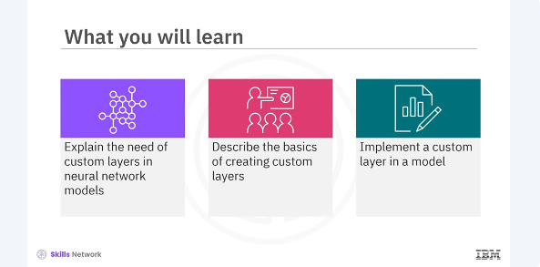
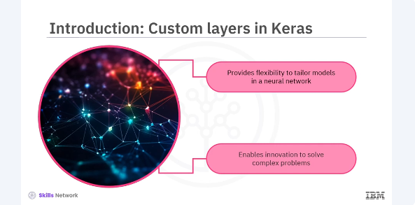
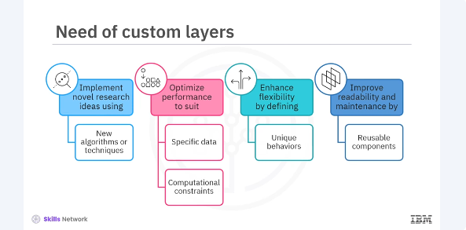

# Creating Custom Layers in Keras




​After watching this video, you'll be able to explain the need of custom layers in ​neural network models, describe the basics of creating custom layers, ​implement a custom layer in a model. 



Custom layers allow you to define your own operations in a neural network, ​giving you the flexibility to tailor your models to specific tasks and ​experiment with new ideas. ​Whether you're working on cutting-edge research or ​building a specialized application, understanding how to create custom layers ​can greatly enhance your ability to innovate and solve complex problems. 



​Creating custom layers is essential when you need specific functionalities ​not provided by Keras. ​Standard layers like dense, convolutional or LSTM cover a broad range of use cases, ​but sometimes you need something more specific. ​Custom layers allow you to implement novel research ideas. 
​If you're developing new algorithms or techniques, ​custom layers let you implement them directly into your models. ​Optimize performance, tailor layers to better suit your specific data or ​computational constraints. ​Enhance flexibility, custom layers enable you to define unique behaviors that ​aren't possible with standard layers. ​Improve readability and maintenance, encapsulate complex logic and ​reusable components, making your code cleaner and easier to manage. ​By creating custom layers, you unlock the full potential of Keras, ​allowing for more sophisticated and fine-tuned models.

```bash
pyenv activate venv3.10.4
```

```python
from tensorflow.keras.layers import Layer

class MyCustomLayer(Layer):
    def __init__(self, units=32, **kwargs):
        super(MyCustomLayer, self).__init__(**kwargs)
        self.units = units
    def build(self, input_shape):
        self.w = self.add_weight(
            shape=(input_shape[-1], self.units),
            initializer='random_normal',
            trainable=True
        )
        self.b = self.add_weight(
            shape=(self.units,),
            initializer='zeros',
            trainable=True
        )
    def call(self, inputs):
        return tf.matmul(inputs, self.w) + self.b


```

​Lets look at the basic structure of a custom layer in keras. ​Here's an example of a simple custom layer that performs a dense operation. 
​To create a custom layer, you need the subclass, ​the layer class from from tensorflow.keras.layers. ​This involves implementing three key methods, ​init, that initializes the layer's attributes. ​build, that creates the layer's weights. ​This method is called once during the first call to the layer. ​call, that defines the forward path logic.

```python
class CustomDenseLayer(Layer):
    def __init__(self, units=32):
        super(CustomDenseLayer, self).__init__()
        self.units = units
    def build(self, input_shape):
        self.w = self.add_weight(
            shape=(input_shape[-1], self.units),
            initializer='random_normal',
            trainable=True
        )
        self.b = self.add_weight(
            shape=(self.units,),
            initializer='zeros',
            trainable=True
        )
    def call(self, inputs):
        return tf.nn.relu(tf.matmul(inputs, self.w) + self.b)
```

​Now let's implement a custom dense layer that includes activation logic. ​You will define the init, build, and ​call methods to create a fully functional layer. ​This custom layer will perform a dense operation followed by a relu activation. Finally, you will use your custom layer in a Keras model. 
​Integrating custom layers into a model is straightforward, ​just like using any other Keras layer. 

```python
from tensorflow.keras.models import Sequential

model = Sequential([
    CustomDenseLayer(64),
    CustomDenseLayer(10)
])

model.compile(optimizer='adam', loss='categorical_crossentropy')
```

​Here's an example of a simple sequential model using a custom dense layer. ​In this video, you learned that creating custom layers in keras is ​a powerful way to extend the functionality of your neural networks. ​It allows you to tailor your models to specific needs, ​implement novel research ideas, and optimize performance for unique tasks. ​By practicing and experimenting with custom layers, you'll gain a deeper ​understanding of how neural networks work and enhance your ability to innovate. 