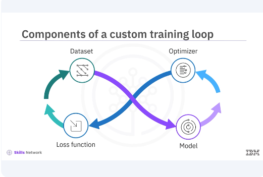
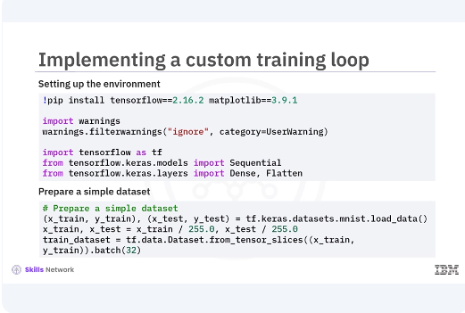
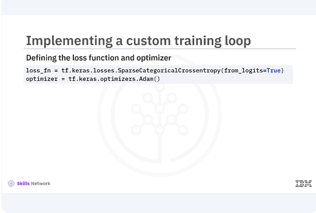
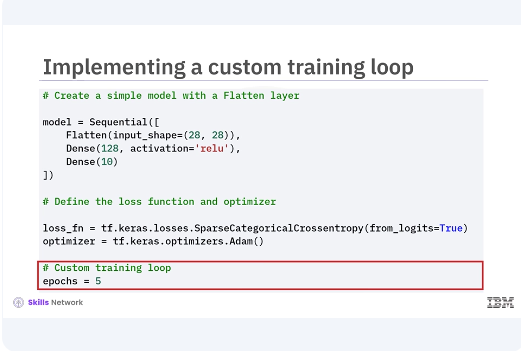
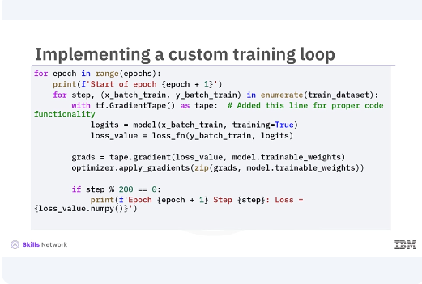
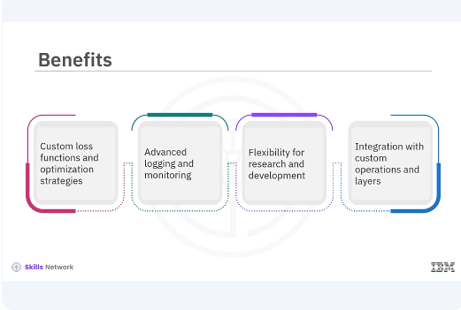
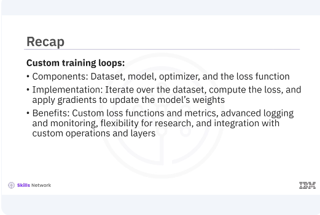

# Custom Training Loops in Keras

​Welcome to this video on custom training loops in Keras. ​After watching this video, ​you'll be able to describe ​a basic structure of a custom training loop, ​explain the benefits of a custom training loop, ​implement a custom training loop. 

​Let's begin by exploring ​the basic structure of a custom training loop. ​It involves several key components. ​The dataset, the model, ​the optimizer, and the loss function. ​Let's break down each component. 

​Here's a code example of setting up the environment. 
​First, set up your environment by importing ​the necessary libraries and preparing your dataset. ​Next, prepare a simple dataset. ​In this example, you import TensorFlow and Keras modules, ​load the MNIST dataset, normalize the data, ​and then create a TensorFlow dataset, ​and batch it for training. 

​Now let's look at how to define ​the loss function and optimizer. ​The loss function measures how well ​the model's predictions match the true labels. ​The optimizer updates the model's weights ​to minimize the loss. ​Now let's implement the custom training loop. 
​You will iterate over the dataset, ​compute the loss, and apply ​gradients to update the model's weights. ​First, create a simple model with a flatten layer. ​Next, define the loss function and optimizer. ​Finally, implement the custom training loop. ​In this loop, you iterate over ​the training dataset for a specified number of epochs. 

​For each batch, compute ​the logits by passing the inputs through the model. ​You can then calculate ​the loss using the specified loss function. 
​To compute gradients and update ​model weights, we use tf.GradientTape. ​TF.GradientTape is a TensorFlow API ​that records operations for automatic differentiation, ​which is a technique used to compute ​the gradients required to ​optimize a model during training. ​By using tf.GradientTape, ​you can watch the forward pass through the network, ​which allows TensorFlow to record ​all operations on the watched variables. ​These recorded operations are then used to compute ​the gradients of the loss with ​respect to each weight in the network. ​Using these gradients, the optimizer ​updates the model weights to minimize the loss. ​This technique allows for ​fine control over each training step, ​making it possible to implement ​complex training procedures and custom algorithms. 

​Custom training loops include several benefits. 
​They provide more granular control ​over the training process, ​allowing for the implementation of ​custom loss functions and optimization strategies. ​They also enable advanced logging and monitoring, ​which can be crucial for research and development. ​Custom training loops also offer ​integration with custom operations and layers. 

​In this video, you learned that ​a custom training loop consists of a dataset, ​model, optimizer, and the loss function. ​To implement the custom training loop, ​you iterate over the dataset, ​compute the loss, and apply ​gradients to update the model's weights. ​Some of the benefits of custom training loops ​include custom loss functions and metrics, ​advanced logging and monitoring, ​flexibility for research, and ​integration with custom operations and layers. 