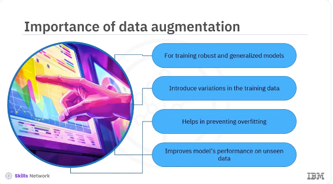
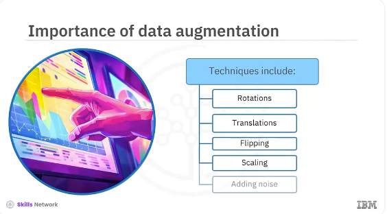
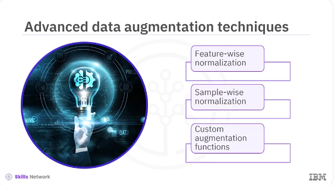

# Data Augmentation Techniques



Welcome to this video on data augmentation techniques that improve model ​generalization. ​After watching this video you'll be able to, ​describe data augmentation techniques for improving model generalization. ​Implement data augmentation using Keras. ​Data augmentation is crucial for training robust and generalized models. ​By introducing variations in the training data, models learn to recognize patterns. ​This helps prevent overfitting and ​improves the model's performance on unseen data. 



​Data augmentation techniques include rotations, translations, flipping, ​scaling and adding noise. 

​Let's start with some basic data augmentation techniques. ​You will use Keras' Image Data Generator class to apply these transformations. ​Let's see an example of how to apply common augmentations like rotation, ​width shift, height shift and horizontal flip. 


```bash
pyenv activate venv3.10.4
```
```python
from matplotlib import pyplot as plt
from tensorflow.keras.preprocessing.image import ImageDataGenerator

# Create an instance of ImageDataGenerator with augmentation options
datagen = ImageDataGenerator(
    rotation_range=40,
    width_shift_range=0.2,
    height_shift_range=0.2,
    shear_range=0.2,
    zoom_range=0.2,
    horizontal_flip=True,
    fill_mode='nearest'
)

# Load a sample image and reshape it
from tensorflow.keras.preprocessing import image
img = image.load_img('sample.jpg')
x = image.img_to_array(img)
x = x.reshape((1,) + x.shape)
x.shape

# Generate batches of augmented images
i = 0
for batch in datagen.flow(x, batch_size=1):
    plt.figure(i)
    imgplot = plt.imshow(image.array_to_img(batch[0]))
    plt.show()
```


​The code ImageDataGenerator initializes the data generator with various ​augmentation options such as rotation, width shift, height shift, ​shear, zoom and horizontal flip. ​Image.load _image (sample.jpg) loads a sample image. ​Image to array converts the image to an array. ​The code reshapes the image array to include a batch dimension. ​This code generates batches of augmented images from the input image. ​Finally, the image plot displays the augmented images.



​In addition to basic augmentations, Keras allows for ​more advanced techniques like feature-wise normalization, ​sample-wise normalization, and applying custom augmentation functions.

```python
# Create an instance of ImageDataGenerator with advanced options
datagen = ImageDataGenerator(
    featurewise_center=True,
    featurewise_std_normalization=True,
    samplewise_center=True,
    samplewise_std_normalization=True
)

# Compute the mean and standard deviation on a dataset of images
datagen.fit(training_images)

# Generate batches of normalized images
i = 0
for batch in datagen.flow(training_images, batch_size=32):
    plt.figure(i)
    imgplot = plt.imshow(image.array_to_img(batch[0]))
    i += 1
    if i % 4 == 0:
        break

plt.show()
```

​Let's see an example of using feature-wise and sample-wise normalization. ​The featurewise_center parameter sets the mean of the dataset to 0. ​The parameter featurewise_std_normalization normalizes ​the dataset to have a standard deviation of 1. ​The samplewise_center parameter sets the mean of each sample to 0. 

​The samplewise_std_normalization parameter normalizes each sample to have ​a standard deviation of 1. ​The datagen.fit(training_images) computes the mean and ​standard deviation on a dataset of images. ​The datagen.flow(training_images, ​batch_size=32) generates normalized images from the training set. 

```python
import numpy as np

def add_random_noise(image):
    noise = np.random.normal(0, 0.1, image.shape)
    return image + noise

# Create an instance of ImageDataGenerator with custom augmentation
datagen = ImageDataGenerator(preprocessing_function=add_random_noise)

# Generate batches of augmented images
i = 0
for batch in datagen.flow(training_images, batch_size=32):
    plt.figure(i)
    imgplot = plt.imshow(image.array_to_img(batch[0]))
    i += 1
    if i % 4 == 0:
        break

plt.show()
```

​Keras allows custom augmentation functions giving you complete control over ​the process. ​You can define your own functions to apply specific transformations. ​Let's see an example of custom augmentation function that ​adds random noise to images. ​The parameter adds_random_noise and ​defines a function that adds random noise to an image. 

​The code ImageDataGenerator preprocessing_function=add_random_noise ​initializes the data generator with the custom augmentation function. ​The code datagen.flow training_images, batch_size=32, ​generates batches of augmented images with added noise. ​In this video, you learned various data augmentation techniques using Keras, ​from basic augmentations like rotation and ​flipping to advanced techniques like normalization and custom functions. ​By incorporating these techniques into your training pipeline, ​you can improve the generalization ability of your models and ​achieve better performance on unseen data. ​