# Deep Q Networks DQNs with Keras

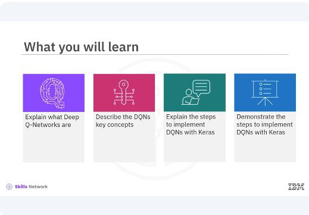

​After watching this video, you'll be able to explain what are Deep Q-Networks. ​Describe the DQNs key concepts. ​Explain the steps to implement DQNs with Keras, ​demonstrate the steps to implement DQNs with Keras. 
 
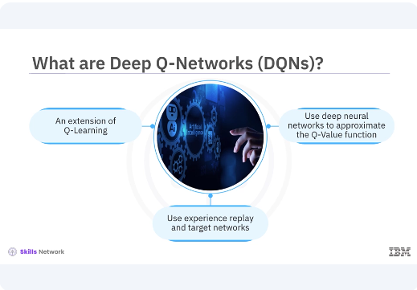

​Deep Q-Networks (DQNs) are an extension of Q-Learning that uses deep neural ​networks to approximate the Q-Value function. ​Traditional Q-Learning becomes impractical for ​large state spaces due to the exponential growth of the Q-Table. ​DQNs address this limitation by using a neural network to estimate the Q-Values, ​allowing the algorithm to scale to environments with large or ​continuous state spaces. 
​The DQN algorithm was famously used by DeepMind to achieve human-level ​performance in playing atari games. ​The key innovation of DQNs is the use of experience, ​replay and target networks to stabilize training and improve performance. 

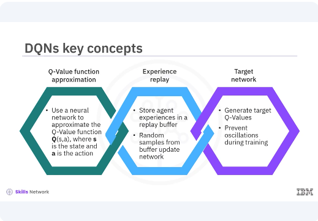

​Lets look at some key concepts of DQNs. ​Q-Value function approximation. ​Instead of using a Q-Table, DQNs use a neural network to approximate ​the Q-Value function QSA where the A is the state, and the A is the action. ​Experience replay, ​DQNS store agent experiences state action reward next state in a replay buffer. ​During training, random samples from this buffer are used to update the network, ​breaking the correlation between consecutive samples and ​improving learning stability. 
​Target network, a separate target network is used to generate the target Q-Values. ​This network is updated less frequently than the primary network, ​providing more stable target values and preventing oscillations during training. 

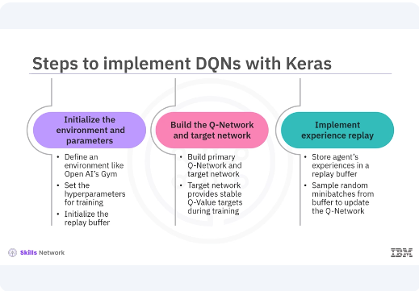

Implementing DQNs involves several steps similar to Q-Learning, but ​with additional components for experience, replay, and target networks. ​These steps initialize the environment and parameters. ​To begin DQNs, you define the environment using a platform like Open AI's Gym. ​Set the hyperparameters for ​training and initialize the replay buffer to store experiences. ​Build the Q-Network and target network. 
​In Keras, you build two neural networks, ​the primary Q-network and the target network. ​Both networks have the same architecture, but the target networks weights ​are updated less frequently to provide stable Q-Value targets during training. ​Implement experience replay, ​experience replay involves storing the agents experiences in a replay buffer. ​During training, ​you sample random minibatches from this buffer to update the Q-Network, ​which helps in breaking the correlation between consecutive experiences. 

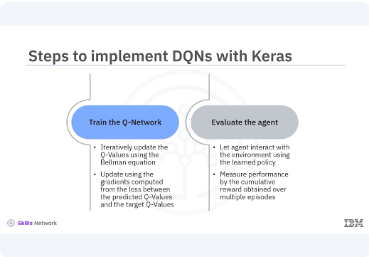

​Train the Q-Network, ​training involves iteratively updating the Q-Values using the Bellman equation. ​The primary Q-Network is updated using the gradients computed from the loss between ​the predicted Q-Values and the target Q-Values obtained from the target network. ​Evaluate the agent, after training, you evaluate the agent ​by letting it interact with the environment using the learned policy. 
​The agent's performance is measured by the cumulative reward obtained over ​multiple episodes. 

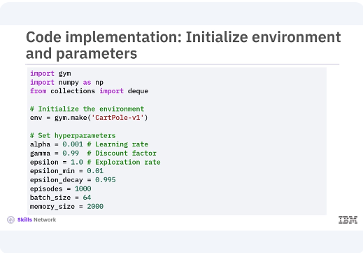

​Here is the code implementation for each step, ​focusing on initializing the environment, building the Q-Network and target network, ​implementing experience replay, training the Q-Network, and evaluating the agent. ​You initialize the cart poll environment and ​define key hyperparameters such as the learning rate, discount factor, ​expiration rate, and batch size for experience replay. 

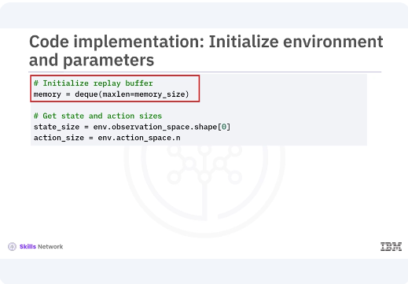

​The replay buffer is initialized using a DQ with a fixed maximum size to ​store experiences. ​

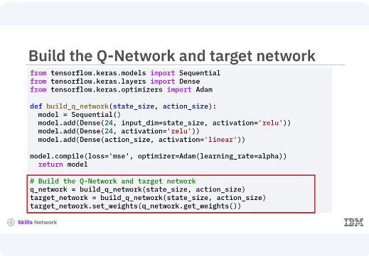

Two neural networks are created, the primary Q-Network and the target network. ​Both networks have the same architecture with two hidden layers containing 24 ​neurons with relu activation. ​The target networks weights are updated periodically to match the primary networks ​weights. 

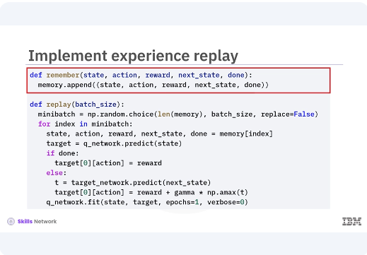

​The remember function stores experiences in the replay buffer. ​The replay function samples random minibatches from the buffer to ​train the Q-Network, helping to break the correlation between consecutive ​experiences and stabilized training. 

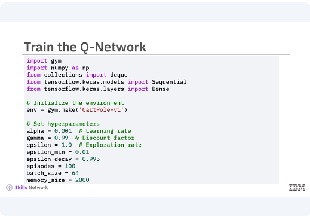

​The training loop iterates over a specified number of episodes. ​For each episode, the agent interacts with the environment, ​selecting actions based on the Epsilon greedy policy. 

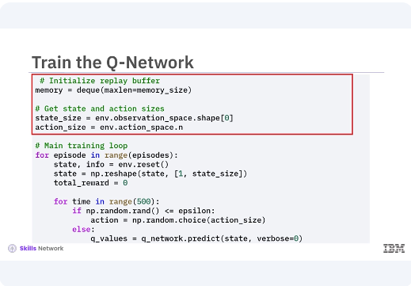

​The agent's experience is state action reward. ​Next state, done are stored in the replay buffer. 

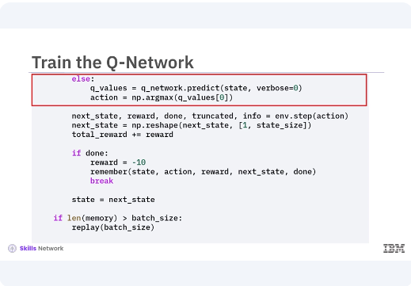

​The Q-Values are updated using the Bellman equation, ​leveraging the target network for stable Q-Value targets. 

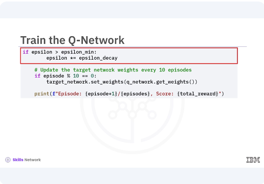

​The exploration rate decays over time to balance exploration and ​exploitation, the target networks weights are periodically updated to match ​the primary networks weights. ​

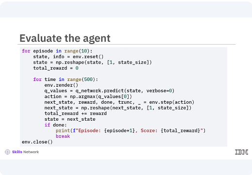

After training, ​the agent is evaluated by interacting with the environment using the learned policy. ​The environment is rendered to visualize the agents behavior and ​the total reward for each episode is printed. ​During evaluation, the agent primarily exploits the learned Q-Values to maximize ​rewards, demonstrating the effectiveness of the trained Q-Network.

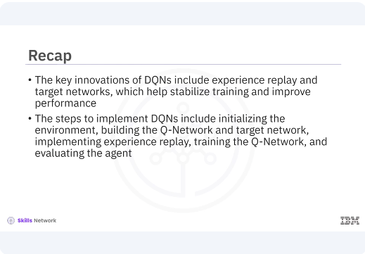

​In this video, you learned, ​the key innovations of DQNs include experience replay and target networks, ​which help stabilize training and improve performance. ​The steps to implement DQNs include initializing the environment, ​building the Q-Network and target network, implementing experience replay, ​training the Q-Network, and evaluating the agent. 