# Diffusion Models

Welcome to this video on how to build diffusion models. ​After watching this video, ​you'll be able to: Explain the concept of ​diffusion models and their ​significance in machine learning. ​Demonstrate how to implement ​a basic diffusion model using Keras. 

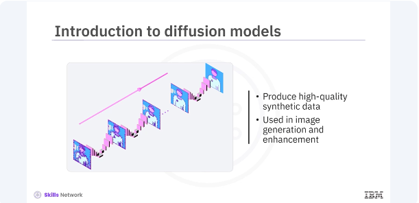

​Diffusion models are a class ​of generative models that have recently ​gained popularity for their ability to ​produce high-quality synthetic data. ​They are used in various applications, ​including image generation and enhancement. ​

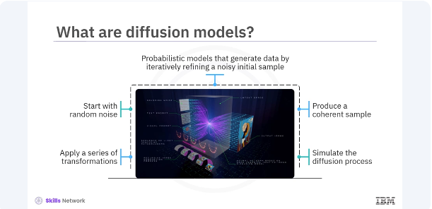

Diffusion models are probabilistic models that generate ​data by iteratively refining a noisy initial sample. ​They start with a random noise and gradually apply ​a series of transformations to ​produce a coherent data sample. 
​The process is akin to ​simulating the physical process of diffusion, ​where particles spread out from regions of ​high concentration to regions of low concentration. ​

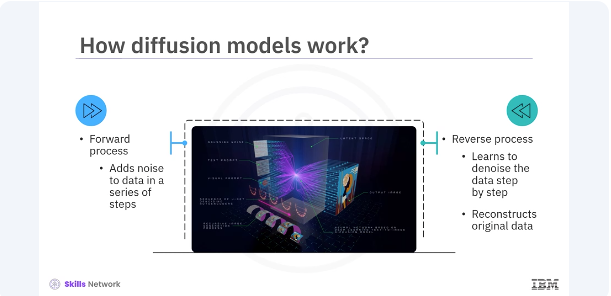

Diffusion models work by defining ​a forward process and a reverse process. ​The forward process adds ​noise to the data over a series of ​steps while the reverse process ​learns to denoise the data step by step, ​ultimately reconstructing the original data. ​This reverse denoising process is what allows ​diffusion models to generate ​high-quality samples from random noise. 

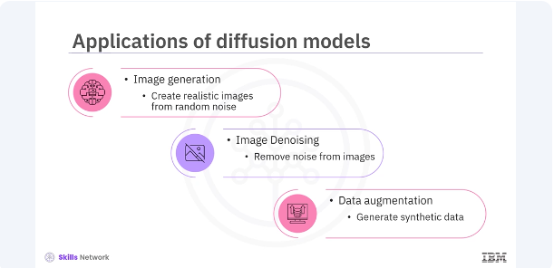

​Diffusion models have several applications ​in the field of machine learning. ​Image generation, creating ​realistic images from random noise. ​Image denoising, removing noise ​from the images to enhance quality. 
​Data augmentation, generating synthetic data ​to augment training data sets. ​These applications demonstrate the versatility ​and power of diffusion models in various domains.

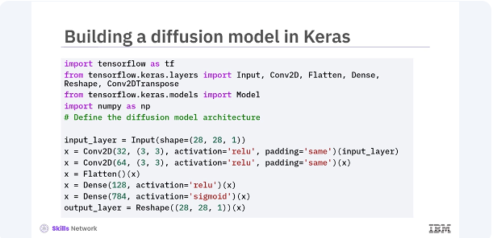
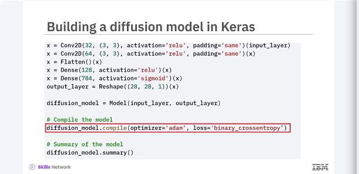

​Let's build a basic diffusion model in Keras. ​You will start by defining ​the model architecture and then ​train it to learn the denoising process. ​In this code, you define ​a simple convolutional neural network, ​CNN, as your diffusion model. ​The model takes a noisy 28 by 28 image as input, ​processes it through a series of ​convolutional and dense layers, ​and outputs a denoised image of the same size. ​You compile the model using ​the Adam optimizer and binary cross-entropy loss. 

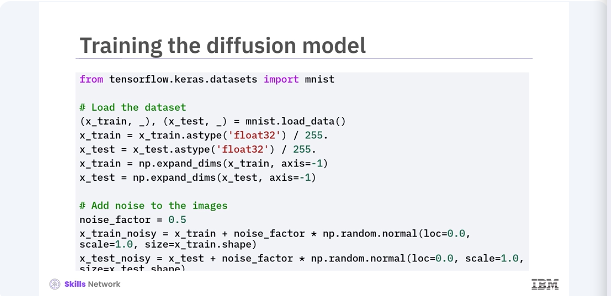
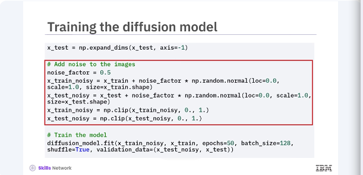

​Next, you will prepare the MNIST dataset. ​add noise to the images ​train your diffusion model to denoise them. ​In this code, you load and pre-process ​the MNIST dataset set by normalizing the pixel values, ​and adding random noise to the images. ​The model is then trained using noisy images as input, ​and the original images as the target, ​teaching the model to denoise the images. 

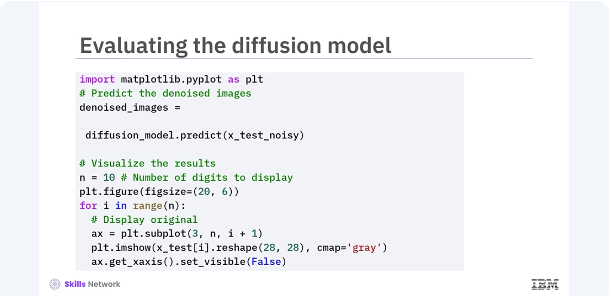
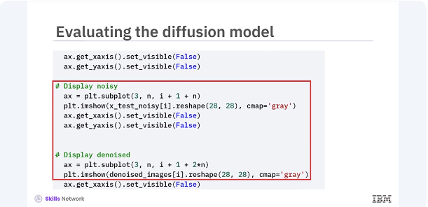

​After training, you can evaluate ​the diffusion model's performance by ​visualizing the denoised images. ​Let's compare the original, ​noisy, and denoised images. ​This code generates predictions using ​the trained diffusion model and visualizes the results. ​By displaying the original, ​noisy, and denoised images side by side ​you can see how effectively the model ​has learned to remove noise from the images. 

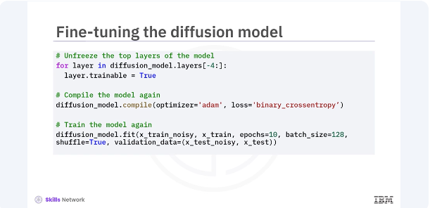

​You can further improve the ​diffusion model by fine tuning it. ​Fine tuning involves adjusting ​the models parameters and retraining ​it for additional epochs. ​In this code, you unfreeze ​the last four layers of the ​diffusion model and recompile it. ​Training the model again for ​a few more epochs can ​help in fine tuning its performance, ​leading to better denoising results. 

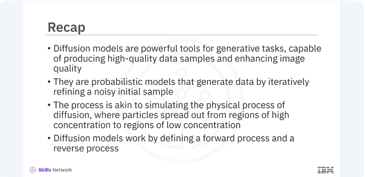

​In this video, you learned ​diffusion models are powerful tools for generating tasks, ​capable of producing high-quality data samples, ​and enhancing image quality. ​They are probabilistic models that generate data ​by iteratively refining a noisy initial sample. ​The process is akin to simulating ​the physical process of diffusion where ​particles spread out from regions of ​high concentration to regions of low concentration. 
​Diffusion models work by defining ​a forward process and a reverse process. 