# Generative Adversarial Networks

Welcome to this video on generative adversarial networks (GANs) after watching ​this video, you'll be able explain the concept of generative adversarial networks ​(GANs) and their significance in machine learning. ​Demonstrate how to implement a basic GAN using Keras. ​Generative adversarial networks, ​GANs, are a revolutionary type of neural network architecture designed to generate ​synthetic data that closely resembles real data. 

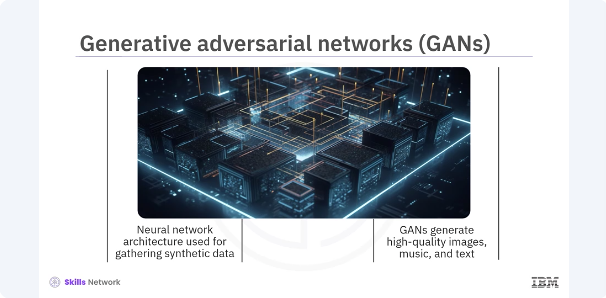

​GANs have gained significant attention for ​their ability to generate high quality images, music, and even text. ​GANs consists of two main components, a generator and a discriminator. ​The generator's goal is to create realistic data, while the discriminator's ​goal is to distinguish between real and generated data. ​These two networks are trained simultaneously through a process of ​adversarial training. ​Through this adversarial process, both networks improve over time, ​resulting in the generation of highly realistic data. 

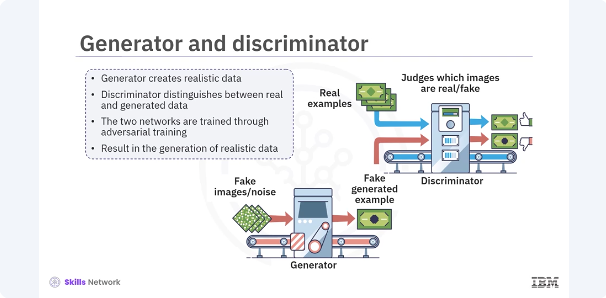

​Let's break down how GANs work. ​The generator takes random noise as input and generates synthetic data. ​The discriminator receives both real data and synthetic data from the generator and ​attempts to classify the data as real or fake. ​The generator is trained to fool the discriminator. ​The discriminator is trained to classify the data accurately.

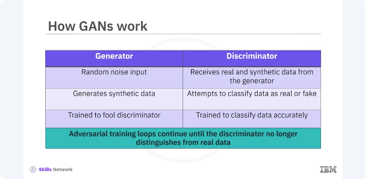

​This adversarial training loop continues until the generator can produce data that ​the discriminator can no longer distinguish from real data. 

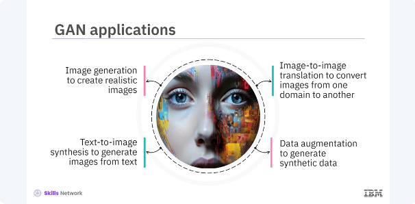

​GANs have numerous applications across various fields. ​Image generation creates realistic images from random noise. ​Image-to-image translation converts images from one domain to another, ​such as turning sketches into photographs. ​Text-to-image synthesis generates images from textual descriptions. ​Data augmentation generates synthetic data to augment training datasets. ​These applications demonstrate the versatility and ​power of GANs in different domains. ​Lets build a basic GAN in Keras. 

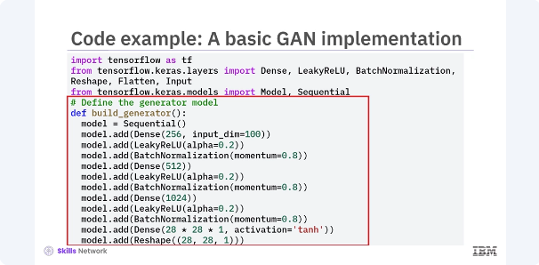

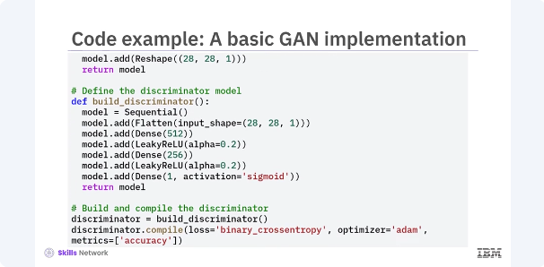

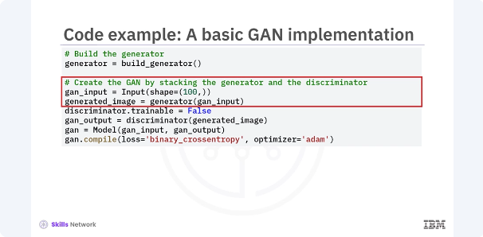

​Start by defining the generator and discriminator models, ​then combine them into a GAN. ​In this example, two separate models are defined, the generator and ​the discriminator. ​The generator takes random noise vector as input and generates a synthetic image, ​while the discriminator takes an image as input and ​outputs a probability indicating whether the image is real or fake. ​Then the GAN is created by combining the generator and discriminator models. ​The discriminator is set to non trainable when compiling the GAN to ensure that only ​the generator is updated during the adversarial training.

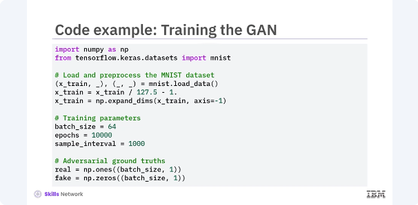

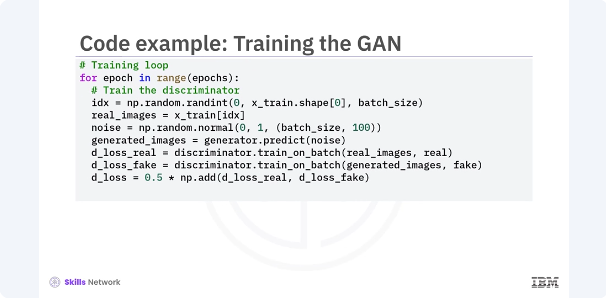

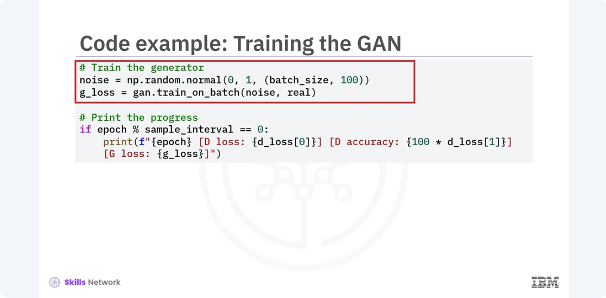

​Next you train the GAN. ​The training process involves updating the discriminator and ​generator in alternating steps. 
​You train the discriminator on both real and generated data and ​then train the generator to improve its ability to fool the discriminator. ​In this example, the code outlines the training loop for the GAN. ​You first train the discriminator on a batch of real images and ​a batch of generated images. ​The discriminators weights are updated to improve its ability to distinguish between ​real and fake images. ​Next, you train the generator by feeding it noise vectors and ​updating its weights to improve its ability to fool the discriminator. ​This adversarial training process continues for ​a specified number of epochs.

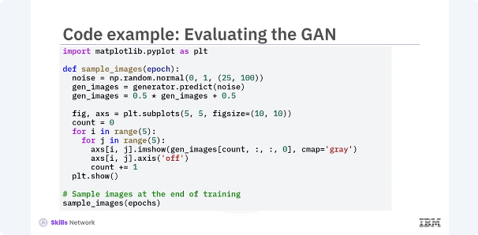

​To evaluate the GAN, you can periodically generate and ​visualize images during training. 
​This helps monitor the quality of the generated images and ​assess the models progress. ​In this example, ​the code generates a grid of images using the trained generator model. ​By visualizing these images at different stages of training, ​you can observe how the quality of the generated images improves over time. 

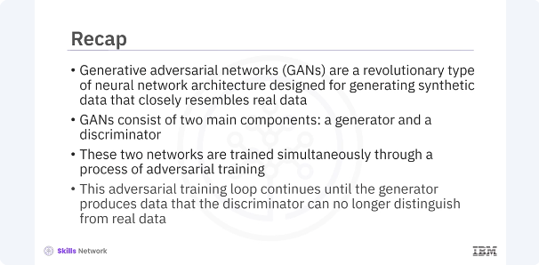

​In this video, you learned generative adversarial networks, ​GANs are a revolutionary type of neural network architecture designed for ​generating synthetic data that closely resemble real data. ​GANs consist of two main components, a generator and a discriminator. ​These two networks are trained simultaneously through a process of ​adversarial training. ​This adversarial training loop continues until the generator produces data that ​the discriminator can no longer distinguish from real data. 