# Hyperparameter Tuning with Keras Tuner

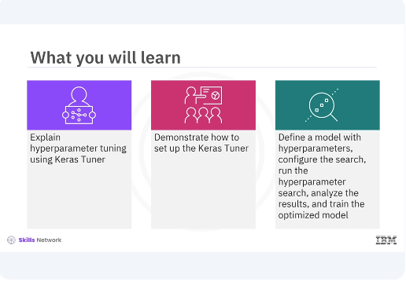

After watching ​this video, you'll be able explain hyperparameter tuning using Keras Tuner. ​Demonstrate how to set up the Keras Tuner, define a model with hyperparameters, ​configure the search, run the hyperparameter search, ​analyze the results and train the optimized model.

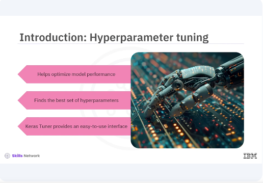

​Hyperparameter tuning is a crucial step in the machine learning pipeline as it helps ​optimize model performance by finding the best set of hyperparameters. ​Keras Tuner simplifies this process by providing an easy to use interface for ​hyperparameter optimization. ​

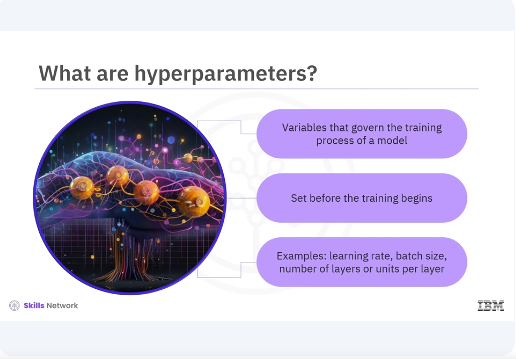

Hyperparameters are the variables that govern the training process of a model. ​Unlike model parameters which are learned during training, ​hyperparameters must be set before the training begins. 
​Examples include the learning rate, batch size, and the number of layers or ​units in a neural network. 

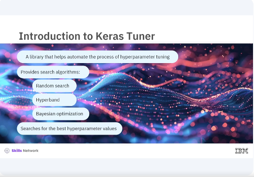

​Keras Tuner is a library that helps automate the process of hyperparameter ​tuning. ​It provides several search algorithms including random search, hyperband and ​Bayesian optimization. ​These algorithms efficiently search for the best hyperparameter values for ​your model. 

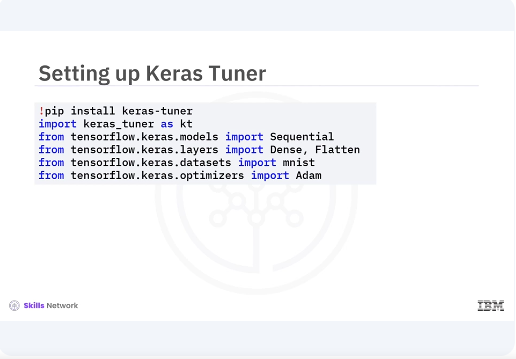

​Lets start by setting up the Keras Tuner. ​You will install the library and import the necessary modules. ​You begin by installing Keras Tuner using pip and importing the required modules. 
​This includes the Keras Tuner module along with tensorflow and ​Keras components for building the model and loading the dataset. 

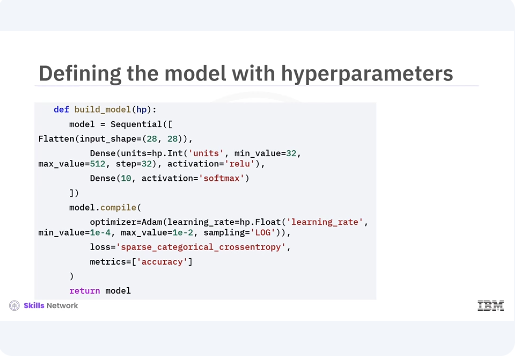

​Next you will define a model building function where you ​specify the hyperparameters you want to tune. ​The call method applies the self attention followed by the feedforward network with ​residual connections and layer normalization. ​In the given code snippet you define a simple neural network model with ​a flattened layer and two dense layers. ​You use the hyperparameter object to specify the range of the values for ​the number of units in the hidden layer and the learning rate. ​The hp.int function is used for integer hyperparameters while the hp.float ​function is used for floating point hyperparameters. 

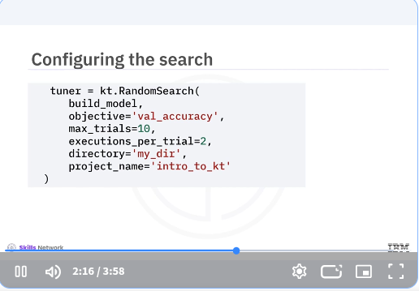

​Now you will configure the search process by creating a random search tuner. 
​This tuner will explore the hyperparameter space and ​find the best configurations based on model performance. ​In the code snippet, you create a random search tuner and ​specify the model building function. ​The optimization objective, validation accuracy, ​the number of trials, and the number of executions per trial. ​You also set the directory and project name for storing the results. 

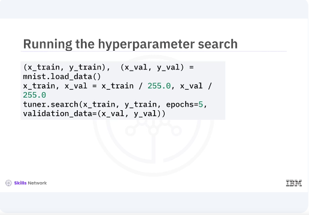

​With the tuner configured, you can now run the hyperparameter search. ​You will use the search method and pass in the training data, validation data, and ​the number of epochs. ​You load and preprocess the MNIST dataset, ​then run the hyperparameter search using the search method. 
​The tuner will evaluate different hyperparameter combinations and ​find the best one based on validation accuracy. 

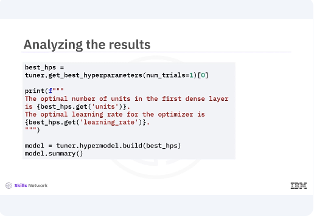

​After the search is complete, you can retrieve the best hyperparameters and ​build a model with these optimized values. ​You use the get best hyperparameters method to ​retrieve the best hyperparameter values and print them. ​Then you build a model with these optimized hyperparameters and ​print its summary. 

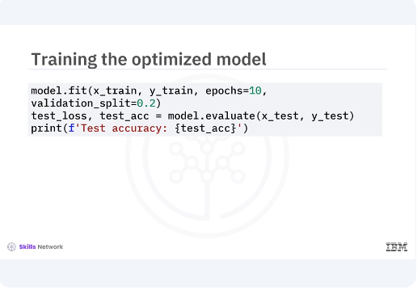

​Finally, you train the model with the optimized hyperparameters on the full ​training dataset and evaluate its performance on the test set. ​This final step ensures that the model performs well with the selected ​hyperparameters. 

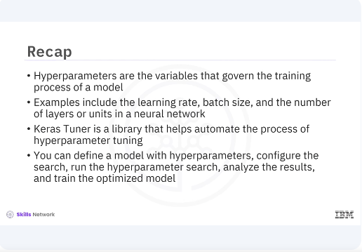

​In this video, you learned hyperparameters are the variables ​that govern the training process of a model. 
​Examples include the learning rate, batch size, and the number of layers or ​units in a neural network. ​Keras Tuner is a library that helps automate the process of hyperparameter ​tuning. ​You can define the model with hyperparameters, configure the search, ​run the hyperparameter search, analyze the results, and train the optimized model. ​[MUSIC] 