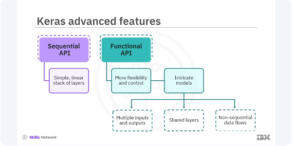

# Intro to Advanced Keras



While the sequential API in Keras is excellent for a simple linear stack of layers, the functional API provides more flexibility and control, essential for building complex models. Let's take a closer look at the functional API. 


```bash
pyenv activate venv3.10.4
```

## Sequential API
```python
from tensorflow.keras.models import Sequential
from tensorflow.keras.layers import Dense, Input

# Create a Sequential model
## Hint, 784 is the flattened ImageNet shape
model = Sequential([
    Input(shape=(784,)),
    Dense(64, activation='relu', input_shape=(784,)),
    Dense(10, activation='softmax')
])

# Compile the model
model.compile(optimizer='adam',
              loss='sparse_categorical_crossentropy',
              metrics=['accuracy'])
```


## Functional API
In the functional API example, you first define an input layer. Connect the first dense layer with relu activation to the input layer. 

```python
from tensorflow.keras.models import Model
from tensorflow.keras.layers import Input, Dense

# Define the input
inputs = Input(shape=(784,))

# Define layers
x = Dense(64, activation='relu')(inputs)
outputs = Dense(10, activation='softmax')(x)

# Create the model
model = Model(inputs=inputs, outputs=outputs)

# Compile the model
model.compile(optimizer='adam', loss='sparse_categorical_crossentropy', metrics=['accuracy'])
```

The output layer has the softmax activation. Then combine the input and output layers into a model. The functional API offers several advantages crucial for research and developing cutting-edge models. It is flexible enabling you to create complex architectures like multi branch models, residual connections, and more. The functional API provides clarity, and the model structure is more explicit and easier to debug. Layers and models can be reused across different parts of the architecture. Let's look at a complex model with multiple inputs. 


```python
from tensorflow.keras.layers import concatenate
from tensorflow.keras.utils import plot_model

# Define two sets of inputs
inputA = Input(shape=(64,))
inputB = Input(shape=(128,))

# The first branch operates on the first input
x = Dense(8, activation='relu')(inputA)
x = Dense(4, activation='relu')(x)

# The second branch operates on the second input
y = Dense(16, activation='relu')(inputB)
y = Dense(4, activation='relu')(y)

# Combine the outputs of the two branches
combined = concatenate([x, y])

# Apply a dense layer and then a regression prediction on the combined outputs
z = Dense(2, activation='relu')(combined)
z = Dense(1, activation='linear')(z)

# The model will accept the inputs of the two branches and output a single value
model = Model(inputs=[inputA, inputB], outputs=z)

# Compile the model
model.compile(optimizer='adam', loss='mean_squared_error')
```

In the example, two input layers, input A and input B, are defined with different shapes. Separate branches process each input through dense layers. Then outputs of the branches are concatenated. The combined output is processed through additional dense layers to produce a final output. You can use Keras Functional API to develop models in diverse fields such as healthcare, finance, and autonomous driving. Its ability to handle complex architectures makes it an invaluable tool for any deep learning practitioner. For example, the healthcare industry uses functional API models for medical image analysis to detect diseases. 

We learned that the Keras Functional API is a powerful tool that provides the flexibility needed to build complex neural network models. Its advantages over the Sequential API including the ability to create models with multiple inputs and outputs, shared layers, and intricate architectures, make it essential for advanced deep learning applications. By understanding and utilizing the functional API, you can enhance your models' capabilities and tackle a wider range of problems. 