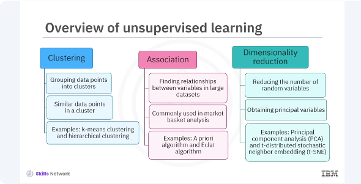
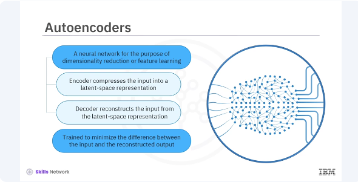
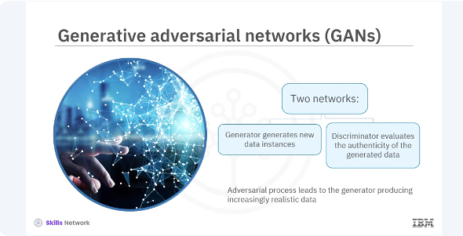

# Intro to Unsupervised Learning


​Welcome to this video on Unsupervised Learning in Keras. ​After watching this video, ​you'll be able to:

* define ​unsupervised learning in its categories,  
* ​describe unsupervised learning techniques, autoencoders, ​and generative adversarial networks, ​GANs, with examples.   


​Unsupervised learning is a type ​of machine learning where the algorithm is ​used to find patterns in data without ​any labels or predefined outcomes. 

​This is different from supervised learning, ​where we have a target variable to predict. ​In unsupervised learning, the goal is ​to understand the underlying structure of the data. 

​Unsupervised learning can be ​broadly categorized into three types:

* ​clustering  
* association
* dimensionality reduction




​Clustering involves grouping data points into clusters, ​such that data points in the same cluster are ​more similar to each other than ​to those in other clusters. 
​Examples include, k means ​clustering and hierarchical clustering. 

​Association involves finding relationships ​between variables and large data sets. ​It is commonly used in market basket analysis to ​identify products that frequently ​co-occur in transactions. ​Examples include the a priori algorithm ​and Eclat algorithm. 

​Dimensionality reduction involves reducing the number of ​random variables under consideration ​by obtaining a set of principal variables. ​Examples include principal component analysis, ​PCA, and ​t-distributed stochastic neighbor embedding, T-SNE. 



​Autoencoders are a type of neural network used to learn ​efficient representations of data for ​the purpose of dimensionality ​reduction or feature learning. 
​They consist of two main parts. ​Encoder, this part compresses ​the input into a latent space representation. ​Decoder. This part reconstructs ​the input from the latent space representation. ​The key idea is that the autoencoder is trained to ​minimize the difference between ​the input and the reconstructed output, ​forcing the network to learn ​meaningful representations of the data. ​Let's look at a simple implementation ​of an autoencoder in Keras. 

```bash
pyenv activate venv3.10.4
```
```python
import tensorflow as tf
from tensorflow.keras.layers import Input, Dense
from tensorflow.keras.models import Model

# Define the encoder
input_layer = Input(shape=(784,))
encoded = Dense(64, activation='relu')(input_layer)

# Define the decoder
decoded = Dense(784, activation='sigmoid')(encoded)

# Combine the encoder and decoder into an autoencoder model
autoencoder = Model(input_layer, decoded)

# Compile the autoencoder
autoencoder.compile(optimizer='adam', loss='binary_crossentropy')

# Summary of the model
autoencoder.summary()
```


​In this code, you define an autoencoder ​for a data set with 784 features. 
​The encoder compresses the input into 64 features, ​and the decoder reconstructs the original 784 features.


```python
# Load the MNIST dataset
(x_train, _), (x_test, _) = tf.keras.datasets.mnist.load_data()

# Normalize the data
x_train = x_train.astype('float32') / 255.
x_test = x_test.astype('float32') / 255.
x_train = x_train.reshape((len(x_train), 784))
x_test = x_test.reshape((len(x_test), 784))

# Train the autoencoder
autoencoder.fit(x_train, x_train,
                epochs=50,
                batch_size=256,
                shuffle=True,
                validation_data=(x_test, x_test))
```


​To train the autoencoder, ​you use the same data for both input and output. ​For example, you can use ​the Modified National Institute ​of Standards and Technology, ​MNIST data set as shown in this code. ​This code trains the autoencoder to learn ​efficient representations of the MNIST digits. 



​Generative adversarial networks, GANs, ​are a class of neural networks ​designed by Ian Goodfellow in 2014. ​They consist of two networks, ​the generator and the discriminator, ​which compete against each other in a zero sum game. ​Generator network generates new data instances ​that resemble the training data. 
​Discriminator network evaluates ​the authenticity of the generated data. ​The generator tries to fool the discriminator while ​the discriminator tries to ​distinguish between real and fake data. ​This adversarial process leads to ​the generator producing increasingly realistic data. ​Here's a simple implementation of a GAN in Keras. 

```python
from tensorflow.keras.layers import LeakyReLU
import numpy as np

# Define the generator model
def build_generator():
    model = tf.keras.Sequential()
    model.add(Dense(128, input_dim=100))
    model.add(LeakyReLU(alpha=0.01))
    model.add(Dense(784, activation='tanh'))
    return model

# Define the discriminator model
def build_discriminator():
    model = tf.keras.Sequential()
    model.add(Dense(128, input_shape=(784,)))
    model.add(LeakyReLU(alpha=0.01))
    model.add(Dense(1, activation='sigmoid'))
    return model
```

In this code, you define a simple GAN, ​where the generator takes ​a 100-dimensional noise vector as input, ​and produces a 784-dimensional image. ​The discriminator evaluates whether ​the image is real or generated. ​Training a GAN involves training ​the discriminator and generator alternately. 

```python
def train_gan(gan, generator, discriminator, x_train, epochs=400,
              batch_size=128):
    
    for epoch in range(epochs):
        
        # Generate random noise as input for the generator
        noise = np.random.normal(0, 1, (batch_size, 100))
        generated_images = generator.predict(noise)
        
        # Get a random set of real images
        idx = np.random.randint(0, x_train.shape[0], batch_size)
        real_images = x_train[idx]
        
        # Labels for real and fake images
        real_labels = np.ones((batch_size, 1))
        fake_labels = np.zeros((batch_size, 1))
        
        # Train the discriminator on real and fake images separately
        d_loss_real = discriminator.train_on_batch(real_images, real_labels)
        d_loss_fake = discriminator.train_on_batch(generated_images, fake_labels)
        
        # Calculate the average loss for the discriminator
        d_loss = 0.5 * np.add(d_loss_real, d_loss_fake)
        
        # Generate new noise and train the generator through the GAN model
        # (note: we train the generator via the GAN model, where the discriminator's weights are frozen)
        noise = np.random.normal(0, 1, (batch_size, 100))
        g_loss = gan.train_on_batch(noise, real_labels, return_dict=True)
        
        # Print the progress every 10 epochs
        if epoch % 10 == 0:
            print(f"Epoch {epoch} - Discriminator Loss: {d_loss[0]}, Generator Loss: {g_loss['loss']}")
    
    return d_loss, g_loss
```

​Here's a simplified version of the training loop. ​This loop trains the discriminator ​to distinguish real images from ​generated ones and trains ​the generator to produce realistic images. ​In this video, you learned ​unsupervised learning is a type of machine learning ​where the algorithm is used to find patterns in ​data without any labels or predefined outcomes. ​Unsupervised learning can be ​broadly categorized into three types, ​clustering, association, and dimensionality reduction. ​Autoencoders consist of two main parts ​; encoder and decoder. ​Generative adversarial networks, ​GANs consist of two networks; ​the generator and the discriminator, ​which compete against each other in a zero sum game. ​Generator network generates new data instances ​that resemble the training data, ​discriminator network evaluates ​the authenticity of the generated data. 