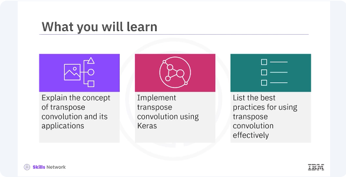
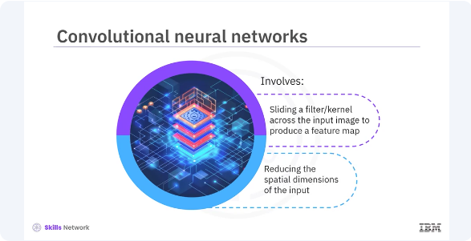
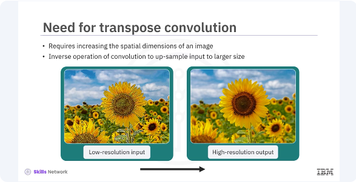
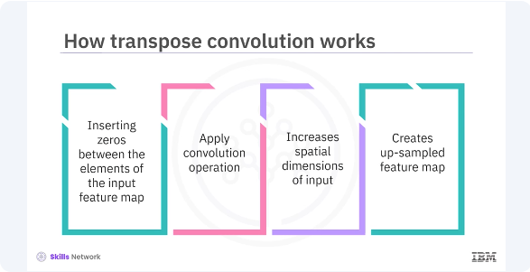
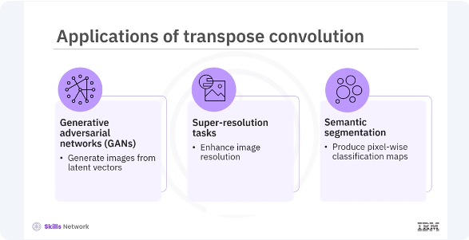
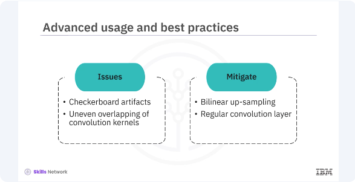

# Introducing Transpose Convolution



Welcome to this video on transpose convolution. ​After watching this video, ​you'll be able to explain the concept of ​transpose convolution and its applications, ​implement transpose convolution using Keras, ​list the best practices for ​using transpose convolution effectively. 


Transpose convolution is an essential technique ​in deep learning for image processing tasks. ​Also known as deconvolution, ​transpose convolution is particularly ​useful in applications such as image generation, ​super-resolution, and semantic segmentation. ​To understand transpose convolution, ​let's briefly revisit standard convolution. ​




In convolution neural networks (CNNs), ​a convolution operation involves sliding a filter ​or kernel across the input image ​to produce a feature map. ​This process reduces the spatial dimensions of the input, ​which is useful for extracting features, ​but not for tasks requiring up-sampling. 




​Certain tasks, such as generating ​higher-resolution images from low-resolution inputs, ​require increasing the spatial dimensions of an image. ​Transpose convolution addresses this need ​by performing the inverse operation of convolution, ​effectively up-sampling the input to a larger size. 




​Transpose convolution works by ​inserting zeros between elements ​of the input feature map and ​then applying the convolution operation. ​This process increases ​the spatial dimensions of the input, ​creating an up-sampled feature map that ​retains the characteristics of the original input, ​but at a higher resolution. 



​Transpose convolutions are ​crucial in various applications. ​In generative adversarial networks, ​GANs, they generate images from latent vectors. ​In super-resolution tasks, ​they enhance image resolution. 
​Additionally, they produce ​pixel-wise classification maps and ​semantic segmentation by ​up-sampling intermediate feature maps.


```bash
pyenv activate venv3.10.4
```

```python
import os
import logging
import tensorflow as tf
from tensorflow.keras.models import Model
from tensorflow.keras.layers import Input, Conv2DTranspose

# Set environment variables to suppress TensorFlow warnings
os.environ['TF_CPP_MIN_LOG_LEVEL'] = '3'  # Ignore INFO, WARNING, and ERROR messages
os.environ['TF_ENABLE_ONEDNN_OPTS'] = '0'  # Turn off oneDNN custom operations

# Use logging to suppress TensorFlow warnings
logging.getLogger('tensorflow').setLevel(logging.ERROR)

# Define the input layer
input_layer = Input(shape=(28, 28, 1))

# Add a transpose convolution layer
transpose_conv_layer = Conv2DTranspose(
    filters=32,
    kernel_size=(3, 3),
    strides=(2, 2),
    padding='same',
    activation='relu'
)(input_layer)

# Define the output layer
output_layer = Conv2DTranspose(
    filters=1,
    kernel_size=(3, 3),
    activation='sigmoid',
    padding='same'
)(transpose_conv_layer)

# Create the model
model = Model(inputs=input_layer, outputs=output_layer)

# Compile the model
model.compile(
    optimizer='adam',
    loss='mean_squared_error',
    metrics=['accuracy']
)

# Display the model summary
model.summary()
```

​Let's implement transpose convolution in Keras. ​You will create a simple model with an input layer, ​a transpose convolution layer, and an output layer. ​This code creates ​a transpose convolution layer with 32 filters, ​a three-by-three kernel, ​strides of two, and relu activation. ​This code creates the output layer of ​one filter and a sigmoid activation. ​This code creates a Keras model that connects ​the input and output layers ​through a transpose convolution layer. ​This code compiles the model with ​the Adam optimizer and mean squared error loss. 




​While using transpose convolution, ​be aware of potential issues ​such as checkerboard artifacts, ​which can occur due to ​uneven overlapping of the convolution kernels. ​To mitigate this, consider ​using additional techniques like ​blinear up-sampling followed ​by a regular convolution layer.

```python
import os
import logging
import tensorflow as tf
from tensorflow.keras.models import Sequential, Model
from tensorflow.keras.layers import Input, UpSampling2D, Conv2D

# Set environment variables to suppress TensorFlow warnings
os.environ['TF_CPP_MIN_LOG_LEVEL'] = '3'  # Ignore INFO, WARNING, and ERROR messages
os.environ['TF_ENABLE_ONEDNN_OPTS'] = '0'  # Turn off oneDNN custom operations

# Use logging to suppress TensorFlow warnings
logging.getLogger('tensorflow').setLevel(logging.ERROR)

# Define the input layer
input_layer = Input(shape=(28, 28, 1))

# Define a model with up-sampling followed by convolution to avoid checkerboard artifacts
x = UpSampling2D(size=(2, 2))(input_layer)
output_layer = Conv2D(
    filters=64,
    kernel_size=(3, 3),
    padding='same'
)(x)

# Create the model
model = Model(inputs=input_layer, outputs=output_layer)

# Compile the model
model.compile(
    optimizer='adam',
    loss='mean_squared_error',
    metrics=['accuracy']
)

# Display the model summary
model.summary()
```

​Let's see an example where you can reduce ​the artifacts and improve ​the quality of the up-sampled images. ​In this example, up-sampling ​2D performs up-sampling by a factor of two. ​This code applies a convolution layer ​to refine the up-sampled output.


​In this video, you learned ​transpose convolution is useful in image generation, ​super-resolution, and semantic segmentation applications. ​It performs the inverse operation of convolution, ​effectively up-sampling the input image ​to a larger size of higher resolution. 
​It works by inserting zeros between elements of ​the input feature map and ​then applying the convolution operation. 