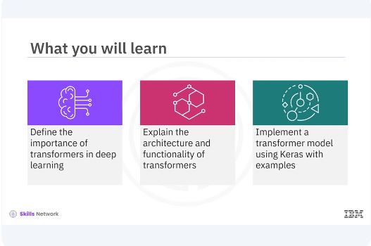
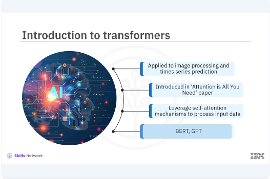
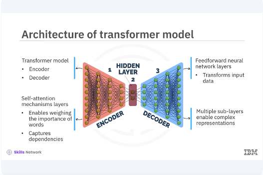
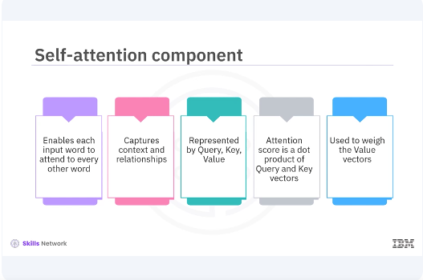
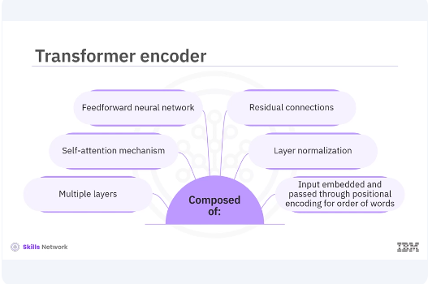
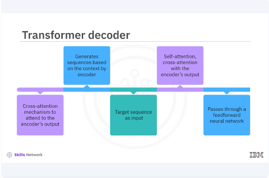

# Introducing To Transformers



​Welcome to this video on Transformers in Keras. ​After watching this video, ​you'll be able to define ​the importance of transformers in deep learning, ​explain the architecture and ​functionality of transformers, ​implement a transformer model using Keras with examples.



​Transformers have transformed the field of ​natural language processing and are ​now being applied to a wide range of tasks, ​including image processing and time series prediction. ​Transformers were introduced by ​Vaswani Adal in the landmark paper, ​"Attention is All You Need". ​Unlike traditional sequence models such as RNNs, ​transformers leverage self attention mechanisms ​to process and put data in parallel, ​making them highly efficient and powerful. ​Transformers are now the backbone ​of state of the art models like BERT, ​GPT, and many others. 




​The transformer model consists of two main parts, ​the encoder and the decoder. 
​Both the encoder and the decoder ​are composed of layers that ​include self attention mechanisms ​and feed forward neural networks. ​Self-attention allows the model ​to weigh the importance of ​different words in a sentence ​when encoding a particular word. ​This is crucial for capturing ​dependencies that are far apart in the input sequence. ​The feed forward neural network layers help in ​transforming the input data ​after the self attention mechanism. ​Each layer in the encoder and decoder stacks ​multiple such sub layers enabling ​the model to learn complex representations. 



​Self-attention is the core component ​of the transformer architecture. ​It allows each word and ​the input to attend to every other word, ​making it possible to capture ​contexts and relationships more effectively. 
​In self-attention, each word ​is represented by three vectors. ​Query, key and value. ​The attention score is computed as ​a dot product of the query and key vectors, ​which is then used to weigh the value vectors. ​This process allows the model to focus on ​different parts of the input ​sequence when making predictions. 

```bash
pyenv activate venv3.10.4
```

```python
import tensorflow as tf
from tensorflow.keras.layers import Layer

class SelfAttention(Layer):
    def __init__(self, d_model):
        super(SelfAttention, self).__init__()
        self.d_model = d_model
        self.query_dense = tf.keras.layers.Dense(d_model)
        self.key_dense = tf.keras.layers.Dense(d_model)
        self.value_dense = tf.keras.layers.Dense(d_model)
    def call(self, inputs):
        q = self.query_dense(inputs)
        k = self.key_dense(inputs)
        v = self.value_dense(inputs)
        attention_weights = tf.nn.softmax(
            tf.matmul(q, k, transpose_b=True) /
            tf.math.sqrt(tf.cast(self.d_model, tf.float32)),
            axis=-1
        )
        output = tf.matmul(attention_weights, v)
        return output


# Example usage
inputs = tf.random.uniform((1, 60, 512))  # Batch size of 1, sequence length of 60, and model dimension of 512
self_attention = SelfAttention(d_model=512)
output = self_attention(inputs)

print(output.shape)  # Should print (1, 60, 512)
```

​In this code example, ​the self attention class ​defines the self attention mechanism. ​The init method initializes the dense layers for query, ​key and value projections. ​The call method computes the attention weights ​and applies them to the value vectors to get the output. 
​The tf.nn.softmax parameter applies ​the Softmax function to ​the attention scores to get the attention weights. 




​The transformer encoder is composed of multiple layers, ​each containing a self attention mechanism ​followed by a feed forward neural network. ​Each layer also includes ​residual connections and ​layer normalization to stabilize training. ​The input to the encoder is ​first embedded and then passed through ​positional encoding to add ​information about the position of words in the sequence. ​This helps the model understand the order of words. 

```python
class TransformerEncoder(Layer):
    def __init__(self, d_model, num_heads, dff, rate=0.1):
        super(TransformerEncoder, self).__init__()
        self.mha = tf.keras.layers.MultiHeadAttention(
            num_heads=num_heads,
            key_dim=d_model
        )
        self.ffn = tf.keras.Sequential([
            tf.keras.layers.Dense(dff, activation='relu'),
            tf.keras.layers.Dense(d_model)
        ])
    def call(self, x, training, mask):
        attn_output = self.mha(x, x, x, attention_mask=mask)  # Self attention
        attn_output = self.dropout1(attn_output, training=training)
        out1 = self.layernorm1(x + attn_output)  # Residual connection and normalization
        ffn_output = self.ffn(out1)  # Feed forward network
        ffn_output = self.dropout2(ffn_output, training=training)
        out2 = self.layernorm2(out1 + ffn_output)  # Residual connection and normalization
        return out2


# Example usage
encoder = TransformerEncoder(d_model=512, num_heads=8, dff=2048)
x = tf.random.uniform((1, 60, 512))
mask = None
```

​In the example, the transformer encoder class ​defines the transformer encoder. ​The init method initializes the multi head attention, ​feed forward network, ​layer normalization, and dropout layers. 
​The multi head attention method ​applies multi head attention to the input. ​The call method applies ​self attention, residual connection, ​normalization, feed forward network, ​and another residual connection and normalization. 




​The transformer decoder is similar to the encoder, ​but with an additional cross attention mechanism ​to attend to the encoders output. ​This allows the decoder to generate ​sequences based on the context provided by the encoder. ​The decoder takes the target sequence as input, ​applies self attention and cross ​attention with the encoders output, ​and then passes through a feed forward neural network. 

```python
class TransformerDecoder(Layer):
    def __init__(self, d_model, num_heads, dff, rate=0.1):
        super(TransformerDecoder, self).__init__()
        self.mha1 = tf.keras.layers.MultiHeadAttention(
            num_heads=num_heads,
            key_dim=d_model
        )
        self.mha2 = tf.keras.layers.MultiHeadAttention(
            num_heads=num_heads,
            key_dim=d_model
        )
        self.ffn = tf.keras.Sequential([
            tf.keras.layers.Dense(dff, activation='relu'),
            tf.keras.layers.Dense(d_model)
        ])
        self.layernorm1 = tf.keras.layers.LayerNormalization(epsilon=1e-6)
        self.layernorm2 = tf.keras.layers.LayerNormalization(epsilon=1e-6)
        self.layernorm3 = tf.keras.layers.LayerNormalization(epsilon=1e-6)
        self.dropout1 = tf.keras.layers.Dropout(rate)
        self.dropout2 = tf.keras.layers.Dropout(rate)
        self.dropout3 = tf.keras.layers.Dropout(rate)

    def call(self, x, enc_output, training, look_ahead_mask, padding_mask):
        attn1 = self.mha1(x, x, x, attention_mask=look_ahead_mask)  # Self attention
        attn1 = self.dropout1(attn1, training=training)
        out1 = self.layernorm1(x + attn1)  # Residual connection and normalization

        attn2 = self.mha2(
            out1,
            enc_output,
            enc_output,
            attention_mask=padding_mask
        )  # Cross attention
        attn2 = self.dropout2(attn2, training=training)
        out2 = self.layernorm2(out1 + attn2)  # Residual connection and normalization

        ffn_output = self.ffn(out2)  # Feed forward network
        ffn_output = self.dropout3(ffn_output, training=training)
        out3 = self.layernorm3(out2 + ffn_output)  # Residual connection and normalization

        return out3
```

​In the example, the transformer decoder class ​defines the transformer decoder. ​The init method initializes the multi head attention, ​feed forward network, layer normalization, ​and drop out layers. 
​The multi head attention method applies multi ​head attention to the input and encoder output. ​The call method applies self attention, ​cross attention, residual connection, ​normalization, feed forward network, ​and another residual connection and normalization. 


​In this video, you learned ​the transformer model consists of two main parts, ​the encoder and the decoder. ​Both the encoder and decoder are composed of layers that ​include self attention mechanisms ​and feed forward neural networks. ​Transformers have become a cornerstone in deep learning, ​especially in natural language processing. ​Understanding and implementing transformers will ​enable you to build powerful models for various tasks. 