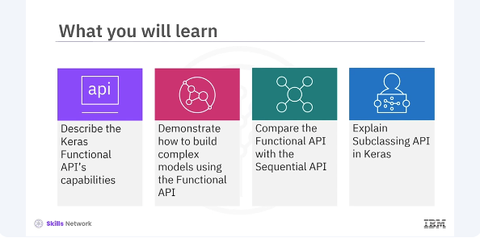
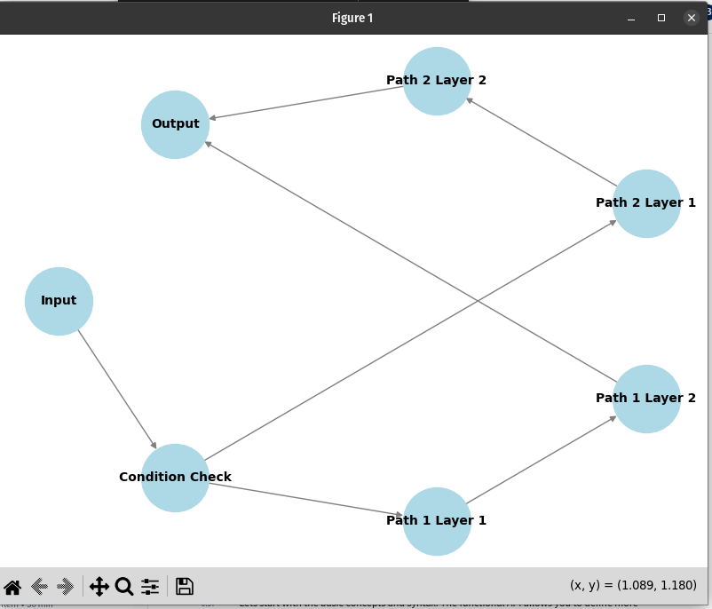

# Keras Functional API and Subclassing API





he functional API is beneficial when you need to construct models beyond the simple stack of the layers the sequential API offers. For instance, it allows for creating models with multiple inputs and outputs, shared layers, and even models with nonlinear data flows. This increased flexibility is crucial for research and tackling complex problems requiring custom solutions. 

```bash
pyenv activate venv3.10.4
```

```python
from tensorflow.keras.models import Model
from tensorflow.keras.layers import Input, Dense

# Define the input
inputs = Input(shape=(784,))

# Define a dense layer
x = Dense(64, activation='relu')(inputs)

# Define the output layer
outputs = Dense(10, activation='softmax')(x)

# Create the model
model = Model(inputs=inputs, outputs=outputs)
```
The input function is used to define the shape of the input data. The dense layers are added sequentially with the first dense layer applying a relu activation function and the final dense layer applying a softmax activation function suitable for multiclass classification. One of the significant advantages of the functional API is the ability to handle models with multiple inputs and outputs. This ability is particularly useful in complex applications like multitask learning. 


```python
from tensorflow.keras.layers import concatenate

# Define two sets of inputs
inputA = Input(shape=(64,))
inputB = Input(shape=(128,))

# The first branch operates on the first input
x = Dense(8, activation='relu')(inputA)
x = Dense(4, activation='relu')(x)
x = Model(inputs=inputA, outputs=x)

# The second branch operates on the second input
y = Dense(16, activation='relu')(inputB)
y = Dense(4, activation='relu')(y)
y = Model(inputs=inputB, outputs=y)
```

Here's how you can define a model with multiple inputs and outputs. You create each input layer, process them through different paths, and merge them before passing them through the output layers. In the code, define two separate input layers with different shapes. 


```python
# Combine the output of the two branches
combined = concatenate([x.output, y.output])

# Apply a FC layer and then a regression prediction on the combined outputs
z = Dense(2, activation='relu')(combined)
z = Dense(1, activation='linear')(z)

# The model will accept the inputs of the two branches and then output a single value
model = Model(inputs=[x.input, y.input], outputs=z)
```

Then separate branches of the model will be defined, each processing one of the inputs.

```python
from tensorflow.keras.layers import Lambda

# Define the input layer
input = Input(shape=(28, 28, 1))

# Define a shared convolutional base
conv_base = Dense(64, activation='relu')

# Process the input through the shared layer
processed_1 = conv_base(input)
processed_2 = conv_base(input)

# Create a model using the shared layer
model = Model(inputs=input, outputs=[processed_1, processed_2])
```

For instance, in a Siamese network, you can use shared layers to process two different inputs through the same layers and then compare their outputs. In the code, define a shared dense layer applied to both inputs. Apply the shared layer to the input and create a model with shared layers producing two outputs. 

```python
from tensorflow.keras.layers import Conv2D, MaxPooling2D, Flatten
from tensorflow.keras.activations import relu, linear

# First input model
inputA = Input(shape=(32, 32, 1))
x = Conv2D(32, (3, 3), activation=relu)(inputA)
x = MaxPooling2D((2, 2))(x)
x = Flatten()(x)
x = Model(inputs=inputA, outputs=x)

# Second input model
inputB = Input(shape=(32, 32, 1))
y = Conv2D(32, (3, 3), activation=relu)(inputB)
y = MaxPooling2D((2, 2))(y)
y = Flatten()(y)
y = Model(inputs=inputB, outputs=y)
```

Let's put it all together in a practical example. You will build a complex model with multiple inputs, shared layers, and outputs. You start by defining the input layers, then add layers to process each input, merge the layers, and finally explain the output layers. 

```python
# Combine the output of the two branches
combined = concatenate([x.output, y.output])

# Apply a FC layer and then a regression prediction on the combined outputs
z = Dense(64, activation=relu)(combined)
z = Dense(1, activation=linear)(z)

# The model will accept the inputs of the two branches and then output a single value
model = Model(inputs=[x.input, y.input], outputs=z)
```

Here's the complete code for the model. This complex model includes two branches each with convolutional layers, followed by pooling and flattening layers. The outputs of these branches are concatenated and passed through additional dense layers, ending with a single output unit. 

Another powerful feature of Keras is subclassing API. Unlike the sequential and functional APIs, the subclassing API offers the most flexibility. This API allows you to define custom and dynamic models by subclassing the model class and implementing your own call() method. 

The subclassing API is particularly useful when you need to build models where the forward pass cannot be defined statically. It is widely used in research and development for custom training loops and non-standard architectures. 

```python
import tensorflow as tf

# Define your model by subclassing
class MyModel(tf.keras.Model):
    def __init__(self):
        super(MyModel, self).__init__()
        # Define layers
        self.dense1 = tf.keras.layers.Dense(64, activation='relu')
        self.dense2 = tf.keras.layers.Dense(10, activation='softmax')
    def call(self, inputs):
        # Forward pass
        x = self.dense1(inputs)
        return self.dense2(x)


# Instantiate the model
model = MyModel()

# Define loss function and optimizer
loss_fn = tf.keras.losses.SparseCategoricalCrossentropy()
optimizer = tf.keras.optimizers.Adam()
```

To use the subclassing API, you need to subclass the model class and define your layers in the init method. Then you implement the forward pass in the call() method where you explicitly define how the layers are connected and how the data flows through the model. In this example, a custom model MyModel is created by subclassing tf.keras.model. The model consists of two dense layers where the first layer has 64 neurons with relu activation and the second layer has ten neurons with softmax activation. The subclassing API is especially useful in the following scenarios. 


* Models with dynamic architectures. When the models architectures need to be changed dynamically, such as in certain types of reinforcement learning models.

* Custom training loops, when you need more control over the training process and want to implement custom training loops.

* Research and prototyping, for experimenting with new types of layers or architectures that are not yet available in the standard keras API. 

```python
# Define number of epochs
epochs = 5
#Creat ea dummy training dataset
(train_images, train_labels), _ = tf.keras.datasets.mnist.load_data()
train_images = train_images.reshape(-1, 28*28).astype("float32") / 255
# Flatten and normalize
train_labels = train_labels.astype(np.int32)

# Create a tf.data dataset for batching
train_dataset = tf.data.Dataset.from_tensor_slices((train_images, train_labels)).batch(32)

# Custom training loop
for epoch in range(epochs):
    print(f"Epoch {epoch+1}/{epochs}")
    for x_batch, y_batch in train_dataset:
        with tf.GradientTape() as tape:
            predictions = model(x_batch, training=True)
            loss = loss_fn(y_batch, predictions)
        gradients = tape.gradient(loss, model.trainable_variables)
        optimizer.apply_gradients(zip(gradients, model.trainable_variables))
    print(f"Epoch {epoch+1}, Loss: {loss.numpy():.4f}")
```

In this example, a custom training loop is implemented using a tf.GradientTape method. This provides more flexibility and control over the training process compared to the built in keras.fit method. 

```python
# !pip install networkx
# !pip install matplotlib

import matplotlib.pyplot as plt
import networkx as nx

# Create a graph
G = nx.DiGraph()

# Adding nodes
G.add_node("Input")
G.add_node("Condition Check")
G.add_node("Path 1 Layer 1")
G.add_node("Path 1 Layer 2")
G.add_node("Path 2 Layer 1")
G.add_node("Path 2 Layer 2")
G.add_node("Output")

# Adding edges for dynamic flow
G.add_edges_from([
    ("Input", "Condition Check"),
    ("Condition Check", "Path 1 Layer 1"),
    ("Path 1 Layer 1", "Path 1 Layer 2"),
    ("Path 1 Layer 2", "Output"),
    ("Condition Check", "Path 2 Layer 1"),
    ("Path 2 Layer 1", "Path 2 Layer 2"),
    ("Path 2 Layer 2", "Output"),
])

# Position nodes using a shell layout
pos = nx.shell_layout(G)

# Draw the graph
plt.figure(figsize=(8, 6))
nx.draw(G, pos, with_labels=True, node_color='lightblue', node_size=3000,
        font_size=10, font_weight='bold', edge_color='gray')
plt.title('Dynamic Graph Visualization')
plt.show()
```

In addition, the subclassing API allows the use of dynamic graphs. 



This example code will first add edges for dynamic flow and then draw the graph with the title as shown in the output. In this video, you learned that Keras Functional API allows you to define layers and connect them in a graph of layers. The Functional API can handle models with multiple inputs and outputs. Another powerful feature of the functional API is shared layers, which are helpful when you want to apply the same transformation to multiple inputs. Subclassing API allows you to define custom and dynamic models by subclassing the model class and implementing your own call() method. The tf.GradientTape method provides more flexibility and control over the training process compared to the built in keras.fit method.

[https://github.com/bbearce/code-journal/blob/master/docs/notes/data_science/Coursera/Keras_and_Tensorflow/JupyterNotebooks/M01L01_Lab_%20Implementing%20the%20Functional%20API%20in%20Keras.ipynb](https://github.com/bbearce/code-journal/blob/master/docs/notes/data_science/Coursera/Keras_and_Tensorflow/JupyterNotebooks/M01L01_Lab_%20Implementing%20the%20Functional%20API%20in%20Keras.ipynb)

