# Model Optimization

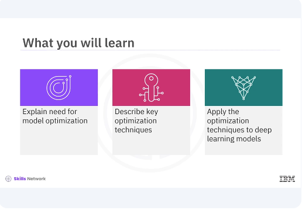

Welcome to this video on model optimization. ​After watching this video, you'll be able to explain need for ​model optimization, describe key optimization techniques, ​apply the optimization techniques to deep learning models.

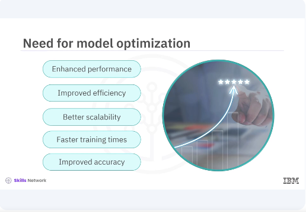

​Model optimization aims to improve the performance and ​efficiency of your neural networks. ​Model optimization is crucial in deep learning as it helps enhance ​the performance, efficiency and scalability of models. ​Optimized models can lead to faster training times, ​better utilization of hardware resources, and improved accuracy. ​There are several common techniques for model optimization including weight ​initialization, learning rate scheduling, and batch normalization. ​Each of these techniques address different aspects of the training process to improve ​model performance. 

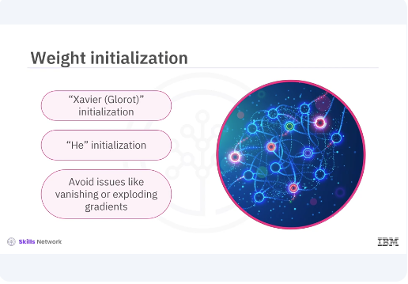

​Proper weight initialization can significantly impact the convergence and ​performance of a neural network. ​Methods such as Xavier Glorot initialization and ​He initialization are commonly used. ​These methods set the initial weights to avoid issues like vanishing or ​exploding gradients.

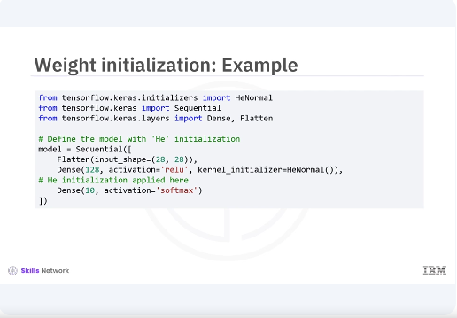

​In this example, you will apply the He initialization method using keras. ​He initialization is suitable for layers with relu activation, ​helping maintain a stable gradient flow during training. 

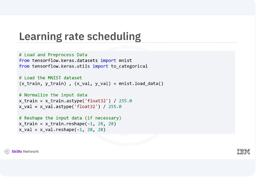

​Let's look at the training rate scheduling technique for model optimization. ​You start by loading your dataset and getting it ready for training. 
​You will be working with the MNIST dataset, a classic choice for ​image classification tasks. ​You begin by loading the MNIST dataset, then normalizing the pixel values to be ​between zero and one for better performance during training. ​Lastly, you reshape the data to ensure it's in the correct format. 

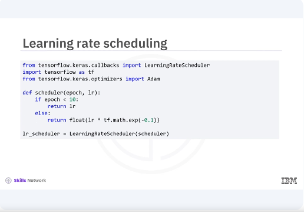

​Next you will implement a learning rate scheduler to adjust your learning rate ​dynamically during training. ​This will help your model converge more efficiently. ​Here you define a scheduler function that keeps the learning rate constant for ​the first ten epochs, then exponentially decreases it. ​This can help the model fine tune its learning as training progresses. 

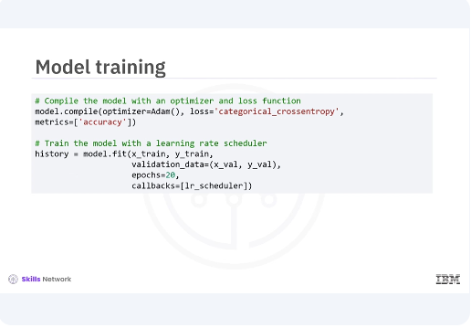

​Now were ready to train our model. ​You will train for 20 epochs and validate its performance with your validation data. ​The learning rate scheduler will be in action during this time. ​The training process begins with our model, learning from the training data and ​adjusting based on validation performance. ​The learning rate scheduler will help fine tune this process as you proceed. 

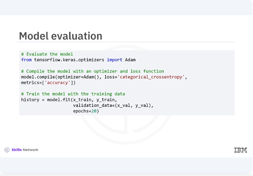

​Before you evaluate your model, you need to train it on the training data. ​You will train for ​20 epochs while validating its performance with your validation data. 
​Once the training is complete, you will evaluate the model's performance on ​the validation set and it can be used for further use cases. ​Training the model allows it to learn from the training data and ​adjust its parameters to improve performance. ​After training, you evaluate the model's performance on unseen validation ​data to check its generalization capability. 

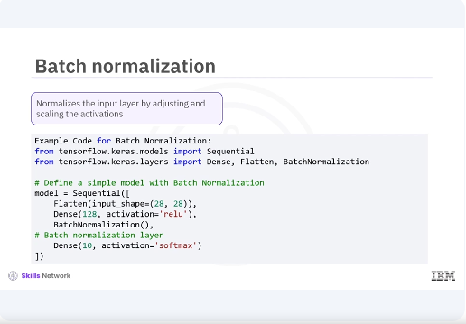

​Now let's briefly explore additional techniques like batch normalization, ​mixed precision training, model pruning and quantization, and ​how they can help improve model performance and efficiency. ​Batch normalization. ​Batch normalization is a technique used to normalize the input layer by adjusting and ​scaling the activations. ​This code can help accelerate training, improve model convergence, and ​reduce the sensitivity to the initial learning rate. 

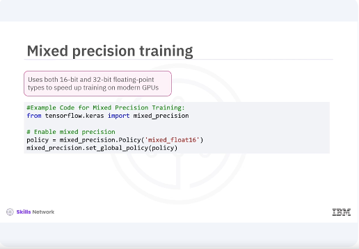

​Mixed precision training. ​Mixed precision training involves using both 16-bit and ​32-bit floating-point types to speed up training on modern GPUs, ​leading to faster computation and reduced memory usage. ​Model pruning. ​

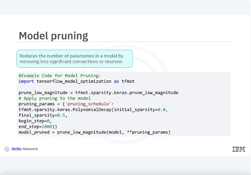

Model pruning reduces the number of parameters in a model by removing less ​significant connections or neurons, ​making it more efficient without a substantial loss in accuracy. 

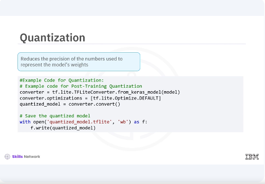

​Quantization. ​Quantization reduces the precision of the numbers used to represent the models' ​weights, which helps in deploying models on edge devices by reducing memory ​usage and inference time. 

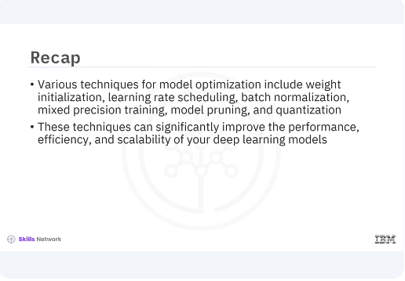

​In this video, you learned that various techniques for ​model optimization include weight initialization, learning rate scheduling, ​batch normalization, mixed precision training, model pruning, and quantization. 
​These techniques can significantly improve the performance, efficiency and ​scalability of your deep learning models.