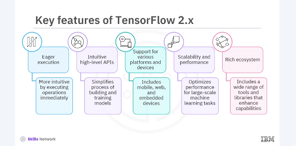
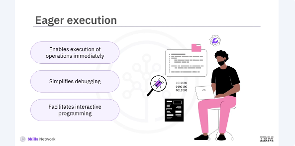
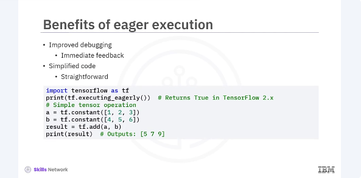
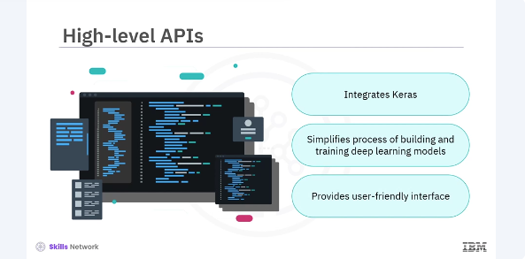
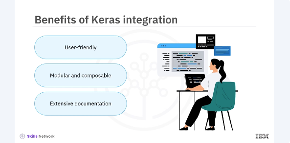
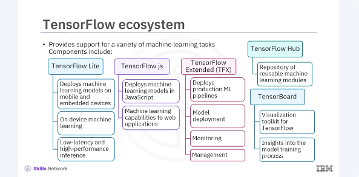

# Overview of Tensorflow 2.x


Welcome to this video that gives ​an overview of TensorFlow 2.X. ​After watching this video, you'll be able to. ​Describe the key features of TensorFlow 2.X, ​list the benefits of eager execution. ​Describe the integration of Keras with TensorFlow, ​list the benefits of Keras integration with TensorFlow. ​List the components of TensorFlow ecosystem. 
​TensorFlow is an open source platform ​for machine learning developed by Google. ​Since its inception, TensorFlow has become one of ​the most popular frameworks for ​machine learning and deep learning applications. ​It provides comprehensive tools to build and deploy ​machine learning models across ​various environments from servers to edge devices. ​In this overview, we'll cover ​the key features of TensorFlow 2.X, ​including eager execution, high level APIs, ​and the extensive TensorFlow ecosystem. ​TensorFlow 2. X has ​several key features that make ​it powerful and user friendly. ​Let's dive into some of ​the most important ones.



Eager execution. ​This feature makes TensorFlow more ​intuitive by executing operations immediately, ​which is great for debugging and interactive programming. ​Intuitive high level APIs. ​TensorFlow 2.X integrates Keras as its high level API, ​simplifying the process of building and training models. ​Support for various platforms and devices. 
​TensorFlow supports deployment across ​multiple platforms, including mobile, ​web, and emitted devices, ​making it highly versatile, scalability and performance. ​TensorFlow allows for seamless scaling across CPUs, GPUs, ​and TPUs, optimizing performance for ​large scale machine learning tasks. Rich ecosystem. ​TensorFlow's ecosystem includes a wide range ​of tools and libraries that enhance its capabilities, ​such as TensorFlow Light, ​TensorFlow JS, and TensorFlow extended TFX. ​These features collectively contribute to ​TensorFlow status as a leading framework ​in the machine learning community.



​Eager execution is a major enhancement in TensorFlow 2.X that makes the framework ​more user friendly and flexible. 
​It allows operations to be ​executed immediately without building graphs, ​which simplifies the debugging process ​and facilitates interactive programming. ​This mode of execution is especially beneficial for ​beginners and for tasks that ​require dynamic model behaviors. 




​Some of the benefits of eager execution are ​as follows, improved debugging. ​By executing operations immediately, ​eager execution provides immediate feedback, ​making it easier to identify and ​fix errors. Simplified code. ​Without the need to build static computation graphs, ​the code is more straightforward ​and easier to understand. ​Here is an example of a simple TensorFlow code. 

​Interactive development. ​Eager execution supports interactive programming, ​which is ideal for exploratory research and development. 




​TensorFlow 2. X integrates Keras as its high level API, ​which greatly simplifies the process ​of building and training deep learning models. ​Keras provides a user friendly interface that ​abstracts much of the complexity ​involved in neural network programming. ​



The benefits of Keras integration ​with TensorFlow are as follows. ​User friendly. Keras allows for ​the creation of models using simple and concise code. 
​Modular and composable. ​It supports building models in a modular fashion, ​where layers and blocks can be easily combined. ​Extensive documentation. ​Keras comes with comprehensive documentation and ​numerous examples ​facilitating learning and implementation. 

```bash
from tensorflow.keras.models import Sequential
from tensorflow.keras.layers import Dense

# Define a simple feedforward neural network
model = Sequential([
    Dense(64, activation='relu', input_shape=(784,)),
    Dense(10, activation='softmax')
])

# Compile the model
model.compile(optimizer='adam',
              loss='sparse_categorical_crossentropy',
              metrics=['accuracy'])
```

​In this example, you define a simple neural network with ​one hidden layer and compile it using the atom optimizer. ​The integration of Keras and TensorFlow 2.X streamlined ​to the workflow and makes ​the model building and training more accessible. 




​TensorFlow has a rich ecosystem ​of tools and libraries that extend ​its capabilities and provide ​support for a variety of machine learning tasks. ​Some key components of ​the TensorFlow ecosystem include TensorFlow light, ​a lightweight solution for deploying ​machine learning models on mobile and embedded devices. ​It enables on device machine learning, ​providing low latency and high performance inference, ​TensorFlow JS, a library for training and deploying ​machine learning models in ​Java script environments such as web browsers and no JS. ​This allows developers to bring ​machine learning capabilities to web applications. ​TensorFlow extended TFX, ​an end-to-end platform for deploying production ML pipelines. ​TFX provides tools for model deployment, monitoring, ​and management, ensuring that ​machine learning models perform ​reliably in production environments. ​TensorFlow hub, a repository ​of reusable machine learning modules, ​which can be easily integrated into ​TensorFlow applications to accelerate development. 
​TensorBoard, a visualization toolkit for ​TensorFlow that provides insights ​into the model training process, ​including metrics, graphs, and other useful data. ​These components make TensorFlow ​a comprehensive platform that ​supports the entire machine learning ​life cycle from development to deployment.

​In this video, you learned that. ​TensorFlow 2.X is ​a powerful and flexible platform for machine learning. ​Its key features such as ​eager execution, high level APIs, ​and a rich ecosystem of tools, ​make it an ideal choice for ​developing and deploying machine learning models. ​Understanding these features and ​capabilities will help you ​build and deploy machine ​learning models more effectively, ​whether you're working on research, ​prototyping, or production applications. 