# Q-Learning_with_Keras

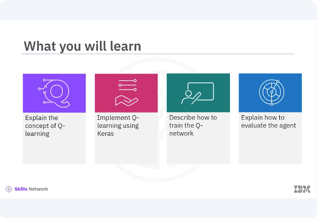

​Welcome to this video on Q-learning with Keras. ​After watching this video, ​you'll be able to: Explain the concept of Q-learning. ​Implement Q-learning using Keras. ​Describe how to train the Q-network. ​Explain how to evaluate the agent. 

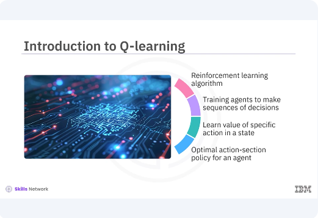

​Q-learning is a widely ​used reinforcement learning algorithm. ​Reinforcement learning is a powerful paradigm ​in machine learning that focuses on ​training agents to make sequences of decisions ​by maximizing a notion of cumulative reward. ​Q-learning is an off policy algorithm ​that seeks to learn the value of taking ​a specific action in a given state and aims to ​find the optimal action selection policy for an agent. 

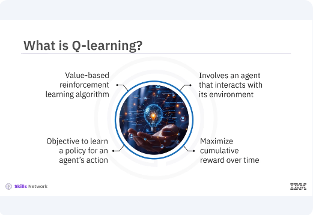

​Q-learning is a type of ​value based reinforcement learning algorithm. ​Unlike other types of learning ​like supervised or unsupervised, ​reinforcement learning involves an agent ​that interacts with its environment, ​takes actions, and learns ​from the consequences of these actions. ​The core objective of Q-learning is ​to learn a policy that tells an agent ​what action to take under ​what circumstances to maximize ​its cumulative reward over time. 

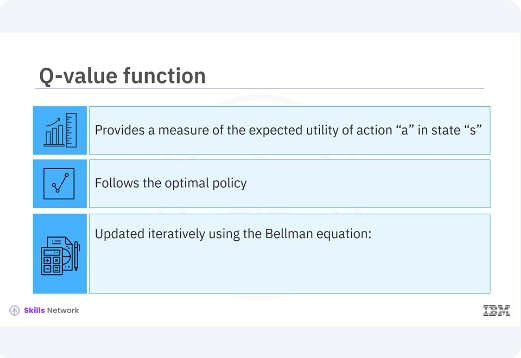

​The essence of Q-learning lies in ​the Q-value function, Q(s, a). ​This function provides a measure of ​the expected utility of taking action ​a in state S and thereafter following the optimal policy. ​The Q-values are updated ​iteratively using the Bellman equation, ​which incorporates both the immediate reward ​and the estimated future rewards. 

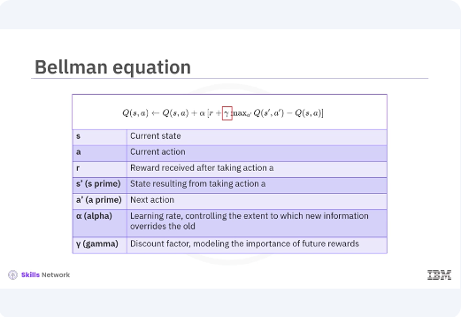

​The update rule for the Q-value ​is given by the equation as shown. ​In the equation, s represents the current state, ​a represents the current action, ​r denotes the reward received after taking action a. ​s', s', is the state resulting from taking action a. ​A', a', represents the next action. ​Alpha is the learning rate controlling ​the extent to which new information overrides the old. ​Gamma is the discount factor ​which models the importance of future rewards. 

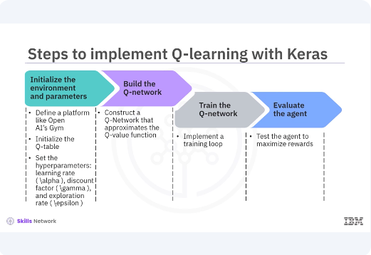

​Implementing Q-learning involves several steps, ​each critical to the agent's ability ​to learn and perform well. ​Initialize the environment and parameters. ​Define the environment using ​a platform like OpenAI's Gym. ​Initialize the Q-table, ​a table of state action pairs. ​Set the hyper parameters, learning rate Alpha, ​discount factor Gamma, and exploration rate Epsilon. ​Build the Q-network. ​Utilize Keras to construct ​a neural network that approximates the Q-value function. ​This Q-network will replace ​the Q-table for environments with large state spaces. ​Train the Q-network. 
​Implement a training loop where ​the agent interacts with the environment, ​selects actions, receives rewards, ​transitions to new states, ​and updates the Q-values. ​Evaluate the agent. After training, ​test the agent in the environment to assess ​its performance and ability to maximize rewards. ​Let's look at each step in detail.

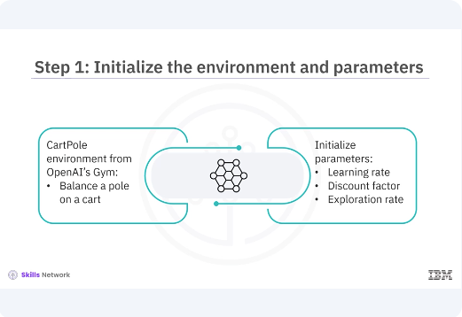

​To start with Q-learning, ​you need an environment where your agent will interact. ​For simplicity, you use ​the CartPole environment from OpenAI's Gym. ​The CartPole environment is ​a classic control problem where the goal ​is to balance a pole on a cart. ​You also initialize ​important parameters like the learning rate, ​discount factor, and exploration rate. ​These parameters significantly influence ​the learning process and the agent's performance. 

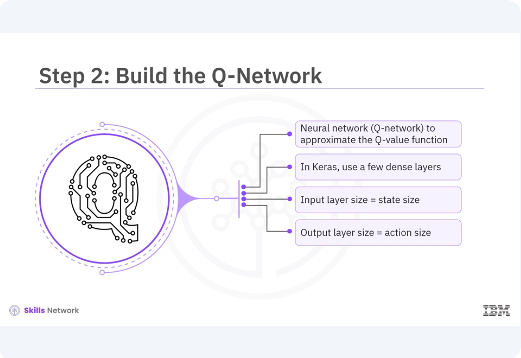

In traditional Q-learning, ​you use a Q-table to store ​Q-values for all state action pairs. ​However, for environments with ​large or continuous state spaces, ​a Q-table becomes impractical. ​Instead, you use our neural network, ​Q-network, to approximate the Q-value function. ​In Keras, you can build ​this Q-network using a few dense layers. ​The input layer size should match the state size ​and the output layer size should match the action size. 
​The hidden layers can have any architecture, ​but typically two or three hidden layers ​with ReLU activation functions are used. ​

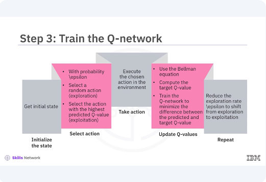

Training the Q-network involves several key steps. ​Initialize the state, reset ​the environment to get the initial state, ​select action, use an Epsilon greedy policy ​to balance exploration and exploitation. ​With probability or Epsilon, ​select a random action, exploration, ​or select the action with ​the highest predicted Q-value exploitation. Take action. ​Execute the chosen action in ​the environment to receive the next state and reward. ​Update Q-values. 
​Use the Bellman equation to update the Q-values. ​Compute the target Q-value ​for the current state action pair and train ​the Q-network to minimize the difference between ​the predicted Q-value and the target Q-value. ​Repeat. Continue the process until ​the agent reaches a terminal state or achieves the goal. ​Over multiple episodes, gradually ​reduce the exploration rate, Epsilon, ​to shift from exploration to exploitation. 

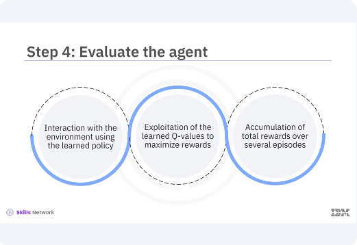

After training, you evaluate the agent by ​letting it interact with the environment ​using the learned policy. ​During evaluation, the agent should primarily ​exploit the learned Q-values to maximize rewards. ​The performance of the agent can be measured by ​the total rewards accumulated over several episodes. 

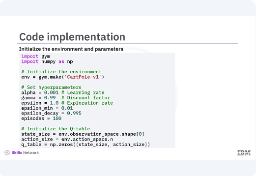

​Here is the code implementation for each step, ​focusing on initializing the environment, ​building the Q-network, ​training the Q-network, ​and evaluating the agent. ​The CartPole environment is ​initialized using the gym.make function. ​This environment is a standard benchmark problem ​for reinforcement learning. ​Hyper parameters such as learning rate, ​discount factor, exploration rate, ​and the number of episodes are defined. ​The exploration rate Epsilon is initialized to 1.0 ​and decays over time to shift ​the agent's behavior from exploration to exploitation. ​The state size and action size are determined based on ​the environment's observation ​and action spaces respectively. 
​A Q-table is initialized with zeros, ​although it is not used directly ​in the neural network approach. 

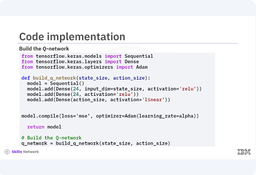

​A neural network, Q-network, ​is built using Keras. ​The network consists of an input layer, ​two hidden layers with 24 neurons ​each and ReLU activation, ​and an output layer with a linear activation function. ​The atom optimizer and ​mean squared error loss function ​are used for training the network. ​

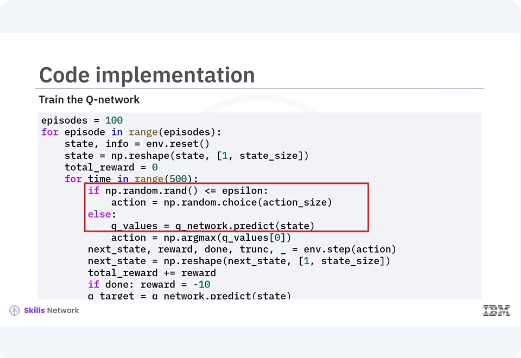

The training loop iterates over ​the specified number of episodes. ​For each episode, the environment is reset and the agent ​interacts with the environment for up ​to a maximum of 500 steps. ​An Epsilon greedy policy is used to select actions. ​With the probability of Epsilon, ​the agent selects a random action, exploration, ​and with the probability of one Epsilon, ​it selects the action with ​the highest Q-value exploitation. ​The agent takes the selected action, ​receives the next state and reward, 

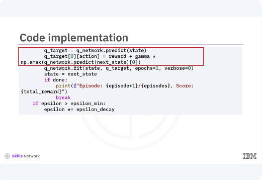

​and updates the Q-values using the Bellman equation. ​The Q-network is trained to minimize the difference ​between the predicted Q-values and the target Q-values. ​The exploration rate Epsilon decays ​over time to balance exploration and exploitation. ​After training, the agent is evaluated by ​interacting with the environment ​using the learned policy. ​The environment is rendered to visualize ​the agent's behavior and ​the total reward for each episode is printed. ​During evaluation, the agent primarily ​exploits the learned Q-values to maximize rewards, ​demonstrating the effectiveness of the trained Q-network. 

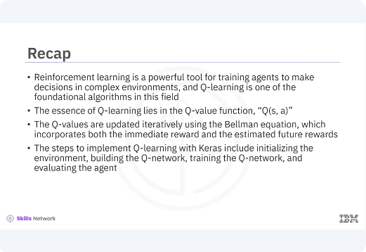

​In this video, you learned ​reinforcement learning is a powerful tool ​for training agents to make ​decisions in complex environments and ​Q-learning is one of the foundational ​algorithms in this field. ​The essence of Q-learning lies in ​the Q-value function, Q(s, a). ​The Q-values are updated ​iteratively using the Bellman equation, ​which incorporates both the immediate reward ​and the estimated future rewards. ​The steps to implement Q-learning with ​Keras include initializing the environments, ​building the Q-network, ​training the Q-network, ​and evaluating the agent. 