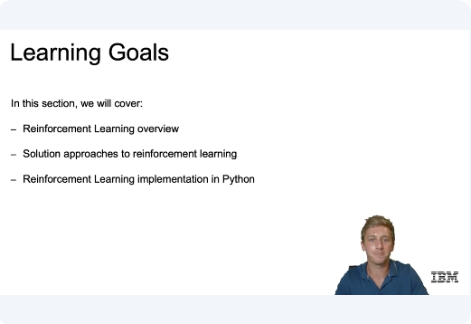
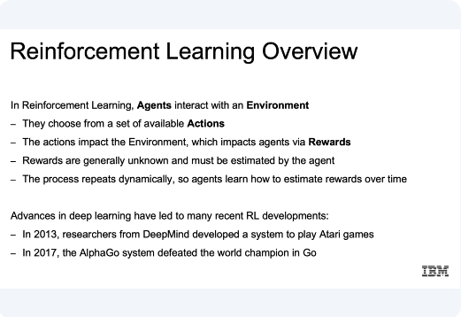
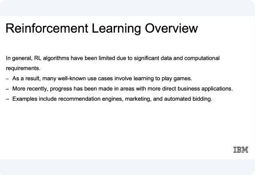
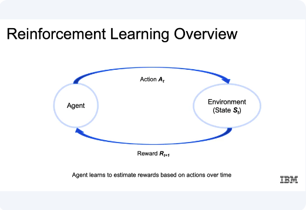
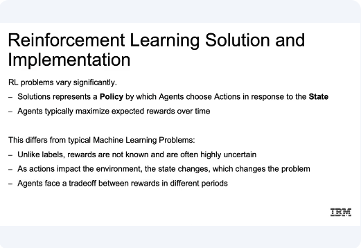
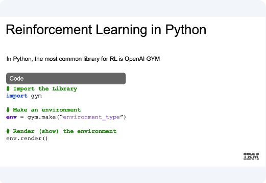
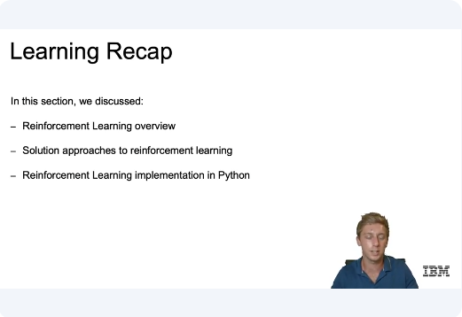

# Reinforcement Learning

​In this video, we'll provide a high-level introduction to reinforcement learning. ​Now let's go over the learning goals for this section. ​In this section, we're going to cover an overview of reinforcement learning at ​a very high level. 

​We'll have a discussion about the understanding of the approaches and ​implementation for reinforcement learning. ​Then finally we'll introduce reinforcement learning implementation using Python. 

​So let's start off with reinforcement learning overview as we promised. ​Now, in reinforcement learning, ​the idea is that agents will be interacting with an environment. And agents then are going to be the thing that ultimately takes the action. ​So if you think in regards to games, which are very popular for ​reinforcement learning, currently this would be the actual player. ​If we were thinking through a model that was meant to figure out, for example, ​where to place ads on a web page, the agent would just be that program that ​makes the decision where the ad will be placed. ​And the environment is going to be the world through which our agent moves. ​So if you're playing games such as chess, this would be the actual chess board for ​thinking something like ads on a web page, this would be the entire web page. ​And they choose from a set of available actions, and again using the game example, ​this would be all possible moves that an agent or a player can make in our game. ​In our ads example, this may be either adding an ad, removing an ad, or ​taking option of neither removing or adding an ad from the current page. 

​And the actions that we take are going to impact the environment, ​which in turn impacts the agents via rewards. ​So when an action is taken, ​we have impacted the environment where our agent exists. ​So if you think if we move a piece in our game, ​we have adjusted the environment of our game. ​If our move resulted in us getting more points or winning the game, ​this would be an example of a reward. ​And our system would learn that the actions taken were good actions. ​And similarly for ads example, ​our reward could be a result in increase clicks or increase in revenue. ​Now something to note is that rewards are generally unknown and ​must be estimated by the agent, so often times it will take many steps to ​reach towards that reward stage of your game. ​If that's just to win the game more to get to a certain place within the game. ​So I think for any game of any kind, ​oftentimes they'll take multiple moves before you get any type of reward.

​And this process again repeats dynamically. ​So agents continuously learn how to estimate rewards overtime. ​Now, advances in deep learning have led to many ​recent reinforcement learning developments. ​For example in 2013 researchers from DeepMind developed the system ​to play Atari games and actually beat humans in Atari games. ​And in 2017 the AlphaGo system defeated the world champion in Go. 
​So for the first time, the machines were able to beat a human champion in ​a complex game such as Go using reinforcement learning. 

​Now, in general, reinforcement learning algorithms have been limited due ​to significant data and computational requirements. ​So if you think about the infinite number of possibilities at every juncture, ​if you're adjusting for every person that visits your site, or even for ​games which is the example that has proven to be successful. ​But the reason why it's taken so long is that you think about something like Go or ​chess, the infinite amounts of moves that anyone can make along ​with the following moving reaction to those moves may lead to us needing a lot ​of data to train our reinforcement learning models. ​Now more recently, ​progress has been made in areas with more direct business applications. ​And examples include recommendation engines where recommending correctly ​could perhaps be a reward. ​Marketing with higher revenues or higher clicks, again, ​being that reward mechanism, and automated bidding. 
​If you're able to optimize the amount spent or paid per an item, and ​setting up some reward system in that sense as well. 

​Now the idea here is that the agents again, ​if we think about reinforcement learning, the agent takes some action. ​That action affects the current environment, and then feedback from ​that environment is passed back to the agent in terms of a reward. ​So if it resulted in a positive result in relation to our reward system, ​the agent's actions are then reinforced. ​And then vice versa for negative results if it ended up in a bad state and ​the agent is reinforced not to take those same steps.

​Now reinforcement learning problems will vary significantly. ​And solutions represent a policy by which agents choose actions ​in response to the current state, or in other words, ​since this is not directly supervised learning, what takes our input a\nd comes up with the resulting action as the policy, and that is what we ​ultimately try and optimize, whatever that policy is defined as. ​And agents typically work to maximize expected rewards over time.

​And this differs from typical machine learning problems because unlike with ​labels, rewards are not known and often highly uncertain. ​We may not know at every juncture whether actions resulted in immediate rewards, or ​even if it did, ​if those intermediate rewards will lead to our larger goals of our network. ​Whereas with typical machine learning problems, the solutions remain static, ​with reinforcement learning as actions impact the environment, the state changes, ​which continuously changes the problem that we're working with. ​And then finally, agents face a trade-off between rewards in different periods, ​again, pointing to this uncertainty that revolves around this reward system. 

​Now just a quick introduction. ​We will get into Notebook, but in Python the most common library for ​reinforcement learning is going to be OpenAI GYM. ​So we're going to want to import our GYM library to create an environment. ​We call gym.make, and there are actually some environments that are going to be ​available to us according to the strings that we pass and ​we'll see this in the Notebook, so that we can specify the game or ​environments that world in which we are living. ​And then about render, now that we've created that environment object, ​will show the current state of our environment.

​Now just to recap, in this section we discussed reinforcement learning overview ​with an understanding of that feedback loop, where the goal is for ​an agent to interact with the environment to choose from ​a set of available actions to increase possible rewards. ​And those rewards lead to reinforcement of those actions within the environment. ​And we discussed how solution approaches to reinforcement learning relied on ​the policy by which agents chose actions in response to the given state. ​And as those actions impact the environment, ​the state changes, which changes the problem we are currently working with. ​Then finally we closed out with a quick introduction to reinforcement ​learning implementation in Python, ​which we're going to go into further in our final notebook. 