# TensorFlow for Model Optimization

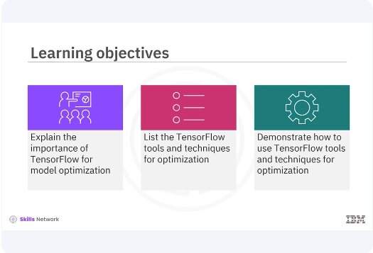

Welcome to this video on TensorFlow for Model Optimization. ​After watching this video, you'll be able to explain the importance of TensorFlow for optimizing deep learning models to improve ​efficiency in terms of speed, size, and computational requirements. ​List the TensorFlow tools and techniques for optimization. ​Demonstrate how to use TensorFlow tools and techniques for optimization.

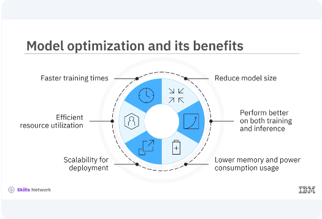

​Model optimization is crucial for developing efficient and performant deep learning models. ​Optimized models train faster, reduce the model size, use resources more effectively, ​perform better on both training and inference tasks, provide scalability for deployment, ​use lower memory and power consumption. 

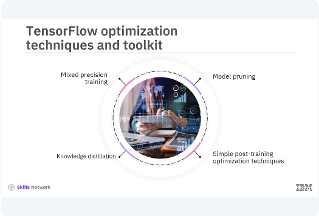

TensorFlow provides several built-in tools and techniques ​to help with this process. TensorFlow includes several optimization techniques ​such as mixed-precision training, knowledge distillation, and simple post-training optimization ​techniques like pruning, quantization, which are supported by the TensorFlow Model Optimization ​Toolkit.

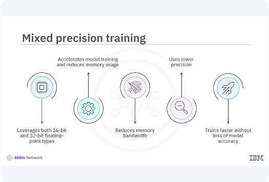

These tools help you optimize your models for both training and deployment. ​Mixed-precision training leverages both 16-bit and 32-bit floating-point types to accelerate ​model training and reduce memory usage. This technique can significantly improve performance ​on modern GPUs that support mixed-precision operations. It reduces memory bandwidth and ​uses lower precision where possible, allowing models to train faster on modern GPUs without ​significant loss of model accuracy. 

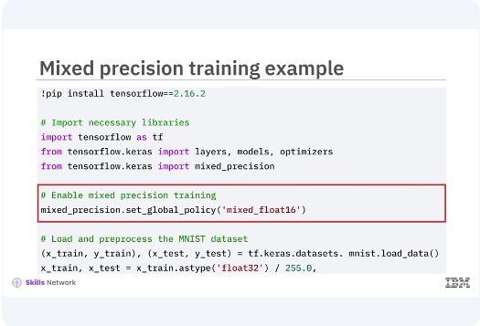

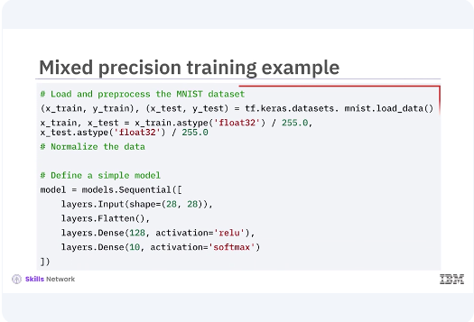

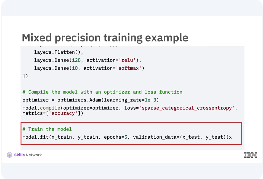

In this example, you set the global policy to Mixed ​Float 16 for mixed-precision in training. Then you load and preprocess the MNIST dataset ​and define a simple model. You then optimize the model by using an optimizer ​and loss function. This speeds up training by reducing the size of gradients and other ​immediate results while maintaining accuracy through loss scaling. This allows TensorFlow ​to use 16-bit floats where possible, improving performance and reducing memory usage without ​compromising model accuracy. 

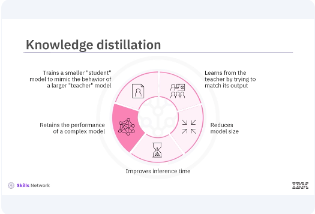

Knowledge distillation is a technique that ​involves training a smaller student model to mimic the behavior of a larger teacher ​The teacher model is typically a deep and complex neural network trained to high accuracy, ​and the student model is a smaller, simpler network that learns from the teacher by trying ​to match its output. This technique reduces the model size, making it suitable for deployment ​on resource-constrained devices with faster inference time while retraining the performance ​of a more complex model.

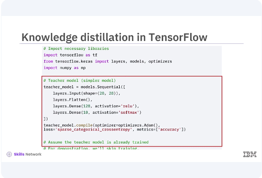

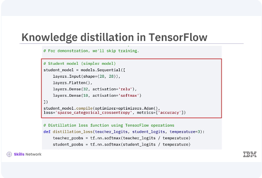

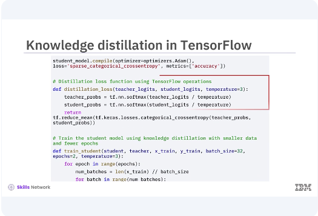

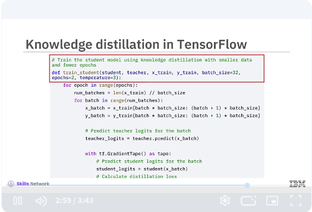

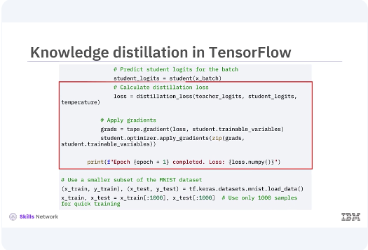

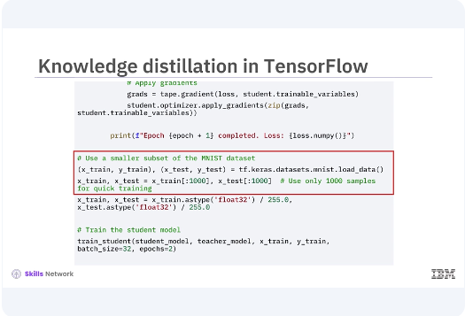

The teacher model is trained to achieve high accuracy on the ​training data. The student model is then trained using the ​outputs, logits, of the teacher model instead of the original labels. This is achieved using ​a softened version of the outputs, controlled by a temperature parameter in the softmax ​function. Train the student model using knowledge ​distillation with smaller data and fewer epochs. Predict teacher logits for the batch using ​tf.GradientTape method. Calculate distillation loss and apply gradients. 
​Use a smaller subset of the MNIST dataset and train the student model. 

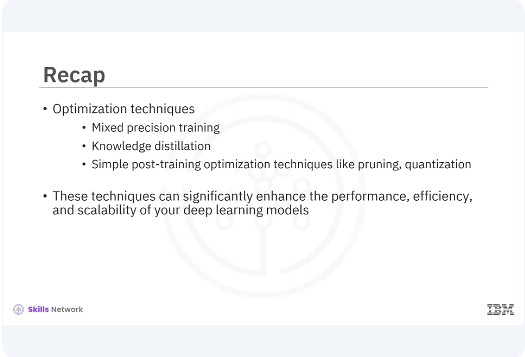

​In this video, you learned, TensorFlow includes several optimization techniques such as mixed ​precision training, knowledge distillation, and simple post-training optimization techniques ​like pruning, quantization, which are supported by the TensorFlow Model ​Optimization Toolkit. These techniques can significantly enhance the performance, ​efficiency, and scalability of your deep learning models. 