# TensorFlow for Unsupervised Learning

​Welcome to this video on ​TensorFlow for unsupervised learning. ​After watching this video, ​you'll be able to explain the use of ​TensorFlow for unsupervised learning tasks. ​Demonstrate how to implement ​a basic unsupervised learning model using TensorFlow. 

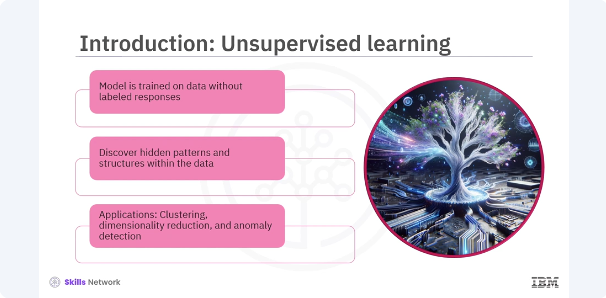

Unsupervised learning is a type of machine learning ​where the model is trained on ​data without labeled responses. ​This approach is essential for discovering ​hidden patterns and structures within the data. ​Common applications include clustering, ​dimensionality reduction, and anomaly detection. ​Let's learn more about unsupervised applications. 

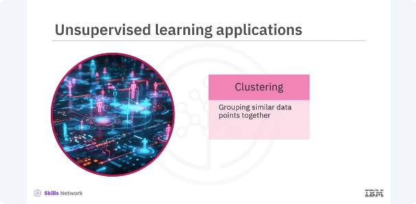

​Clustering involves grouping ​similar data points together. 

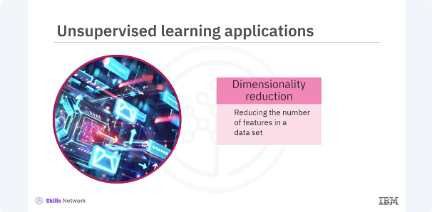

​Dimensionality reduction includes reducing the number of ​features in a dataset ​while retaining important information.

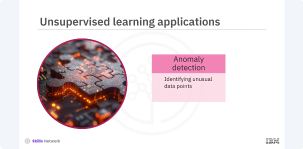
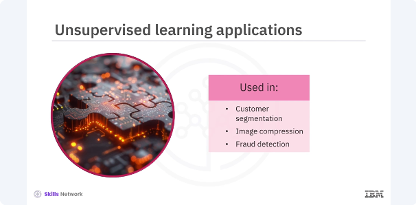

​Anomaly detection involves identifying ​unusual data points that do not fit the general pattern. ​These applications are widely used in ​various domains such as customer segmentation, ​image compression, and fraud detection.

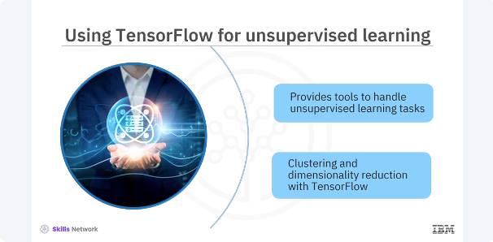

​TensorFlow provides powerful tools ​for implementing unsupervised learning models. ​With its flexible architecture and extensive libraries, ​TensorFlow can handle ​various unsupervised learning tasks efficiently. ​In this section, you will focus on ​clustering and dimensionality reduction using TensorFlow. 

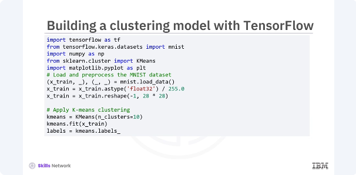

​Let's start by building a basic ​clustering model using TensorFlow. ​You will use the K means algorithm, ​which is a popular clustering technique. ​In this code, you load and pre process the MNIST ​dataset by normalizing the pixel values ​and reshaping the images. ​You then apply the K means clustering ​algorithm to group the images into ten clusters. 

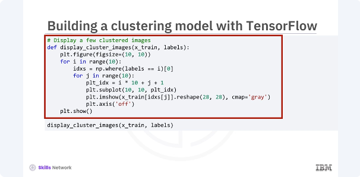
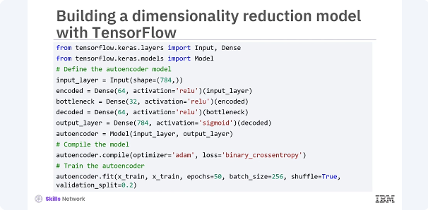

​Finally, you display a few images ​from each cluster to visualize the results. ​Next, you will build an auto encoder ​for dimensionality reduction. ​An auto encoder is a type of neural network used to learn ​efficient representations of data by compressing ​the input into a lower dimensional space ​and reconstructing it back. 
​In this code, you define ​an auto encoder with an input layer, ​an encoding layer, a bottleneck layer, ​a decoding layer, and an output layer. ​The model is trained to reconstruct ​the input data from its compressed representation. ​This process effectively reduces ​the dimensionality of the data. 

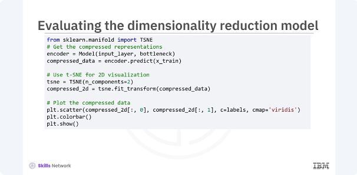

After training the Auto encoder, ​you evaluate its performance by ​visualizing the compressed representations. ​Let's plot the two D representation of the data. ​In this code, you extract ​the compressed representations from ​the bottleneck layer of the auto encoder. ​You then use the TSNE, ​a technique for visualizing ​high dimensional data and 2D to plot the compressed data. 
​The resulting scatter plot shows how ​the data points are grouped ​in the lower dimensional space.

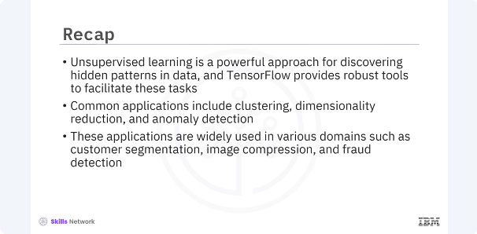

​In this video, you learned that. ​Unsupervised learning is a powerful approach ​for discovering hidden patterns and data, ​and TensorFlow provides robust tools ​to facilitate these tasks. ​Common applications include clustering, ​dimensionality reduction, and anomaly detection. ​These applications are widely used in ​various domains such as customer segmentation, ​image compression, and fraud detection.