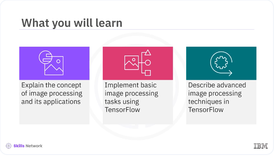
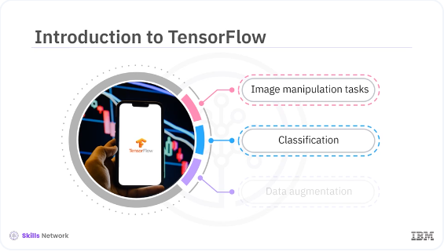
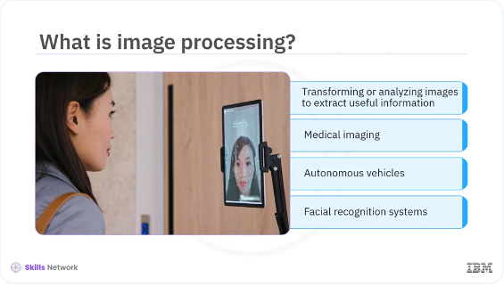
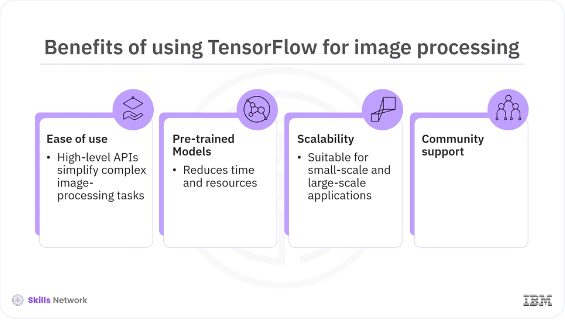

# Tensorflow for Image Processing




Welcome to this video on ​image processing, using TensorFlow. ​After watching this video, ​you'll be able to: ​explain the concept of ​image processing and its applications, ​implement basic image processing tasks using TensorFlow, ​describe advanced image ​processing techniques in TensorFlow. 



​TensorFlow is a powerful library that ​enables various image manipulation tasks, ​including classification, data augmentation, ​and more advanced techniques. ​Image processing is an essential part ​of computer vision applications, ​and TensorFlow offers comprehensive tools ​to handle these tasks efficiently.



​Image processing involves transforming or ​analyzing images to extract useful information. ​It is widely used in various applications ​such as medical imaging, ​autonomous vehicles, and facial recognition systems. ​TensorFlow provides ​robust capabilities for image processing, ​making it easier to develop ​and deploy computer vision models. 
​



Using TensorFlow for image processing ​offers several benefits: Ease of use. ​TensorFlow's high level APIs simplified ​the implementation of complex image processing tasks. ​Pre-trained models: Access to a variety of ​pre-trained models reduces the time and ​computational resources required for training. ​Scalability: TensorFlow's ability to run on ​multiple platforms makes it suitable for ​both small scale and large scale applications. ​Community support: A large community of developers, ​and extensive documentation, ​provide valuable resources and support.

```bash
pyenv activate venv3.10.4
```

```python
import tensorflow as tf
from tensorflow.keras.preprocessing.image import ImageDataGenerator, img_to_array, load_img

# Load and preprocess the image
img = load_img('/home/bbearce/Documents/code-journal/docs/journal_image.jpg', target_size=(224, 224))
img_array = img_to_array(img)
img_array = tf.expand_dims(img_array, 0)  # Add batch dimension

# Display the original image
import matplotlib.pyplot as plt
plt.imshow(img)
plt.show()
```


​Let's start with some basic image ​processing tasks using TensorFlow. ​You will load and pre-process an image, ​then apply a few common transformations. 


```python
datagen = ImageDataGenerator(
    rotation_range=40,
    width_shift_range=0.2,
    height_shift_range=0.2,
    shear_range=0.2,
    zoom_range=0.2,
    horizontal_flip=True,
    fill_mode='nearest'
)

img = load_img('/home/bbearce/Documents/code-journal/docs/journal_image.jpg')
x = img_to_array(img)
x = x.reshape((1,) + x.shape)

i = 0
for batch in datagen.flow(x, batch_size=1):
    plt.figure(i)
    imgplot = plt.imshow(tf.keras.preprocessing.image.array_to_img(batch[0]))
    i += 1
    if i % 4 == 0:
        break

plt.show()
```
​In the example, this code loads the image and ​resizes it to 224 by 224 pixels. ​This code converts the image to a NumPy array. ​This code adds a batch dimension, ​which is necessary for model predictions. ​Data augmentation is a technique to increase ​the diversity of your training data ​by applying random transformations. ​This helps improve the robustness ​and performance of your models. ​In this example, the code configures ​the augmentation parameters such as rotation, ​shift, shear, zoom, and flip. ​This code generates batches of augmented images. 

​In this video you learned, ​TensorFlow is a powerful library that ​enables various image manipulation tasks, ​including classification, data augmentation, ​and more advanced techniques. ​Image processing involves transforming or ​analyzing images to extract useful information. ​It is widely used in ​various applications such as medical imaging, ​autonomous vehicles, and facial recognition systems. ​TensorFlow's high level APIs simplify ​the implementation of complex image processing tasks. 