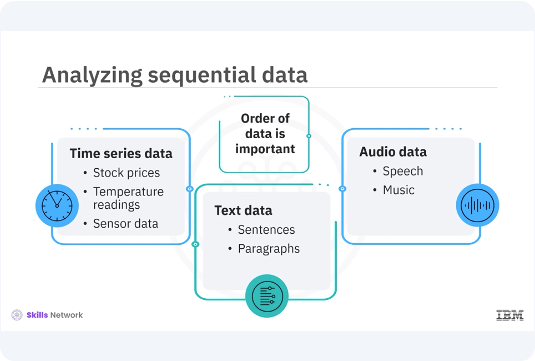
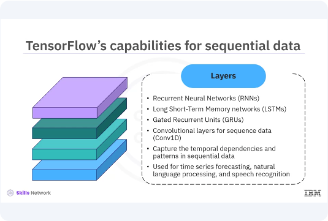
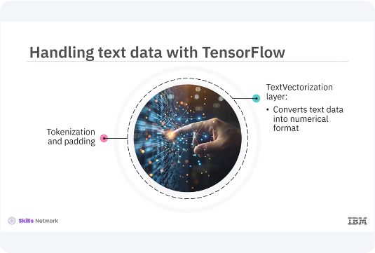
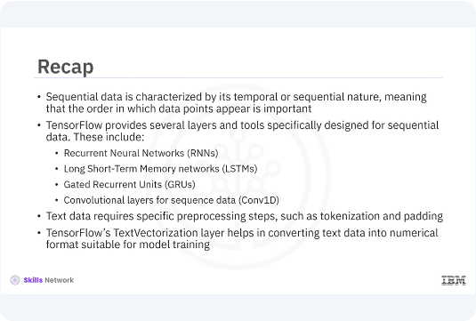

# Tensorflow for Sequential Data


​Welcome to this video on how to ​develop TensorFlow for sequential data. ​After watching this video, ​you'll be able to:

* Describe ​TensorFlow's capabilities for handling sequential data.   
* ​Demonstrate how TensorFlow can be used to ​process and analyze sequential data with examples. 


​Sequential data, such as time series, text, ​and audio, is a type of data ​where the order of the data points is crucial. ​TensorFlow offers a range ​of tools and functionalities that ​makes it well-suited for ​processing and analyzing sequential data. 




​Sequential data is characterized by ​its temporal or sequential nature, ​meaning that the order in which ​the data points appear is important. ​Examples include time series data ​like stock prices, temperature readings, ​and sensor data, text data, ​like sentences and paragraphs, ​and audio data, like speech and music. 
​Analyzing and making predictions on such data requires ​models that can capture ​the dependencies and patterns within the sequences. 



​TensorFlow provides several layers and ​tools specifically designed for sequential data. ​These include recurrent neural networks, ​RNNs, long short-term memory networks, ​LSTMs, gated recurrent units, ​GRUs, convolutional layers for sequence data, Conv1D. ​These patterns help in capturing ​the temporal dependencies and ​patterns in sequential data, ​making TensorFlow a powerful framework ​for tasks like time series forecasting, ​natural language processing, and speech recognition. 


​Let's start by building ​a simple RNN model using TensorFlow. ​You will use a time series data set and ​create an RNN model to predict future values. ​The model will consist of ​an RNN layer followed by ​a dense layer for output prediction. 

```bash
pyenv activate venv3.10.4
```

```python
import tensorflow as tf
from tensorflow.keras.models import Sequential
from tensorflow.keras.layers import SimpleRNN, Dense

# Generate some example sequential data
import numpy as np

# Create a simple sine wave dataset
def create_sine_wave_dataset(seq_length=100):
    x = np.linspace(0, 50, seq_length)
    y = np.sin(x)
    return y

data = create_sine_wave_dataset()
time_steps = np.arange(len(data))

# Prepare the dataset
def prepare_data(data, time_steps, time_window):
    X, Y = [], []
    for i in range(len(data) - time_window):
        X.append(data[i:i + time_window])
        Y.append(data[i + time_window])
    return np.array(X), np.array(Y)

time_window = 10
X, Y = prepare_data(data, time_steps, time_window)
```

​In this example, first generate ​a simple sine wave data set for ​demonstration and define its dimensions. ​Then prepare the data set by ​creating sequences and corresponding labels. 

```python
# Reshape the data to match RNN input shape
X = X.reshape(X.shape[0], X.shape[1], 1)

# Build the RNN model
model = Sequential([
    SimpleRNN(50, activation='relu', input_shape=(time_window, 1)),
    Dense(1)
])
```

​Now build an RNN model using TensorFlows, ​simple RNN, and dense layers.

```python
# Compile the model
model.compile(optimizer='adam', loss='mse')

# Train the model
model.fit(X, Y, epochs=20, batch_size=16)

# Make predictions
predictions = model.predict(X)

# Plot the results
import matplotlib.pyplot as plt

plt.plot(time_steps, data, label='True Data')
plt.plot(time_steps[time_window:], predictions, label='Predictions')
plt.xlabel('Time Steps')
plt.ylabel('Value')
plt.legend()
plt.show()
```

​Finally, compile and train the model. ​Make predictions, and plot the results. ​

```python
from tensorflow.keras.layers import LSTM

# Build the LSTM model
lstm_model = Sequential([
    LSTM(50, activation='relu', input_shape=(time_window, 1)),
    Dense(1)
])

# Compile the model
lstm_model.compile(optimizer='adam', loss='mse')

# Train the model
lstm_model.fit(X, Y, epochs=20, batch_size=16)

# Make predictions
lstm_predictions = lstm_model.predict(X)


# Plot the results
import matplotlib.pyplot as plt

plt.plot(time_steps, data, label='True Data')
plt.plot(time_steps[time_window:], lstm_predictions, label='LSTM Predictions')
plt.xlabel('Time Steps')
plt.ylabel('Value')
plt.legend()
plt.show()
```

Now, let's build an LSTM model. ​LSTMs are a type of RNN ​that are capable of learning long-term dependencies, ​making them suitable for sequential data ​with long-term patterns. 
​You will use the same data set and ​structure the model similar to your RNN model, ​but with LSTM layers. ​In this example, replace ​the simple RNN layer with ​an LSTM layer to build the LSTM model. ​Next, compile and train the LSTM model. ​Finally, make predictions and plot ​the results to compare with the true data. 



​Next, let's see how TensorFlow ​can be used to handle text data. ​Text data requires specific pre-processing steps ​such as tokenization and padding. ​TensorFlow's text vectorization layer helps in ​converting text data into ​numerical format suitable for model training. 

```python
from tensorflow.keras.layers import TextVectorization

# Sample text data
texts = [
    "Hello, how are you?",
    "I am fine, thank you.",
    "How about you?",
    "I am good too."
]

# Define the TextVectorization layer
vectorizer = TextVectorization(
    output_mode='int',
    max_tokens=100,
    output_sequence_length=10
)

# Adapt the vectorizer to the text data
vectorizer.adapt(texts)

# Vectorize the text data
text_vectorized = vectorizer(texts)

print("Vectorized text data:\n", text_vectorized.numpy())
```

​In this example, first, ​define sample text data. ​Then create a text vectorization layer ​to tokenize and pad the text sequences. ​Finally, adapt the vectorizer to ​the text data and transform ​the text into numerical format. 



​In this video, you learned ​sequential data is characterized ​by its temporal or sequential nature, ​meaning that the order in which ​the data points appear is important. ​TensorFlow provides several layers and ​tools specifically designed for sequential data. ​These include recurrent neural networks, ​RNNs, long short-term memory networks, ​LSTMs, gated recurrent units, ​GRUs, convolutional layers for sequence data, Conv1D. ​Text data requires specific pre-processing steps ​such as tokenization and padding. 
​TensorFlow's text vectorization layer helps in ​converting text data into ​numerical format suitable for model training. 