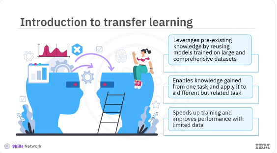
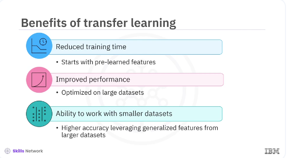

# Transfer Learning



Welcome to this video on transfer learning in Keras. ​After watching this video, ​you'll be able to explain ​the concept of transfer learning and its benefits, ​implement transfer learning using ​pre-trained models in Keras. ​Transfer learning has revolutionized ​the field of machine and deep learning. ​It leverages pre-existing knowledge by reusing ​models trained on large and comprehensive datasets. ​This concept mirrors how humans use ​prior knowledge to solve new problems more efficiently. ​For instance, if you know how to play the piano, ​learning to play the organ becomes ​easier because of the shared principles. ​Similarly, transfer learning allows ​you to use the knowledge ​gained from one task and apply ​it to a different but related task, ​which can significantly speed ​up training and improve performance, ​especially when you have limited data. 


​Transfer learning involves taking a pre-trained model, ​usually trained on a large dataset like ​ImageNet and fine-tuning it on a new dataset. ​The pre-trained model has already ​learned valuable features from its original training, ​which can be transferred to the new task. ​In practice, a model like ​VGG16 trained on millions of images, ​learns to identify edges, ​textures, shapes, and other general features. ​These learned features can be handy ​for other image classification tasks. ​By reusing the convolutional base of the VGG16 model, ​you can save time and computational resources ​while achieving high accuracy in your new tasks. 



​The benefits of transfer learning include ​reduced training time because ​the model starts with the pre-learned features. ​It requires significantly less time ​to converge than training from scratch. ​Improved performance as pre-trained models ​have been optimized on large datasets, ​which usually results in better performance on new tasks. ​Even with limited data, ​ability to work with smaller datasets, ​transfer learning allows you ​to achieve high accuracy with ​smaller datasets by leveraging ​the generalized features learned from larger datasets. ​These advantages make transfer learning ​particularly valuable when data ​is limited and expensive to collect. ​It also enables practitioners to build ​powerful models without requiring ​extensive computational resources. 

```bash
pyenv activate venv3.10.4
```

```python
# !pip install --upgrade tensorflow numpy Pillow

import sys
import os
from tensorflow.keras.applications import VGG16
from tensorflow.keras.models import Sequential
from tensorflow.keras.layers import Dense, Flatten
from tensorflow.keras.preprocessing.image import ImageDataGenerator
from PIL import Image
import numpy as np

# Increase recursion limit (temporary solution)
sys.setrecursionlimit(10000)

# Ensure the dataset directory exists and generate sample data if needed
def generate_sample_data():
    path = '/home/bbearce/Documents/code-journal/docs/notes/data_science/Coursera/Keras_and_Tensorflow/training_data'
    os.makedirs(os.path.join(path, 'class_1'), exist_ok=True)
    os.makedirs(os.path.join(path, 'class_2'), exist_ok=True)
    for i in range(10):
        img = Image.fromarray(
            np.random.randint(0, 255, (224, 224, 3), dtype=np.uint8)
        )
        img.save(os.path.join(path, 'class_1', 'img_{i}.jpg'))
        img.save(os.path.join(path, 'class_2', 'img_{i}.jpg'))
        # img.save(f'/content/training_data/class_2/img_{i}.jpg')


# Generate sample data (uncomment if you need to generate data)
generate_sample_data()

# Load the VGG16 model pre-trained on ImageNet
base_model = VGG16(weights='imagenet', include_top=False,
                   input_shape=(224, 224, 3))

```

​Let's implement transfer learning ​using a pre-trained model in Keras. ​You will use the VGG16 model, ​which you have pretrained on ​the ImageNet dataset and fine-tune it to a new dataset. ​Here is the explanation of the code. 

​First, you import the VGG model pretrained ​from the tensorflow.keras.applications module. ​Then import sequential, a linear stack of ​layers from the tensorflow.keras.models module. ​Import dense and flatten layers ​from the tensorflow.keras.layers module. ​Import image data generator, ​a utility for image data augmentation and preprocessing ​from the tensorflow.keras.preprocessing.image module. ​The following line of code loads ​the VGG16 model pretrained on the ImageNet dataset. ​The line includes top=False, ​excludes the top fully connected layers ​of the VGG16 model. ​This exclusion allows you to add ​your custom layers for the specific task. 

​The line input_shape= (224, 224, ​3) specifies the input shape of the images, ​224 by 224 pixels with three color channels. ​The loop iterates through all layers of ​the base model and sets ​their trainable attribute to false. 


```python
# Freeze the base model layers
for layer in base_model.layers:
    layer.trainable = False

# Create a new model and add the base model and new layers
model = Sequential([
    base_model,
    Flatten(),
    Dense(256, activation='relu'),
    Dense(1, activation='sigmoid')  # Change to the number of classes you have
])

# Compile the model
model.compile(optimizer='adam', loss='binary_crossentropy',
              metrics=['accuracy'])

```


​The line layer.trainable = False, ​freezes the weights of ​the base model layers so ​that they are not updated during training. ​This freezing is useful when using the model as ​a feature extractor and to ​retain the learned features from the ImageNet dataset. ​The following code line creates a new sequential model, ​a linear stack of layers. ​The line base_model adds ​the pre-trained VGG16 base model as the first layer. ​The following line flattens ​the output from the base layer to a 1D array. 
​The Dense(256, activation= ' relu ' ), ​adds a fully connected layer with ​256 units and ReLU activation. ​The line Dense(1, ​activation= ' sigmoid ' ), ​adds a fully connected output layer with one unit ​and Sigmoid activation for binary classification. ​If there are more classes, ​you can change this to match the number of ​classes and use a softmax activation instead. ​The following line of code optimizer= ' ​adam ' uses the Adam optimizer for training. ​The line loss= 'binary_crossentropy ', ​uses binary cross-entropy as the loss function, ​which is suitable for binary classification tasks. ​The next line, metrics= [ 'accuracy ' ], ​evaluates the model using ​accuracy as the performance metric. ​

```python
# Load and preprocess the dataset
train_datagen = ImageDataGenerator(rescale=1./255)
train_generator = train_datagen.flow_from_directory(
    '/home/bbearce/Documents/code-journal/docs/notes/data_science/Coursera/Keras_and_Tensorflow/training_data',
    target_size=(224, 224),
    batch_size=32,
    class_mode='binary'
)

# Train the model
model.fit(train_generator, epochs=10)
```

The ​code ​ImageDataGenerator(rescale=1./255) creates an instance ​of image data generator that rescales ​the image's pixel values to ​the range 0,1 by dividing 255. 
​The line train_datagen.flow_from_directory provides ​the path to the training data's directory. ​The directory should have subdirectories for each class, ​such as house pets would be the directory, ​and the subdirectory would be cats and dogs. ​The line target_size= (224, ​224) resizes all the images to 224 by 224 pixels. ​The next line, ​batch_size=32 processes images in batches of 32. ​The line class_mode= ' ​binary ' specifies the binary classification mode. ​Finally, the train_generator is ​the data generator for ​the training data that trains the model for 10 epochs. ​In addition to using ​the pre-trained model as a feature extractor, ​you can fine-tune some layers ​to adapt them to the new task. 

```python
# Unfreeze the top layers of the base model
for layer in base_model.layers[-4:]:
    layer.trainable = True

# Compile the model again
model.compile(optimizer='adam', 
              loss='binary_crossentropy',
              metrics=['accuracy'])

# Train the model again
model.fit(train_generator, epochs=10)
```


​Let's see how to fine-tune ​the top layers of the pre-trained model. ​In the code, layer_trainable = ​True unfreezes the top four layers of the base model. ​The next code, model.compile(optimizer= ' adam ', ​loss= 'binary_crossentropy ', ​metrics=[ ' accuracy ' ], recompiles the model. ​Finally, model.fit(train_generator, ​epochs=10) trains the model again for 10 epochs. 


​In this video, you learned, ​the concept of transfer learning was demonstrated and ​the implementation was done ​using pre-trained models in Keras. ​Leveraging pre trained models can significantly ​reduce training time and improve performance, ​especially when working with limited data. ​Transfer learning helps achieve ​higher accuracy and enables ​advanced models in real-world applications where ​data collection can be a significant challenge, ​such as medical imaging, ​natural language processing, and more. 
​Its ability to utilize pre-trained models for ​new tasks makes it an essential ​technique for machine learning practitioners. 