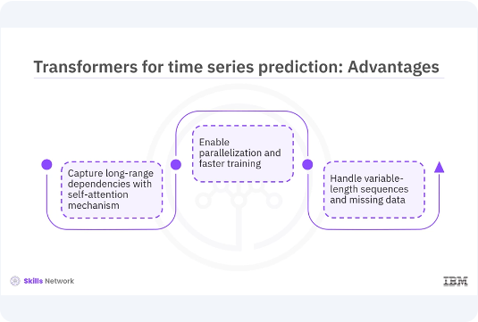
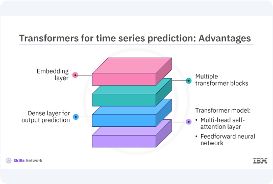
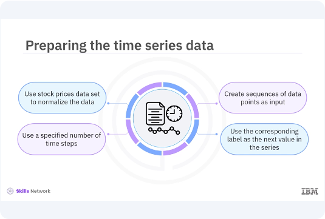
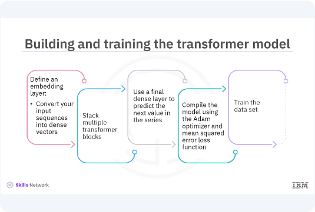

# Transformers for Time Series Predictions



​Welcome to this video on developing ​transformers for time series prediction. ​After watching this video, you'll be able to, ​explain the concept of using ​transformers for time series prediction. ​Explain how transformers can capture ​long-term dependencies and sequential data. ​Describe how to build and train ​a transformer model for ​time series prediction using Keras. ​Time series data is a sequence of ​data points collected or ​recorded at successive points in time. ​Traditional methods like auto ​regressive integrated moving average, ARIMA, ​and more recent methods like ​recurrent neural network, RNN, ​and long short term memory, ​LSTM, have been widely used for time series prediction. ​However, transformers have shown great promise in ​capturing long term dependencies in sequential data, ​making them highly effective for time series forecasting. 

​Let's dive into how transformers ​can be applied to this domain. ​Transformers offer several advantages ​over traditional models for time series prediction. ​Their self attention mechanism allows them to ​capture long range dependencies more effectively. ​Unlike RNNs and LSTMs, ​transformers process the entire sequence at once, ​enabling parallelization and faster training. ​Moreover, transformers can handle ​variable length sequences and ​missing data more gracefully. ​These attributes make transformers a ​powerful tool for time series forecasting. ​




Let's build a transformer model ​for time series prediction. 
​You will use Keras to define your model. ​The key components of your model ​will include an embedding layer, ​multiple transformer blocks, and ​a final dense layer for output prediction. ​You will start by defining the transformer block, ​which consists of a multi head self attention layer ​and a feed forward neural network.

```bash
pyenv activate venv3.10.4
```

```python
import tensorflow as tf
from tensorflow.keras.layers import Layer, Dense, LayerNormalization, Dropout

class TransformerBlock(Layer):
    def __init__(self, embed_dim, num_heads, ff_dim, rate=0.1):
        super(TransformerBlock, self).__init__()
        self.att = tf.keras.layers.MultiHeadAttention(
            num_heads=num_heads,
            key_dim=embed_dim
        )
        self.ffn = tf.keras.Sequential([
            Dense(ff_dim, activation="relu"),
            Dense(embed_dim),
        ])
        self.layernorm1 = LayerNormalization(epsilon=1e-6)
        self.layernorm2 = LayerNormalization(epsilon=1e-6)
        self.dropout1 = Dropout(rate)
        self.dropout2 = Dropout(rate)
    def call(self, inputs, training, mask=None):
        attn_output = self.att(inputs, inputs, inputs, attention_mask=mask)
        attn_output = self.dropout1(attn_output, training=training)
        out1 = self.layernorm1(inputs + attn_output)
        ffn_output = self.ffn(out1)
        ffn_output = self.dropout2(ffn_output, training=training)
        return self.layernorm2(out1 + ffn_output)
```

​In this example, the transformer block class defines ​the transformer block with ​multi head self attention and feed forward layers. ​The code method applies self attention and feed ​forward layers with residual connections ​and layer normalization. 



​Before training your transformer model, ​you need to prepare your time series data. ​You will use a stock prices ​dataset and normalize the data. 
​Then you will create sequences of ​data points to be used as input for your model. ​Each sequence will contain ​a specified number of time steps, ​and the corresponding label ​will be the next value in the series.

```python
import numpy as np
import pandas as pd
from sklearn.preprocessing import MinMaxScaler

# Create a synthetic stock price dataset
np.random.seed(42)
data_length = 2000  # Adjust data length as needed
trend = np.linspace(100, 200, data_length)
noise = np.random.normal(0, 2, data_length)
synthetic_data = trend + noise

# Create a DataFrame and save as 'stock_prices.csv'
data = pd.DataFrame(synthetic_data, columns=['Close'])
data.to_csv('stock_prices.csv', index=False)
print("Synthetic stock_prices.csv created and loaded.")


# Load the data set
data = pd.read_csv('stock_prices.csv')
data = data[['Close']].values

# Normalize the data
scaler = MinMaxScaler(feature_range=(0, 1))
data = scaler.fit_transform(data)


# Prepare the data for training
def create_dataset(data, time_step=1):
    X, Y = [], []
    for i in range(len(data) - time_step - 1):
        a = data[i:(i + time_step), 0]  # slice a sequence from data
        X.append(a)  # append the sequence to X
        Y.append(data[i + time_step, 0])  # append the next value to Y
    return np.array(X), np.array(Y)

time_step = 60
X, Y = create_dataset(data, time_step)

# Print to debug and understand the shapes
print("Length of data:", len(data))
print("Length of X:", len(X))
print("Shape of first element in X:", X[0].shape if len(X) > 0 else "X is empty")
print("Shape of Y:", Y.shape)

# Reshape X to fit LSTM input shape requirements (if X is not empty)
if len(X) > 0:
    X = X.reshape(X.shape[0], X.shape[1], 1)
    print("Shape of X after reshape:", X.shape)

print("Shape of X:", X.shape)
print("Shape of Y:", Y.shape)
```

​In this data preparation example, ​you need to load the dataset ​and select the closed prices. ​Then normalize the data using min max scaler. ​Create sequences of data points ​and corresponding labels for training. ​Print the output to debug ​the missing values and understand the shapes. ​Now that you have prepared your data, ​let's build and train your transformer model. 





​You will define an embedded layer to convert ​your input sequences into dense vectors. ​Then you will stack multiple transformer blocks ​followed by a final dense layer ​to predict the next value in the series. ​You will compile the model using the atom optimizer and ​mean squared error loss function ​and train it on your prepared dataset. 

```python
from tensorflow.keras.models import Model
from tensorflow.keras.layers import Input, Dense, Flatten, Embedding

# Define the Transformer model
input_shape = (X.shape[1], X.shape[2])
inputs = Input(shape=input_shape)

# Embedding layer
x = Dense(128)(inputs)

# Transformer blocks
for _ in range(4):
    x = TransformerBlock(embed_dim=128, num_heads=4, ff_dim=512)(x)

# Output layer
x = Flatten()(x)
outputs = Dense(1)(x)

# Create the model
model = Model(inputs, outputs)

# Compile the model
model.compile(optimizer='adam', loss='mse')

# Train the model
model.fit(X, Y, epochs=20, batch_size=32)
```

​In this code example, ​you need to define the input shape and embedding ​layer to convert input sequences into dense vectors. ​Then stack multiple transformer blocks. ​Add a final dense layer to ​predict the next value in the series. ​Compile the model using ​the atom optimizer and mean squared arrow loss function. ​Train the model on the prepared dataset. ​

```python
from keras.models import Sequential
from keras.layers import LSTM, Dense

from matplotlib import pyplot as plt

# Define the model
model = Sequential()
model.add(LSTM(50, return_sequences=True, input_shape=(time_step, 1)))
model.add(LSTM(50, return_sequences=False))
model.add(Dense(1))

# Compile the model
model.compile(optimizer='adam', loss='mean_squared_error')

# Train the model
model.fit(X, Y, epochs=10, batch_size=32)

# Make predictions
predictions = model.predict(X)

# Inverse transform the predictions to get the original scale
predictions = scaler.inverse_transform(predictions)

# Plot the predictions
plt.plot(scaler.inverse_transform(data), label='True Data')
plt.plot(np.arange(time_step, time_step + len(predictions)), predictions,
         label='Predictions')
plt.xlabel('Time')
plt.ylabel('Stock Prices')
plt.legend()
plt.show()
```

After training your transformer model, ​you need to evaluate its ​performance and make predictions. ​You will use the trained model to predict ​future values in the time series ​and visualize the results. ​Use the trained model to make ​predictions on the input sequences. ​Inverse transform the predicted ​values to the original scale. ​Plot the true data and ​predictions to visualize the model's performance.


​In this video, you learned time series data is ​a sequence of data points collected ​or recorded at successive points in time. ​By leveraging the self attention mechanism, ​transformers can effectively capture ​long term dependencies in time series data, ​making them a powerful tool for forecasting. ​The key components of the transformer model ​include an embedding layer, ​multiple transformer blocks, and ​a final dense layer for output prediction. 