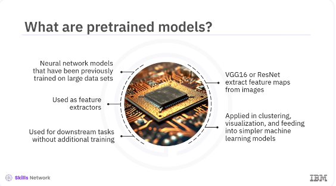
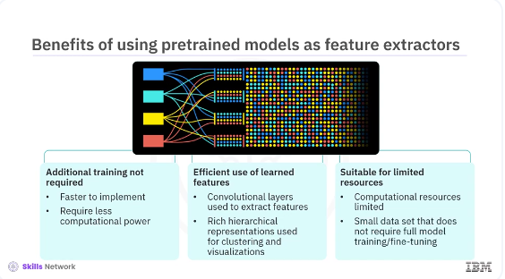
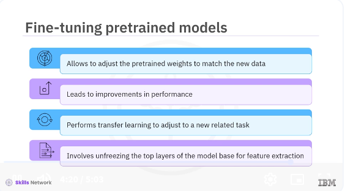

# Using Pre-trained Models


​Welcome to this video on using pretrained models. ​After watching this video, ​you'll be able to use ​pretrained models as feature extractors in Keras for ​various tasks and list the benefits and ​limitations of using pretrained models ​as fixed feature extractors.




​Pretrained models are neural network models that ​have been previously trained on large datasets, ​such as ImageNet, to learn ​useful features that can be leveraged in new tasks. ​However, instead of fine-tuning ​these models for new tasks, ​we can use them directly as feature extractors. ​This approach involves using the pretrained model ​to extract high-level features from new data, ​which can then be used for ​various downstream tasks without additional training. ​For example, ImageNet trained models like VGG16 or ​ResNet are used to extract ​feature maps from images that can be applied in tasks, ​such as clustering, visualization, ​or feeding into simpler machine learning models. ​This method is beneficial when you want to utilize ​the powerful feature extraction capabilities of ​these models without modifying ​the original weights through retraining. 




​Using pretrained models as ​feature extractors offer several unique benefits, ​including additional training is not required. ​Since the model is used as ​a feature extractor without any retraining, ​it is faster to implement and ​requires significantly less computational power. ​Efficient use of learned features. ​The pretrained model's convolutional layers, ​which are used to extract features, ​capture rich hierarchical representations that can be ​utilized for various tasks ​like clustering or visualizations. ​Suitable for limited resources. ​This approach is ideal when ​computational resources are limited or when ​the new task does not have ​sufficiently large dataset to ​justify full model training or fine-tuning. ​Let's see how to use a pretrained model in ​Keras specifically for feature extraction.


```bash
pyenv activate venv3.10.4
cd /home/bbearce/Documents/code-journal/docs/notes/data_science/Coursera/Keras_and_Tensorflow
```

```python
import os
import shutil
from PIL import Image
import numpy as np

# Define the base directory for sample data
base_dir = 'sample_data'
class1_dir = os.path.join(base_dir, 'class1')
class2_dir = os.path.join(base_dir, 'class2')

# Create directories for two classes
os.makedirs(class1_dir, exist_ok=True)
os.makedirs(class2_dir, exist_ok=True)

# Function to generate and save random images
def generate_random_images(save_dir, num_images):
    for i in range(num_images):
        # Generate a random RGB image of size 224x224
        img = Image.fromarray(np.uint8(np.random.rand(224, 224, 3) * 255))
        # Save the image to the specified directory
        img.save(os.path.join(save_dir, f'image_{i}.jpg'))

# Number of images to generate for each class
num_images_per_class = 100  # You can increase this to have more training data

# Generate random images for class 1 and class 2
generate_random_images(class1_dir, num_images_per_class)
generate_random_images(class2_dir, num_images_per_class)

print(f'Sample data generated at {base_dir} with {num_images_per_class} images per class.')
```

​We will load a pretrained model such as VGG16 and ​use it to extract features from ​a new dataset without any additional training. ​Let's see the example. 

​First, you need to create ​the sample data using this code snippet. ​Create directories for two classes, one and two. ​Define a function to generate random images. 

​Then save the images to the specified directories, ​and finally generate the images for the two classes. ​This sample data will be used in the pretrained model. 

```python
from tensorflow.keras.applications import VGG16
from tensorflow.keras.models import Sequential
from tensorflow.keras.layers import Dense, Flatten
from tensorflow.keras.preprocessing.image import ImageDataGenerator
from tensorflow.keras.optimizers import Adam

# Load the VGG16 model pre-trained on ImageNet
base_model = VGG16(weights='imagenet',
                   include_top=False, input_shape=(224, 224, 3))

# Freeze all layers initially
for layer in base_model.layers:
    layer.trainable = False

# Create a new model and add the base model and new layers
model = Sequential([
    base_model,
    Flatten(),
    Dense(256, activation='relu'),
    Dense(1, activation='sigmoid')
# Change to the number of classes you have
])
```
​This example demonstrates how ​to use pretrained models strictly for ​extracting features that can be applied ​to downstream tasks like clustering, ​visualization, or dimensionality reduction. ​First, load the VGG16 model pretrained on ImageNet, ​excluding the top fully connected layers with ​an input_shape of 224 by 224 by 3. ​The flatten method flattens the output of the base model. ​The dense layer adds a fully connected layer with ​256 units and relu activation. ​The next dense layer adds ​a fully connected output layer with ​one unit and sigmoid activation. ​

```python

# Compile the model
model.compile(
    optimizer=Adam(learning_rate=0.001),
    loss='binary_crossentropy',
    metrics=['accuracy']
)

```
The model compile method compiles the model with ​the Adam optimizer and binary_crossentropy loss. 


```python
# Load and preprocess the dataset
train_datagen = ImageDataGenerator(rescale=1./255)
train_generator = train_datagen.flow_from_directory(
    'sample_data',
    target_size=(224, 224),
    batch_size=32,
    class_mode='binary'
)

# Train the model with frozen layers
model.fit(train_generator, epochs=10)

```

​ImageDataGenerator rescales the image ​pixel values to zero, one. 
​The flow_from_directory method loads and ​pre-processes the training data from a directory. ​Specifically, it reads images ​from the sample data directory, ​resizes them to 224 by 224 pixels, ​processes them in batches of 32, ​and expect binary class labels. ​The model.fit method trains the model for 10 epochs. 

```python
# Gradually unfreeze layers and fine-tune
for layer in base_model.layers[-4:]:  # Unfreeze the last 4 layers
    layer.trainable = True

# Compile the model again with a lower learning rate for fine-tuning
model.compile(optimizer=Adam(learning_rate=0.0001),
              loss='binary_crossentropy', metrics=['accuracy'])

# Fine-tune the model
model.fit(train_generator, epochs=10)
```

​Finally, fine-tuning involves ​unfreezing a few of the top layers of ​the frozen model base used for feature extraction and ​jointly training the newly added part ​of the model and the top layers. ​This step-by-step process demonstrates how easy it is to ​integrate pretrained models into ​your workflow using Keras. ​By doing so, you can leverage ​the powerful feature extraction capabilities ​of models like VGG16, ​which have been trained on extensive datasets.




​Fine-tuning allows the model to adjust ​the pretrained weights to match the new data better. 
​This fine-tuning can lead to ​significant improvements in performance, ​particularly when the new dataset differs ​considerably from the original dataset ​on which the model was trained. ​By fine-tuning, you are performing transfer learning. ​Transfer learning involves adjusting ​a pretrained model to a new related task. ​This adjustment is especially ​useful in scenarios where you ​do not have enough data to train ​a deep learning model from the outset. ​Fine-tuning involves unfreezing a few ​of the top layers of the frozen model base ​used for feature extraction and jointly training ​the newly added part of the model and the top layers. ​This training can greatly improve ​model performance when the new task ​is like the original task, ​but has some differences. 


​In this video, you learned that you can use ​a pretrained model as ​a feature extractor and fine-tune it for a new task. 
​By leveraging pretrained models, ​you can significantly improve the performance ​of your models with less data and training time. ​By using models trained on large datasets, ​you can leverage the learned features to ​improve the performance of your models. ​Fine-tuning pretrained models allows you ​to adapt the model to your specific task, ​leading to an even better performance. 