# Building a CNN Classifier

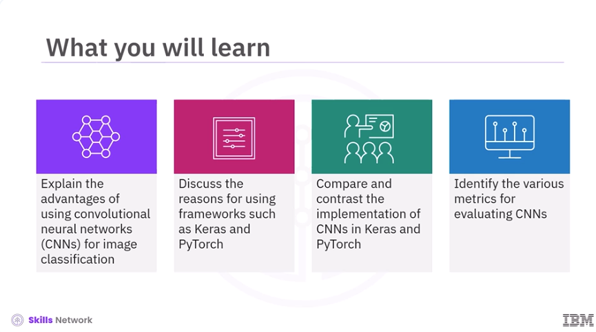

​Welcome to Building a CNN Classifier. ​After watching this video, you'll be able to explain the advantages of using convolutional ​neural networks, CNNs, for image classification, discuss the reasons for using frameworks such ​as Keras and PyTorch, compare and contrast the implementation of CNNs in Keras and PyTorch, ​and identify the various metrics for evaluating CNNs.

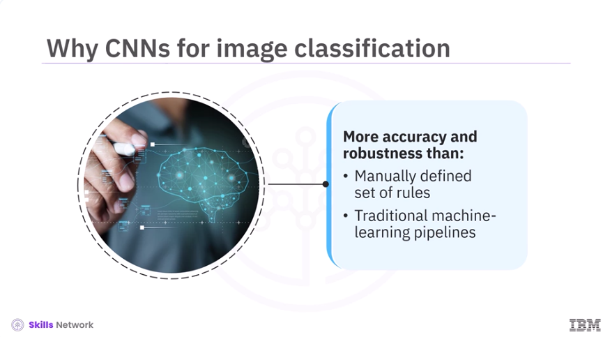

​For image classification tasks, CNNs offer greater accuracy and robustness than any other ​manually defined set of rules or traditional machine learning pipelines. 

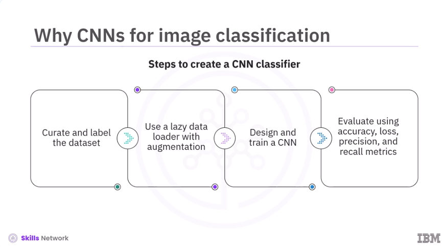

​To create a CNN classifier, first, curate and label the dataset. ​Then use a lazy data loader with on-the-fly augmentation. ​Next, design and train a CNN. ​And finally, evaluate with accuracy, loss, precision, and recall metrics. 

!`Images/Building_a_CNN_Classifier/Building_a_CNN_Classifier_4.png`(Images/Building_a_CNN_Classifier/Building_a_CNN_Classifier_4.png)

​The most widely used framework for implementing CNNs are Keras and PyTorch. ​These frameworks take care of the low-level tensor operations, gradient calculations, ​and graphic processing unit GPU management. ​This allows you to focus on architecture and experimentation instead of writing the back ​propagation mathematics. ​Secondly, they embed decades of optimization research that would be difficult to replicate ​in custom code. ​This includes efficient GPU kernels, automatic differentiation, mixed-precision arithmetic, ​and distributed training routines. 

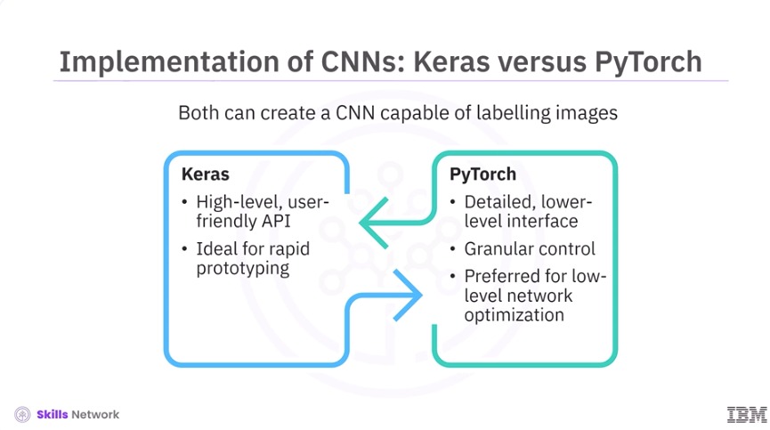

​Let's dive into the implementation of CNNs using Keras and PyTorch. ​While both Keras and PyTorch can create a CNN capable of labeling images, ​their implementation differs. 
​Keras is a high-level, user-friendly Application Programming Interface API that targets rapid ​prototyping with minimal boilerplate code. ​PyTorch, on the other hand, offers a more detailed, lower-level interface and ​provides granular control over every gradient step. ​PyTorch is popular for low-level network optimization. 

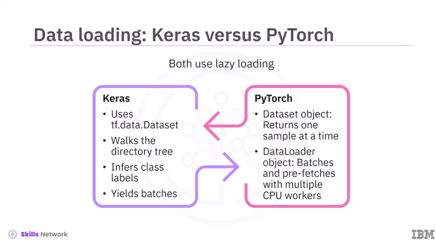

​Now let's discuss data loading in Keras and PyTorch. ​Both Keras and PyTorch use a lazy loading strategy for data loading. ​Keras uses the tf.data.dataset subsystem, where a helper routine walks the directory ​tree, infers class labels, and yields batches as needed. ​Whereas PyTorch implements a two-piece design – a dataset object that returns one sample ​at a time, and a dataloader object that batches those samples and uses multiple Central Processing ​Unit CPU workers to prefetch upcoming batches. 

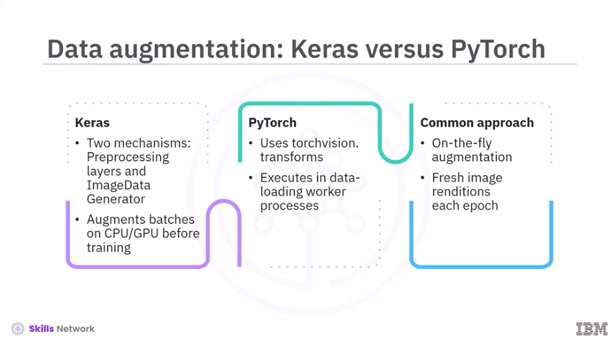

​Next, let's discuss data augmentation in Keras and PyTorch. ​Keras offers two mechanisms for data augmentation. ​First is the preprocessing of layers that can be chained into a small sequential block, ​and second, the image data generator utility. ​Each batch is augmented on the CPU, or even the GPU, before reaching the training loop. ​On the other hand, PyTorch uses the torchvision.transforms module, where these transformations are declared ​in a functional list that executes inside each data loading worker process. ​However, in both Keras and PyTorch, augmentation happens on the fly, meaning you never store ​augmented copies on disks, and the model sees a fresh rendition of each image ​during every epoch. 

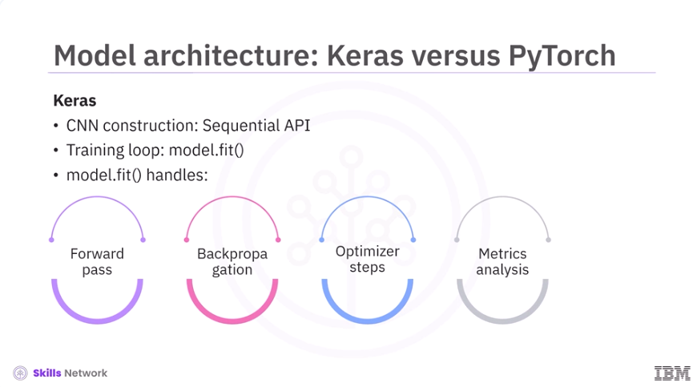

​Once the data pipeline is in place, the next step is to design the model architecture. 
​Keras streamlines the construction of a CNN using the sequential API, and it manages the ​entire training loop via the model.fit method. ​This method contains key operations such as the forward pass, back propagation, optimizer ​steps, and metrics analysis. ​

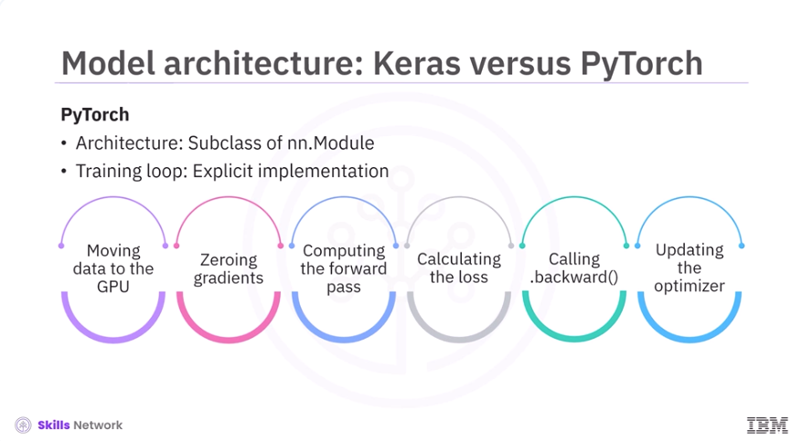

In PyTorch, a similar architecture is defined as a subclass of nn.module. ​The training loop must be implemented explicitly. ​This includes moving data to the GPU, zeroing gradients, computing the forward pass, calculating ​the loss, calling .backward, and updating the optimizer. 

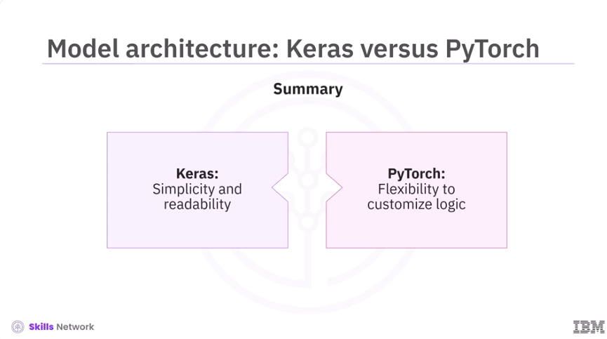

​While Keras excels in simplicity and readability, PyTorch provides greater flexibility to customize ​logic directly into the training loop. 

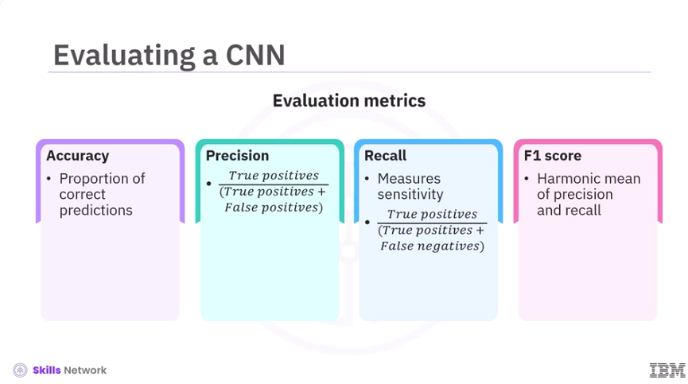

​After data loading, data augmentation, model building, and training, the next step is evaluation. ​Let's dive into the various metrics to evaluate a CNN. ​First is accuracy. ​Accuracy is the proportion of correct predictions across all classes, but it can be misleading ​on skewed datasets. ​Next is precision, the ratio of true positives to true positives plus false positives. ​It answers the question, of all positive predictions, how many were correct? ​Precision is crucial when false positives incur logistical costs. ​Then comes recall, measuring sensitivity. ​It is the ratio of true positives to true positives plus false negatives. ​It answers the question, how many were correctly identified? ​Recall is important when the absence of a specific class can impact projections. ​Further, F1 score is the harmonic mean of precision and recall, providing a single value ​that balances both errors. 

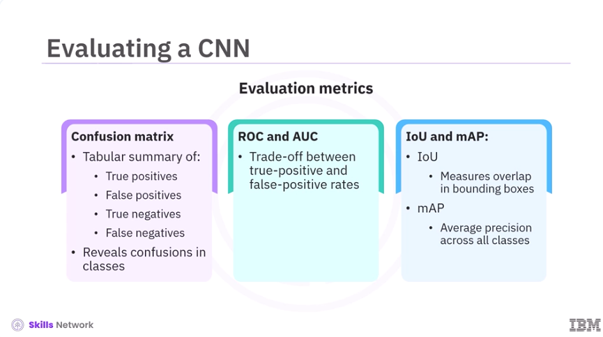

​Next, a confusion matrix is a tabular summary of true positives, false positives, true negatives, ​and false negatives. ​It quickly reveals if the model systematically confuses different classes. ​Metrics such as the Receiver Operating Characteristic, ROC curve, and the Area Under the Curve, AUC, ​summarize the tradeoff between true positive and false positive rates across ​all possible cutoffs. ​Metrics such as Intersection Over Union, IoU, and Mean Average Precision, mAP, are used ​for object detection or segmentation. ​IoU measures the overlap between predicted and ground truth bounding boxes, and mAP is ​a metric that measures the average precision across all classes in tasks like object detection. 

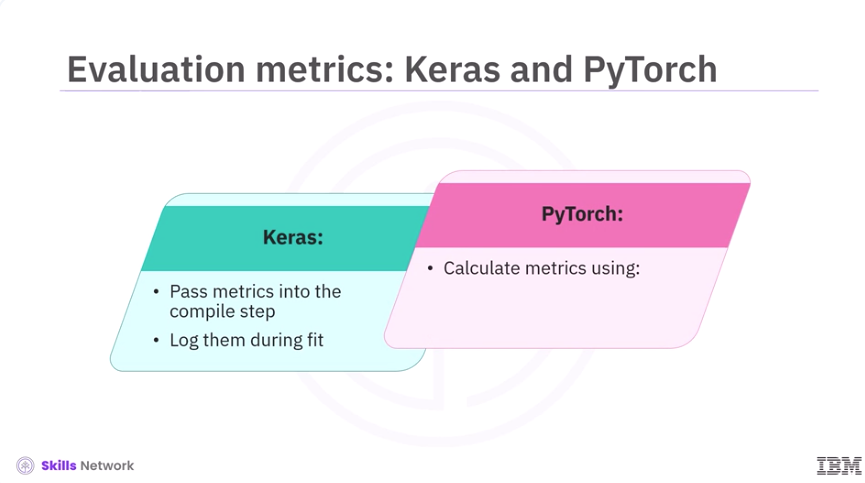

​Keras allows metrics to be passed into the compile step, logging them during fit. ​For PyTorch, you calculate metrics using Scikit-learn or Torch metrics. 

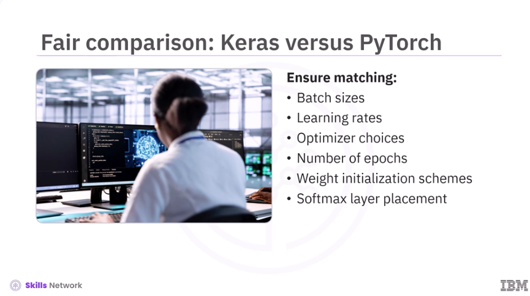

​To compare CNNs trained in Keras versus PyTorch, you need to have similar batch sizes, learning ​rates, optimizer choices, and number of epochs. ​Weight initialization schemes and the placement of a softmax layer must also match. 

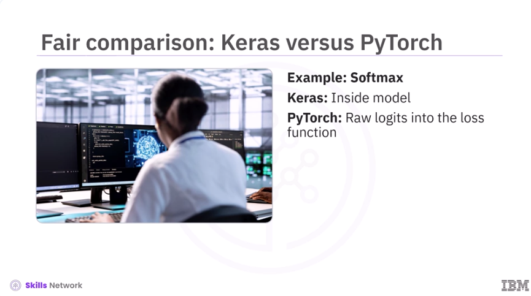

​For example, Keras typically includes softmax inside the model, whereas PyTorch omits it ​and feeds raw logits into the loss function. 

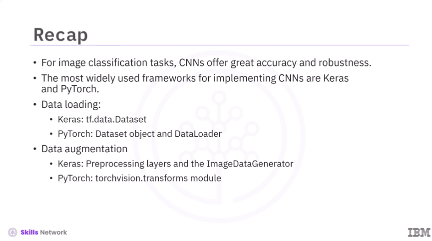

​In this video, you learned, for image classification tasks, Convolutional Neural Networks, CNNs, ​offer great accuracy and robustness. ​The most widely used frameworks for implementing CNN are Keras and PyTorch. ​For data loading, Keras uses the tf.data.dataset subsystem, while PyTorch uses a dataset object ​and data loader. ​For data augmentation, Keras offers preprocessing layers and the image data generator, while ​PyTorch uses the TorchVision.transforms module. 

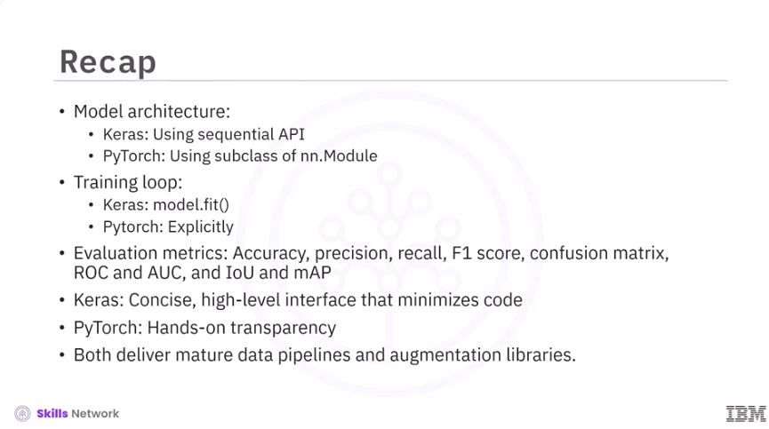

​In Keras, the model architecture is constructed using sequential API. ​In PyTorch, the architecture is defined as a subclass of nn.module. ​In Keras, the training loop is managed via the model.fit method. 
​In PyTorch, the training loop is implemented explicitly. ​Metrics used to evaluate CNNs are Accuracy, Precision, Recall, F1-score, Confusion Matrix, ​ROC and AUC, and IoU and mAP. ​While Keras offers a concise, high-level interface that minimizes code, making it perfect for ​rapid prototyping, PyTorch provides hands-on transparency that empowers customized research ​and in-depth debug tools. ​Both deliver mature data pipelines and augmentation libraries, and are chosen ​based on your personal preference. 