# Transfer_Learning_and_Vision_Transformers.md

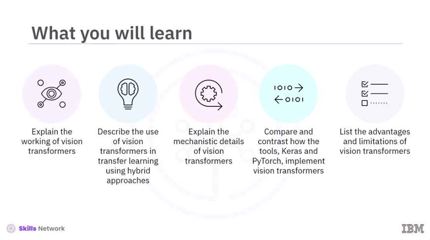

​Welcome to Transfer Learning and Vision Transformers. ​After watching this video, you'll be able to explain the working of vision transformers, ​describe the use of vision transformers in transfer learning using hybrid approaches, ​explain the mechanistic details of vision transformers, compare and contrast how the ​tools Keras and PyTorch implement vision transformers, and list the advantages and limitations of ​vision transformers. 

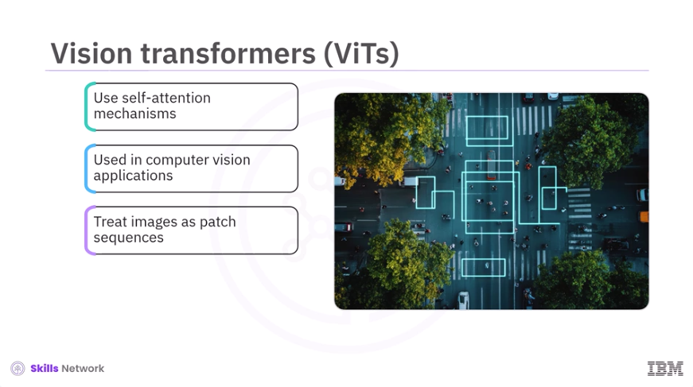

​Vision transformers, also known as ViTs, leverage self-attention mechanisms originally developed ​for natural language processing for computer vision applications. ​They treat images as sequences of patches and model relationships between them. ​Vision transformers demonstrate remarkable performance on a wide range of visual tasks, ​particularly when large datasets and computational resources are available. 

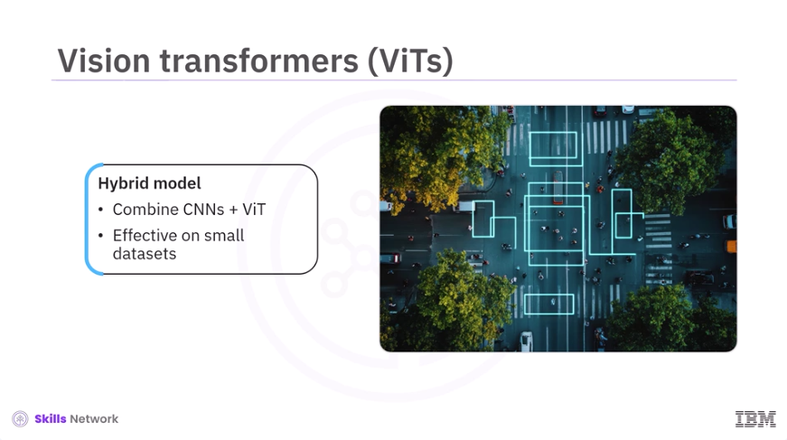

​However, a hybrid model combining convolutional neural networks, CNNs, and vision transformers ​could be useful if the training dataset is small. ​Let's dive deep into the working of vision transformers.

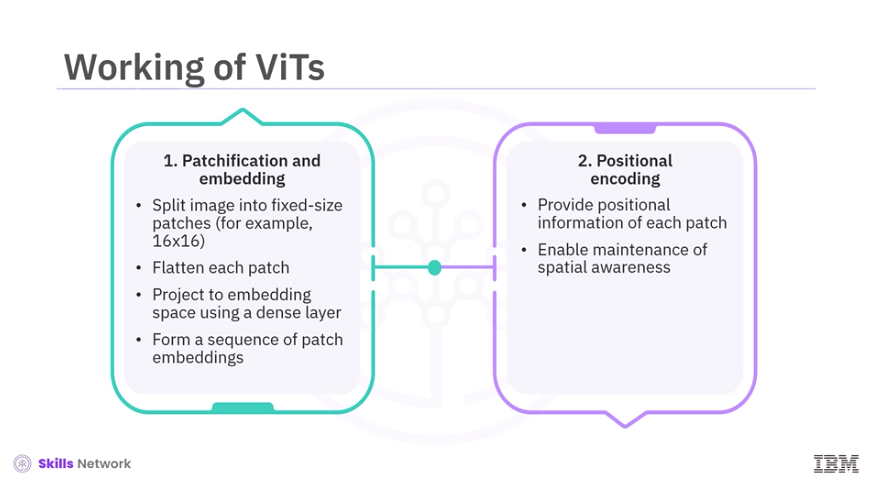

​First, vision transformers divide an input image into fixed-size patches, for example, ​16 by 16 pixels. ​Each patch is then flattened and projected into a higher-dimensional embedding space ​using a dense and fully-connected layer. ​This process transforms the image into a sequence of patch embeddings analogous to ​word embeddings in natural language processing. ​Next, positional encodings provide information about the position of each patch in the original ​image, enabling the model to maintain spatial awareness throughout the processing pipeline. 

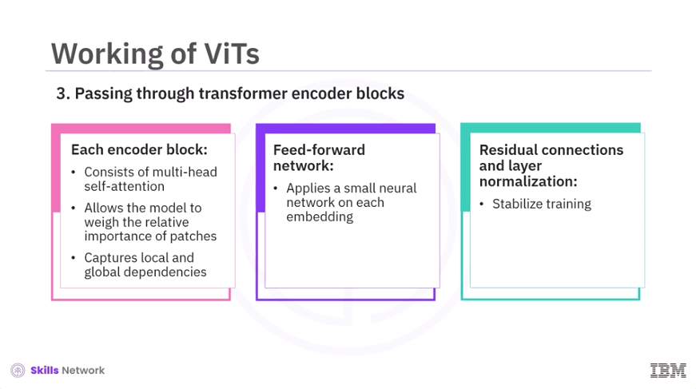

​Further, the sequence of patch embeddings, along with positional information, is passed ​through a stack of transformer encoder blocks. ​Each block consists of multi-head self-attention, which allows the model to weigh the importance ​of each patch relative to others, capturing both local and global dependencies ​across the image. ​This is followed by a feed-forward network, which applies a small neural network to each ​patch embedding independently. 
​In addition, residual connections and layer normalization help stabilize training ​and enable deeper architectures. 

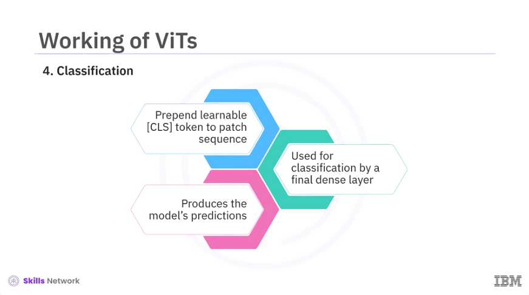

​A special learnable token, often called a classification or CLS token, ​is prepended to the sequence of patches. ​After passing through the transformer blocks, the output corresponding to this token is ​used for classification by a final dense layer, producing the model's predictions. 

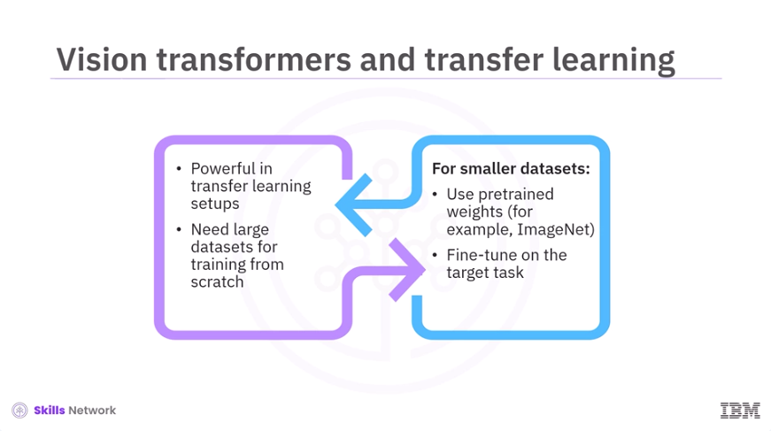

​Vision transformers are very powerful in transfer learning scenarios. ​They often require large datasets to train from scratch. ​However, transfer learning using pre-trained weights from large datasets, such as ImageNet ​or other pre-trained network models, enables visual transformers to perform ​well even on smaller datasets. ​This requires fine-tuning on the target task. 

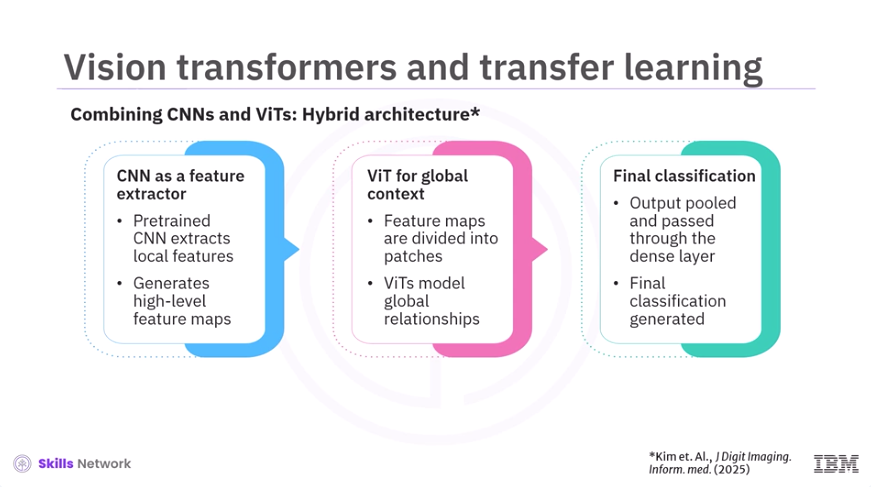

​A common and effective strategy is to combine CNNs and vision transformers in a hybrid architecture. ​A pre-trained CNN processes the input image to extract local features, ​generating high-level feature maps. ​The feature maps are divided into patches and fed into a vision transformer, which models ​global relationships and context using self-attention. ​The output is then pooled and passed through a dense layer for final classification. ​This hybrid approach leverages the local feature extraction strengths of CNNs and the global ​context modeling capabilities of vision transformers. ​This often results in improved performance, especially when data is limited or computational ​efficiency is a concern. 

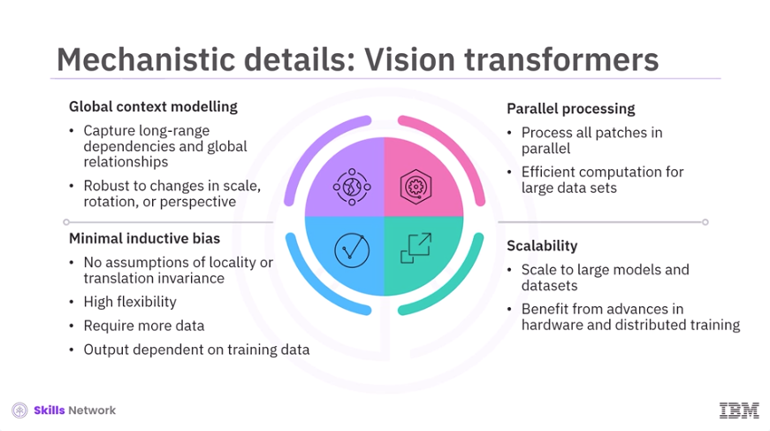

​Next, let's discuss the mechanistic details of vision transformers. 
​First, there is global context modeling. ​Vision transformers excel at capturing long-range dependencies and global relationships within ​an image, making them robust to changes in scale, rotation, or perspective. ​Next, all patches are processed in parallel, leading to efficient computation ​especially for large datasets. ​Unlike CNNs, vision transformers show minimal inductive bias. ​They do not assume locality or translation invariance, making them highly flexible. ​However, they also require more data, and their output is highly dependent ​on training data. ​Vision transformers can scale to very large models and datasets and thus benefit from ​advances in hardware and distributed training. 

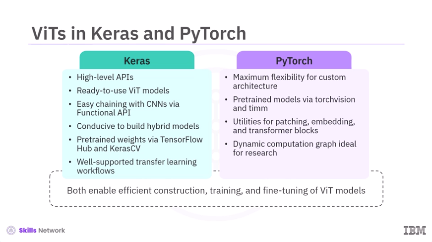

​Both Keras and PyTorch provide robust tools for implementing vision transformers. ​Keras offers high-level application processing interfaces, APIs, and ready-to-use vision ​transformer implementations. ​The functional API allows easy chaining of CNNs and ViTs, making it straightforward to ​build hybrid models. ​Pre-trained ViT weights are available via TensorFlow Hub, and KerasCV and transfer ​learning workflows are well-supported. ​On the other hand, PyTorch provides maximum flexibility for custom architectures. ​Libraries like torchvision and timm supply pre-trained ViT models and utilities for ​patch extraction, embedding, and transformer blocks. ​PyTorch's dynamic computation graph is particularly suited for research and experimentation. 
​While these frameworks differ in syntax and abstraction level, both enable efficient construction, ​training, and fine-tuning of ViT models for a variety of computer vision tasks. 

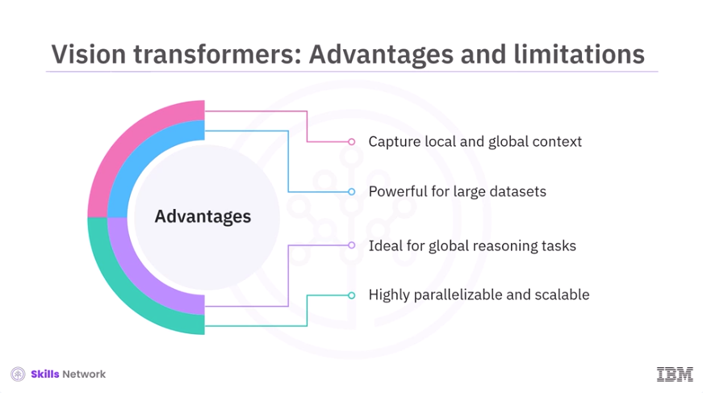

​Finally, let's understand the advantages and limitations of vision transformers. ​Advantages include the ability to capture both local and global image context. ​They are powerful for large datasets and tasks requiring global reasoning. ​They are also highly parallelizable and scalable. 

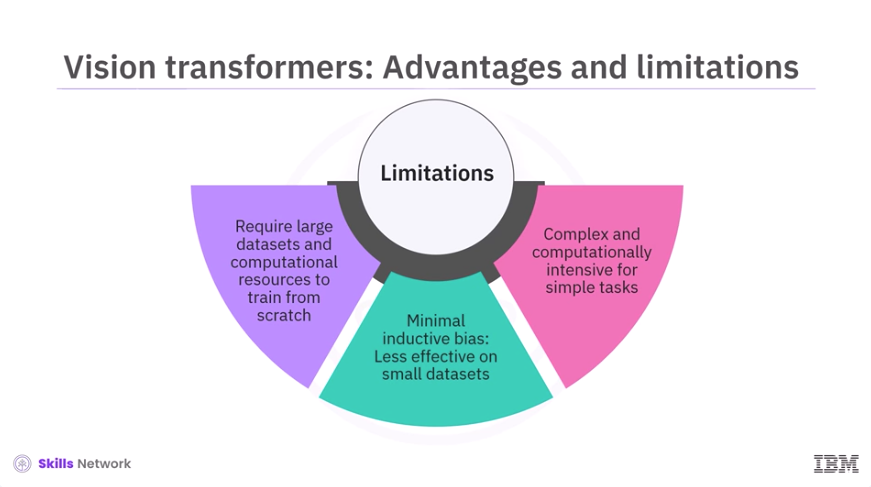

​Limitations include the need for large datasets and significant computational resources ​to train from scratch. ​Their minimal inductive bias can make them less effective on small datasets without transfer ​learning or hybridization. 
​They are also more complex and computationally intensive than lightweight ​CNNs for simple tasks. 

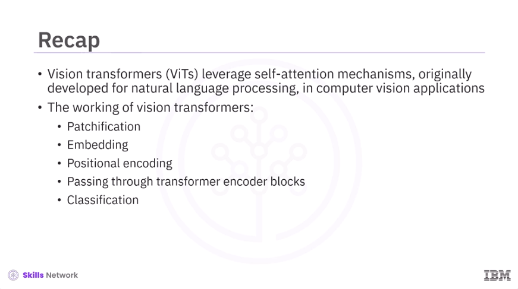

​In this video, you learned ​Vision transformers, ViTs, leverage self-attention mechanisms originally developed for natural ​language processing in computer vision applications. ​The working of vision transformers involves patchification, embedding, positional encoding, ​passing through transformer encoder blocks, and classification. 

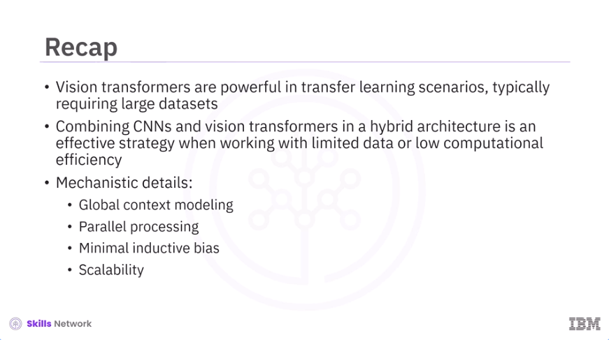

​Vision transformers are powerful in transfer learning scenarios, ​typically requiring large datasets. ​Combining CNNs and vision transformers in a hybrid architecture is an effective strategy ​when working with limited data or low computational efficiency. ​Mechanistic details of vision transformers include global context modeling, ​parallel processing, minimal inductive bias, and scalability. 

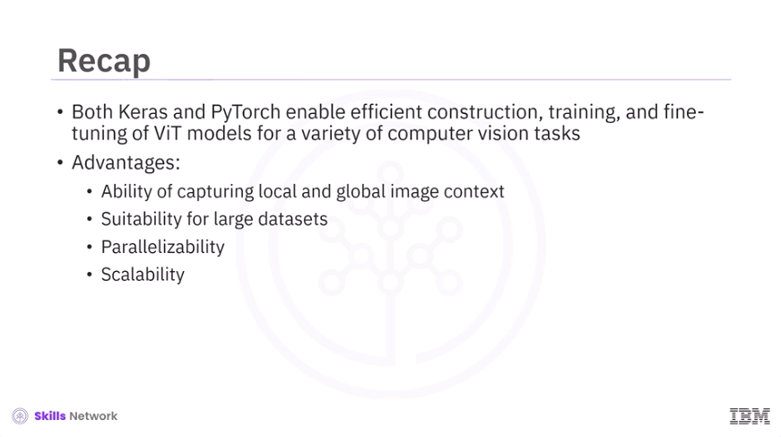

​Both Keras and PyTorch enable efficient construction, training, and fine-tuning of ViT models for ​a variety of computer vision tasks. 
​Advantages of visual transformers include the ability to capture local and global ​image context, suitability for large datasets, parallelizability, and scalability.

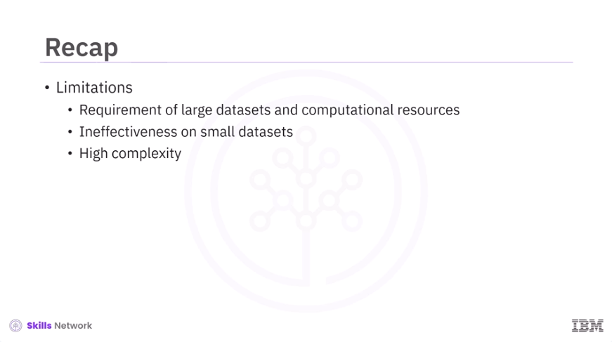

​Limitations include requirement of large datasets and computational resources, ​ineffectiveness on small datasets, and high complexity. 