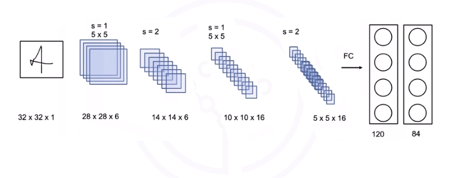
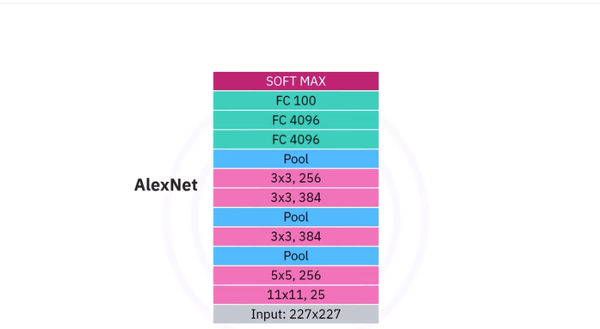
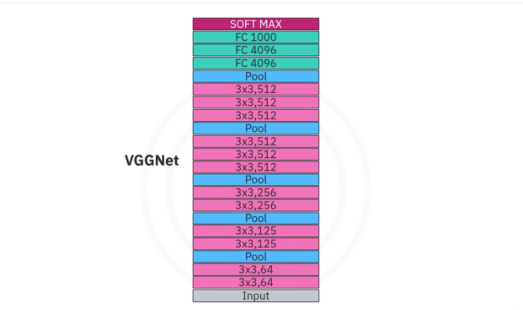
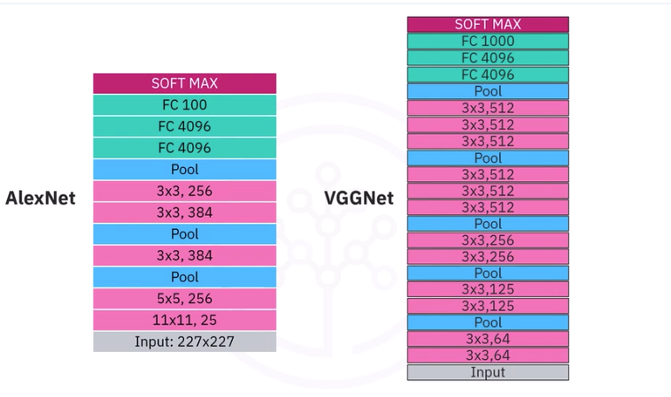
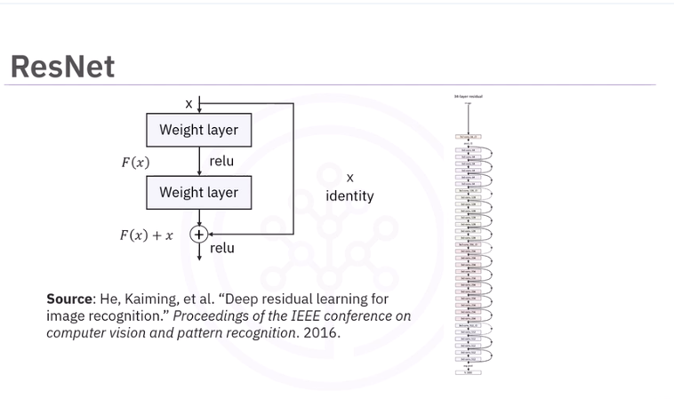
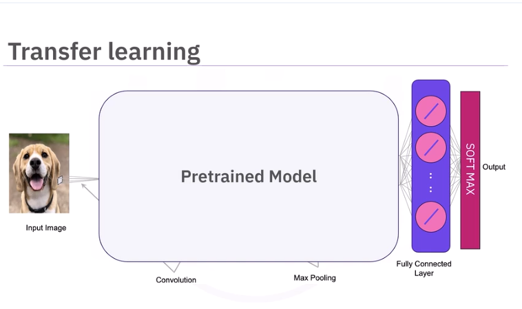

# CNN Architectures

Popular architectures include:

* LeNet-5
* AlexNet
* VGGNet
* ResNet

One of the first CNNs was proposed by Jan Lekun and others in 1989. The most successful use case of the LeNet-5 is the MNIST dataset of handwritten digits. LeNet-5 receives an input image, normally a grayscale image. 

Reminder:

For a conv layer with: 
*  input size: $H_{in}, W_{in}$
*  kernel size: $K_{h}, K_{w}$
*  stride: $S$
*  padding: $P$
*  number of filters: $C_{out} (design choice)$

$H_{out} = (H_{in}-K_{h}+2P)/S + 1$  
$W_{out} = (W_{in}-K_{w}+2P)/S + 1$  


For a pool layer with: 
*  input size: $H_{in}, W_{in}$
*  kernel size: $K$  (always square?)
*  stride: $S$
*  number of filters: $C_{out}$ (same as coming in)

> Assumes square so H is W.  

$H_{out} = (H_{in}-K)/S + 1$ 

> No padding in classic LeNet pool layers, so:

$H_{out} = H_{in}/S$ 


## LeNet-5:


1. 32x32x1 in put image  
2. 5x5 filter (kernel) with a stride of 1 resulting in a vol of 28x28x6 outputs.  
```python
H_out = ((32-5+2*0)/1) + 1 = 28.0
W_out = ((32-5+2*0)/1) + 1 = 28.0
C_out = 6 # Chosen

```
3. Pooling layer with stride of 2 and 14x14x6 outputs. 

> no mention of filter dimentions and only stride specified...assume a kernel of 2x2 (K=2).
```python
H_out = (28-2)/2) + 1 = 14.0
W_out = (28-2)/2) + 1 = 14.0
C_out = 6 # Stays same
```
4. 5x5 filter (kernel) with a stride of 1 resulting in a vol of 10x10x16 outputs.  
```python
H_out = (14-5+2*0)/1 + 1 = 10.0
W_out = (14-5+2*0)/1 + 1 = 10.0
C_out = 16 # Chosen
```
5. Pooling layer with stride of 2 and 5x5x16 outputs.  
> no mention of filter dimentions and only stride specified...assume a kernel of 2x2 (K=2).

```python
H_out = (10-2)/2) + 1 = 5.0
W_out = (10-2)/2) + 1 = 5.0
C_out = 16 # Stays same

```

...then into the fully connected layers

## AlexNet:


ImageNet is a benchmark dataset. AlexNet in 2012 beat the then reigning champ, SIFT + EVs (51%) by getting around 63.3% accuracy. AlexNet was a CNN and beat out a HOG like method.

The first  (11x11, 25) layer has a lot of parameters

## VGGNet:


The VGG network is a very deep convolutional network that was developed out of the need to reduce the number of parameters in the convolution layers and improve on training time. It also showed in general that deeper networks performed better. VGGNet has multiple variants like the VGG19 and the VGG16, where 16 stands for the number of layers in the network. Here VGG16 is pictured next to AlexNet. We see it's much deeper. 



Basically, going deeper and reducing the kernel size was the key innovation. By reducing the kernel size. This gives:

* The same receptive field (or better) - Basically even though the kernels are smaller, in a layer each stack of filters sees what the layer before it saw. So the deeper you go, you are seeing so many passes through the image that your receptive field is actually getting quite large.
* Fewer parameters - smaller kernels - and each parameter is a learned weight.
* More nonlinearities - 3 ReLUs instead of 1
  - Think of it like this: A single ReLU after one giant conv is like one painter trying to paint a mural in one go. Three conv+ReLU layers is like 3 painters working in stages, refining edges, shapes, textures.
  - Each layer can:
    * extract new features,
    * reshape representations,
    * compress or expand information,
    * compose patterns into more complex patterns.
* Deeper representation

In other words, depth beats width.


## ResNet:
As CNNs got deeper, the vanishing gradient began to become a problem again. 


Helped solve the problem by introducing residual learning.  Residual layers or skip connections allow the gradient to bypass different layers, improving performance. We can now build much deeper networks. Here is a 32-layer network from the paper Deep Residual Learning for Image Recognition. 

## Transfer Learning
Use pre-trained networks to have a jumping off point. You can then add or remove layers or just continue training.



We will cover the simplest method, where we replace the softmax layer with our own softmax layer. The number of neurons is equal to the number of classes. We then train the softmax layer on the dataset we would like to classify. The input dimension of each neuron in the softmax layer is equal to the last number of neurons fully connected layer. 


## Lab: Image classification with CNN.ipynb
[Image classification with CNN.ipynb](JupyterNotebooks/Image classification with CNN.ipynb)