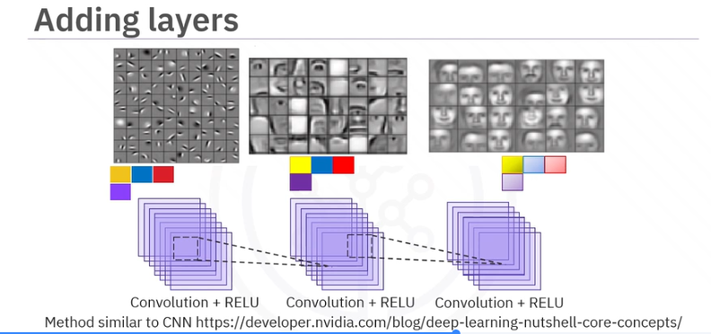
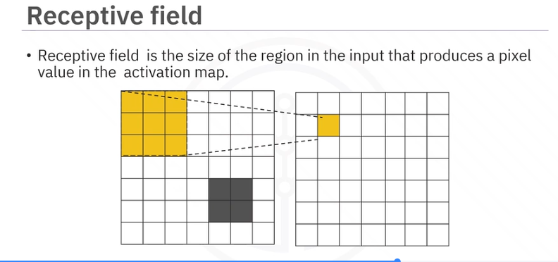
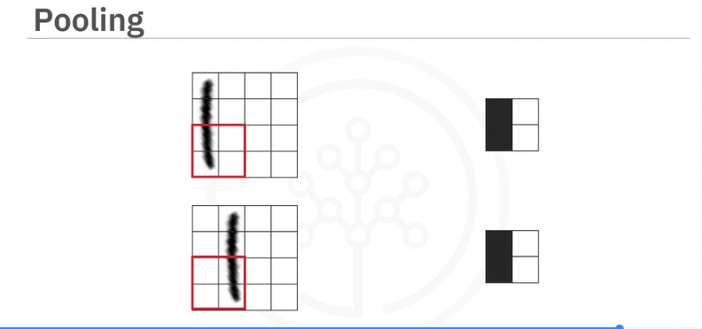
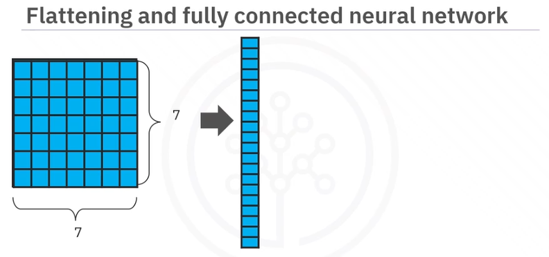
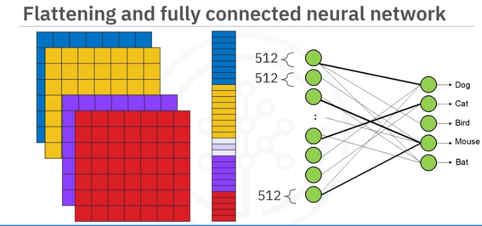

# Convolutional Networks

1. How CNNs build features
2. Adding Layers
3. Receptive Fields
4. Pooling
5. Flattening and fully connected neural layers

## How CNNs build features
Kernels for features are stored in a stack. There could be many. They are each convolved with the image and the results is stored as a stack too. That is passed to the next convolutional layer.

We use kernels like neurons. The image passes by each one so each is like a "neuron".

## Adding Layers

Here is the fun part...the next layer of kernels will convolve against the entire stack. So if it was a series of 2D convolutions before, it is now a 3D set of convolutions where the new kernels slide cubes through the original stack of kernels from first convolution. It gets higher order from there...

So you can have a lot of combinations of things and a lot of times you might have 3 feature outputs and those 3 feed into 2 feature maps. Those create 2 feature outputs.

## Receptive Fields
Size of region in input that produces a pixel value in the activation map.

We can add kernels that have larger receptive fields to search for larger features without having to increase the size of the kernel.

## Pooling
Reduces number of parameters and increases receptive field while preserving important features.

"Resizing the image"

Max-pooling is most popular.

Notice how even though slightly different, the "sense" is that there is some signal vertically on the left and the pooling makes the same output regardless.

## Flattening and fully connected neural layers

All features lined up to be fully connected to neural net.

## Lab: DataAugmentation
[DataAugmentation](JupyterNotebooks/Data_Augmentation.ipynb)