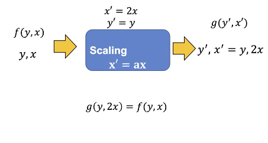
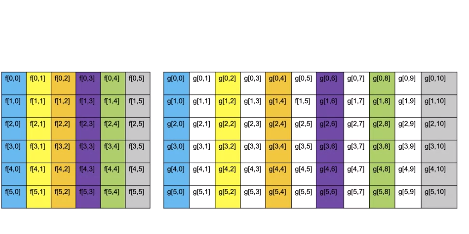
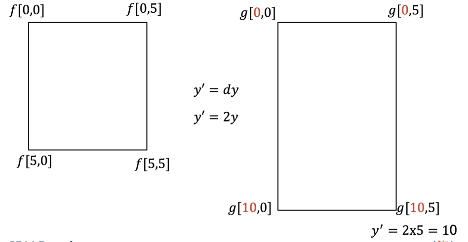
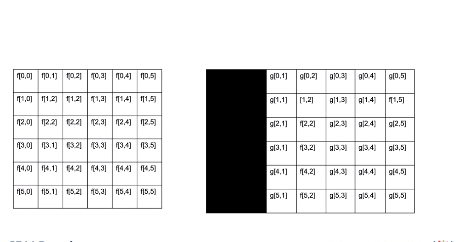
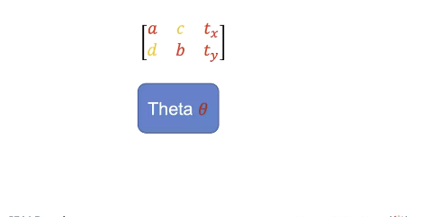

# Geometric Operations
In this video we will discuss Geometric Operations we will cover:

* Geometric Operations
* Scaling
* Translation
* Rotation


We will show the one channel representation, but unless specified we can apply these 
operations to each channel simultaneously.


We will treat the image as a function of y and x. y is the vertical direction, x is the horizontal direction. Although x and y are real numbers, we will sample integer points of x and y. for example point 0,0 or point 1,1.


In a geometric transformation, we change the coordinates of the image x and y. The new image, g is a function of x prime and y- prime g of x prime and y prime has the value of f corresponding to the values that have been mapped from x and y. We will deal with a subset of Geometric Transformations called Affine transformations 


## Scaling
Scaling is where we reshape the image, we can shrink or expand the image in a horizontal and or vertical direction. Shrinking the image or making the image larger We can scale the image along the x axis.



Let us use “a” to represent the scaling factor We can scale the image by 2. g of y and 2x is equal to f of f of y and x, hence the values of the image g will look stretched relative to image f.


Consider the following image, we will only work on the corner pixels points. Consider the image at Point 0,0, the x coordinate is in red. Applying the transform nothing happens, here is point 0, 5. Applying the transform the the x coordinates is mapped from 5 to 10 in red. Applying the transform to point 5,0 nothing happens the point 5,5 is mapped to 5, 10 overlaying the image points we see the image appears stretched.



Let’s look at the relationship between the pixel f and g. The first column of f is mapped to the first column of g. The second column of f is mapped the third column of g the final column of f is mapped to the following column in g. The colors shows the relation between columns of image f and g. We see several column’s of g have no corresponding value in f. To determine the unknown pixel value we use Interpolation. Interpolation is where we used neighbouring pixels to determine the value of an unknown pixel. 


In this case, we use the nearest neighbours; this just assigns the value based on the nearest pixel; there are other methods that PIL and open cv use.



We can scale the horizontal axis; we will denote the vertical scale factor as d. Lets set d to two. Nothing changes when applying the transform to the top portion of the image For the point 5,0, the new value after the transform is applied is mapped to 10, 0 the point 5, 5 is mapped to 10,5. The result is the image is stretched in the horizontal direction We can use this method to make the image larger, if the values of a or d are less than zero; the image will shrink.

## Translation

Translation is where we shift the image. We can shift an image horizontally by adding the number of pixels “tx” then by mapping the new location x prime. We can add two pixels. Consider the following intensity values. 


We can apply the transform shifting the points. The points shift, transforming the next set of points. Shifting the points, the image appears shifted.

Let’s see what happens to each pixel.



We see that pixels have been shifted, those pixels that are on the edge have been replaced by zero values. We can increase the size of the image to include the pixels that have been shifted.


We can shift the image vertically by adding pixels ty, this shifts the image vertically.

We can represent a geometric transformation as a set of equations, putting the equations in matrix form, we get the Affine Transformation matrix With open cv you input this matrix as an array. We also have the shear parameters; we will not cover them in this Course. 


## Rotate Image

You can also rotate an image We can rotate an image by an angle theta, where the red lines represent the original orientation of the horizontal and vertical axis. 


We can use a similar matrix to rotate an image. This Rotation matrix will perform a counter-clockwise rotation; the expression for the matrix is quite complex.


 We will simplify by assuming the Isotropic scale factor “r” is 1, and we will rotate from the center of the image to simplify If you make the above assumptions, libraries like PIL and open CV only require the parameter theta Lets try PIL.



## PIL

In PIL we can scale the image by specifying the integer number of pixel’s using the method “resize". We can double the width of the image. We apply the method resize the image is twice as wide. You can also shrink the image but the input must be an integer. 


We can rotate the image. We use the method rotate; the input is the angle we would like to rotate the image by.


## OpenCV

Lets try open CV. In open cv we can use the function resize to rescale the image. We scale the horizontal axis by two and leave the vertical axis as is.


We can also specify the interpolation the result is the image is twice as wide. The scaling factor does not have to be an integer, and it can be less than one,


Translation requires the Affine Transformation matrix M. Where tx is the number of pixels you shift the location in the horizontal direction, ty is the number of pixels you shift in the vertical direction. We will leave the scale factors as one.


We input the image and matrix into the function warpAffine, we also input the shape of the output image. The image is shifted. There is a lot more you can do using this method.

We can obtain the matrix to rotate the image using getRotationMatrix2D, this will rotate the image by angle θ The parameter center is the Center of the rotation in the source, scale will be set to one Like before we rotate the image. Check out the lab for more examples.


## Code Lab

### PIL
```bash
# Setup Environment
cd ~/Desktop; rm -r temp; # To remove
cd ~/Desktop; mkdir temp; cd temp; pyenv activate venv3.10.4;

wget https://cf-courses-data.s3.us.cloud-object-storage.appdomain.cloud/IBMDeveloperSkillsNetwork-CV0101EN-SkillsNetwork/images%20/images_part_1/lenna.png -O lenna.png
wget https://cf-courses-data.s3.us.cloud-object-storage.appdomain.cloud/IBMDeveloperSkillsNetwork-CV0101EN-SkillsNetwork/images%20/images_part_1/baboon.png -O baboon.png
wget https://cf-courses-data.s3.us.cloud-object-storage.appdomain.cloud/IBMDeveloperSkillsNetwork-CV0101EN-SkillsNetwork/images%20/images_part_1/barbara.png -O barbara.png  
```

```python
import matplotlib.pyplot as plt
from PIL import Image
import numpy as np
from PIL import ImageOps 

```

First, let's define a helper function to plot two images side-by-side. You will not need to understand this code this moment, but this function will be used repeatedly in this tutorial to showcase the results. 

```python
def plot_image(image_1, image_2,title_1="Orignal",title_2="New Image"):
    plt.figure(figsize=(10,10))
    plt.subplot(1, 2, 1)
    plt.imshow(image_1,cmap="gray")
    plt.title(title_1)
    plt.subplot(1, 2, 2)
    plt.imshow(image_2,cmap="gray")
    plt.title(title_2)
    plt.show()
```

#### Geometric Transformations

Geometric transformations allow you to perform different operations like translation, i.e. to shift, reshape and rotate the image.

```python
# We can resize an image using the method resize() of PIL images, which takes the resized image's width and height as paramters. 
# Consider the following image:

image = Image.open("lenna.png")
plt.imshow(image)
plt.show()

# We can scale the horizontal axis by two and leave the vertical axis as is:
width, height = image.size
new_width = 2 * width
new_hight = height
new_image = image.resize((new_width, new_hight))
plt.imshow(new_image)
plt.show()

# In the same manner, we can scale the vertical axis by two:
new_width = width
new_hight = 2 * height
new_image = image.resize((new_width, new_hight))
plt.imshow(new_image)
plt.show()

# We can double both the width and the height of the image:
new_width = 2 * width
new_hight = 2 * height
new_image = image.resize((new_width, new_hight))
plt.imshow(new_image)
plt.show()

# We can shrink too
new_width = width // 2
new_hight = height // 2

new_image = image.resize((new_width, new_hight))
plt.imshow(new_image)
plt.show()

# Rotation
theta = 45
new_image = image.rotate(theta)

plt.imshow(new_image)
plt.show()

```

#### Mathematical Operations
```python
image = np.array(image)

# We can then add the constant to the image array:
new_image = image + 20
plt.imshow(new_image)
plt.show()

# We can also multiply every pixel's intensity value by a constant value.
new_image = 10 * image
plt.imshow(new_image)
plt.show()

# We can add the elements of two arrays of equal shape. In this example, we generate an array of random noises with the same shape and data type as our image.

Noise = np.random.normal(0, 20, (height, width, 3)).astype(np.uint8)
Noise.shape

# We add the generated noise to the image and plot the result. We see the values that have corrupted the image:
new_image = image + Noise

plt.imshow(new_image)
plt.show()

# At the same time, we can multiply the elements of two arrays of equal shape. We can multiply the random image and the Lenna image and plot the result. 
new_image = image*Noise

plt.imshow(new_image)
plt.show()
```

#### Matrix Operations
```python
im_gray = Image.open("barbara.png")
# Even though the image is gray, it has three channels; we can convert it to a one-channel image.
im_gray = ImageOps.grayscale(im_gray) 
im_gray = np.array(im_gray )
plt.imshow(im_gray,cmap='gray')
plt.show()
# We can apply algorithms designed for matrices.  We can use  Singular Value Decomposition, decomposing our image matrix into a product of three matrices.
U, s, V = np.linalg.svd(im_gray , full_matrices=True)
```

> They did not cover this so here is a tid bit and a link
**Source: ChatGPT to beware**
Singular Value Decomposition is a fundamental matrix decomposition technique in linear algebra. Given a matrix A, the SVD factorizes it into three matrices:

U: The left singular vectors matrix, where each column represents an orthonormal basis for the row space of A.
S: The diagonal singular values matrix, which contains the singular values of A in descending order. These values are non-negative and provide information about the relative importance of different components in the decomposition.
V^T (V transpose): The right singular vectors matrix, where each column represents an orthonormal basis for the column space of A.
The SVD decomposition can be expressed as A = U * S * V^T.

`numpy.linalg.svd` allows you to compute this decomposition for a given matrix A in NumPy. You can use it for various numerical and scientific computing tasks, including dimensionality reduction, data compression, solving linear equations, and more. It's a versatile tool for linear algebra operations involving matrices.

**Source: Humans:**
[geeksforgeeks](https://www.geeksforgeeks.org/singular-value-decomposition-svd/)

**We see s is not rectangular:**
```python
s.shape
# We can convert s to a diagonal matrix S:
S = np.zeros((im_gray.shape[0], im_gray.shape[1]))
S[:image.shape[0], :image.shape[0]] = np.diag(s)
S.shape # (512, 512)
# Plot matrix U and V
plot_image(U, V, title_1="Matrix U", title_2="Matrix V")
# We see most elements in S are zero:
plt.imshow(S, cmap='gray')
plt.show()
# We can find the matrix product of all the  matrices. First, we can perform matrix multiplication on S and U and assign it to `B` and plot the results: 
B = S.dot(V)
plt.imshow(B,cmap='gray')
plt.show()
# We can find the matrix product of `U`, `S`, and `B`. We see it's the entire image:
A = U.dot(B)
plt.imshow(A,cmap='gray')
plt.show()
# It turns out that many elements are redundant. We can eliminate some rows and columns of S and V and approximate the image by finding the product:
for n_component in [1,10,100,200, 500]:
    S_new = S[:, :n_component]
    V_new = V[:n_component, :]
    A = U.dot(S_new.dot(V_new))
    plt.imshow(A,cmap='gray')
    plt.title("Number of Components:"+str(n_component))
    plt.show()
```

## OpenCV
```python
import cv2
```

### Scaling
```python
toy_image = np.zeros((6,6))
toy_image[1:5,1:5]=255
toy_image[2:4,2:4]=0
plt.imshow(toy_image,cmap='gray')
plt.show()
toy_image
```
We can rescale along a specific axis:

- `fx`: scale factor along the horizontal axis  
- `fy`: scale factor along the vertical axis  

The parameter interpolation estimates pixel values based on neighboring pixels. `INTER_NEAREST` uses the nearest pixel and `INTER_CUBIC` uses several pixels near the pixel value we would like to estimate.

```python
new_toy = cv2.resize(toy_image,None,fx=2, fy=1, interpolation = cv2.INTER_NEAREST )
plt.imshow(new_toy,cmap='gray')
plt.show()
# Read image
image = cv2.imread("lenna.png")
plt.imshow(cv2.cvtColor(image, cv2.COLOR_BGR2RGB))
plt.show()
# We can scale the horizontal axis by two and leave the vertical axis as is:
new_image = cv2.resize(image, None, fx=2, fy=1, interpolation=cv2.INTER_CUBIC)
plt.imshow(cv2.cvtColor(new_image, cv2.COLOR_BGR2RGB))
plt.show()
print("old image shape:", image.shape, "new image shape:", new_image.shape)
# In the same manner, we can scale the vertical axis by two:
new_image = cv2.resize(image, None, fx=1, fy=2, interpolation=cv2.INTER_CUBIC)
plt.imshow(cv2.cvtColor(new_image, cv2.COLOR_BGR2RGB))
plt.show()
print("old image shape:", image.shape, "new image shape:", new_image.shape)
# We can scale the horizontal axis and vertical axis by two.
new_image = cv2.resize(image, None, fx=2, fy=2, interpolation=cv2.INTER_CUBIC)
plt.imshow(cv2.cvtColor(new_image, cv2.COLOR_BGR2RGB))
plt.show()
print("old image shape:", image.shape, "new image shape:", new_image.shape)
# We can also shrink the image by setting the scaling factor to a real number between 0 and 1:
new_image = cv2.resize(image, None, fx=1, fy=0.5, interpolation=cv2.INTER_CUBIC)
plt.imshow(cv2.cvtColor(new_image, cv2.COLOR_BGR2RGB))
plt.show()
print("old image shape:", image.shape, "new image shape:", new_image.shape)
# We can  also specify the number of rows and columns:
rows = 100
cols = 200
new_image = cv2.resize(image, (100, 200), interpolation=cv2.INTER_CUBIC)
plt.imshow(cv2.cvtColor(new_image, cv2.COLOR_BGR2RGB))
plt.show()
print("old image shape:", image.shape, "new image shape:", new_image.shape)
```


### Translation
Translation is  when you  shift the location of the image. `tx` is the number of pixels you shift the location in the horizontal direction and `ty` is the number of pixels you shift in the vertical direction. You can create the transformation matrix $M$ to shift the image. 

In this example, we shift the image 100 pixels horizontally:

```python
tx = 100
ty = 0
M = np.float32([[1, 0, tx], [0, 1, ty]])
M
# The shape of the image is given by:
rows, cols, _ = image.shape
```
We use the function `warpAffine` from the `cv2` module. The first input parater is an image array, the second input parameter is the transformation matrix `M`, and the final input paramter is the length and width of the output image $(cols,rows)$:

```python
new_image = cv2.warpAffine(image, M, (cols, rows))
# We can plot the image; the portions of the image that do not have any intensities are set to zero:

plt.imshow(cv2.cvtColor(new_image, cv2.COLOR_BGR2RGB))
plt.show()
# We can see some of the original image has been cut off. We can fix this by changing the output image size: (cols + tx,rows + ty):
new_image = cv2.warpAffine(image, M, (cols + tx, rows + ty))
plt.imshow(cv2.cvtColor(new_image, cv2.COLOR_BGR2RGB))
plt.show()
# We can shift the image horizontally:
tx = 0
ty = 50
M = np.float32([[1, 0, tx], [0, 1, ty]])
new_iamge = cv2.warpAffine(image, M, (cols + tx, rows + ty))
plt.imshow(cv2.cvtColor(new_iamge, cv2.COLOR_BGR2RGB))
plt.show()
```
### Rotation
We can rotate an image by angle θ which is achieved by the Rotation Matrix `getRotationMatrix2D`.

`center`: Center of the rotation in the source image. We will only use the center of the image.

`angle`: Rotation angle in degrees. Positive values mean counter-clockwise rotation (the coordinate origin is assumed to be the top-left corner).

`scale`: Isotropic scale factor, in this course the value will be one.

We can rotate our toy image by 45 degrees:
```python
theta = 45.0
M = cv2.getRotationMatrix2D(center=(3, 3), angle=theta, scale=1)
new_toy_image = cv2.warpAffine(toy_image, M, (6, 6))
plot_image(toy_image, new_toy_image, title_1="Orignal", title_2="rotated image")
# Looking at intensity values, we see that many values have been interpolated:
new_toy_image
# We can perform the same operation on color images:
cols, rows, _ = image.shape
M = cv2.getRotationMatrix2D(center=(cols // 2 - 1, rows // 2 - 1), angle=theta, scale=1)
new_image = cv2.warpAffine(image, M, (cols, rows))
plt.imshow(cv2.cvtColor(new_image, cv2.COLOR_BGR2RGB))
plt.show()
```

### Mathematical Operations

#### Array Operations
```python
# We can perform array operations on an image; Using Python broadcasting, we can add a constant to each pixel's intensity value. 
new_image = image + 20

plt.imshow(cv2.cvtColor(new_image, cv2.COLOR_BGR2RGB))
plt.show()
# We can also multiply every pixel's intensity value by a constant value.
new_image = 10 * image
plt.imshow(cv2.cvtColor(new_image, cv2.COLOR_BGR2RGB))
plt.show()
# We can add the elements of two arrays of equal shape. In this example, we generate an array of random noises with the same shape and data type as our image.
Noise = np.random.normal(0, 20, (rows, cols, 3)).astype(np.uint8)
Noise.shape
# We add the generated noise to the image and plot the result. We see the values that have corrupted the image:
new_image = image + Noise

plt.imshow(cv2.cvtColor(new_image, cv2.COLOR_BGR2RGB))
plt.show()
# At the same time, we can multiply the elements of two arrays of equal shape. We can multiply the random image and the Lenna image and plot the result. 
new_image = image*Noise

plt.imshow(cv2.cvtColor(new_image, cv2.COLOR_BGR2RGB))
plt.show()
```
#### Matrix Operations
```python
# Grayscale images are matrices. Consider the following grayscale image:
im_gray = cv2.imread('barbara.png', cv2.IMREAD_GRAYSCALE)
im_gray.shape

plt.imshow(im_gray,cmap='gray')
plt.show()
# We can apply algorithms designed for matrices.  We can use  Singular Value Decomposition, decomposing our image matrix into  a product of three matrices.
U, s, V = np.linalg.svd(im_gray , full_matrices=True)
```

**We see s is not rectangular:**

```python
s.shape # (512,)
# We can convert  s to a diagonal matrix S.
S = np.zeros((im_gray.shape[0], im_gray.shape[1]))
S[:image.shape[0], :image.shape[0]] = np.diag(s)
# We can plot the matrix `U` and `V`:
plot_image(U,V,title_1="Matrix U ",title_2="matrix  V")
# We see most of the elements in `S` are zero:
plt.imshow(S,cmap='gray')
plt.show()
# We can find the matrix product of all the matrices. First, we can perform matrix multiplication on `S` and `U` and assign it  to `B` and plot the results: 
B = S.dot(V)
plt.imshow(B,cmap='gray')
plt.show()
# We can find the matrix product of `U`, `S`, and `B`. We see it’s the entire image:
A = U.dot(B)
plt.imshow(A,cmap='gray')
plt.show()
# It turns out many elements are redundant, so we can eliminate some rows and columns of `S` and `V` and approximate the image by finding the product.
for n_component in [1,10,100,200, 500]:
    S_new = S[:, :n_component]
    V_new = V[:n_component, :]
    A = U.dot(S_new.dot(V_new))
    plt.imshow(A,cmap='gray')
    plt.title("Number of Components:"+str(n_component))
    plt.show()
```
