# Image Classification

## KNN (K-nearest neighbors)

### Overview
We give the images labels. Say $y=0$ for cat and $y=1$ for dog.

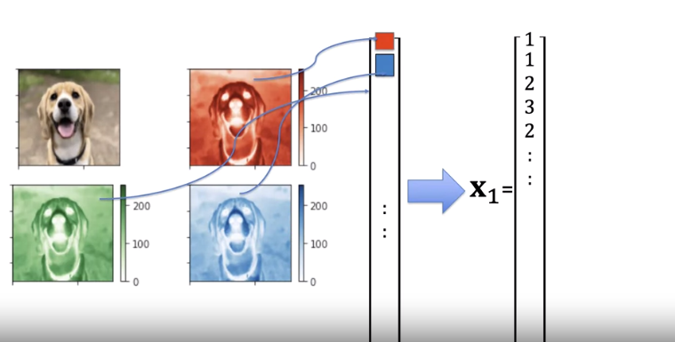

Concatenate the 3 channel images to a vector or use gray scale. 

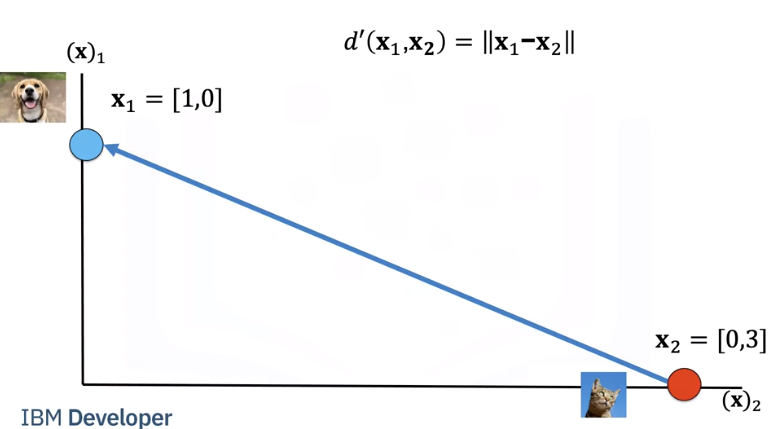

We can calculate the Euclidean distance between two images as i.e the length of the vector connecting the two points.

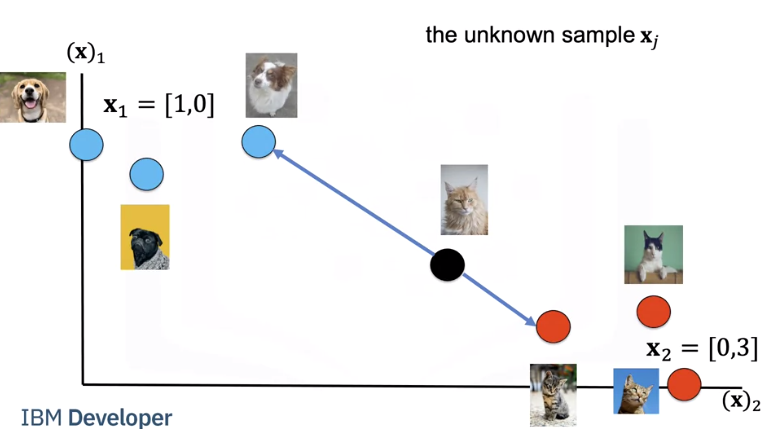

We have a set of images. We will refer to them as training samples. If we have an unknown sample, we calculate the distance between each image.

Let's put the images in a table where each row is a sample, the second column is a class, the final column is the distance from each sample to the unknown point. We will use the distance to predict the label of the unknown class. As this is a guess or prediction of the class we use $\hat{y}$. The hat means it's an estimate. We calculate the distance from our unknown sample.

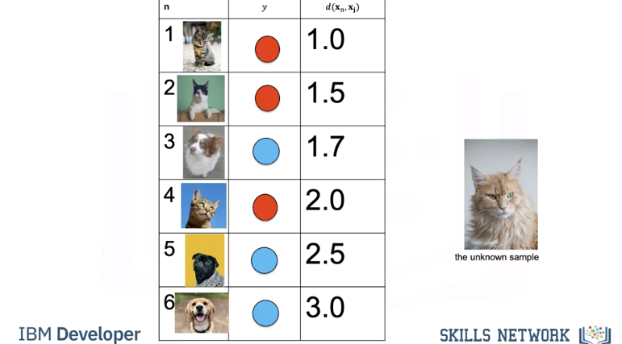

We find the nearest point or nearest neighbour. We assign the label to the unknown sample. We sometimes call this a model. KNN is simple to code yourself or you can use a software package like sklearn.

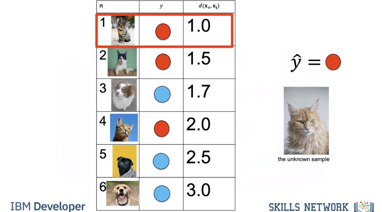

We repeat the process for the next unknown sample.

### Test/Train

Accuracy shows us how good our method works i,e the average number of times our model got it correct. Let's use the following table to calculate accuracy on some test data. The first row in the Table denotes different sample numbers; the second row shows the actual class label, the third row is the predicted value and the final row will be one if the sample is predicted correctly or else it will be zero. We count the number of times the prediction is correct, we then take the average to get the accuracy.

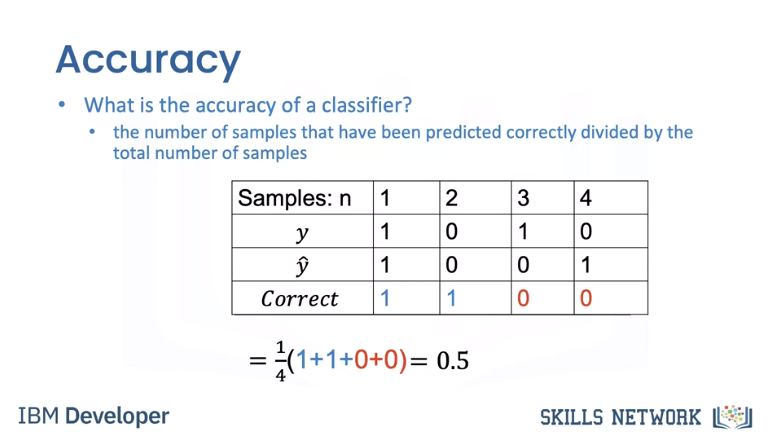

Finding the nearest samples does not always work best, consider the following in our 2d space. The cat is next to a dog that looks like a cat, but all the other samples next to the samples are cats. To handle this we find the K closest samples. We then perform majority vote; where within the sub set we find the class with the most number of samples and assign that label to the unknown sample, Let’s do an example where k=3 As before we calculate the distance.

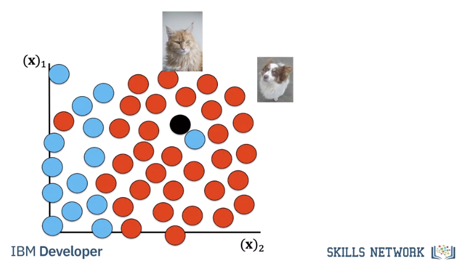

### Hyper Parameter K

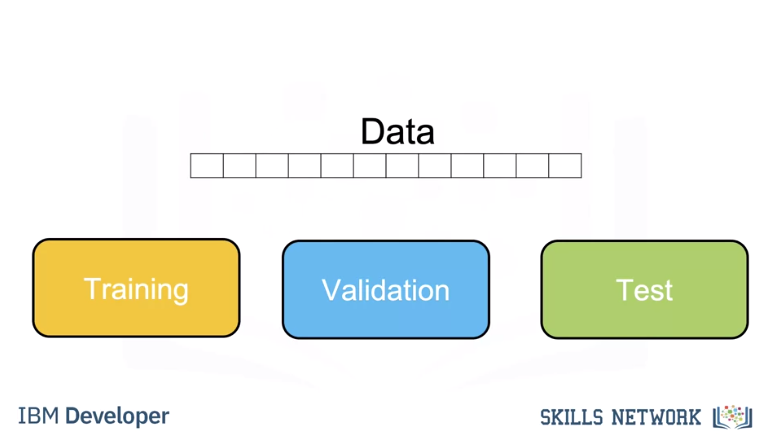

We use a subset called the validation data to determine the best K, this is called a hyper parameter. To select the 
Hyperparameter we split our data set into three parts, the training set, validation set, and test set. We use the training set for different hyperparameters, we use the accuracy for K on the validation data. We select the hyperparameter K that maximizes accuracy on the validation set. 

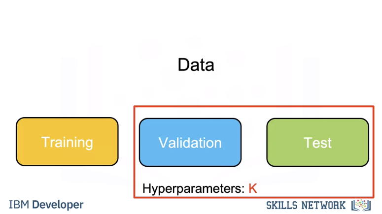

 Let’s do an example. In this example we take two samples. We calculate the accuracy for k=1. We calculate the accuracy for k=3. We select k=3 as it has better accuracy. 
 
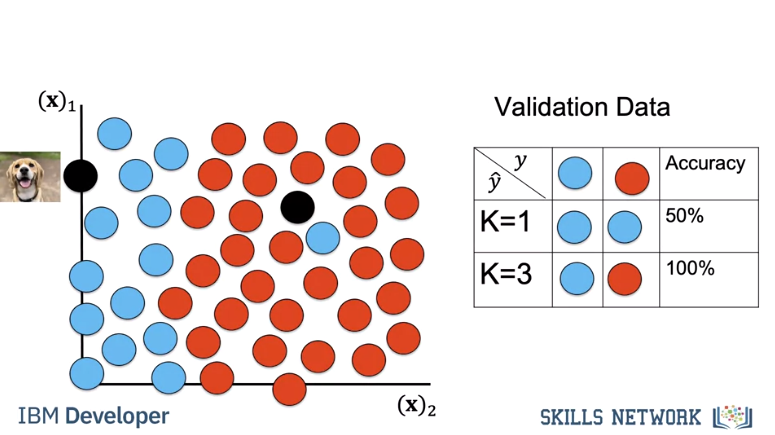
 

If our dataset has enough samples we expect this accuracy in the real world. Once you choose the value of K you can use KNN to classify an image. 

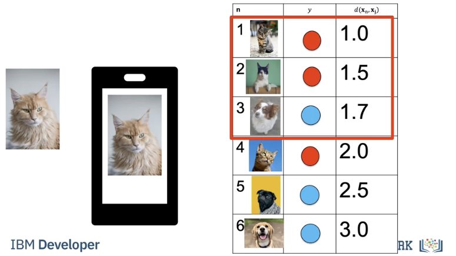

Let's say you build an app to recognize cats and dogs you let k equal to three you take the photo, under the hood your app will calculate the distances find the nearest neighbours and output the class as a string. 

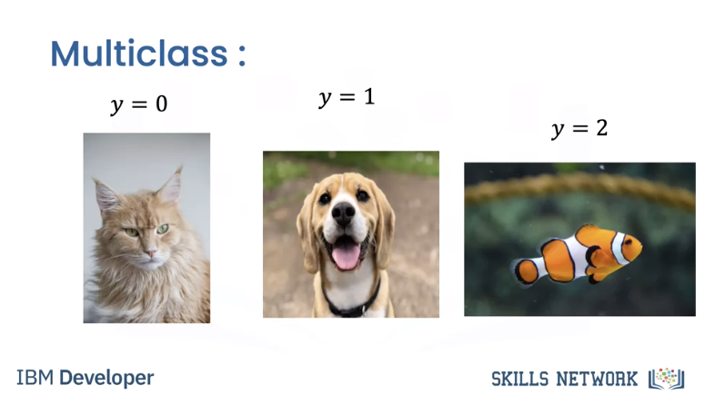

Finally, its simple to add another class, for example fish. 

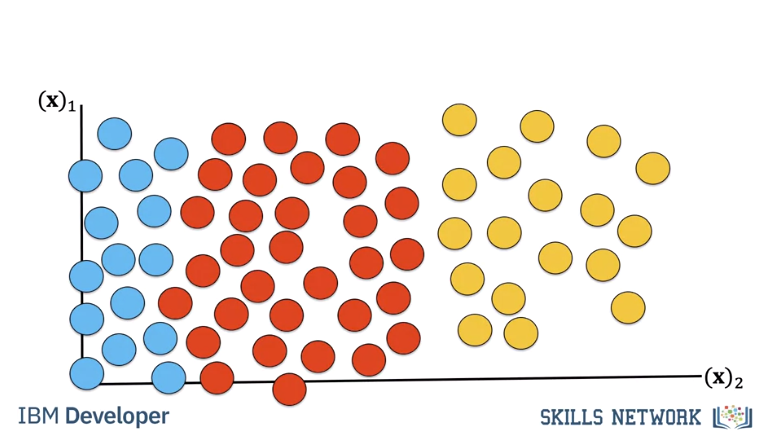

The result would look like this in our 2d space. KNN is not usually used in practice, knn is extremely slow, and it can’t deal with many of the Challenges of Image Classification so let’s learn about other classifiers

## KNN (K-nearest neighbors)

