# Image Features

In this video we will review Image Features. 

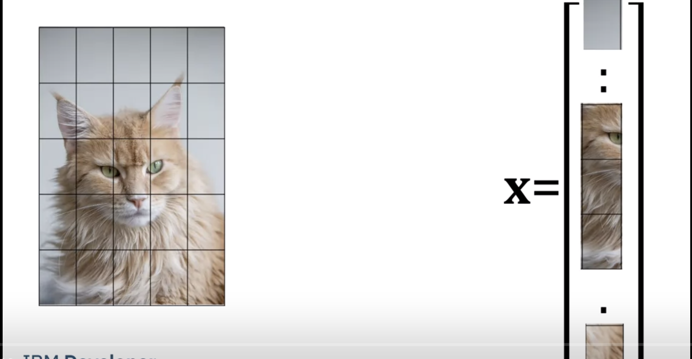

In practice using the image intensities for classification does not function well. Here we convert the image to a vector. We use large patches for illustrative purposes instead of individual pixel values.

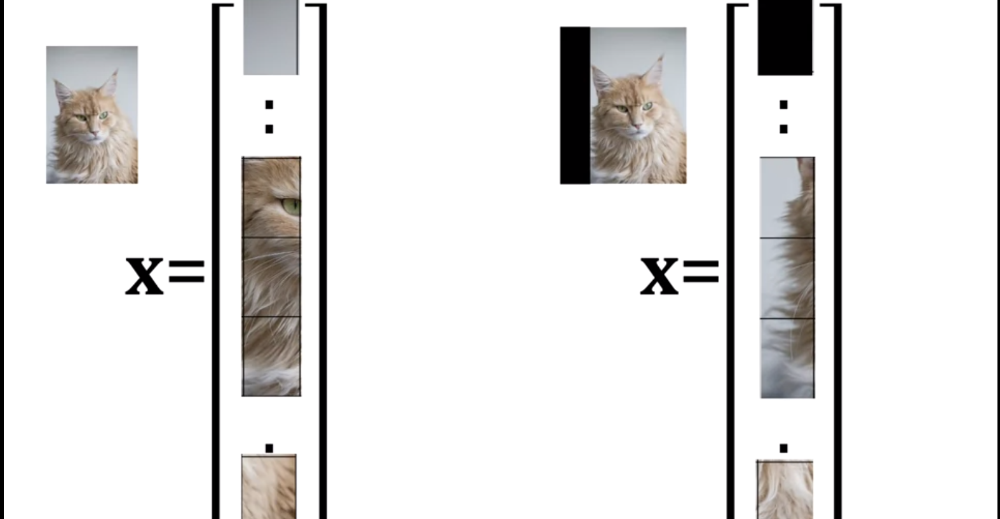

Classifying an image involves the relationship between pixels; a slight change in the image affects this relationship, as discussed in the first chapter. Consider how a minor shift affects the feature vector. Comparing the two vectors we see the small shift in the image makes the vectors different.

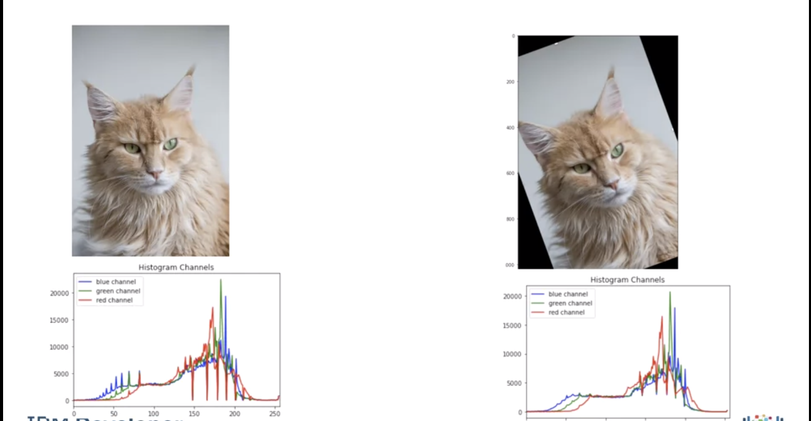

Features are measurements taken from the image that help with classification. For example here we have the color histogram. Determining the histogram of the shifted image and eliminating the zeros we see the histograms are similar. But the histograms only count intensities and does not consider the relationships between pixels.

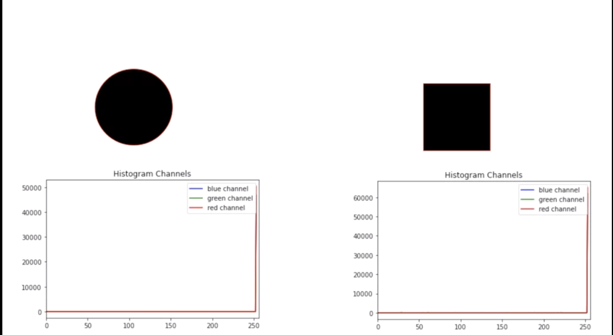

Here we have a circle and a square. The histogram only quantifies the fact that they have the same number of black pixels.

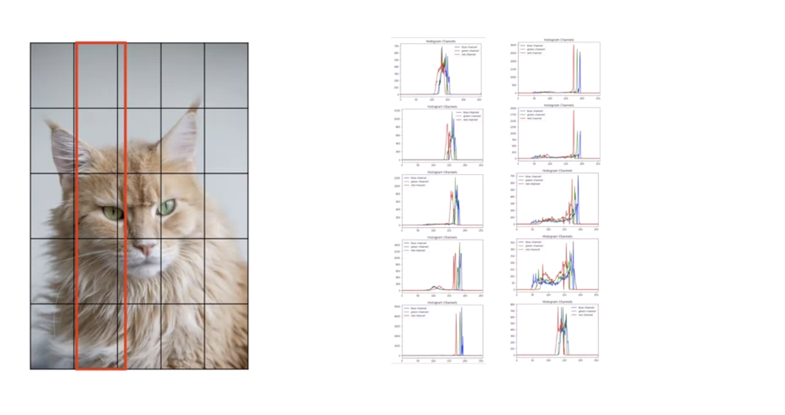

One way too overcome this problem, to split image into sub-images and calculate the histogram for each sub-image. Here we have the histogram for the first 5 sub images. Here we have the histogram for the second 5 sub images and so on.

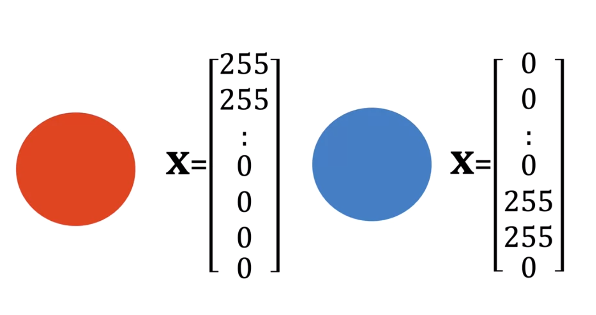

Color is not always the best tool for classification, consider the task of classifying a circle. In this case many of the elements of the red channel would have large values. For the blue circle only the elements of the blue or green channel would have a large magnitude. 

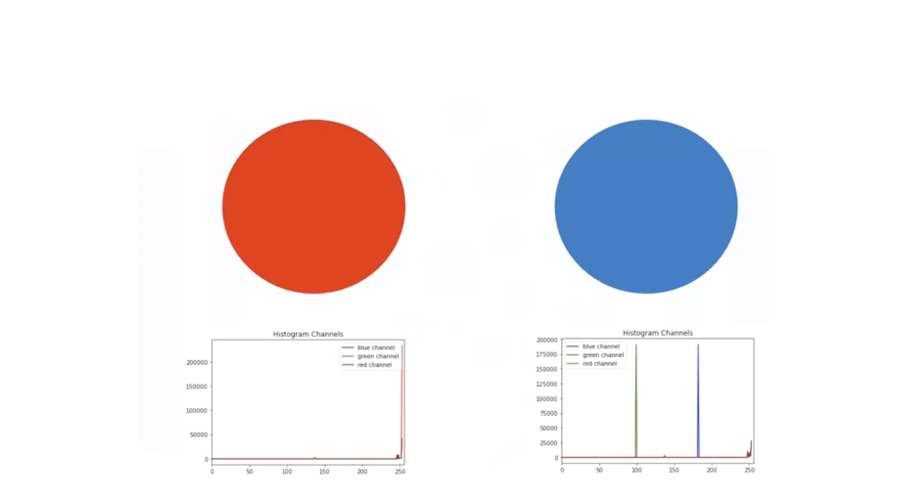

Their histograms have to be the same. Although humans use colors too classify images it's hard for people to come up with features that use colors. 

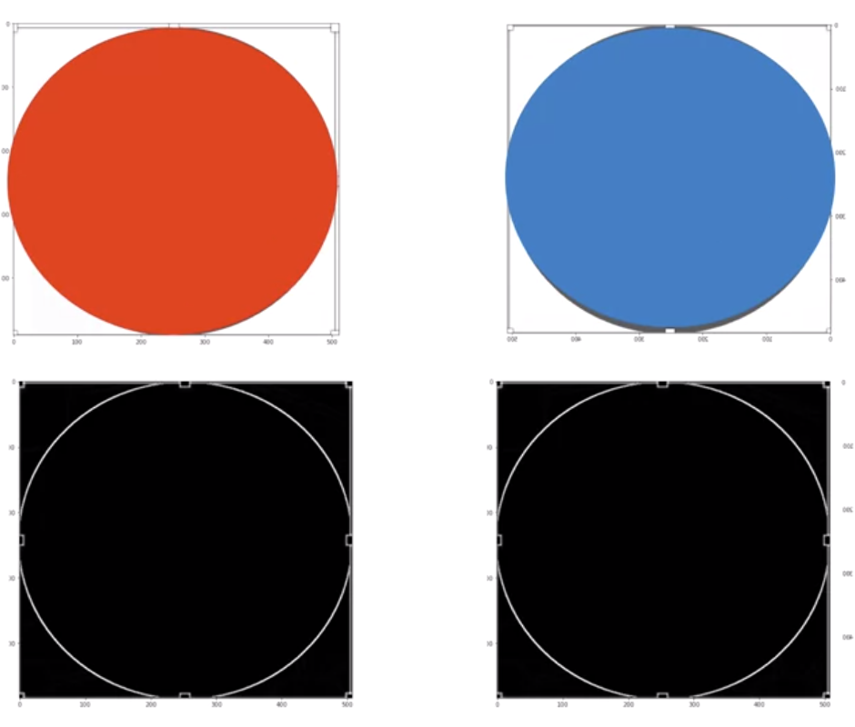

Consider the similar circles. Converting the image to gray scale we see they look similar, surprisingly the gradients look identical. As a result we us features based on gradients. 

## HOG

[Essential HOG explaination](https://learnopencv.com/histogram-of-oriented-gradients/)

HOG Is one of many image features we can use, it's relatively simple to understand. **Histogram of oriented gradients – H.O.G.**, is one of many types of features that have been developed over the years. The technique counts occurrences of gradient orientation in localized portions of an image.

HOG would generate a Histogram for each of these regions separately. The histograms are created using the gradients and orientations of the pixel values, hence the name ‘Histogram of Oriented Gradients’. Let's give a basic idea of how hog works. Consider the unit circle:

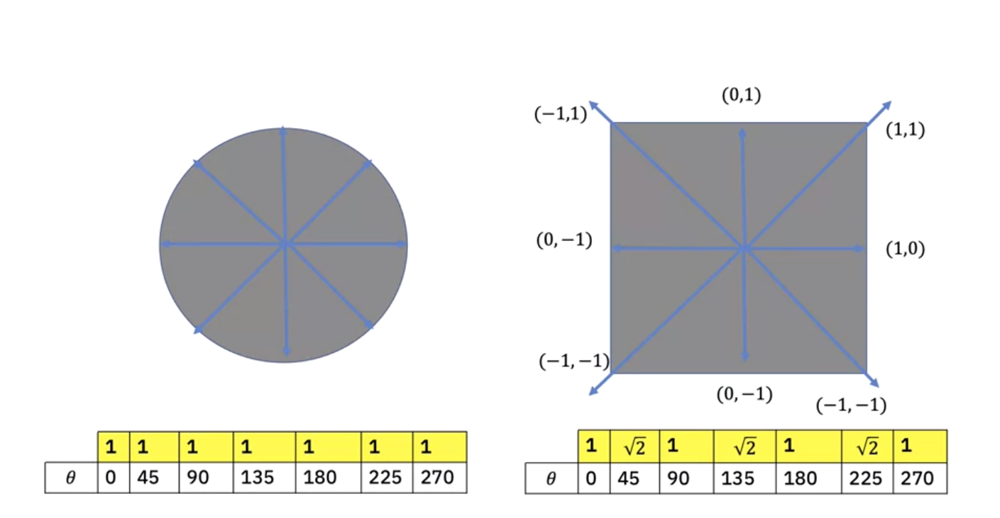

We expect the gradients to have the same magnitude. We can calculate the histogram where each bin index is the angle of the gradient. The value of the histogram is the magnitude. We can plot the gradians for the square. The square will have a different histogram. 

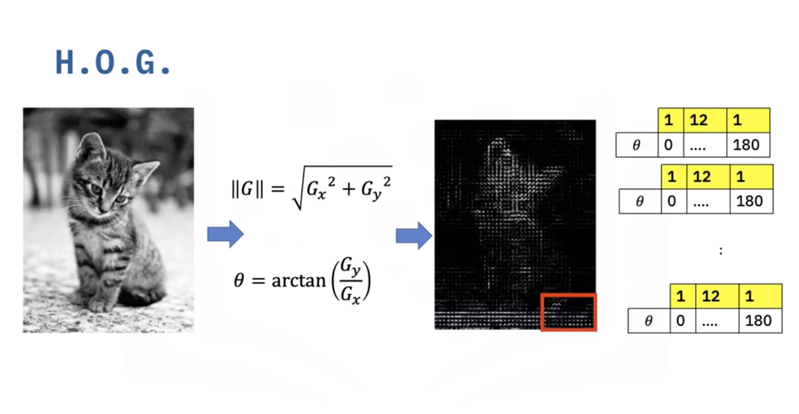

General (H.O.G.) is calculated as follows Assuming we have an image of a kitten. We will convert the image to grayscale, we calculate the magnitude and angles of the gradients using Sobel The images are divided in a grid fashion into cells, and for the pixels within each cell, a histogram of gradient directions is compiled. To improve imbalance to highlights and shadows in the image, cells are block normalized. 

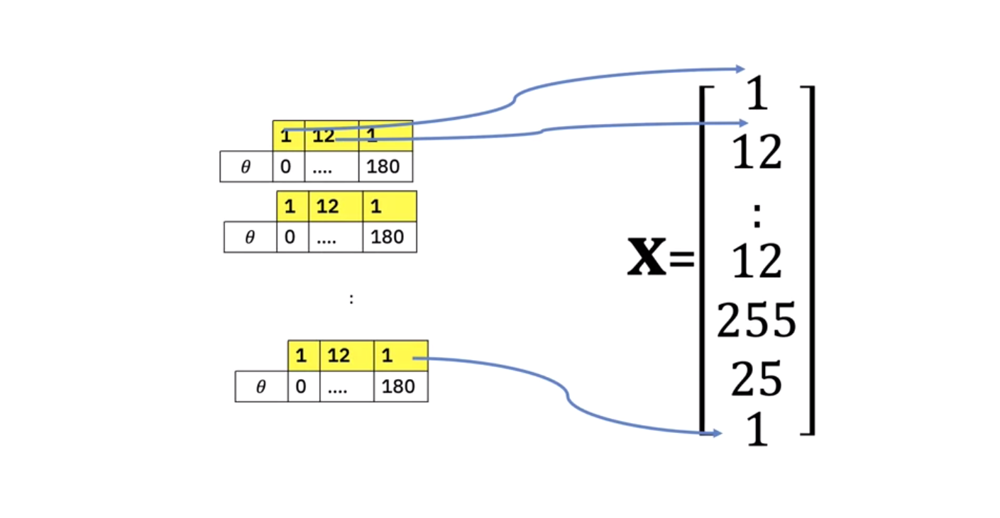

The HOG feature vector is a combination of all pixel-level histograms and used with SVM to classify the image. This example is simplified. We must also consider other free parameters like number of image cells or how many angle bins in the histogram. There are other types of features for images like SURF and SIFT.

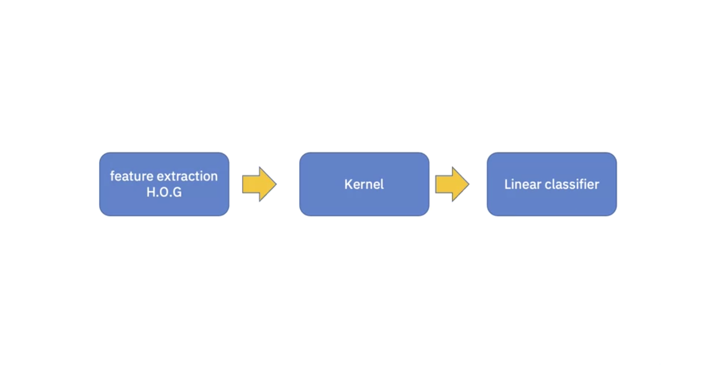

We can summarize the entire machine learning process as follows. Feature extraction, Kernel i.e non-linear mapping, Linear classification.
