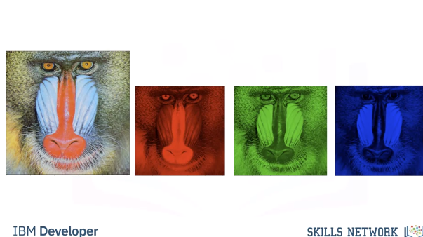
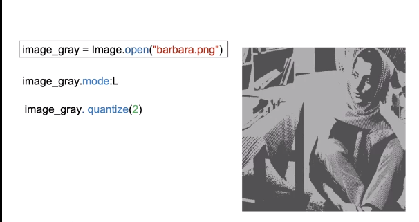
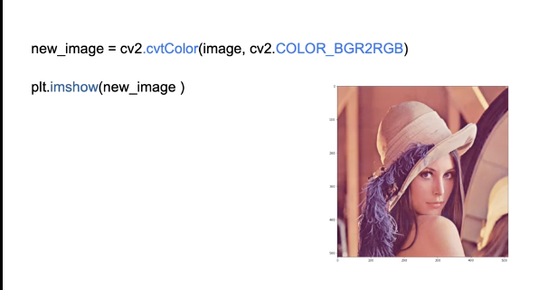
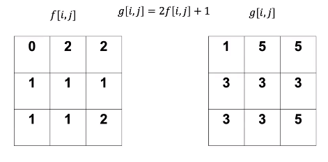

# Image Processing With OpenCV and Pillow

## What is a Digital Image
A rectangular array of numbers.


In the real world, an image can take on an almost unlimited number of values, but digital images have intensity values between zero (black) and 255 (white). It turns out that's all we need, 256 different intensity values to represent an image.

If we use less than 256 values, things will look cartoonish.


RGB:




Image Masks:


Basic Image Types:

An image is a file on your computer. Two popular image formats, Joint Photographic Expert Group image or JPEG, and Portable Network Graphics or PNG, these formats reduce file size and have other features. No matter what Python library you use, you're going to have to load the image

### PIL Intro


ImageOps:


Quantizing:



### Numpy Intro


### OpenCV Intro
OpenCV is a library used for computer vision. It has more functionality than the PIL library, but is more difficult to use.


We can plot the image using Imshow, but the colors appear off. This is because the order of each channel is different in OpenCV unlike PIL that is RGB. OpenCV is BGR. This is the main difference between the arrays and PIL versus OpenCV. We can change the color space with conversion code, this changes the color space. We use the function cvtColor, the input is the color image and the color code BGR to RGB or blue, green, red to red, green, blue. We can now plot the image. You can also convert the image to gray-scale using cvtColor. The input is the original image and the BGR to gray color code. We can plot the image. We can save the image using imright, the input is the path and the image array.


We can change the color space with conversion code, this changes the color space. We use the function cvtColor, the input is the color image and the color code BGR to RGB or blue, green, red to red, green, blue. We can now plot the image. You can also convert the image to gray-scale using cvtColor. The input is the original image and the BGR to gray color code. We can plot the image.



## Image Processing With Pillow

### Image Files and Paths
```bash
# Setup Environment
cd ~/Desktop; rm -r temp; # To remove
cd ~/Desktop; mkdir temp; cd temp; pyenv activate venv3.10.4;

wget https://cf-courses-data.s3.us.cloud-object-storage.appdomain.cloud/IBMDeveloperSkillsNetwork-CV0101EN-SkillsNetwork/images%20/images_part_1/lenna.png -O lenna.png

wget https://cf-courses-data.s3.us.cloud-object-storage.appdomain.cloud/IBMDeveloperSkillsNetwork-CV0101EN-SkillsNetwork/images%20/images_part_1/baboon.png -O baboon.png

wget https://cf-courses-data.s3.us.cloud-object-storage.appdomain.cloud/IBMDeveloperSkillsNetwork-CV0101EN-SkillsNetwork/images%20/images_part_1/barbara.png -O barbara.png  
```
Image processing and computer vision tasks include displaying, cropping, flipping, rotating,  image segmentation, classification, image restoration,  image recognition, image generation.  Also, working with images via the cloud requires storing, transmitting, and gathering images through the internet. 

```python
import os
from PIL import Image
from PIL import ImageOps 
import matplotlib.pyplot as plt
import numpy as np
# First, let's define a helper function to concatenate two images side-by-side. You will not need to understand the code below at this moment, but this function will be used repeatedly in this tutorial to showcase the results.

def get_concat_h(im1, im2):
    #https://note.nkmk.me/en/python-pillow-concat-images/
    dst = Image.new('RGB', (im1.width + im2.width, im1.height))
    dst.paste(im1, (0, 0))
    dst.paste(im2, (im1.width, 0))
    return dst

my_image = "lenna.png"

```
File Types:
* Joint Photographic Expert Group image (or `.jpg` `.jpeg`)
* Portable Network Graphics (or `.png`)

```python
cwd = os.getcwd()
image_path = os.path.join(cwd, my_image)
image = Image.open(my_image)
type(image) # <class 'PIL.PngImagePlugin.PngImageFile'>
image.show()

# Matplotlib
plt.figure(figsize=(10,10))
plt.imshow(image)
plt.show()

# Load in with PIL.Image
image = Image.open(image_path)

# Size
print(image.size) # (512, 512)

# Mode
print(image.mode)

```

The `Image.open` method does not load image data into the computer memory. The `load` method of `PIL` object reads the file content, decodes it, and expands the image into memory.

```python
im = image.load() 

# We can then check the intensity of the image at the $x$-th column and $y$-th row:
x = 0
y = 1
im[y,x] # (226, 137, 125)

# Save
image.save("lenna.jpg")
```

### Greyscale

```python
image_gray = ImageOps.grayscale(image) 
image_gray.show()
image_gray.mode # Mode is L for greyscale.
```

#### Quantization
The Quantization of an image is the number of unique intensity values any given pixel of the image can take. For a grayscale image, this means the number of different shades of gray. Most images have 256 different levels. You can decrease the levels using the method `quantize`. Let's repeatably cut the number of levels in half and observe what happens:

```python
# Half the levels do not make a noticable difference.
image_gray.quantize(256 // 2)
image_gray.show()

# Let’s continue dividing the number of values by two and compare it to the original image.
for n in range(3,8):
    plt.figure(figsize=(10,10))
    plt.imshow(get_concat_h(image_gray,  image_gray.quantize(256//2**n))) 
    plt.title("256 Quantization Levels  left vs {}  Quantization Levels right".format(256//2**n))
    plt.show()
```

#### Color Channels

```python
baboon = Image.open('baboon.png')
# We can obtain the different RGB color channels and assign them to the variables red, green and blue
red, green, blue = baboon.split()

# color vs each channel
get_concat_h(baboon, red).show()
get_concat_h(baboon, green).show()
get_concat_h(baboon, blue).show()

array= np.asarray(image)
print(type(array))
```

`np.asarray` turns the original image into a numpy array. Often, we don't want to manipulate the image directly, but instead, create a copy of the image to manipulate. The `np.array` method creates a new copy of the image, such that the original one will remain unmodified.

```python
array = np.array(image)
# summarize shape
print(array.shape)
# The Intensity values are  8-bit unsigned datatype.
array[0, 0]
```

#### Indexing
You can plot the array as an image:
```python
# Review
plt.figure(figsize=(10,10))
plt.imshow(array)
plt.show()

# We can use numpy slicing, for example, we can return the first 256 rows corresponding to the top half of the image:
rows = 256
plt.figure(figsize=(10,10))
plt.imshow(array[0:rows,:,:])
plt.show()
# We can also return the first 256 columns corresponding to the first half of the image.
columns = 256
plt.figure(figsize=(10,10))
plt.imshow(array[:,0:columns,:])
plt.show()
# If you want to reassign an array to another variable, you should use the `copy` method (we will cover this in the next section).
A = array.copy()
plt.imshow(A)
plt.show()
# If we do not apply the method copy(), the variable will point to the same location in memory. Consider the array B. If we set all values of array A to zero, as B points to A, the values of B will be zero too:
B = A
A[:,:,:] = 0
plt.imshow(B)
plt.show()
# We can also work with the different color channels. Consider the baboon image: 
baboon_array = np.array(baboon)
plt.figure(figsize=(10,10))
plt.imshow(baboon_array)
plt.show()
# We can plot the red channel as intensity values of the red channel.
baboon_array = np.array(baboon)
plt.figure(figsize=(10,10))
plt.imshow(baboon_array[:,:,0], cmap='gray')
plt.show()
# Or we can create a new array and set all but the red color channels to zero. Therefore, when we display the image it appears red:
baboon_red=baboon_array.copy()
baboon_red[:,:,1] = 0
baboon_red[:,:,2] = 0
plt.figure(figsize=(10,10))
plt.imshow(baboon_red)
plt.show()
```

## Manipulating Images

Copying allows you to create a new image independent of the original.

```python
from PIL import Image
from PIL import ImageOps
from PIL import ImageDraw
from PIL import ImageFont
import cv2
import numpy as np
import matplotlib.pyplot as plt

baboon = Image.open('baboon.png'); # baboon.show()
id(baboon) # 140014182059888
A = baboon
id(A) # 140014182059888
B = baboon.copy()
id(B) # 140014180362048

# basic flip
im_flip = ImageOps.flip(baboon)
im_flip.show()
# mirror
im_mirror = ImageOps.mirror(baboon)
im_mirror.show()
# transpose (has built in attributes for different transpositions)
baboon.transpose(Image.FLIP_TOP_BOTTOM).show()


# flip with cv2 (more control)
baboon = cv2.imread('baboon.png'); # baboon.show()

baboon = cv2.cvtColor(baboon, cv2.COLOR_BGR2RGB)
im_flip = cv2.flip(baboon,0)
im_rotate = cv2.rotate(baboon,cv2.ROTATE_90_CLOCKWISE)

baboon_imshow = plt.imshow(baboon)
baboon_flip_imshow = plt.imshow(im_flip)
baboon_rotate_imshow = plt.imshow(im_rotate)

plt.show() # show any one of those
```

## Manipulating Images One Pixel At a Time
* Cropping
* Changing Image Pixels

```python
baboon = Image.open('baboon.png'); # baboon.show()
# Cropping
baboon_np = np.array(baboon)
baboon_np[2:5,:,0] # rows 3-5 of 1st channel
baboon_np[2:5,3:7,0] # rows 3-5, cols 4-7 of 1st channel

baboon_np[:,:,0] = 255
plt.imshow(baboon_np); plt.show()


```

### Drawing
#### Rectangle
```python
baboon = Image.open('baboon.png'); # baboon.show()
img_copy = baboon.copy()
image_fn = ImageDraw.Draw(im=img_copy)
shape = [0,0,50,50]
image_fn.rectangle(xy=shape,fill='red')
img_array = np.array(img_copy)

plt.imshow(img_array) # either works
plt.imshow(img_copy) # either works
plt.show()
```

#### Text
```python
baboon = Image.open('baboon.png'); # baboon.show()
img_copy = baboon.copy()
# Fonts: https://www.fontsquirrel.com/fonts/list/popular
fnt = ImageFont.truetype('/home/bbearce/Downloads/open-sans/OpenSans-BoldItalic.ttf', 100)
image_fn = ImageDraw.Draw(im=img_copy)
image_fn.text(xy=(0,0),text="box", font=fnt,fill=(0,0,0))
plt.imshow(img_copy)
plt.show()
```

#### Cropped Image

Consider the image “crop_image” of a cat. We also have the “image_lenna ”, we can superimpose the image of the cat over “image Lenna”, all we need is the coordinates indicating where to paste the picture. We use the paste() method, the input is the image we would like to super-impose and the box parameter specifies the top left corner of the image you would like to paste and the box parameter specifies the top left corner of the image you would like to paste 

```python
baboon = Image.open('baboon.png'); # baboon.show()
baboon_c = baboon.copy()
lenna = Image.open('lenna.png'); # lenna.show()
lenna_cropped = lenna.crop((0,0,300,300))

left = 150
upper = 150

baboon_c.paste(lenna_cropped, box=(left,upper))

plt.imshow(baboon_c)
plt.show()
```

#### OpenCV Manipulations
```python
baboon = cv2.imread('baboon.png'); # baboon.show()
baboon = cv2.cvtColor(baboon, cv2.COLOR_BGR2RGB)
baboon_c = np.copy(baboon)
left = 150
upper = 150
right = 300
lower = 300

start_point, end_point = (left, upper),(right, lower)
cv2.rectangle(baboon_c, pt1=start_point, pt2=end_point, color=(0,255,0), thickness=3)
plt.imshow(baboon_c)
plt.show()
```


```python
cv2.putText(img=baboon_c, text="Stuff", org=(10,500), color=(255,255,255), fontFace=4, fontScale=5, thickness=9)
plt.imshow(baboon_c)
plt.show()
```


## Pixel Transformations

1. Histograms
2. Intensity Transformations
3. Thresholding and Simple Segmentation

### Histograms
 A histogram counts the number of occurrences of a pixel, and it's a useful tool for understanding and manipulating images.

Consider the following toy image with three intensity values, we can plot the occurrence of each pixel we have one black pixel, 5 gray pixels and two white pixels instead of counting the pixels, we can count the intensity values. 


Consider the following example as numbers ranging from 0 to 2, where 0 is black, 1 gray and 2 is white The histogram counts the pixel intensities. We represent these intensities as an array, the index of the array is the intensity level r in most images we have 256 levels, representing the count of the different intensity of gray levels consider the following image.  


We can calculate the histogram as follows. We have the image, the channel we would like to calculate, in this video we use the gray scale, the number of channels. Finally we have the range of intensity values in yellow We can plot the histogram as a bar graph.  


```python
cv2.calcHist(images, channels, mask, histSize, ranges[, hist[, accumulate]])
```


### Intensity Transformations
 An Intensity Transformation T depends on only one single point i,j, in the image array “f”, the image array ”f” is converted to array g.  


 The transform also operates on the intensity of gray levels “r” mapping them them to “s” This changes the histogram, lets apply a simple transform to a toy image.  


We apply the following linear transform to the image array f, returning the array g, we apply the transform at the pixel located at the first row first column we get the following result at the same pixel location at array g We apply the transform at the pixel located at the second row first column We get the following result at the same index in array g We repeat the process for the entire array.  





We have the histogram each pixel intensity is a function of “r” or histogram r The transform maps each intensity value at r to s we have the new intensity values s and it’s histogram s, let’s see the relationship between histogram “s” and “r” the value of histogram r has one intensity value at zero(click 1) the value of histogram r has one intensity value at zero when applying the transform to r we see the intensity value of zero is mapped to 1 the histogram s now has one intensity value at one we see the intensity value r =1 is mapped to 3 the histogram r has a value of 5 at r=1 In histogram s the value of 5 is mapped to s=3, and so on.  


If we plot the histogram after applying the transform, we see the histogram is shifted and scaled.  


### Image Negatives
Reverse intensity levels of an image. Consider the following image:


The following is the transformed image:

We can apply the transform as an array operation as follows The new image looks like this; we see the details are much more evident.  


Consider the following histogram:
  * We overlay transform as function of intensity (axis on right)
  * This flips graph about the 125 intensity point on x-axis


### Brightness and Contrast Adjustments

A linear transform can be seen as applying Brightness and Contrast Adjustments. 

We can use the following linear model where alpha is Simple contrast control and beta is Simple brightness control We can use the following values, just changing beta we can adjust the brightness Rather than using array operations we use the function “convertScaleAbs” after applying the transformation. The function scales, calculates absolute values, so the intensity values fall in the 0 to 255 value range We see the image is much brighter.  


We see the histogram of the bright image has shifted to the right. A lot of the intensity values have been mapped to the point value of 255.  


We can adjust alpha to change the contrast.  


We see the contrast in the darker areas have improved but the lighter areas the image appears washed out Comparing the original image histogram to the histogram of the new image We see the lower values exhibit more spread, but many of the larger values have been mapped to 255 explaining why the image appeared washed out.  


### Historgram Equalization
We can use nonlinear functions, but let’s explore some algorithms that optimize contrast.  

Consider, the following image with following histogram the function “equalizeHist” improves contrast, by using the histogram to determine a transform that flattens the histogram, the resulting image has improved contrast.  


### Thresholding and Simple Segmentation

A threshold function applies a threshold to every pixel, it can be used in extracting objects from an image this is called segmentation The following function applies a threshold to the input array input image array imput_out and outputs the result the following portion of the code will cycle through each pixel (𝑖,𝑗). If the pixel is greater then that threshold It will set a pixel in the array “image_out” pixel to some value, usually 1 or 255, Otherwise it will set it to another value, usually zero.  


Consider the following array In this case the threshold value is 1 and the min value is 0 and the max value 255 the first loop increments through the rows, for each column in “input_img” we check the condition if the values greater than 1 we set the corresponding element in “image_out” to 255. Otherwise we set it to zeros.  


We repeat the process for the second row As none of the columns are less than one all the corresponding rows in ”Image_out” is set to zero.  


We repeat the process for the final row.  


The result is all the values in the new image array are white or black.  


Consider the following image, it’s histogram bimodal We see the camera man corresponds to the first mode i.e intensities under 87, the second mode is the back round. By setting the threshold accordingly we can segment the camera man. We use the function threshold to perform thresholding, the output new_image is the image after thresholding has been applied. Along with the image ld the input is the threshold and the max value is set to 255. The final parameter is the threshold type, in this case THRESH_BINARY. This means the output will be 0 or 255. In the output we see the camera has zero values and most of the background has values of 255.  

We see the histograms intensities are mapped to black and wight after thresholding has been applied.  


Sometimes its difficult to select a threshold, therefore we can use OTSU method to select the value automatically. ret is the threshold value determined, We see the image looks identical to the one using the manual threshold.  

