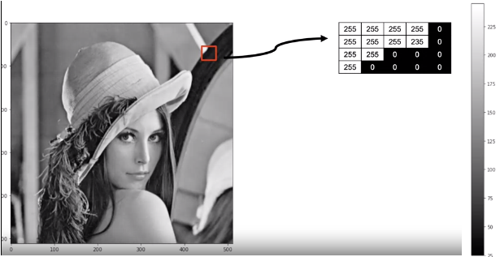
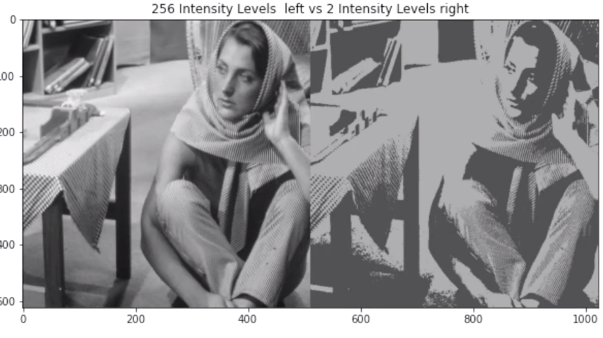
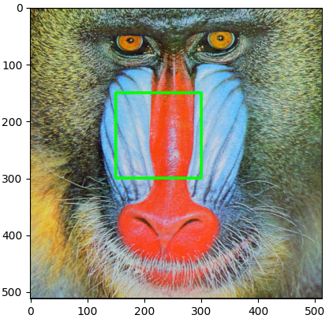
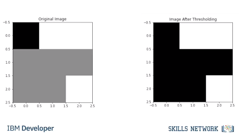
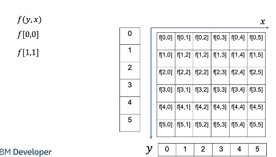

# Image Processing With OpenCV and Pillow

## What is a Digital Image
A rectangular array of numbers.



In the real world, an image can take on an almost unlimited number of values, but digital images have intensity values between zero (black) and 255 (white). It turns out that's all we need, 256 different intensity values to represent an image.

If we use less than 256 values, things will look cartoonish.




RGB:


Image Masks:


Basic Image Types:

An image is a file on your computer. Two popular image formats, Joint Photographic Expert Group image or JPEG, and Portable Network Graphics or PNG, these formats reduce file size and have other features. No matter what Python library you use, you're going to have to load the image

### PIL Intro


ImageOps:


Quantizing:


### Numpy Intro


### OpenCV Intro
OpenCV is a library used for computer vision. It has more functionality than the PIL library, but is more difficult to use.


We can plot the image using Imshow, but the colors appear off. This is because the order of each channel is different in OpenCV unlike PIL that is RGB. OpenCV is BGR. This is the main difference between the arrays and PIL versus OpenCV. We can change the color space with conversion code, this changes the color space. We use the function cvtColor, the input is the color image and the color code BGR to RGB or blue, green, red to red, green, blue. We can now plot the image. You can also convert the image to gray-scale using cvtColor. The input is the original image and the BGR to gray color code. We can plot the image. We can save the image using imright, the input is the path and the image array.


We can change the color space with conversion code, this changes the color space. We use the function cvtColor, the input is the color image and the color code BGR to RGB or blue, green, red to red, green, blue. We can now plot the image. You can also convert the image to gray-scale using cvtColor. The input is the original image and the BGR to gray color code. We can plot the image.


## Image Processing With Pillow

### Image Files and Paths
```bash
# Setup Environment
cd ~/Desktop; rm -r temp; # To remove
cd ~/Desktop; mkdir temp; cd temp; pyenv activate venv3.10.4;

wget https://cf-courses-data.s3.us.cloud-object-storage.appdomain.cloud/IBMDeveloperSkillsNetwork-CV0101EN-SkillsNetwork/images%20/images_part_1/lenna.png -O lenna.png

wget https://cf-courses-data.s3.us.cloud-object-storage.appdomain.cloud/IBMDeveloperSkillsNetwork-CV0101EN-SkillsNetwork/images%20/images_part_1/baboon.png -O baboon.png

wget https://cf-courses-data.s3.us.cloud-object-storage.appdomain.cloud/IBMDeveloperSkillsNetwork-CV0101EN-SkillsNetwork/images%20/images_part_1/barbara.png -O barbara.png  
```
Image processing and computer vision tasks include displaying, cropping, flipping, rotating,  image segmentation, classification, image restoration,  image recognition, image generation.  Also, working with images via the cloud requires storing, transmitting, and gathering images through the internet. 

```python
import os
from PIL import Image
from PIL import ImageOps 
import matplotlib.pyplot as plt
import numpy as np
# First, let's define a helper function to concatenate two images side-by-side. You will not need to understand the code below at this moment, but this function will be used repeatedly in this tutorial to showcase the results.

def get_concat_h(im1, im2):
    #https://note.nkmk.me/en/python-pillow-concat-images/
    dst = Image.new('RGB', (im1.width + im2.width, im1.height))
    dst.paste(im1, (0, 0))
    dst.paste(im2, (im1.width, 0))
    return dst

my_image = "lenna.png"

```
File Types:
* Joint Photographic Expert Group image (or `.jpg` `.jpeg`)
* Portable Network Graphics (or `.png`)

```python
cwd = os.getcwd()
image_path = os.path.join(cwd, my_image)
image = Image.open(my_image)
type(image) # <class 'PIL.PngImagePlugin.PngImageFile'>
image.show()

# Matplotlib
plt.figure(figsize=(10,10))
plt.imshow(image)
plt.show()

# Load in with PIL.Image
image = Image.open(image_path)

# Size
print(image.size) # (512, 512)

# Mode
print(image.mode)

```

The `Image.open` method does not load image data into the computer memory. The `load` method of `PIL` object reads the file content, decodes it, and expands the image into memory.

```python
im = image.load() 

# We can then check the intensity of the image at the $x$-th column and $y$-th row:
x = 0
y = 1
im[y,x] # (226, 137, 125)

# Save
image.save("lenna.jpg")
```

### Greyscale

```python
image_gray = ImageOps.grayscale(image) 
image_gray.show()
image_gray.mode # Mode is L for greyscale.
```

#### Quantization
The Quantization of an image is the number of unique intensity values any given pixel of the image can take. For a grayscale image, this means the number of different shades of gray. Most images have 256 different levels. You can decrease the levels using the method `quantize`. Let's repeatably cut the number of levels in half and observe what happens:

```python
# Half the levels do not make a noticable difference.
image_gray.quantize(256 // 2)
image_gray.show()

# Let’s continue dividing the number of values by two and compare it to the original image.
for n in range(3,8):
    plt.figure(figsize=(10,10))
    plt.imshow(get_concat_h(image_gray,  image_gray.quantize(256//2**n))) 
    plt.title("256 Quantization Levels  left vs {}  Quantization Levels right".format(256//2**n))
    plt.show()
```

#### Color Channels

```python
baboon = Image.open('baboon.png')
# We can obtain the different RGB color channels and assign them to the variables red, green and blue
red, green, blue = baboon.split()

# color vs each channel
get_concat_h(baboon, red).show()
get_concat_h(baboon, green).show()
get_concat_h(baboon, blue).show()

array= np.asarray(image)
print(type(array))
```

`np.asarray` turns the original image into a numpy array. Often, we don't want to manipulate the image directly, but instead, create a copy of the image to manipulate. The `np.array` method creates a new copy of the image, such that the original one will remain unmodified.

```python
array = np.array(image)
# summarize shape
print(array.shape)
# The Intensity values are  8-bit unsigned datatype.
array[0, 0]
```

#### Indexing
You can plot the array as an image:
```python
# Review
plt.figure(figsize=(10,10))
plt.imshow(array)
plt.show()

# We can use numpy slicing, for example, we can return the first 256 rows corresponding to the top half of the image:
rows = 256
plt.figure(figsize=(10,10))
plt.imshow(array[0:rows,:,:])
plt.show()
# We can also return the first 256 columns corresponding to the first half of the image.
columns = 256
plt.figure(figsize=(10,10))
plt.imshow(array[:,0:columns,:])
plt.show()
# If you want to reassign an array to another variable, you should use the `copy` method (we will cover this in the next section).
A = array.copy()
plt.imshow(A)
plt.show()
# If we do not apply the method copy(), the variable will point to the same location in memory. Consider the array B. If we set all values of array A to zero, as B points to A, the values of B will be zero too:
B = A
A[:,:,:] = 0
plt.imshow(B)
plt.show()
# We can also work with the different color channels. Consider the baboon image: 
baboon_array = np.array(baboon)
plt.figure(figsize=(10,10))
plt.imshow(baboon_array)
plt.show()
# We can plot the red channel as intensity values of the red channel.
baboon_array = np.array(baboon)
plt.figure(figsize=(10,10))
plt.imshow(baboon_array[:,:,0], cmap='gray')
plt.show()
# Or we can create a new array and set all but the red color channels to zero. Therefore, when we display the image it appears red:
baboon_red=baboon_array.copy()
baboon_red[:,:,1] = 0
baboon_red[:,:,2] = 0
plt.figure(figsize=(10,10))
plt.imshow(baboon_red)
plt.show()
```

## Manipulating Images

Copying allows you to create a new image independent of the original.

```python
from PIL import Image
from PIL import ImageOps
from PIL import ImageDraw
from PIL import ImageFont
import cv2
import numpy as np
import matplotlib.pyplot as plt

baboon = Image.open('baboon.png'); # baboon.show()
id(baboon) # 140014182059888
A = baboon
id(A) # 140014182059888
B = baboon.copy()
id(B) # 140014180362048

# basic flip
im_flip = ImageOps.flip(baboon)
im_flip.show()
# mirror
im_mirror = ImageOps.mirror(baboon)
im_mirror.show()
# transpose (has built in attributes for different transpositions)
baboon.transpose(Image.FLIP_TOP_BOTTOM).show()


# flip with cv2 (more control)
baboon = cv2.imread('baboon.png'); # baboon.show()

baboon = cv2.cvtColor(baboon, cv2.COLOR_BGR2RGB)
im_flip = cv2.flip(baboon,0)
im_rotate = cv2.rotate(baboon,cv2.ROTATE_90_CLOCKWISE)

baboon_imshow = plt.imshow(baboon)
baboon_flip_imshow = plt.imshow(im_flip)
baboon_rotate_imshow = plt.imshow(im_rotate)

plt.show() # show any one of those
```

### Manipulating Images One Pixel At a Time
* Cropping
* Changing Image Pixels

```python
baboon = Image.open('baboon.png'); # baboon.show()
# Cropping
baboon_np = np.array(baboon)
baboon_np[2:5,:,0] # rows 3-5 of 1st channel
baboon_np[2:5,3:7,0] # rows 3-5, cols 4-7 of 1st channel

baboon_np[:,:,0] = 255
plt.imshow(baboon_np); plt.show()


```

### Drawing
#### Rectangle
```python
baboon = Image.open('baboon.png'); # baboon.show()
img_copy = baboon.copy()
image_fn = ImageDraw.Draw(im=img_copy)
shape = [0,0,50,50]
image_fn.rectangle(xy=shape,fill='red')
img_array = np.array(img_copy)

plt.imshow(img_array) # either works
plt.imshow(img_copy) # either works
plt.show()
```

#### Text
```python
baboon = Image.open('baboon.png'); # baboon.show()
img_copy = baboon.copy()
# Fonts: https://www.fontsquirrel.com/fonts/list/popular
fnt = ImageFont.truetype('/home/bbearce/Downloads/open-sans/OpenSans-BoldItalic.ttf', 100)
image_fn = ImageDraw.Draw(im=img_copy)
image_fn.text(xy=(0,0),text="box", font=fnt,fill=(0,0,0))
plt.imshow(img_copy)
plt.show()
```

#### Cropped Image

Consider the image “crop_image” of a cat. We also have the “image_lenna ”, we can superimpose the image of the cat over “image Lenna”, all we need is the coordinates indicating where to paste the picture. We use the paste() method, the input is the image we would like to super-impose and the box parameter specifies the top left corner of the image you would like to paste and the box parameter specifies the top left corner of the image you would like to paste 

```python
baboon = Image.open('baboon.png'); # baboon.show()
baboon_c = baboon.copy()
lenna = Image.open('lenna.png'); # lenna.show()
lenna_cropped = lenna.crop((0,0,300,300))

left = 150
upper = 150

baboon_c.paste(lenna_cropped, box=(left,upper))

plt.imshow(baboon_c)
plt.show()
```

### OpenCV Manipulations
```python
baboon = cv2.imread('baboon.png'); # baboon.show()
baboon = cv2.cvtColor(baboon, cv2.COLOR_BGR2RGB)
baboon_c = np.copy(baboon)
left = 150
upper = 150
right = 300
lower = 300

start_point, end_point = (left, upper),(right, lower)
cv2.rectangle(baboon_c, pt1=start_point, pt2=end_point, color=(0,255,0), thickness=3)
plt.imshow(baboon_c)
plt.show()
```



```python
cv2.putText(img=baboon_c, text="Stuff", org=(10,500), color=(255,255,255), fontFace=4, fontScale=5, thickness=9)
plt.imshow(baboon_c)
plt.show()
```


## Pixel Transformations

1. Histograms
2. Intensity Transformations
3. Thresholding and Simple Segmentation

### Histograms
 A histogram counts the number of occurrences of a pixel, and it's a useful tool for understanding and manipulating images.

Consider the following toy image with three intensity values, we can plot the occurrence of each pixel we have one black pixel, 5 gray pixels and two white pixels instead of counting the pixels, we can count the intensity values. 


Consider the following example as numbers ranging from 0 to 2, where 0 is black, 1 gray and 2 is white The histogram counts the pixel intensities. We represent these intensities as an array, the index of the array is the intensity level r in most images we have 256 levels, representing the count of the different intensity of gray levels consider the following image.  


We can calculate the histogram as follows. We have the image, the channel we would like to calculate, in this video we use the gray scale, the number of channels. Finally we have the range of intensity values in yellow We can plot the histogram as a bar graph.  


```python
cv2.calcHist(images, channels, mask, histSize, ranges[, hist[, accumulate]])
```


### Intensity Transformations
 An Intensity Transformation T depends on only one single point i,j, in the image array “f”, the image array ”f” is converted to array g.  


 The transform also operates on the intensity of gray levels “r” mapping them them to “s” This changes the histogram, lets apply a simple transform to a toy image.  


We apply the following linear transform to the image array f, returning the array g, we apply the transform at the pixel located at the first row first column we get the following result at the same pixel location at array g We apply the transform at the pixel located at the second row first column We get the following result at the same index in array g We repeat the process for the entire array.  


We have the histogram each pixel intensity is a function of “r” or histogram r The transform maps each intensity value at r to s we have the new intensity values s and it’s histogram s, let’s see the relationship between histogram “s” and “r” the value of histogram r has one intensity value at zero(click 1) the value of histogram r has one intensity value at zero when applying the transform to r we see the intensity value of zero is mapped to 1 the histogram s now has one intensity value at one we see the intensity value r =1 is mapped to 3 the histogram r has a value of 5 at r=1 In histogram s the value of 5 is mapped to s=3, and so on.  


If we plot the histogram after applying the transform, we see the histogram is shifted and scaled.  


### Image Negatives
Reverse intensity levels of an image. Consider the following image:


The following is the transformed image:

We can apply the transform as an array operation as follows The new image looks like this; we see the details are much more evident.  


Consider the following histogram:
  * We overlay transform as function of intensity (axis on right)
  * This flips graph about the 125 intensity point on x-axis


### Brightness and Contrast Adjustments

A linear transform can be seen as applying Brightness and Contrast Adjustments. 

We can use the following linear model where alpha is Simple contrast control and beta is Simple brightness control We can use the following values, just changing beta we can adjust the brightness Rather than using array operations we use the function “convertScaleAbs” after applying the transformation. The function scales, calculates absolute values, so the intensity values fall in the 0 to 255 value range We see the image is much brighter.  


We see the histogram of the bright image has shifted to the right. A lot of the intensity values have been mapped to the point value of 255.  


We can adjust alpha to change the contrast.  


We see the contrast in the darker areas have improved but the lighter areas the image appears washed out Comparing the original image histogram to the histogram of the new image We see the lower values exhibit more spread, but many of the larger values have been mapped to 255 explaining why the image appeared washed out.  


### Historgram Equalization
We can use nonlinear functions, but let’s explore some algorithms that optimize contrast.  

Consider, the following image with following histogram the function “equalizeHist” improves contrast, by using the histogram to determine a transform that flattens the histogram, the resulting image has improved contrast.  


### Thresholding and Simple Segmentation

A threshold function applies a threshold to every pixel, it can be used in extracting objects from an image this is called segmentation The following function applies a threshold to the input array input image array imput_out and outputs the result the following portion of the code will cycle through each pixel (𝑖,𝑗). If the pixel is greater then that threshold It will set a pixel in the array “image_out” pixel to some value, usually 1 or 255, Otherwise it will set it to another value, usually zero.  


Consider the following array In this case the threshold value is 1 and the min value is 0 and the max value 255 the first loop increments through the rows, for each column in “input_img” we check the condition if the values greater than 1 we set the corresponding element in “image_out” to 255. Otherwise we set it to zeros.  


We repeat the process for the second row As none of the columns are less than one all the corresponding rows in ”Image_out” is set to zero.  


We repeat the process for the final row.  


The result is all the values in the new image array are white or black.  


Consider the following image, it’s histogram bimodal We see the camera man corresponds to the first mode i.e intensities under 87, the second mode is the back round. By setting the threshold accordingly we can segment the camera man. We use the function threshold to perform thresholding, the output new_image is the image after thresholding has been applied. Along with the image ld the input is the threshold and the max value is set to 255. The final parameter is the threshold type, in this case THRESH_BINARY. This means the output will be 0 or 255. In the output we see the camera has zero values and most of the background has values of 255.  

We see the histograms intensities are mapped to black and wight after thresholding has been applied.  


Sometimes its difficult to select a threshold, therefore we can use OTSU method to select the value automatically. ret is the threshold value determined, We see the image looks identical to the one using the manual threshold.  


### Code Lab
```bash
# Setup Environment
cd ~/Desktop; rm -r temp; # To remove
cd ~/Desktop; mkdir temp; cd temp; pyenv activate venv3.10.4;

wget https://cf-courses-data.s3.us.cloud-object-storage.appdomain.cloud/IBMDeveloperSkillsNetwork-CV0101EN-SkillsNetwork/images%20/images_part_1/lenna.png -O lenna.png
wget https://cf-courses-data.s3.us.cloud-object-storage.appdomain.cloud/IBMDeveloperSkillsNetwork-CV0101EN-SkillsNetwork/images%20/images_part_1/baboon.png -O baboon.png
wget https://cf-courses-data.s3.us.cloud-object-storage.appdomain.cloud/IBMDeveloperSkillsNetwork-CV0101EN-SkillsNetwork/images%20/images_part_1/goldhill.bmp -O goldhill.bmp
wget https://cf-courses-data.s3.us.cloud-object-storage.appdomain.cloud/IBMDeveloperSkillsNetwork-CV0101EN-SkillsNetwork/images%20/images_part_1/cameraman.jpeg -O cameraman.jpeg
wget https://cf-courses-data.s3.us.cloud-object-storage.appdomain.cloud/IBMDeveloperSkillsNetwork-CV0101EN-SkillsNetwork/images%20/images_part_1/zelda.png -O zelda.png
wget https://cf-courses-data.s3.us.cloud-object-storage.appdomain.cloud/IBMDeveloperSkillsNetwork-CV0101EN-SkillsNetwork/images%20/images_part_1/mammogram.png -O mammogram.png
```

```python
import matplotlib.pyplot as plt
import cv2
import numpy as np

# First, lets define a helper function to plot two images side-by-side. You will not need to understand this code at this moment, but this function will be used repeatedly in this tutorial to showcase the results.
def plot_image(image_1, image_2,title_1="Orignal", title_2="New Image"):
    plt.figure(figsize=(10,10))
    plt.subplot(1, 2, 1)
    plt.imshow(image_1,cmap="gray")
    plt.title(title_1)
    plt.subplot(1, 2, 2)
    plt.imshow(image_2,cmap="gray")
    plt.title(title_2)
    plt.show()

# Lets define another helper function. The following one will plot two histograms side-by-side. Again, you do not need to understand the body of this function at this moment.
def plot_hist(old_image, new_image,title_old="Orignal", title_new="New Image"):
    intensity_values=np.array([x for x in range(256)])
    plt.subplot(1, 2, 1)
    plt.bar(intensity_values, cv2.calcHist([old_image],[0],None,[256],[0,256])[:,0],width = 5)
    plt.title(title_old)
    plt.xlabel('intensity')
    plt.subplot(1, 2, 2)
    plt.bar(intensity_values, cv2.calcHist([new_image],[0],None,[256],[0,256])[:,0],width = 5)
    plt.title(title_new)
    plt.xlabel('intensity')
    plt.show()
```

#### Histograms

```python
# Toy Example
toy_image = np.array([[0,2,2],[1,1,1],[1,1,2]],dtype=np.uint8)
plt.imshow(toy_image, cmap="gray")
plt.show()
print("toy_image:",toy_image)
# toy_image: [[0 2 2]
#  [1 1 1]
#  [1 1 2]]

# cv2.calcHist(images, channels, mask, histSize, ranges[, hist[, accumulate]])
# We can use the caclHist function.
# In this case, we use only three bins as there are only three values, and the index of the bins are from 1 to 3.
hist_counts = cv2.calcHist([toy_image], [0], None, [3], [0,3])
hist_counts_list = [i[0] for i in hist_counts]
# array([[1.],
#        [5.],
#        [3.]], dtype=float32)
plt.bar([x for x in range(3)],hist_counts_list)
plt.show()
```
The histogram is a function where $h[r]$ where $r \in {0,1,2}$. In the above example $h[0]=1$,$h[1]=5$ and $h[2]=3$


#### Gray Scale Histograms
Histograms are used in grayscale images.  Grayscale images are used in many applications, including medical and industrial. Color images are split into luminance and chrominance. The luminance is the grayscale portion and is usually processed in many applications. Consider the following "Gold Hill" image:

```python
goldhill = cv2.imread("goldhill.bmp",cv2.IMREAD_GRAYSCALE)
plt.figure(figsize=(10,10))
plt.imshow(goldhill,cmap="gray")
plt.show()

# We can calculate the histogram using the `calcHist` function from the `cv2` module as follows, the shape is 256.

hist = cv2.calcHist([goldhill],[0], None, [256], [0,256])
```

We can plot it as a bar graph, the $x$-axis are the pixel intensities and the $y$-axis is the number of times of occurrences that the corresponding pixel intensity value on $x$-axis occurred.

```python
intensity_values = np.array([x for x in range(hist.shape[0])])
plt.bar(intensity_values, hist[:,0], width = 5)
plt.title("Bar histogram")
plt.show()
```

The histogram is a function where $h[r]$ where $r \in {0,1,..,255}$.

```python
PMF = hist / (goldhill.shape[0] * goldhill.shape[1])

plt.plot(intensity_values,PMF)
plt.title("PMF")
plt.show()
```

We can also apply a histogram to each image color channel:
```python
baboon = cv2.imread("baboon.png")
plt.imshow(cv2.cvtColor(baboon,cv2.COLOR_BGR2RGB))
plt.show()

# In the loop, the value for i specifies what color channel calcHist is going to calculate the histogram for.   
color = ('blue','green','red')
for i,col in enumerate(color):
    histr = cv2.calcHist([baboon],[i],None,[256],[0,256])
    plt.plot(intensity_values,histr,color = col,label=col+" channel")
    plt.xlim([0,256])

plt.legend()
plt.title("Histogram Channels")
plt.show()
```

#### Intensity Transformations

It's helpful to think of an image as a function $f(x,y)$ instead of an array at this point, where `x` is the row index and `y` is the column index. You can apply a transformation $T$ to the image and get a new image: 
$$
g(x,y)=T(f(x,y))
$$

An Intensity Transformation depends on only one single point $(x,y)$. For example, you can apply a linear transform $g(x,y) = 2f(x,y) + 1$; this will multiply each image pixel by two and add one.

As the Intensity transforms only depend on one value; as a result, it is sometimes referred to as a gray-level mapping. The variable if $r$ is the gray level intensity, similar to the histogram values. The new output s is given by:

$$
s=T(r)
$$

#### Image Negatives

Consider an image with $L$ intensity values ranging from $[0,L-1]$.  We can reverse the intensity levels by applying the following:

$$
g(x,y)=L-1-f(x,y)
$$

Using the intensity transformation function notation 
$$
s = L - 1 - r
$$

This is called the image negative. For $L= 256$ the formulas simplifys to:


$$
g(x,y)=255-f(x,y) \qquad and \qquad s=255-r
$$


We can perform intensity transformation on the toy image where $L=3$.

```python
L = 3
neg_toy_image = (L - 1) - toy_image

print("toy image\n", neg_toy_image)
print("image negatives\n", neg_toy_image)

# We see darker intensity’s become brighter and brighter become darker, middle intensity’s remain the same.
plt.figure(figsize=(10,10))
plt.subplot(1, 2, 1) 
plt.imshow(toy_image,cmap="gray")
plt.subplot(1, 2, 2)
plt.imshow(neg_toy_image,cmap="gray")
plt.show()
print("toy_image:",toy_image)

# Reversing image intensity has many applications, including making it simpler to analyze medical images. Consider the mammogram with micro-calcifications on the upper quadrant:
image = cv2.imread("mammogram.png", cv2.IMREAD_GRAYSCALE)
cv2.rectangle(image, pt1=(160, 212), pt2=(250, 289), color = (255), thickness=2) 

plt.figure(figsize = (10,10))
plt.imshow(image, cmap="gray")
plt.show()

# Transform
img_neg = -1 * image + 255

# We see the micro-calcifications in the image negatives is easier it is to analyze:
plt.figure(figsize=(10,10))
plt.imshow(img_neg, cmap = "gray")
plt.show()
```

#### Brightness and Color Adjustments
We can use multiplication by $\alpha$ for contrast control and addition by $\beta$ to improve brightness control. This applies the Intensity Transformation as well. The image is $f(x,y)$ and the transformed image is $g(x,y)$, where $g(x,y) = \alpha f(x,y) + \beta$.

Rather than implementing via array operations, we use the function  convertScaleAbs. It scales, calculates absolute values, and converts the result to 8-bit so the values fall between $[0,255]$. For brightness control, we can set $\alpha$ to 1 and $\beta$ to 100:

Remember the Good Hill image, it’s dark and hazy so let's see if we can improve it. 

```python
alpha = 1 # Simple contrast control
beta = 100   # Simple brightness control   
new_image = cv2.convertScaleAbs(goldhill, alpha=alpha, beta=beta)
plot_image(goldhill, new_image, title_1 = "Orignal", title_2 = "brightness control")

# We see the brighter image's histogram is shifted:     
plt.figure(figsize=(10,5))
plot_hist(goldhill, new_image, "Orignal", "brightness control")
```

We can increase the contrast by increasing $\alpha$:
```python
plt.figure(figsize=(10,5))
alpha = 2# Simple contrast control
beta = 0 # Simple brightness control   # Simple brightness control
new_image = cv2.convertScaleAbs(goldhill, alpha=alpha, beta=beta)
plot_image(goldhill,new_image,"Orignal","contrast control")
plt.figure(figsize=(10,5))
plot_hist(goldhill, new_image,"Orignal","contrast control")

# When plotting the image we see it's too bright. We can adapt the brightness by making the image darker and increasing the contrast at the same time. 
plt.figure(figsize=(10,5))
alpha = 3 # Simple contrast control
beta = -200  # Simple brightness control   
new_image = cv2.convertScaleAbs(goldhill, alpha=alpha, beta=beta)
plot_image(goldhill, new_image, "Orignal", "brightness & contrast control")
plt.figure(figsize=(10,5))
plot_hist(goldhill, new_image, "Orignal", "brightness & contrast control")
```

#### Histogram Equalization
Histogram Equalization increases the contrast of images, by stretching out the range of the grayscale pixels; It does this by flatting  the histogram. We simply apply the function cv2.equalizeHist.

```python
zelda = cv2.imread("zelda.png",cv2.IMREAD_GRAYSCALE)
new_image = cv2.equalizeHist(zelda)
# We can compare the image before and after Histogram Equalization, we see the contrast is improved. We see after the Histogram Equalization is applied, the histogram is stretched out:
plot_image(zelda,new_image,"Orignal","Histogram Equalization")
plt.figure(figsize=(10,5))
plot_hist(zelda, new_image,"Orignal","Histogram Equalization")
```

#### Thresholding and Simple Segmentation
Thresholding is used in image segmentation this means extracting objects from an image. Image segmentation is used in many applications including extracting text, medical imaging, and industrial imaging.

Thresholding an image takes a threshold; If a particular pixel (i,j) is greater than that threshold it will set that pixel to some value usually 1 or 255, otherwise, it will set it to another value, usually zero. We can write a Python function that will perform thresholding and output a new image given some input grayscale image:

```python
def thresholding(input_img,threshold,max_value=255, min_value=0):
    N,M=input_img.shape
    image_out=np.zeros((N,M),dtype=np.uint8)
        
    for i  in range(N):
        for j in range(M):
            if input_img[i,j]> threshold:
                image_out[i,j]=max_value
            else:
                image_out[i,j]=min_value
                
    return image_out   

# Consider the following toy image:
toy_image           
# We can apply thresholding, by setting all the values less than two to zero. 
threshold = 1
max_value = 2
min_value = 0
thresholding_toy = thresholding(toy_image, threshold=threshold, max_value=max_value, min_value=min_value)
thresholding_toy
# We can compare the two images. In the new image we see all the gray values are now black:
plt.figure(figsize=(10, 10))
plt.subplot(1, 2, 1)
plt.imshow(toy_image, cmap="gray")
plt.title("Original Image")
plt.subplot(1, 2, 2)
plt.imshow(thresholding_toy, cmap="gray")
plt.title("Image After Thresholding")
plt.show()  
# Consider the cameraman image:
image = cv2.imread("cameraman.jpeg", cv2.IMREAD_GRAYSCALE)
plt.figure(figsize=(10, 10))
plt.imshow(image, cmap="gray")
plt.show()
# We can see the histogram as two peeks, this means that there is a large proportion of pixels in those two ranges:
hist = cv2.calcHist([image], [0], None, [256], [0, 256])
intensity_values = np.array([x for x in range(hist.shape[0])])
plt.bar(intensity_values, hist[:, 0], width=5)
plt.title("Bar histogram")
plt.show()
# The cameraman corresponds to the darker pixels, therefore we can set the Threshold in such a way as to segment the cameraman. In this case, it looks to be slightly less than 90, let’s give it a try:
threshold = 87
max_value = 255
min_value = 0
new_image = thresholding(image, threshold=threshold, max_value=max_value, min_value=min_value)
# We see the pixels corresponding to the cameraman are now zero and the rest are set to 255:
plot_image(image, new_image, "Orignal", "Image After Thresholding")
plt.figure(figsize=(10,5))
plot_hist(image, new_image, "Orignal", "Image After Thresholding")
```

The function cv2.threshold applies a threshold to the gray image, with the following parameters:
```python
cv2.THRESH_BINARY # 0
# We can apply thresholding to the image as follows:
ret, new_image = cv2.threshold(image,threshold,max_value,cv2.THRESH_BINARY)
plot_image(image,new_image,"Orignal","Image After Thresholding")
plot_hist(image, new_image,"Orignal","Image After Thresholding")
```

`ret` is the threshold value and new_image is the image after thresholding has been applied. There are different threshold types, for example, `cv2.THRESH_TRUNC` will not change the values if the pixels are less than the threshold value:

```python
ret, new_image = cv2.threshold(image,86,255,cv2.THRESH_TRUNC)
plot_image(image,new_image,"Orignal","Image After Thresholding")
plot_hist(image, new_image,"Orignal","Image After Thresholding")
# We see that the darker elements have not changed and the lighter values are set to 255.

```

Otsu's method `cv2.THRESH_OTSU` avoids having to choose a value and determines it automatically, using the histogram.
```python
ret, otsu = cv2.threshold(image,0,255,cv2.THRESH_OTSU)
plot_image(image,otsu,"Orignal","Otsu")
plot_hist(image, otsu,"Orignal"," Otsu's method")
```

## Geometric Operations
In this video we will discuss Geometric Operations we will cover:

* Geometric Operations
* Scaling
* Translation
* Rotation


We will show the one channel representation, but unless specified we can apply these 
operations to each channel simultaneously.



We will treat the image as a function of y and x. y is the vertical direction, x is the horizontal direction. Although x and y are real numbers, we will sample integer points of x and y. for example point 0,0 or point 1,1.


In a geometric transformation, we change the coordinates of the image x and y. The new image, g is a function of x prime and y- prime g of x prime and y prime has the value of f corresponding to the values that have been mapped from x and y. We will deal with a subset of Geometric Transformations called Affine transformations 


### Scaling
Scaling is where we reshape the image, we can shrink or expand the image in a horizontal and or vertical direction. Shrinking the image or making the image larger We can scale the image along the x axis.


Let us use “a” to represent the scaling factor We can scale the image by 2. g of y and 2x is equal to f of f of y and x, hence the values of the image g will look stretched relative to image f.


Consider the following image, we will only work on the corner pixels points. Consider the image at Point 0,0, the x coordinate is in red. Applying the transform nothing happens, here is point 0, 5. Applying the transform the the x coordinates is mapped from 5 to 10 in red. Applying the transform to point 5,0 nothing happens the point 5,5 is mapped to 5, 10 overlaying the image points we see the image appears stretched.


Let’s look at the relationship between the pixel f and g. The first column of f is mapped to the first column of g. The second column of f is mapped the third column of g the final column of f is mapped to the following column in g. The colors shows the relation between columns of image f and g. We see several column’s of g have no corresponding value in f. To determine the unknown pixel value we use Interpolation. Interpolation is where we used neighbouring pixels to determine the value of an unknown pixel. 


In this case, we use the nearest neighbours; this just assigns the value based on the nearest pixel; there are other methods that PIL and open cv use.


We can scale the horizontal axis; we will denote the vertical scale factor as d. Lets set d to two. Nothing changes when applying the transform to the top portion of the image For the point 5,0, the new value after the transform is applied is mapped to 10, 0 the point 5, 5 is mapped to 10,5. The result is the image is stretched in the horizontal direction We can use this method to make the image larger, if the values of a or d are less than zero; the image will shrink.

### Translation

Translation is where we shift the image. We can shift an image horizontally by adding the number of pixels “tx” then by mapping the new location x prime. We can add two pixels. Consider the following intensity values. 


We can apply the transform shifting the points. The points shift, transforming the next set of points. Shifting the points, the image appears shifted.

Let’s see what happens to each pixel.


We see that pixels have been shifted, those pixels that are on the edge have been replaced by zero values. We can increase the size of the image to include the pixels that have been shifted.


We can shift the image vertically by adding pixels ty, this shifts the image vertically.

We can represent a geometric transformation as a set of equations, putting the equations in matrix form, we get the Affine Transformation matrix With open cv you input this matrix as an array. We also have the shear parameters; we will not cover them in this Course. 


### Rotate Image

You can also rotate an image We can rotate an image by an angle theta, where the red lines represent the original orientation of the horizontal and vertical axis. 


We can use a similar matrix to rotate an image. This Rotation matrix will perform a counter-clockwise rotation; the expression for the matrix is quite complex.


 We will simplify by assuming the Isotropic scale factor “r” is 1, and we will rotate from the center of the image to simplify If you make the above assumptions, libraries like PIL and open CV only require the parameter theta Lets try PIL.


### PIL

In PIL we can scale the image by specifying the integer number of pixel’s using the method “resize". We can double the width of the image. We apply the method resize the image is twice as wide. You can also shrink the image but the input must be an integer. 


We can rotate the image. We use the method rotate; the input is the angle we would like to rotate the image by.


### OpenCV

Lets try open CV. In open cv we can use the function resize to rescale the image. We scale the horizontal axis by two and leave the vertical axis as is.


We can also specify the interpolation the result is the image is twice as wide. The scaling factor does not have to be an integer, and it can be less than one,


Translation requires the Affine Transformation matrix M. Where tx is the number of pixels you shift the location in the horizontal direction, ty is the number of pixels you shift in the vertical direction. We will leave the scale factors as one.


We input the image and matrix into the function warpAffine, we also input the shape of the output image. The image is shifted. There is a lot more you can do using this method.

We can obtain the matrix to rotate the image using getRotationMatrix2D, this will rotate the image by angle θ The parameter center is the Center of the rotation in the source, scale will be set to one Like before we rotate the image. Check out the lab for more examples.


### Code Lab

```bash
# Setup Environment
cd ~/Desktop; rm -r temp; # To remove
cd ~/Desktop; mkdir temp; cd temp; pyenv activate venv3.10.4;
