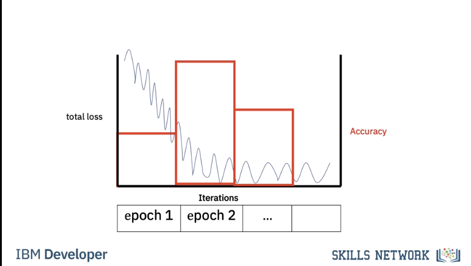

# Logistic Regression Training: Gradient Descent

In the last video, we learned we could use a plane to automatically classify an image. In this video, we will learn how to determine the plane. We will use the dataset of images to train the classifier. When we have an unknown sample, we can classify the image. 

## Cost and Loss

Training is where you find the best learnable parameters of the decision boundary.

In this case, we will randomly select a set of learnable parameters, w and b, the superscript is the guess number. In this case, the decision boundary does a horrible job as it classifies all the images as cats.

The second decision boundary does better. Finally, this decision boundary performs the best. 

First, we need a way to determine how good our decision boundary is. A loss function tells you how good your prediction is. The following loss is called the classification loss.

The first column will show the output of the loss function. Each time our prediction is correct, the loss function will output a zero. Each time our prediction is incorrect, the loss function will output a one. 

The cost is the sum of the loss. The cost tells us how good our learnable parameters are doing on the dataset.

In this case, our model output y hat is incorrect, predicting a cat as a dog and a dog as a cat. In this case, our model output is correct, predicting a dog is a dog and a cat is a cat. For each incorrectly classified samples, the loss is one, increasing the cost. Correctly classified samples do not change the cost.

For this decision boundary, the cost is three.

For this decision boundary the cost is one.

For this decision boundary the cost is zero.

The cost is a function of the learnable parameters. We see a set of learnable parameters. The decision boundary misclassifies three points.

Changing the learnable parameters misclassifies the following points.

The final learnable parameters perform perfectly.

To simplify, let's look at the cost as a function of the bias parameter b. We can plot the cost with respect to learnable parameters. In this case, we plot the cost with respect to the bias parameter b.

Let's see the relationship between cost and the decision boundary. We see the first line misclassifies the following points, thus the value of the cost for this value of b is three. 

The second misclassifies the following two points, hence the value of the cost is two. 

The final lines perform perfectly. The cost is zero. 

### Cross Entropy Loss
In reality, the cost is a function of multiple parameters w and b, even our super simple 2D example has too many parameters to plot. In practice, classification error is difficult to work with. We use the cross entropy loss that uses the output of the logistic function as opposed to the prediction y hat.

The cost is still the sum of the loss. The cross entropy deals with how likely the image belongs to a specific class. If the likelihood of belonging to an incorrect class is large, the cross entropy loss in turn will be large.

If the likelihood of belonging to the correct class is correct, the cross entropy is small, but not zero.

### Gradient Descent
Mosty review. 

However, an interesting piece. It's challenging to perform gradient descent on the threshold function.

> Threshold func is the line or plane that separates data and you sweep it through data to decide what is what. However that results in a non-smooth cost function as depicted below.

The slope is zero in many regions. If we get stuck in these regions, the gradient will be zero and not update. 

The decision plane has multiple parameters.

> As opposed to threshold because with a plane you consider 2+ variables which will turn cost into a bowl and smooth.

As a result, the gradient is a vector. We can update the parameter, it's a set of vectors. For the two dimensional case we can plot it as a surface. It's a bowl shape. When we update the parameter it will find the minimum.

Usually we plot cost with respect to each iteration i. This is called the learning curve. Generally, the more parameters you have, the more images and iterations you need to make the model work.

Let's look at different learning curves. We can choose the learning rate that's way too large as shown in the one dimensional example. We can choose a learning rate that's too small. We can choose a learning rate that's too large. With a good learning rate, we will reach the minimum of the cost.

## Mini-Batch Gradient Descent

Until now we have been using every sample for gradient descent. In Mini-Batch Gradient Descent we use a few samples at a time for each iteration, it's helpful to think about it as if you are minimizing a mini cost function or the total loss.

When we use all the samples in the dataset we call it an epoch. When we use all the samples it’s called **batch gradient descent**, where `one` iteration equals `one` epoch.

We use a few samples to calculate the cost, it’s sometimes referred to as the `total loss`.

> Very important. Creates a saw toothed shape because of a loss calculation on each mini batch in an epoch.

For the first iteration we use the first two samples. For the second iteration we use the second two samples For the 3rd iteration we use the last two samples, therefore with a batch size of three to complete one run or Epoch through the data it took 3 iterations.

For the second Epoch it also takes three iterations.

In this case our batch size is 2. It only takes two iterations to complete one epoch. For the second epoch it also takes 2 iterations.

Let's see how we can determine the number of iterations for different batch sizes and epochs. 

To obtain the number of iterations we simply divide the number of training examples by the batch size.

Let's verify that. For a batch size of one we get 6 iterations, we can verify this pictorially, we see for each iteration we use one sample For a batch size of 2 it takes three iterations, we can verify this pictorially. Each iteration uses two samples. Finally, for a batch size of 3 it takes two iterations.

We can verify this pictorially. We calculate the total loss for each iteration. It’s a noisy version of the cost. At the end of each epoch we calculate the accuracy on the validation data. We repeat the process for the next iteration. If the accuracy decreases we have trained too much. This is called overfitting we will talk about this later

