# Logistic Regression Training: Gradient Descent

In the last video, we learned we could use a plane to automatically classify an image. In this video, we will learn how to determine the plane. We will use the dataset of images to train the classifier. When we have an unknown sample, we can classify the image. 

## Cost and Loss

Training is where you find the best learnable parameters of the decision boundary.

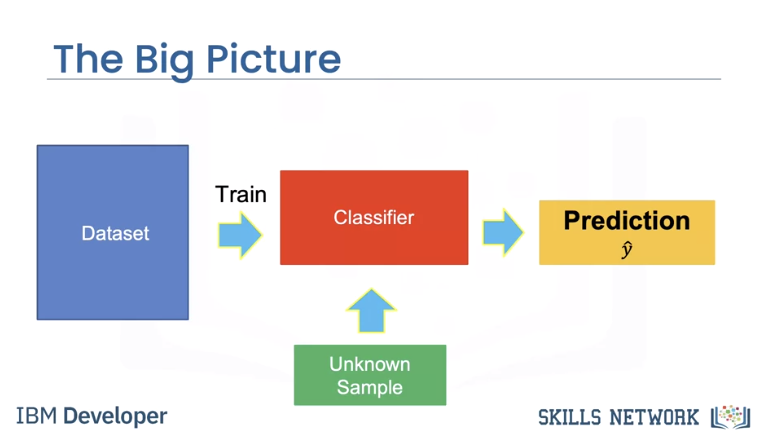

In this case, we will randomly select a set of learnable parameters, w and b, the superscript is the guess number. In this case, the decision boundary does a horrible job as it classifies all the images as cats.
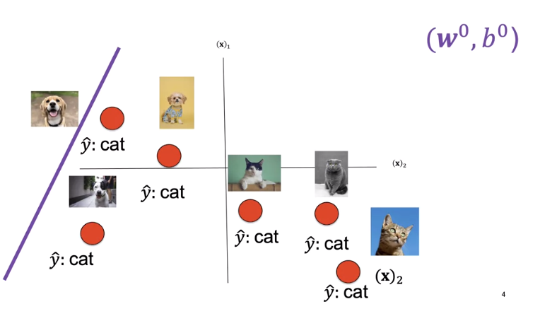

The second decision boundary does better. Finally, this decision boundary performs the best. 

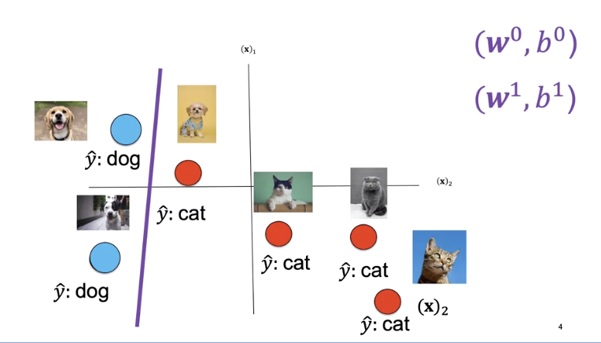

First, we need a way to determine how good our decision boundary is. A loss function tells you how good your prediction is. The following loss is called the classification loss.

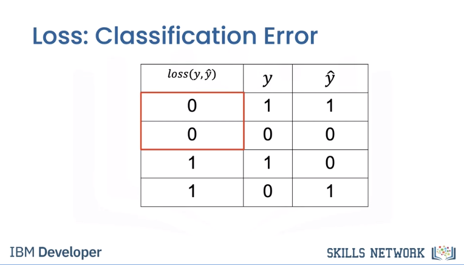

The first column will show the output of the loss function. Each time our prediction is correct, the loss function will output a zero. Each time our prediction is incorrect, the loss function will output a one. 

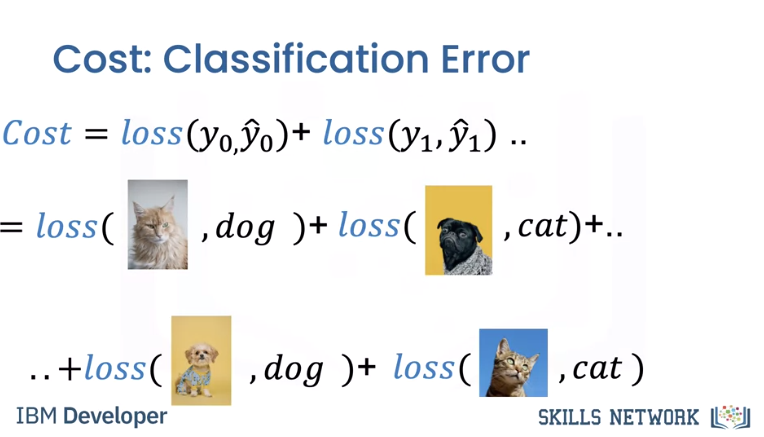


The cost is the sum of the loss. The cost tells us how good our learnable parameters are doing on the dataset.

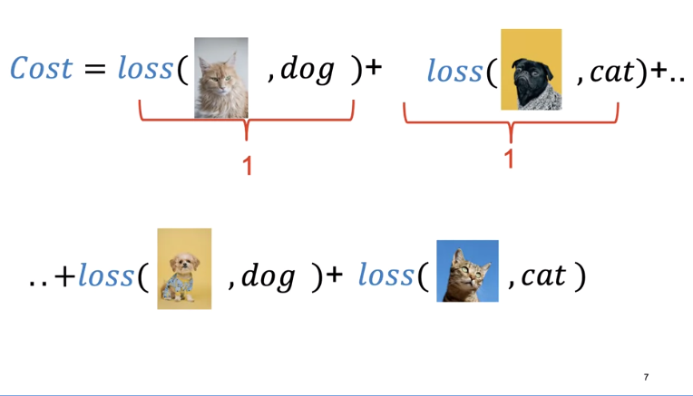

In this case, our model output y hat is incorrect, predicting a cat as a dog and a dog as a cat. In this case, our model output is correct, predicting a dog is a dog and a cat is a cat. For each incorrectly classified samples, the loss is one, increasing the cost. Correctly classified samples do not change the cost.

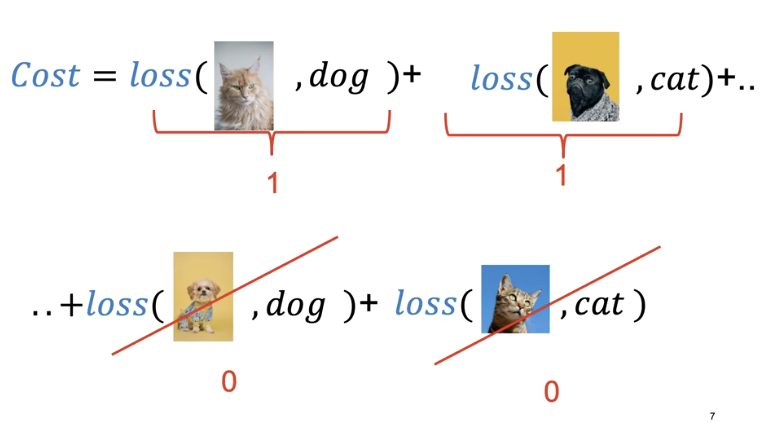

For this decision boundary, the cost is three.

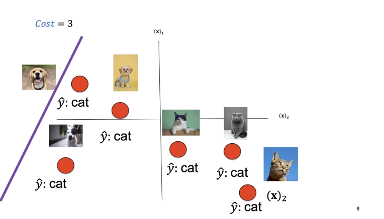

For this decision boundary the cost is one.

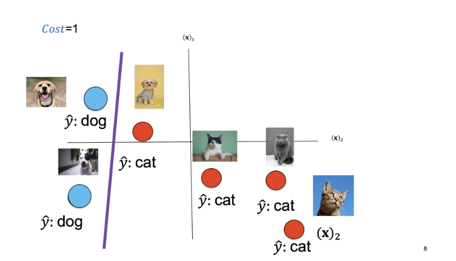

For this decision boundary the cost is zero.

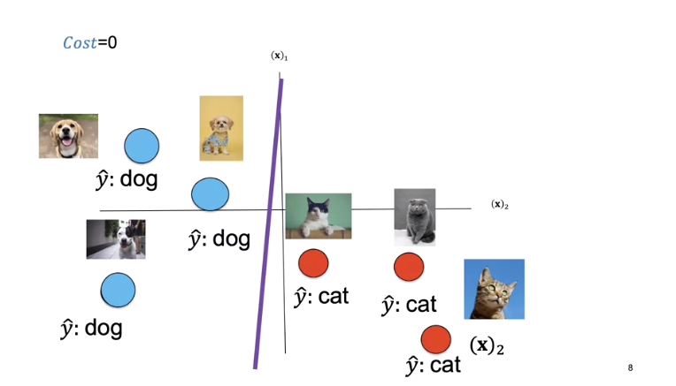

The cost is a function of the learnable parameters. We see a set of learnable parameters. The decision boundary misclassifies three points.

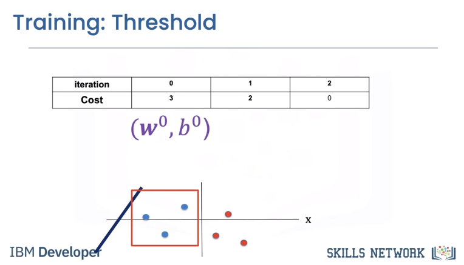

Changing the learnable parameters misclassifies the following points.

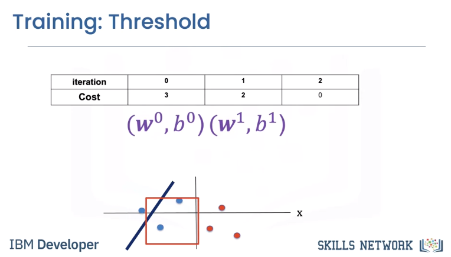


The final learnable parameters perform perfectly.

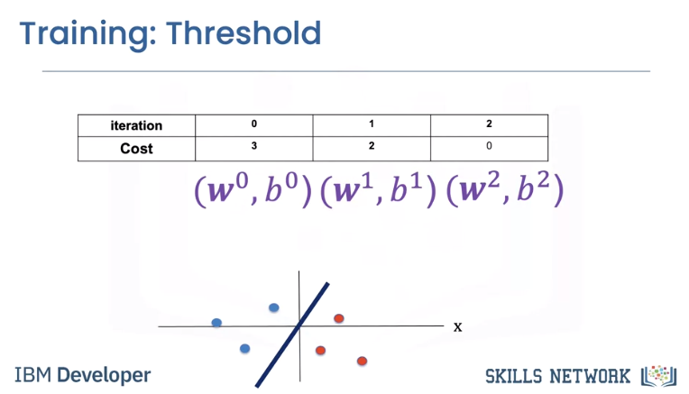


To simplify, let's look at the cost as a function of the bias parameter b. We can plot the cost with respect to learnable parameters. In this case, we plot the cost with respect to the bias parameter b.
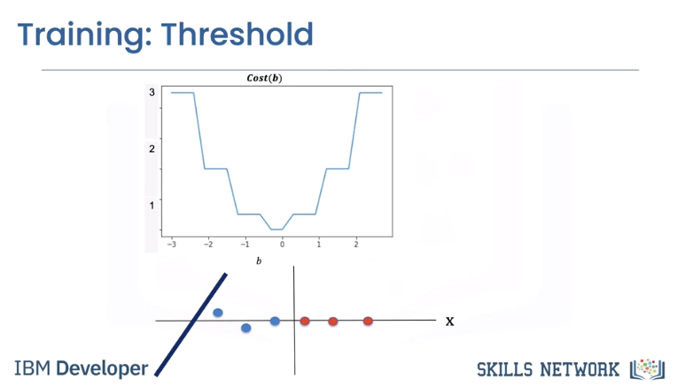


Let's see the relationship between cost and the decision boundary. We see the first line misclassifies the following points, thus the value of the cost for this value of b is three. 

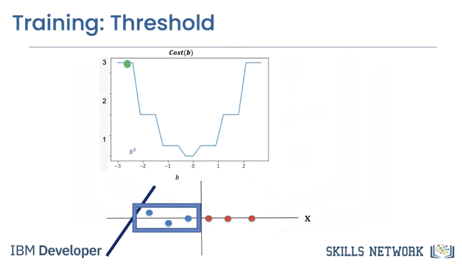

The second misclassifies the following two points, hence the value of the cost is two. 

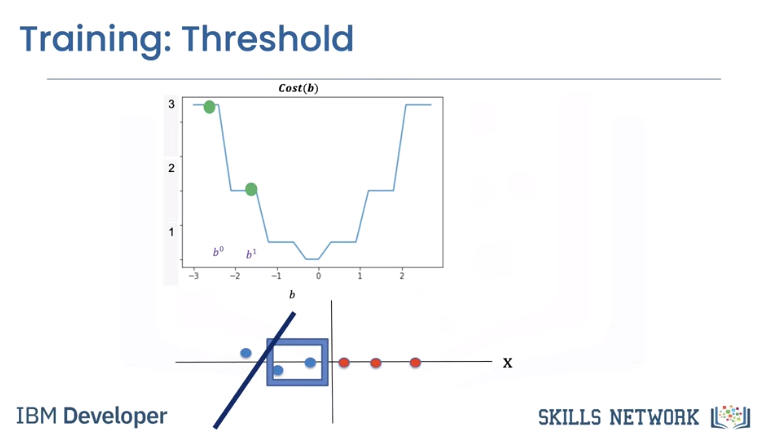


The final lines perform perfectly. The cost is zero. 

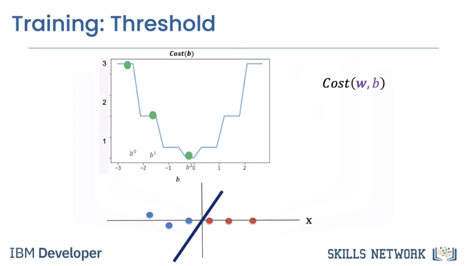


### Cross Entropy Loss
In reality, the cost is a function of multiple parameters w and b, even our super simple 2D example has too many parameters to plot. In practice, classification error is difficult to work with. We use the cross entropy loss that uses the output of the logistic function as opposed to the prediction y hat.

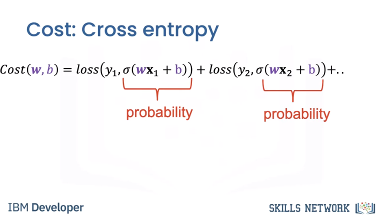


The cost is still the sum of the loss. The cross entropy deals with how likely the image belongs to a specific class. If the likelihood of belonging to an incorrect class is large, the cross entropy loss in turn will be large.


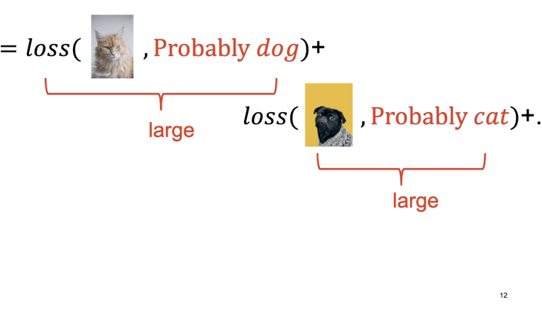

If the likelihood of belonging to the correct class is correct, the cross entropy is small, but not zero.

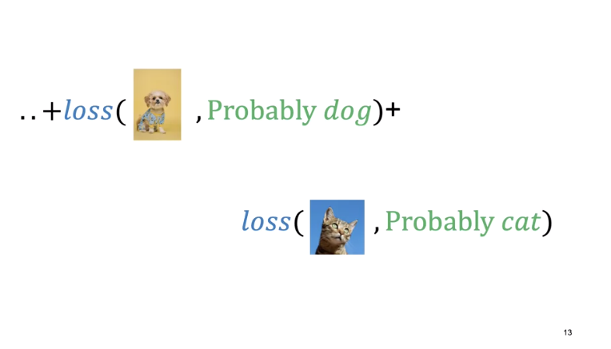


### Gradient Descent
Mosty review. 

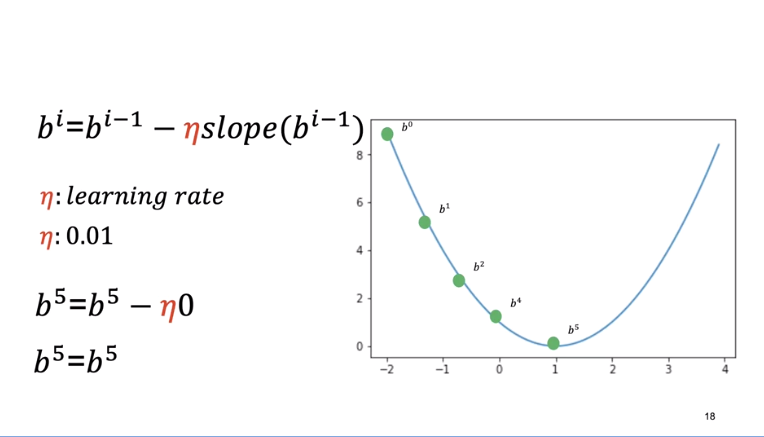

However, an interesting piece. It's challenging to perform gradient descent on the threshold function.

> Threshold func is the line or plane that separates data and you sweep it through data to decide what is what. However that results in a non-smooth cost function as depicted below.

The slope is zero in many regions. If we get stuck in these regions, the gradient will be zero and not update. 

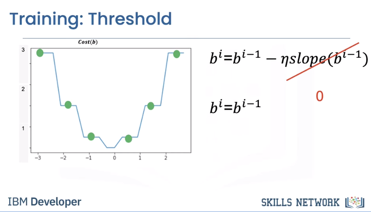

The decision plane has multiple parameters.

> As opposed to threshold because with a plane you consider 2+ variables which will turn cost into a bowl and smooth.

As a result, the gradient is a vector. We can update the parameter, it's a set of vectors. For the two dimensional case we can plot it as a surface. It's a bowl shape. When we update the parameter it will find the minimum.

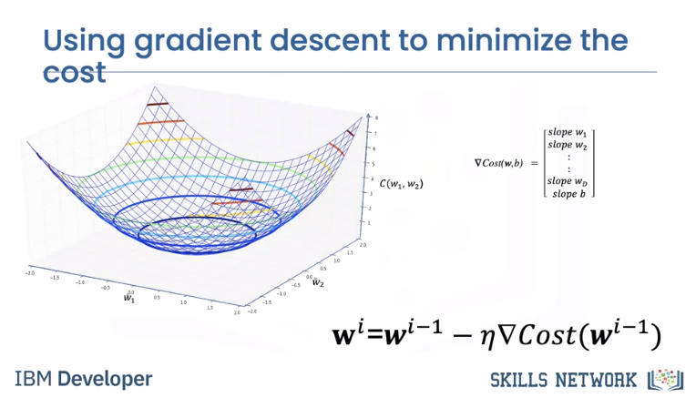

Usually we plot cost with respect to each iteration i. This is called the learning curve. Generally, the more parameters you have, the more images and iterations you need to make the model work.

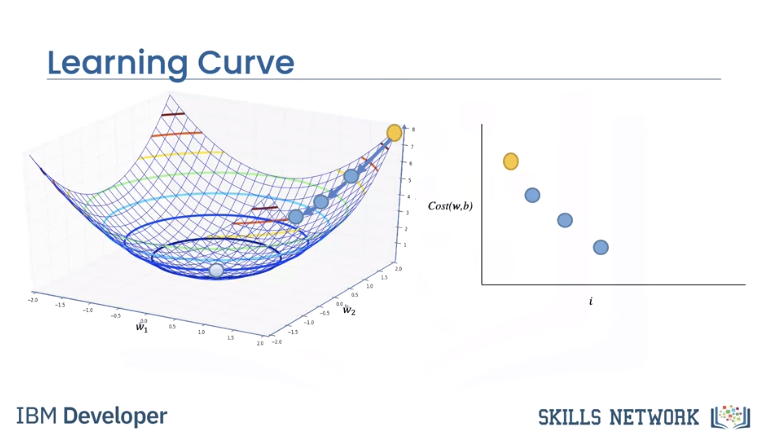

Let's look at different learning curves. We can choose the learning rate that's way too large as shown in the one dimensional example. We can choose a learning rate that's too small. We can choose a learning rate that's too large. With a good learning rate, we will reach the minimum of the cost.

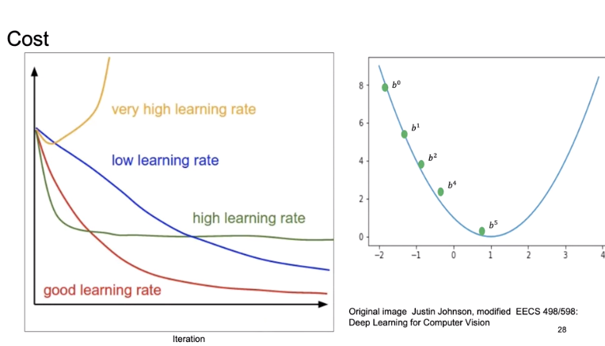


## Mini-Batch Gradient Descent

Until now we have been using every sample for gradient descent. In Mini-Batch Gradient Descent we use a few samples at a time for each iteration, it's helpful to think about it as if you are minimizing a mini cost function or the total loss.

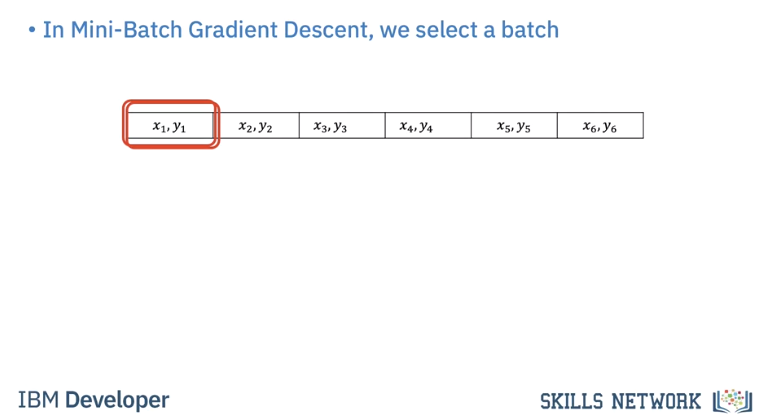

When we use all the samples in the dataset we call it an epoch. When we use all the samples it’s called **batch gradient descent**, where `one` iteration equals `one` epoch.

We use a few samples to calculate the cost, it’s sometimes referred to as the `total loss`.

> Very important. Creates a saw toothed shape because of a loss calculation on each mini batch in an epoch.

For the first iteration we use the first two samples. For the second iteration we use the second two samples For the 3rd iteration we use the last two samples, therefore with a batch size of three to complete one run or Epoch through the data it took 3 iterations.

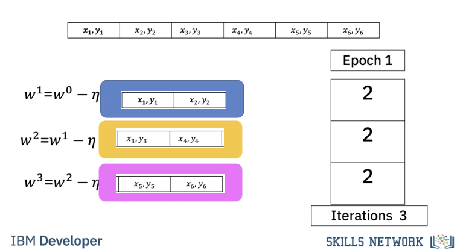


For the second Epoch it also takes three iterations.

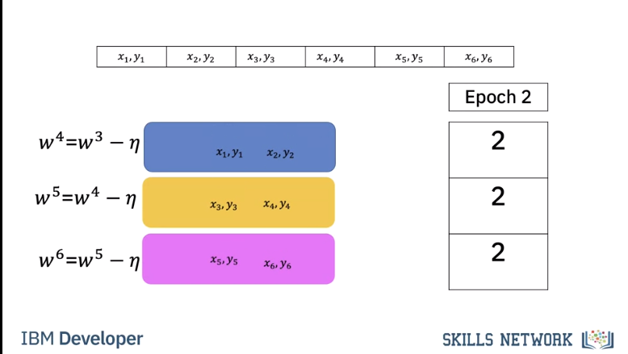

In this case our batch size is 2. It only takes two iterations to complete one epoch. For the second epoch it also takes 2 iterations.

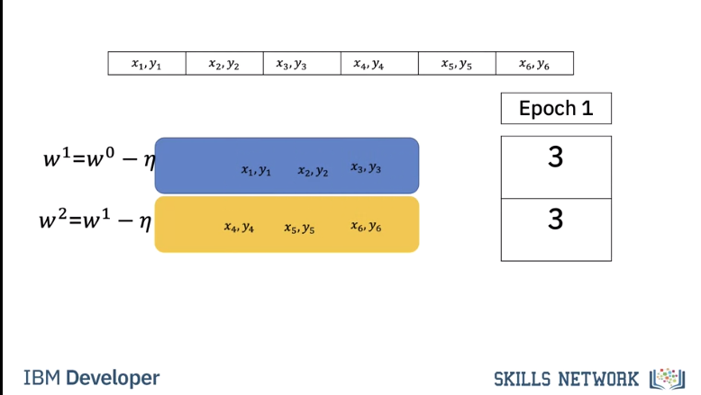

Let's see how we can determine the number of iterations for different batch sizes and epochs. 

To obtain the number of iterations we simply divide the number of training examples by the batch size.

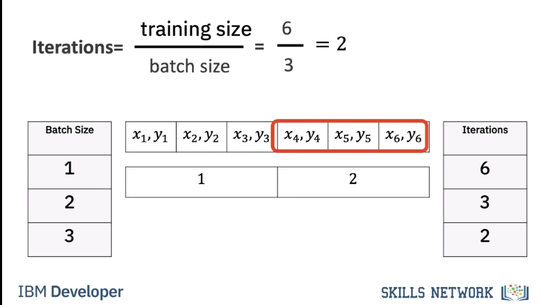


Let's verify that. For a batch size of one we get 6 iterations, we can verify this pictorially, we see for each iteration we use one sample For a batch size of 2 it takes three iterations, we can verify this pictorially. Each iteration uses two samples. Finally, for a batch size of 3 it takes two iterations.

We can verify this pictorially. We calculate the total loss for each iteration. It’s a noisy version of the cost. At the end of each epoch we calculate the accuracy on the validation data. We repeat the process for the next iteration. If the accuracy decreases we have trained too much. This is called overfitting we will talk about this later

## Code Lab
### Logistic Regression With Mini-Batch Gradient Descent

* Represent your data as a Dataset object
* Create a Logistic Regression Model using PyTorch
* Set a Criterion to calculate Loss
* Create a Data Loader and set the Batch Size
* Create an Optimizer to update Model Parameters and set Learning Rate
* Train a Model

### Preparation
```bash
# Setup Environment
cd ~/Desktop; rm -r temp; # To remove
cd ~/Desktop; mkdir temp; cd temp; pyenv activate venv3.10.4;
```

```python
import numpy as np
import matplotlib.pyplot as plt
from mpl_toolkits import mplot3d
import torch
from torch.utils.data import Dataset, DataLoader
import torch.nn as nn
```

The class `plot_error_surfaces` is just to help you visualize the data space and the parameter space during training and has nothing to do with Pytorch. 

```python
# Create class for plotting and the function for plotting
class plot_error_surfaces(object):    
    # Construstor
    def __init__(self, w_range, b_range, X, Y, n_samples = 30, go = True):
        W = np.linspace(-w_range, w_range, n_samples)
        B = np.linspace(-b_range, b_range, n_samples)
        w, b = np.meshgrid(W, B)    
        Z = np.zeros((30, 30))
        count1 = 0
        self.y = Y.numpy()
        self.x = X.numpy()
        for w1, b1 in zip(w, b):
            count2 = 0
            for w2, b2 in zip(w1, b1):
                yhat= 1 / (1 + np.exp(-1*(w2*self.x+b2)))
                Z[count1,count2]=-1*np.mean(self.y*np.log(yhat+1e-16) +(1-self.y)*np.log(1-yhat+1e-16))
                count2 += 1   
            count1 += 1
        self.Z = Z
        self.w = w
        self.b = b
        self.W = []
        self.B = []
        self.LOSS = []
        self.n = 0
        if go == True:
            plt.figure()
            plt.figure(figsize=(7.5, 5))
            plt.axes(projection='3d').plot_surface(self.w, self.b, self.Z, rstride=1, cstride=1, cmap='viridis', edgecolor='none')
            plt.title('Loss Surface')
            plt.xlabel('w')
            plt.ylabel('b')
            plt.show()
            plt.figure()
            plt.title('Loss Surface Contour')
            plt.xlabel('w')
            plt.ylabel('b')
            plt.contour(self.w, self.b, self.Z)
            plt.show()
     # Setter
    def set_para_loss(self, model, loss):
        self.n = self.n + 1
        self.W.append(list(model.parameters())[0].item())
        self.B.append(list(model.parameters())[1].item())
        self.LOSS.append(loss)
    # Plot diagram
    def final_plot(self): 
        ax = plt.axes(projection='3d')
        ax.plot_wireframe(self.w, self.b, self.Z)
        ax.scatter(self.W, self.B, self.LOSS, c='r', marker='x', s=200, alpha=1)
        plt.figure()
        plt.contour(self.w, self.b, self.Z)
        plt.scatter(self.W, self.B, c='r', marker='x')
        plt.xlabel('w')
        plt.ylabel('b')
        plt.show()
    # Plot diagram
    def plot_ps(self):
        plt.subplot(121)
        plt.ylim
        plt.plot(self.x[self.y==0], self.y[self.y==0], 'ro', label="training points")
        plt.plot(self.x[self.y==1], self.y[self.y==1]-1, 'o', label="training points")
        plt.plot(self.x, self.W[-1] * self.x + self.B[-1], label="estimated line")
        plt.xlabel('x')
        plt.ylabel('y')
        plt.ylim((-0.1, 2))
        plt.title('Data Space Iteration: ' + str(self.n))
        plt.show()
        plt.subplot(122)
        plt.contour(self.w, self.b, self.Z)
        plt.scatter(self.W, self.B, c='r', marker='x')
        plt.title('Loss Surface Contour Iteration' + str(self.n))
        plt.xlabel('w')
        plt.ylabel('b')


# Plot the diagram
def PlotStuff(X, Y, model, epoch, leg=True):
    plt.plot(X.numpy(), model(X).detach().numpy(), label=('epoch ' + str(epoch)))
    plt.plot(X.numpy(), Y.numpy(), 'r')
    if leg == True:
        plt.legend()
    else:
        pass


# Setting the seed will allow us to control randomness and give us reproducibility
torch.manual_seed(0)
```

### Load Data
The Dataset class represents a dataset. Your custom dataset should inherit Dataset which we imported above and override the following methods:

* "__len__" so that len(dataset) returns the size of the dataset.
* "__getitem__" to support the indexing such that dataset[i] can be used to get ith sample.


```python
# Create the custom Data class which inherits Dataset
class Data(Dataset):
    
    # Constructor
    def __init__(self):
        # Create X values from -1 to 1 with step .1
        self.x = torch.arange(-1, 1, 0.1).view(-1, 1)
        # Create Y values all set to 0
        self.y = torch.zeros(self.x.shape[0], 1)
        # Set the X values above 0.2 to 1
        self.y[self.x[:, 0] > 0.2] = 1
        # Set the .len attribute because we need to override the __len__ method
        self.len = self.x.shape[0]
    
    # Getter that returns the data at the given index
    def __getitem__(self, index):      
        return self.x[index], self.y[index]
    
    # Get length of the dataset
    def __len__(self):
        return self.len

# Create Data object
data_set = Data()
# We can see the X values of the dataset
data_set.x
# We can see the Y values of the dataset which correspond to the class of the X value
data_set.y
# We can get the length of the dataset
len(data_set)
# We can get the label $y$ as well as the $x$ for the first sample 
x,y = data_set[0]
print("x = {},  y = {}".format(x,y))
# We can see we can separate the one-dimensional dataset into two classes:
plt.plot(data_set.x[data_set.y==0], data_set.y[data_set.y==0], 'ro', label="y=0")
plt.plot(data_set.x[data_set.y==1], data_set.y[data_set.y==1]-1, 'o', label="y=1")
plt.xlabel('x')
plt.legend()   
plt.show()       
```

### Create the Model and Total Loss Function (Cost)

```python
# Create logistic_regression class that inherits nn.Module which is the base class for all neural networks
class logistic_regression(nn.Module):
    # Constructor
    def __init__(self, n_inputs):
        super(logistic_regression, self).__init__()
        # Single layer of Logistic Regression with number of inputs being n_inputs and there being 1 output 
        self.linear = nn.Linear(n_inputs, 1)
        
    # Prediction
    def forward(self, x):
        # Using the input x value puts it through the single layer defined above then puts the output through the sigmoid function and returns the result
        yhat = torch.sigmoid(self.linear(x))
        return yhat

# Create the logistic_regression result
model = logistic_regression(1)
```

We can make a prediction sigma $\sigma$ this uses the forward function defined above

```python
x = torch.tensor([-1.0])
sigma = model(x)
sigma
# We can also make a prediction using our data
x,y = data_set[2]
sigma = model(x)
sigma
```

Create a `plot_error_surfaces` object to visualize the data space and the learnable parameters space during training:

We can see on the Loss Surface graph, the loss value varying across w and b values with yellow being high loss and dark blue being low loss which is what we want

On the Loss Surface Contour graph we can see a top-down view of the Loss Surface graph


```python
# Create the plot_error_surfaces object

# 15 is the range of w
# 13 is the range of b
# data_set[:][0] are all the X values
# data_set[:][1] are all the Y values

get_surface = plot_error_surfaces(15, 13, data_set[:][0], data_set[:][1])

# We define a criterion using Binary Cross Entropy Loss. This will measure the difference/loss between the prediction and actual value.
criterion = nn.BCELoss()
# We have our samples:
x, y = data_set[0]
print("x = {},  y = {}".format(x,y))
# We can make a prediction using the model:
sigma = model(x)
sigma

# We can calculate the loss 
loss = criterion(sigma, y)
loss
```

### Setting the Batch Size using a Data Loader
You have to use data loader in PyTorch that will output a batch of data, the input is the `dataset` and `batch_size`.

```python
batch_size=10
trainloader = DataLoader(dataset = data_set, batch_size = batch_size)
dataset_iter = iter(trainloader)
X,y=next(dataset_iter )
# We can see here that 10 values the same as our batch size
X
```
### Setting the Learning Rate
```
learning_rate = 0.1
optimizer = torch.optim.SGD(model.parameters(), lr = learning_rate)
```

### Train the Model via Mini-Batch Gradient Descent
#### Train the Model

```python
# First we create an instance of the model we want to train
model = logistic_regression(1)
# We create a criterion which will measure loss
criterion = nn.BCELoss()
# We create a data loader with the dataset and specified batch size of 5
trainloader = DataLoader(dataset = data_set, batch_size = 5)
# We create an optimizer with the model parameters and learning rate
optimizer = torch.optim.SGD(model.parameters(), lr = .01)
# Then we set the number of epochs which is the total number of times we will train on the entire training dataset
epochs=500
# This will store the loss over iterations so we can plot it at the end
loss_values = []

# Loop will execute for number of epochs
for epoch in range(epochs):
    # For each batch in the training data
    for x, y in trainloader:
        # Make our predictions from the X values
        yhat = model(x)
        # Measure the loss between our prediction and actual Y values
        loss = criterion(yhat, y)
        # Resets the calculated gradient value, this must be done each time as it accumulates if we do not reset
        optimizer.zero_grad()
        # Calculates the gradient value with respect to each weight and bias
        loss.backward()
        # Updates the weight and bias according to calculated gradient value
        optimizer.step()
        # Set the parameters for the loss surface contour graphs
        get_surface.set_para_loss(model, loss.tolist())
        # Saves the loss of the iteration
        loss_values.append(loss)
    # Want to print the Data Space for the current iteration every 20 epochs
    if epoch % 20 == 0:
        get_surface.plot_ps()
```

We can see the final values of the weight and bias. This weight and bias correspond to the orange line in the Data Space graph and the final spot of the X in the Loss Surface Contour graph.

```python
w = model.state_dict()['linear.weight'].data[0]
b = model.state_dict()['linear.bias'].data[0]
print("w = ", w, "b = ", b)

# Now we can get the accuracy of the training data
# Getting the predictions
yhat = model(data_set.x)
# Rounding the prediction to the nearedt integer 0 or 1 representing the classes
yhat = torch.round(yhat)
# Counter to keep track of correct predictions
correct = 0
# Goes through each prediction and actual y value
for prediction, actual in zip(yhat, data_set.y):
    # Compares if the prediction and actualy y value are the same
    if (prediction == actual):
        # Adds to counter if prediction is correct
        correct+=1
# Outputs the accuracy by dividing the correct predictions by the length of the dataset
print("Accuracy: ", correct/len(data_set)*100, "%")

# Finally, we plot the Cost vs Iteration graph, although it is erratic it is downward sloping.

loss_values_np = []
for loss_tensor in loss_values:
    loss_detached = loss_tensor.detach()  # Detach each tensor
    loss_np = loss_detached.numpy()       # Convert to NumPy array
    loss_values_np.append(loss_np)        # Append to the list

plt.plot(loss_values_np)
plt.xlabel("Iteration")
plt.ylabel("Cost")
plt.show()
```

### Stochastic Gradient Descent
In this case, we will set the batch size of the data loder to 1 so that the gradient descent will be performed for each example this is referred to as Stochastic Gradient Descent. The number of epochs is set to 100.

Notice that in this example the batch size is decreased from 5 to 1 so there would be more iterations. Due to this, we can reduce the number of iterations by decreasing the number of epochs. Due to the reduced batch size, we are optimizing more frequently so we don't need as many epochs.

First, we must recreate the `get_surface` object again so that for each example we get a Loss Surface for that model only.

```python
get_surface = plot_error_surfaces(15, 13, data_set[:][0], data_set[:][1], 30)
```
#### Train the model
```python
# First we create an instance of the model we want to train
model = logistic_regression(1)
# We create a criterion which will measure loss
criterion = nn.BCELoss()
# We create a data loader with the dataset and specified batch size of 1
trainloader = DataLoader(dataset = data_set, batch_size = 1)
# We create an optimizer with the model parameters and learning rate
optimizer = torch.optim.SGD(model.parameters(), lr = .01)
# Then we set the number of epochs which is the total number of times we will train on the entire training dataset
epochs=100
# This will store the loss over iterations so we can plot it at the end
loss_values = []

# Loop will execute for number of epochs
for epoch in range(epochs):
    # For each batch in the training data
    for x, y in trainloader:
        # Make our predictions from the X values
        yhat = model(x)
        # Measure the loss between our prediction and actual Y values
        loss = criterion(yhat, y)
        # Resets the calculated gradient value, this must be done each time as it accumulates if we do not reset
        optimizer.zero_grad()
        # Calculates the gradient value with respect to each weight and bias
        loss.backward()
        # Updates the weight and bias according to calculated gradient value
        optimizer.step()
        # Set the parameters for the loss surface contour graphs
        get_surface.set_para_loss(model, loss.tolist())
        # Saves the loss of the iteration
        loss_values.append(loss)
    # Want to print the Data Space for the current iteration every 20 epochs
    if epoch % 20 == 0:
        get_surface.plot_ps()
```

We can see the final values of the weight and bias. This weight and bias correspond to the orange line in the Data Space graph and the final spot of the X in the Loss Surface Contour graph.

```python
w = model.state_dict()['linear.weight'].data[0]
b = model.state_dict()['linear.bias'].data[0]
print("w = ", w, "b = ", b)
# Now we can get the accuracy of the training data
# Getting the predictions
yhat = model(data_set.x)
# Rounding the prediction to the nearedt integer 0 or 1 representing the classes
yhat = torch.round(yhat)
# Counter to keep track of correct predictions
correct = 0
# Goes through each prediction and actual y value
for prediction, actual in zip(yhat, data_set.y):
    # Compares if the prediction and actualy y value are the same
    if (prediction == actual):
        # Adds to counter if prediction is correct
        correct+=1
# Outputs the accuracy by dividing the correct predictions by the length of the dataset
print("Accuracy: ", correct/len(data_set)*100, "%")

# Finally, we plot the Cost vs Iteration graph, although it is erratic it is downward sloping.
loss_values_np = []
for loss_tensor in loss_values:
    loss_detached = loss_tensor.detach()  # Detach each tensor
    loss_np = loss_detached.numpy()       # Convert to NumPy array
    loss_values_np.append(loss_np)        # Append to the list

plt.plot(loss_values_np)
plt.xlabel("Iteration")
plt.ylabel("Cost")
plt.show()
```
### High Learning Ratening-with-python/home/welcom

In this case, we will set the batch size of the data loder to 1 so that the gradient descent will be performed for each example this is referred to as Stochastic Gradient Descent. This time the learning rate will be set to .1 to represent a high learning rate and we will observe what will happen when we try to train.

First, we must recreate the `get_surface` object again so that for each example we get a Loss Surface for that model only.

```python
get_surface = plot_error_surfaces(15, 13, data_set[:][0], data_set[:][1], 30)
```

#### Train the Model
```python
# First we create an instance of the model we want to train
model = logistic_regression(1)
# We create a criterion that will measure loss
criterion = nn.BCELoss()
# We create a data loader with the dataset and specified batch size of 1
trainloader = DataLoader(dataset = data_set, batch_size = 1)
# We create an optimizer with the model parameters and learning rate
optimizer = torch.optim.SGD(model.parameters(), lr = 1)
# Then we set the number of epochs which is the total number of times we will train on the entire training dataset
epochs=100
# This will store the loss over iterations so we can plot it at the end
loss_values = []

# Loop will execute for number of epochs
for epoch in range(epochs):
    # For each batch in the training data
    for x, y in trainloader:
        # Make our predictions from the X values
        yhat = model(x)
        # Measure the loss between our prediction and actual Y values
        loss = criterion(yhat, y)
        # Resets the calculated gradient value, this must be done each time as it accumulates if we do not reset
        optimizer.zero_grad()
        # Calculates the gradient value with respect to each weight and bias
        loss.backward()
        # Updates the weight and bias according to calculated gradient value
        optimizer.step()
        # Set the parameters for the loss surface contour graphs
        get_surface.set_para_loss(model, loss.tolist())
        # Saves the loss of the iteration
        loss_values.append(loss)
    # Want to print the Data Space for the current iteration every 20 epochs
    if epoch % 20 == 0:
        get_surface.plot_ps()
```
Notice in this example the due to the high learning rate the Loss Surface Contour graph has increased movement over the previous example and also moves in multiple directions due to the minimum being overshot.

We can see the final values of the weight and bias. This weight and bias correspond to the orange line in the Data Space graph and the final spot of the X in the Loss Surface Contour graph.

```python
w = model.state_dict()['linear.weight'].data[0]
b = model.state_dict()['linear.bias'].data[0]
print("w = ", w, "b = ", b)
```

Now we can get the accuracy of the training data

```python
# Getting the predictions
yhat- = model(data_set.x)
# Rounding the prediction to the nearedt integer 0 or 1 representing the classes
yhat = torch.round(yhat)
# Counter to keep track of correct predictions
correct = 0
# Goes through each prediction and actual y value
for prediction, actual in zip(yhat, data_set.y):
    # Compares if the prediction and actualy y value are the same
    if (prediction == actual):
        # Adds to counter if prediction is correct
        correct+=1
# Outputs the accuracy by dividing the correct predictions by the length of the dataset
print("Accuracy: ", correct/len(data_set)*100, "%")

loss_values_np = []
for loss_tensor in loss_values:
    loss_detached = loss_tensor.detach()  # Detach each tensor
    loss_np = loss_detached.numpy()       # Convert to NumPy array
    loss_values_np.append(loss_np)        # Append to the list

plt.plot(loss_values_np)
plt.xlabel("Iteration")
plt.ylabel("Cost")
plt.show()
```