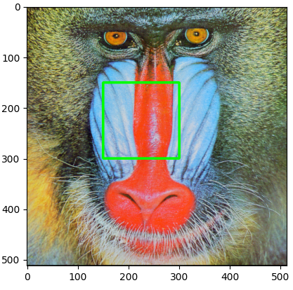
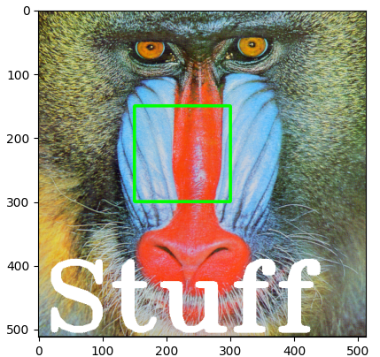

# Manipulating Images

Copying allows you to create a new image independent of the original.

```python
from PIL import Image
from PIL import ImageOps
from PIL import ImageDraw
from PIL import ImageFont
import cv2
import numpy as np
import matplotlib.pyplot as plt

baboon = Image.open('baboon.png'); # baboon.show()
id(baboon) # 140014182059888
A = baboon
id(A) # 140014182059888
B = baboon.copy()
id(B) # 140014180362048

# basic flip
im_flip = ImageOps.flip(baboon)
im_flip.show()
# mirror
im_mirror = ImageOps.mirror(baboon)
im_mirror.show()
# transpose (has built in attributes for different transpositions)
baboon.transpose(Image.FLIP_TOP_BOTTOM).show()


# flip with cv2 (more control)
baboon = cv2.imread('baboon.png'); # baboon.show()

baboon = cv2.cvtColor(baboon, cv2.COLOR_BGR2RGB)
im_flip = cv2.flip(baboon,0)
im_rotate = cv2.rotate(baboon,cv2.ROTATE_90_CLOCKWISE)

baboon_imshow = plt.imshow(baboon)
baboon_flip_imshow = plt.imshow(im_flip)
baboon_rotate_imshow = plt.imshow(im_rotate)

plt.show() # show any one of those
```

## Manipulating Images One Pixel At a Time
* Cropping
* Changing Image Pixels

```python
baboon = Image.open('baboon.png'); # baboon.show()
# Cropping
baboon_np = np.array(baboon)
baboon_np[2:5,:,0] # rows 3-5 of 1st channel
baboon_np[2:5,3:7,0] # rows 3-5, cols 4-7 of 1st channel

baboon_np[:,:,0] = 255
plt.imshow(baboon_np); plt.show()


```

## Drawing
### Rectangle
```python
baboon = Image.open('baboon.png'); # baboon.show()
img_copy = baboon.copy()
image_fn = ImageDraw.Draw(im=img_copy)
shape = [0,0,50,50]
image_fn.rectangle(xy=shape,fill='red')
img_array = np.array(img_copy)

plt.imshow(img_array) # either works
plt.imshow(img_copy) # either works
plt.show()
```

### Text
```python
baboon = Image.open('baboon.png'); # baboon.show()
img_copy = baboon.copy()
# Fonts: https://www.fontsquirrel.com/fonts/list/popular
fnt = ImageFont.truetype('/home/bbearce/Downloads/open-sans/OpenSans-BoldItalic.ttf', 100)
image_fn = ImageDraw.Draw(im=img_copy)
image_fn.text(xy=(0,0),text="box", font=fnt,fill=(0,0,0))
plt.imshow(img_copy)
plt.show()
```

### Cropped Image

Consider the image “crop_image” of a cat. We also have the “image_lenna ”, we can superimpose the image of the cat over “image Lenna”, all we need is the coordinates indicating where to paste the picture. We use the paste() method, the input is the image we would like to super-impose and the box parameter specifies the top left corner of the image you would like to paste and the box parameter specifies the top left corner of the image you would like to paste 

```python
baboon = Image.open('baboon.png'); # baboon.show()
baboon_c = baboon.copy()
lenna = Image.open('lenna.png'); # lenna.show()
lenna_cropped = lenna.crop((0,0,300,300))

left = 150
upper = 150

baboon_c.paste(lenna_cropped, box=(left,upper))

plt.imshow(baboon_c)
plt.show()
```

## OpenCV Manipulations
```python
baboon = cv2.imread('baboon.png'); # baboon.show()
baboon = cv2.cvtColor(baboon, cv2.COLOR_BGR2RGB)
baboon_c = np.copy(baboon)
left = 150
upper = 150
right = 300
lower = 300

start_point, end_point = (left, upper),(right, lower)
cv2.rectangle(baboon_c, pt1=start_point, pt2=end_point, color=(0,255,0), thickness=3)
plt.imshow(baboon_c)
plt.show()
```



```python
cv2.putText(img=baboon_c, text="Stuff", org=(10,500), color=(255,255,255), fontFace=4, fontScale=5, thickness=9)
plt.imshow(baboon_c)
plt.show()
```

