# Neural Nets and Deep Learning for Image Classification

## Neural Nets

Imagine this box is a decision function we want to learn for classification.
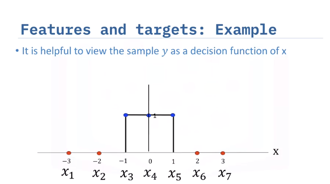

We can also view the problem as trying to approximate the box function using logistic regression:
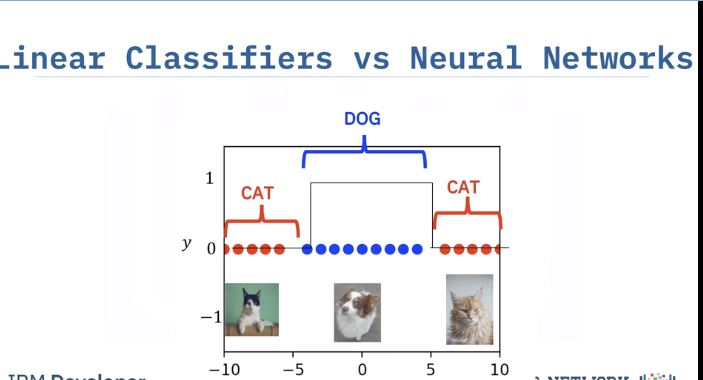

If we attempt a linear regression turned into a logistic one, we will still get errors for the higher x values.
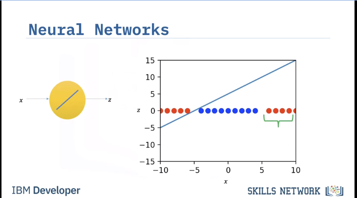

Shown here:
> Reminder this logistic regression is an activation function
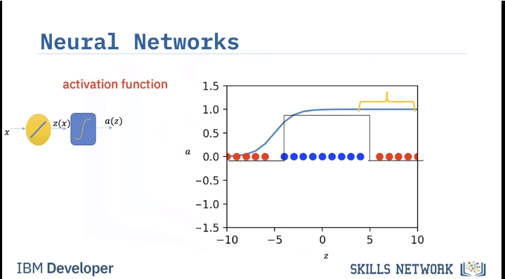

We could draw another line though:

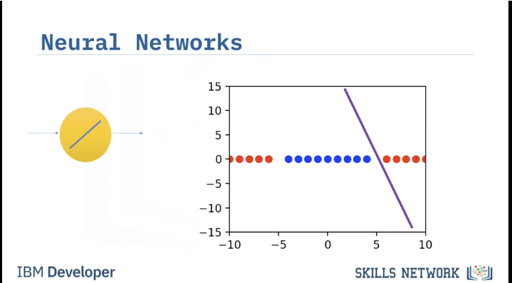

This too perhaps:

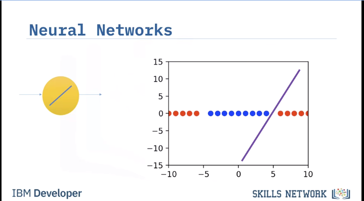

Again though not perfect:

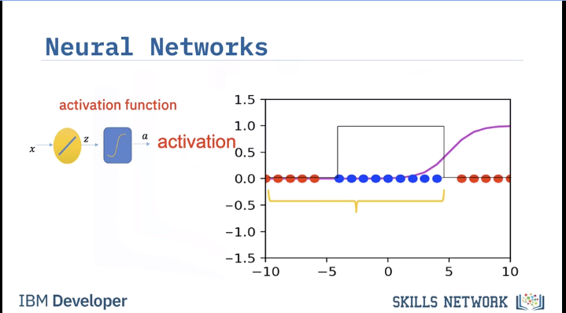

However apparently we can make a band pass filter like shape by subtracting one from another to get our prediction to match the desired square pulse from earlier (kind of):

Pretty square pulse we are aiming for:

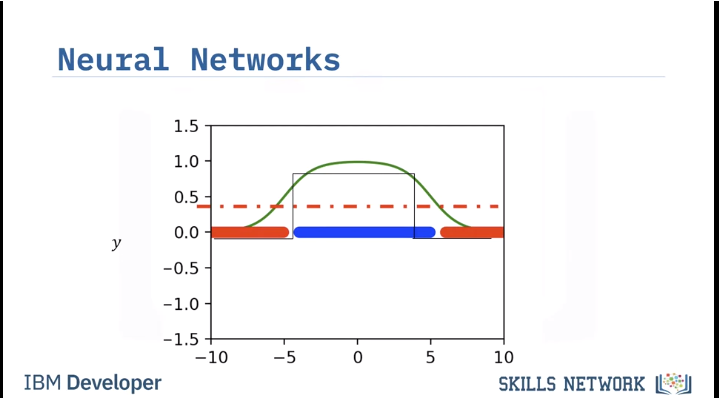

As you can see with two different neurons perfomring a logistic regression with a different line, we can effectively have our square pulse.

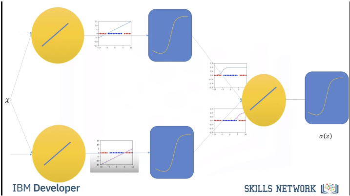

This first layer of neurons and activation functions are called the hidden layer. Each neuron is an artifician neuron. The output layer has one artificial neuron.

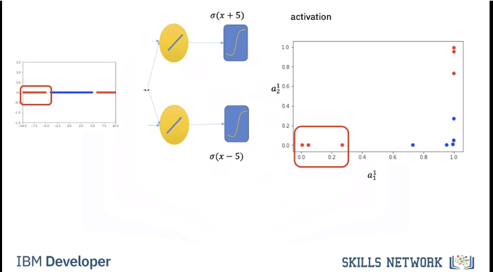

Shown below are the activation outputs. You can see red and blue colors but that is not the output of the activation layers. Imagine the dots are black and the red and blue are just letting us know the ground truth. The final layer that fits a black line (decision boundary) is what the output layer has to figure out.

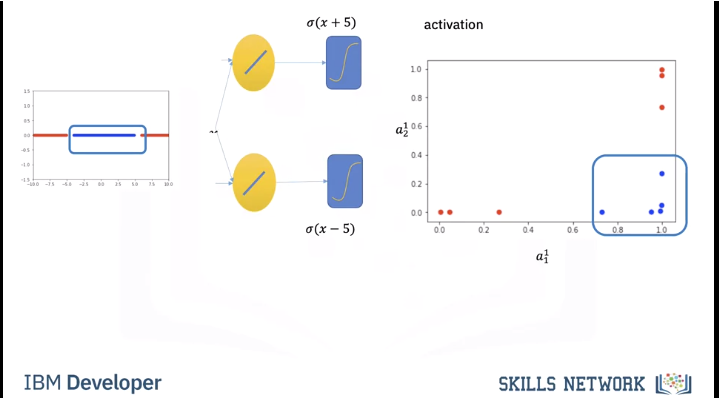

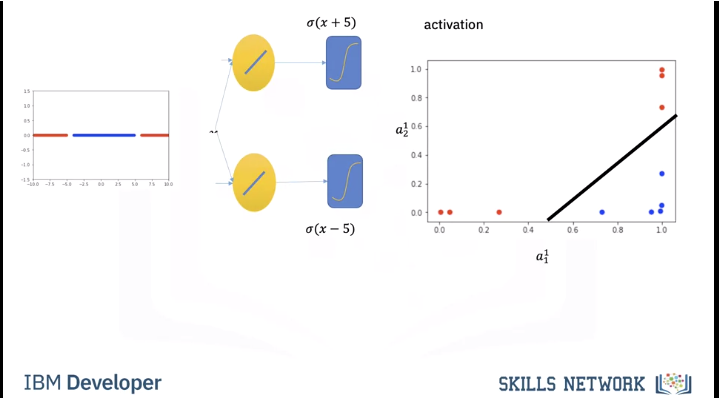

Review that all these logistic regressions are a series of weights and biases that can be learned. These are free forward neural networks and are also called cully connected networks

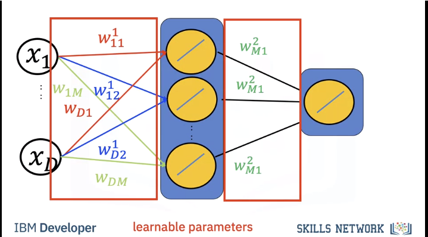

With many neurons we can create complex decision boundaries.
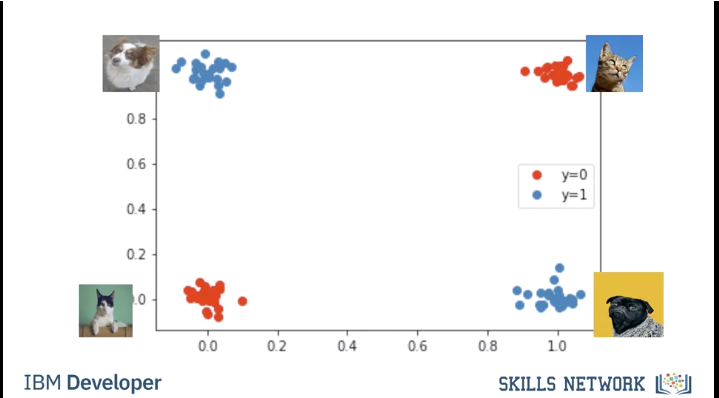

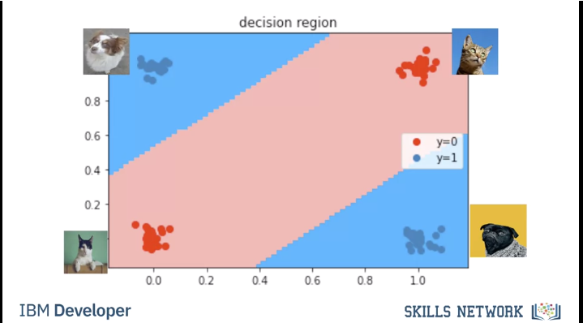

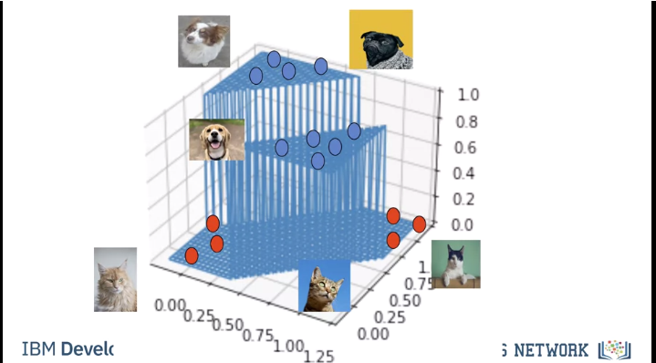
