# Object Detection

We will learn about:  
* Sliding Windows
* Bounding Box
* Bounding Box Pipeline
* Score

## Sliding Windows

If we want to detect a dog, we consider a fixed window size. If chosen properly, the dog will occupy most of the window. This is essentially a sub-image that we would like to classify as the dog. The other sub-images would be classified as background. 

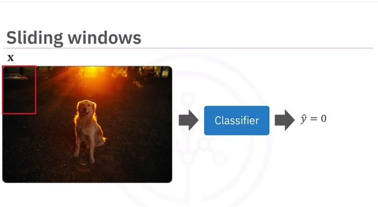

We then shift the window, and classify the next sub-image.

We repeat the process. When we get to the horizontal border, we move a few pixels down in the vertical direction and repeat the process.
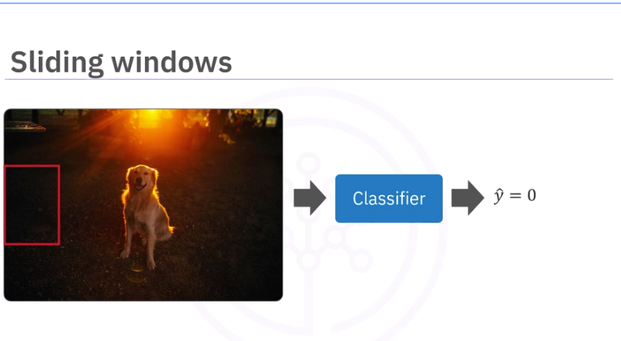

When the object occupies most of the window, it will be classified as a dog. 
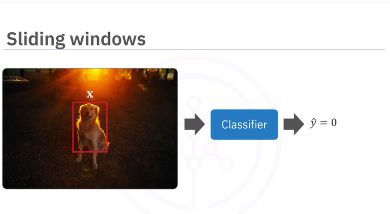

Problems include many overlapping detections.
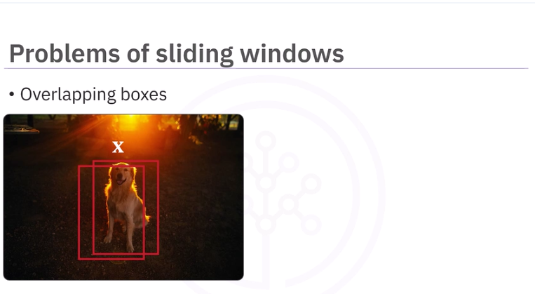

Object Sizes too are an issue. One way to solve this is to resize the image.
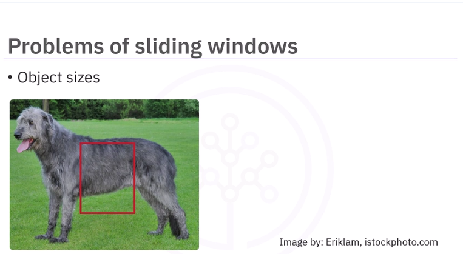

The same object can have different shapes.
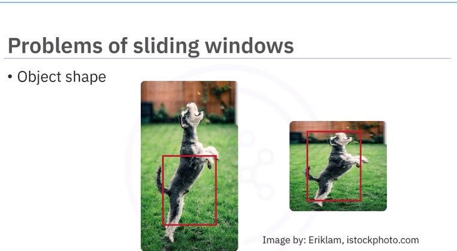

There is also the problem of overlapping objects.
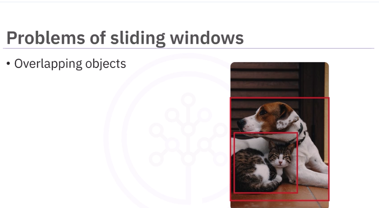

## Bounding Boxes

Bounding boxes is another method for object detection. It can be used independently, with sliding windows or with other more advanced methods.
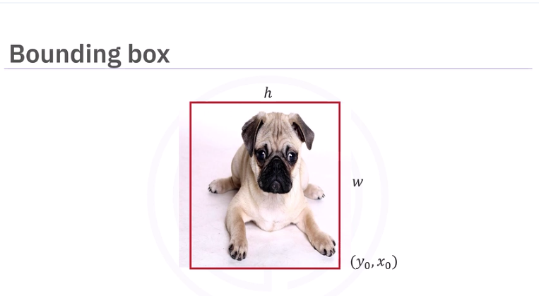

The bounding box is a rectangular box that can be determined. With the lower right corner of the rectangle with coordinates y0 and x0, and the width and height. The y and x are not the same as the classification labels y and the image x, so we will color them blue.
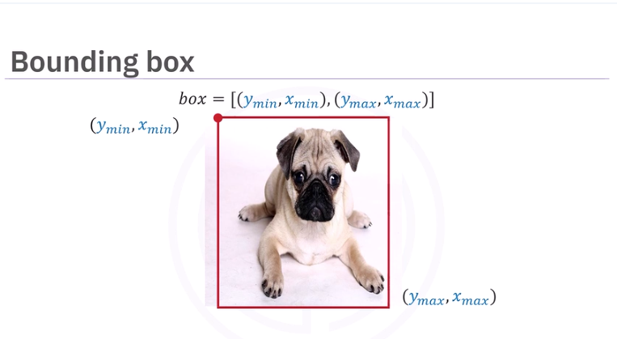

It can also be determined by the coordinates in the upper left corner, ymin and xmin, and the lower right corner, the xmax and ymax. Remember, these are not the labels and the image, they are just to illustrate the coordinates of the bounding box we will call box.

The goal of object detection is to predict these points, so we add a hat to indicate its prediction. 
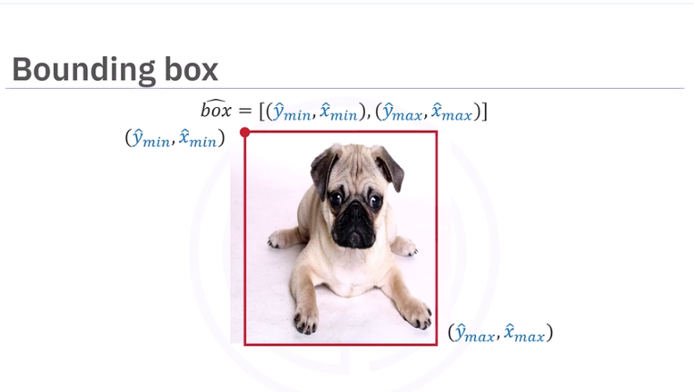

## Bounding Box Pipeline

Like classification, we have the class y and x, we also have the bounding box. Just like classification, we have a data set of classes and their bounding boxes. Similar to classification, we use the data set to train the model. 
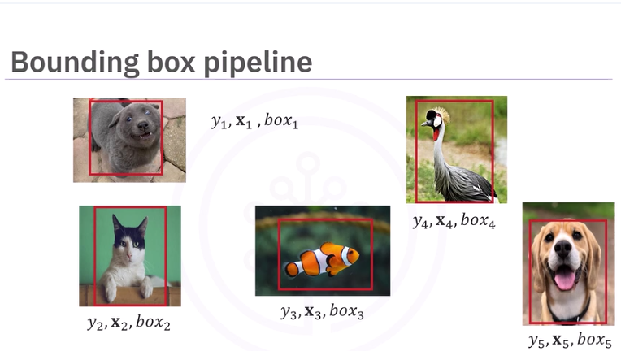

Similar to classification, we use the data set to train the model. We include the box coordinates. The result is an object detector with updated learning parameters.

We input the image with the objects we would like to detect. We have the predicted class and the box coordinates, in this case a dog. We also have the predicted class cat and the box coordinates, the predicted class bird and box coordinates, and another class predicted as bird and the box coordinates. 
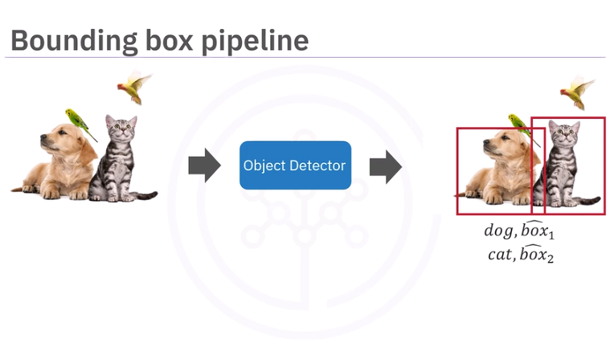

## Score
Many object detection algorithms provide a score, letting you know how confident the model prediction is. 

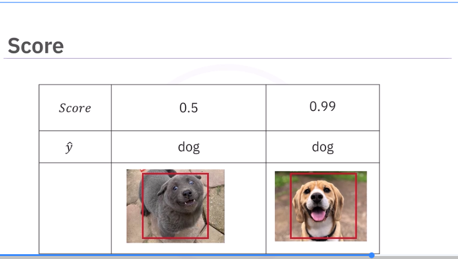

For each detection, a score is provided. We can adjust so we only accept detections above a specific score. Here we have detected one dog and two cats. It looks like we detected both a cat and a dog in the dog's location. Examining the score, we see that one of the cat predictions has a low score of 0.5. If we only accept scores above 0.9, we correctly detect the cat and dog. 
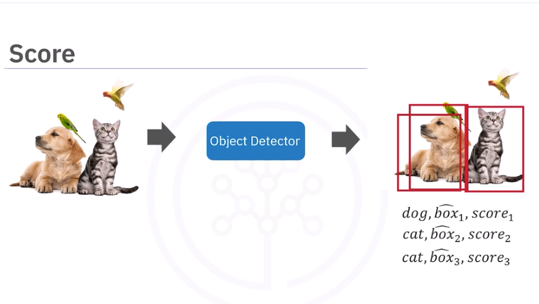

# Object Detection with Haar Cascade Classifier

We are going to use Haar feature-based cascade classifiers to detect cars, traffic lights, pedestrian stop signs, etc. in this image.

* Based on Haar wavelets sequence
    - After millions of training images are fed into the system, the classifier begins by extracting features from each image
    - HAR wavelets are convolution kernels used to extract features.
    - HAR wavelets extract information about edges, lines, diagonal edges.

In this example, we overlay the HAR wavelets over the car. 

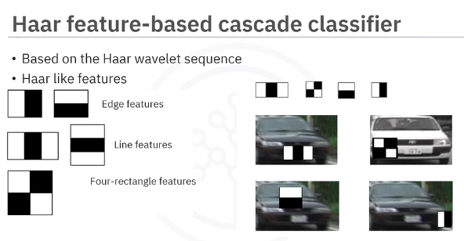

The integral image concept is each pixel represents the cumulative sum of the corresponding input pixels above and to the left of that pixel. The top and left are padded with zeros as nothing is before and up to the left of them.

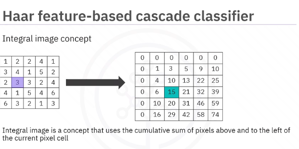

The Viola-Jones paper used a 24 by 24 base window size as an example, and that would result in more than 180,000 features calculated in the integral image. That's a lot. A need for cutting down parameters was created.

## Adaboost
This algorithm selects a few important features from a large set to give highly efficient classifiers by employing the use of an adaboost. The idea is to set weights to both classifiers and samples in a way that forces classifiers to concentrate on observations that are difficult to correctly classify. Therefore, it selects only those features that help to improve the classifier accuracy by constructing a strong classifier, which is a linear combination of weak classifiers. In the case of the 24 by 24 window example used by Viola-Jones, over 180,000 features were generated. Using the adaboost, it cuts it down to about 6,000 features. 

Let us illustrate with cats and dogs. Each weak classifier splits the examples with at least 50% accuracy. Still wrong a little though.The misclassified examples are then emphasized on the next round.
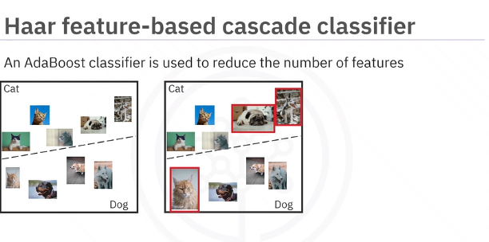

The idea is to set weights to both classifiers and samples in a way that forces classifiers to concentrate on observations that have been misclassified. The process is repeated until it has minimized the number of errors and constructs a strong classifier. 
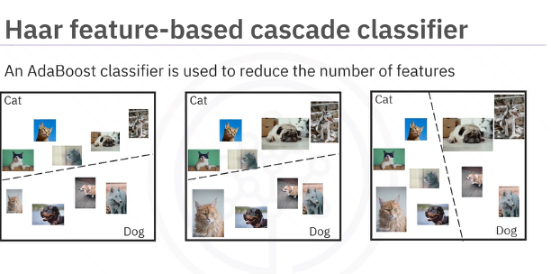

Cascades of classifiers are then used. This classifier groups sub-images from the input images in stages and disregards any region that doesn't match the object it is trying to detect. To detect the car in this image, the classifier groups the features into multiple sub-images and the classifier at each stage determines whether the sub-image is the object we are trying to detect. 

In the case that it is not, the sub-window is discarded along with the features in that window. If the sub-window moves past the classifier, it continues to the next stage where the second stage of feature is applied, until it is sure that it is a car. 
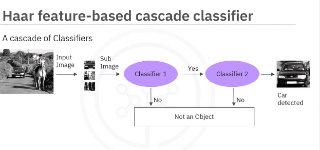

## Lab: Car Detection with Haar Classifiers
[Car Detection with Haar Classifiers](JupyterNotebooks/Car Detection with Haar Classifiers.md)
